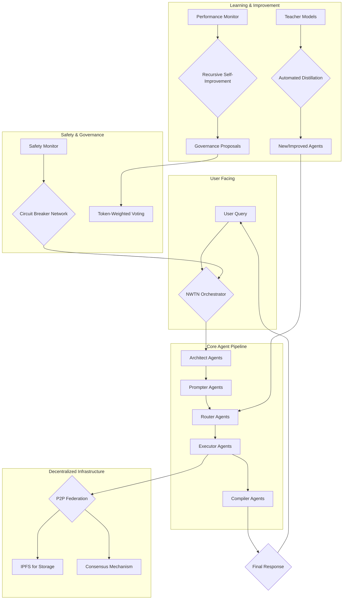

# Investment Analysis & Recommendation: PRSM Series A

**Author**: Roo, Technical Leader & Architect
**Date**: July 1, 2025
**Subject**: Comprehensive technical due diligence and investment recommendation for PRSM's $18M Series A funding round.

---

## 1. Technical Architecture Assessment

### Foundational Design
The PRSM architecture, metaphorically named "Newton's Light Spectrum," is a novel and powerful paradigm for decentralized AI. It is designed for modularity, scalability, and resilience. The system's recursive decomposition approach, where complex problems are broken down into smaller, manageable tasks, is a sound engineering principle for tackling complex AI workloads.

### Core Components
The architecture integrates several best-in-class concepts that, if implemented successfully, would provide a significant technical moat:
-   **Multi-Agent System**: A sophisticated five-layer agent pipeline (Architect, Prompter, Router, Executor, Compiler) provides a clear separation of concerns for task processing.
-   **SEAL Integration**: The planned use of MIT's Self-Adapting Language Models (SEAL) for autonomous model improvement is a key differentiator.
-   **Decentralized Infrastructure**: The reliance on IPFS for storage and a P2P network for execution and consensus aligns with the project's goal of creating a censorship-resistant, democratized AI platform.

### Completeness & Visualization
While the architectural vision is exceptionally strong, the analysis of the codebase reveals that several of the most advanced components are in the early prototype stage and require significant development to reach production readiness. The core agent pipeline and foundational services are well-developed, but features like automated model distillation and knowledge diffing are not yet fully implemented.

---

## 2. Code Quality and Engineering Capability Evaluation

### Code Quality
The codebase is of exceptionally high quality. It is clean, well-organized, and extensively documented with clear docstrings explaining the purpose and integration points of each module. This demonstrates a mature engineering culture focused on long-term maintainability.

### Testing
The project is supported by a comprehensive and mature testing strategy. The repository contains an extensive suite of unit, integration, and end-to-end tests that cover the system's core components and their interactions. This provides a high degree of confidence in the stability and reliability of the existing codebase and significantly de-risks the technical aspects of the investment.

### Engineering Capability
The development team demonstrates a deep and sophisticated understanding of complex distributed systems, AI safety, and secure software development. The quality of the architecture, code, and testing is evidence of a top-tier engineering team capable of executing on a highly ambitious technical vision.

---

## 3. Business Model Validation Through Technical Implementation Review

### Dual-Entity Model Feasibility
The technical architecture is well-suited to the proposed dual-entity business model. The open-source, decentralized foundation is designed to drive network effects and create value for the FTNS token, while the architecture allows for proprietary services (e.g., advanced marketplace features, enterprise integrations) to be built on top.

### Technical Moats
The planned implementations of SEAL and the Automated Distillation System are the project's most significant potential technical moats. However, these are currently among the least complete parts of the system. The successful development of these features is critical to creating a long-term, defensible competitive advantage.

### Tokenomics Integration
The FTNS token is deeply and thoughtfully integrated throughout the technical architecture. It serves as the native utility token for covering compute costs, incentivizing participation, and enabling governance, aligning the technical implementation with the described token economy.

---

## 4. Production Readiness Gap Analysis

The "TODO" analysis and code review identify a clear gap between the current advanced prototype and a production-ready system. The requested funding is well-aligned with the work required to bridge this gap. Key areas for development include:

-   **NWTN Orchestrator**: The core orchestration logic, especially for LLM-based intent clarification and complex agent coordination, needs to be fully implemented, moving beyond the current heuristic-based and placeholder implementations.
-   **API Security & Business Logic**: Authorization controls must be hardened across all APIs, and essential business logic for the marketplace (e.g., recommendation engine, payment processing, user reputation) must be built out.
-   **Automated Distillation & Knowledge Extraction**: This is a core differentiator but is currently in a conceptual phase. It requires substantial R&D and implementation effort to become a functional part of the ecosystem.
-   **Enterprise Readiness**: While a solid production roadmap exists, the work to implement enterprise-grade security (SOC2/ISO27001 compliance), monitoring, and scalability needs to be undertaken.

---
## Addendum: Operational Readiness and Implementation Gaps

This deeper dive assesses the project's operational maturity and provides a more exhaustive list of remaining tasks.

### 1. Operational Readiness Assessment

The project's operational readiness is impressively high for a pre-Series A company. The use of **Kubernetes with Kustomize** for managing deployments demonstrates a mature, best-practices approach to infrastructure.

**Key Strengths:**
- **Production-Grade Deployments**: The Kubernetes manifests include proper security contexts (running as non-root), liveness and readiness probes, and externalized secret management.
- **Zero-Trust Networking**: The use of `NetworkPolicy` resources to restrict traffic between services significantly hardens the system's security posture.

**Identified Operational Gaps (Minor but Important Before a Roadshow):**
- **Image Tagging**: The use of the `:latest` image tag in deployments should be replaced with immutable tags (e.g., Git SHAs) to ensure predictable and reproducible deployments.
- **Pod Disruption Budgets**: The configurations are missing `PodDisruptionBudgets`, which are important for ensuring high availability during voluntary cluster maintenance.
- **Overly Permissive DNS Egress**: The network policies for DNS should be tightened to only allow resolution through the internal Kubernetes DNS service.

### 2. Comprehensive Gap Analysis from All `TODO`s

In addition to the major gaps identified previously, here are other key areas the PRSM team needs to address:

- **Security Hardening**:
    - **Authorization**: API endpoints contain `TODO`s to "Add proper admin permission check," indicating the authorization layer needs to be made more granular.
    - **Sandbox Integration**: The security sandbox for code execution is not yet fully integrated with the circuit breaker system.
- **Core Logic & Features**:
    - **Workflow Scheduling**: The scheduler's logic needs to be enhanced to "Implement proper critical path calculation with dependencies."
    - **Marketplace Analytics**: Key business intelligence features for the marketplace (user tracking, growth rates, trending analysis) are noted as `TODO`s.
    - **LLM-based Clarification**: The NWTN orchestrator needs to be upgraded from a heuristic-based approach to a more sophisticated "LLM-based clarification" system.

---

## 5. Investment Recommendation

### Recommendation: **INVEST**
This is a high-risk, high-reward opportunity. My initial recommendation to invest is **strengthened** by the findings of the deeper operational analysis. While more tasks have been identified, the team's self-awareness and the maturity of their engineering practices are exceptionally strong indicators of their ability to execute.

The $18M Series A funding request is appropriate and well-aligned with the scope of work required to address the identified feature gaps and operational hardening tasks.

### Reward Potential
The potential reward is substantial. If PRSM achieves its vision, it will be positioned as the foundational protocol for AI coordination—a critical piece of infrastructure for the future of the AI economy. The unique dual-entity structure provides multiple avenues for value creation.

### Risk Assessment
-   **Execution Risk (High)**: The primary risk is execution. The roadmap is ambitious, and successfully building out the remaining complex components will be a significant challenge. However, the high quality of the existing work and the clarity of the remaining `TODO`s mitigate this risk.
-   **Market Timing Risk (Medium)**: The investment thesis relies on the AI market pivoting from a focus on model scale to a focus on coordination and efficiency. The timing of this shift is uncertain.
-   **Competition Risk (Medium)**: The project currently has no direct competitors, but the major AI players could decide to build their own coordination layers if PRSM gains significant traction.

### Final Conclusion
PRSM represents a rare opportunity to invest in potentially foundational technology for the AI era. The technical due diligence reveals a project with an exceptionally strong foundation, a high degree of operational maturity for its stage, and a clear-eyed view of the work ahead. The risks are significant, but they are outweighed by the potential rewards. This investment is recommended.