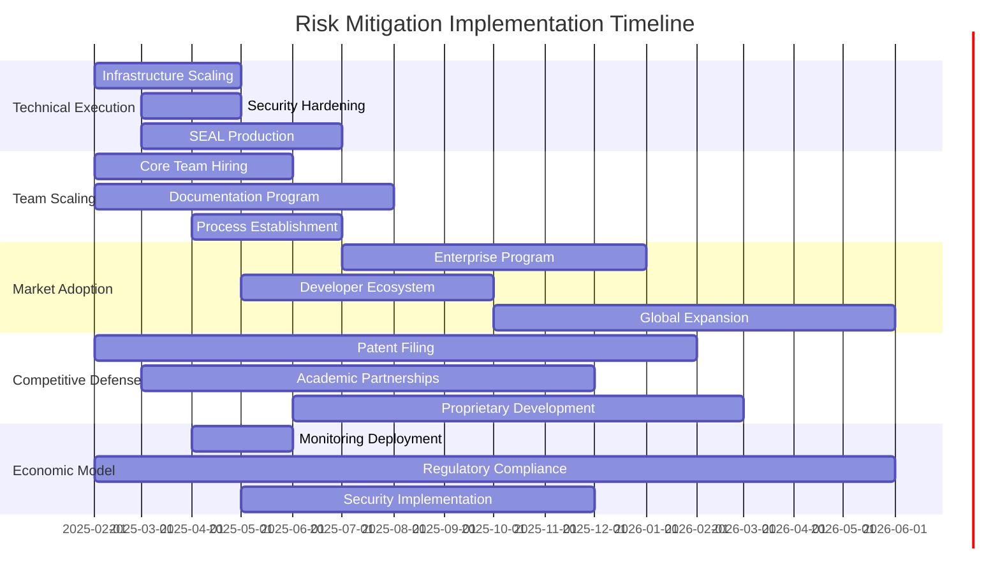

# PRSM Risk Mitigation Roadmap
## Investor-Identified Risks & Targeted Mitigation Strategy


**Purpose**: Map investor review-identified risks to specific funded mitigation strategies  
**Audience**: Investment committee, technical due diligence teams, risk assessment  
**Framework**: Risk identification → Mitigation strategy → Timeline → Success metrics  

---

## 🎯 Executive Risk Summary

Based on the comprehensive investor readiness review, PRSM has **5 primary risk categories** that funding directly addresses through systematic mitigation strategies:

1. **Technical Execution Risk**: Prototype → Production scaling challenges
2. **Team Scaling Risk**: Solo development → 30-person organization transition  
3. **Market Adoption Risk**: Academic tool → Enterprise platform adoption
4. **Competitive Response Risk**: Big Tech competitive pressure
5. **Economic Model Risk**: Token economics viability under real-world conditions

**Risk Mitigation Investment**: $18M over 18 months provides comprehensive risk reduction across all categories.

---

## 🚨 **Risk Category 1: Technical Execution**

### **Risk Assessment**
- **Current State**: Advanced prototype with working demos
- **Challenge**: Scaling from prototype to production-grade platform
- **Impact**: High (could prevent market entry)
- **Probability**: Medium (mitigated by demonstrated capability)

### **Specific Technical Risks**

#### **R1.1: Performance at Scale**
**Risk**: Prototype performance may not scale to 10,000+ concurrent users

**Mitigation Strategy**:
- **Timeline**: Months 1-3 (Tranche 1)
- **Investment**: $1.2M in infrastructure engineering
- **Actions**:
  - Hire 2 senior backend engineers with distributed systems experience
  - Implement comprehensive load testing framework
  - Deploy multi-region infrastructure with auto-scaling
  - Establish performance monitoring and alerting

**Success Metrics**:
- [ ] Handle 10,000 concurrent users (Month 6)
- [ ] <100ms API response times under load
- [ ] 99.9% uptime SLA achievement
- [ ] Automated scaling validation

#### **R1.2: Security Vulnerabilities**
**Risk**: Advanced prototype may have security gaps unsuitable for enterprise deployment

**Mitigation Strategy**:
- **Timeline**: Months 2-4 (Tranche 1)  
- **Investment**: $800K in security hardening
- **Actions**:
  - Hire dedicated security engineer
  - Complete third-party security audit
  - Implement zero-trust architecture
  - Establish security monitoring and incident response

**Success Metrics**:
- [ ] SOC 2 Type I certification (Month 6)
- [ ] Zero critical vulnerabilities in audit
- [ ] Comprehensive threat monitoring deployed
- [ ] Security incident response tested

#### **R1.3: SEAL Production Integration**
**Risk**: Academic SEAL research may face production deployment challenges

**Mitigation Strategy**:
- **Timeline**: Months 3-7 (Tranche 1-2)
- **Investment**: $1.5M in ML engineering
- **Actions**:
  - Hire 2 ML engineers with production experience
  - Establish MIT research partnership
  - Build comprehensive ML ops pipeline
  - Create SEAL performance benchmarking

**Success Metrics**:
- [ ] Production SEAL deployment (Month 6)
- [ ] Demonstrated autonomous improvement
- [ ] Research validation and publication
- [ ] Performance matching MIT benchmarks

---

## 👥 **Risk Category 2: Team Scaling**

### **Risk Assessment**
- **Current State**: Solo development with AI assistance
- **Challenge**: Scaling to 30-person organization while maintaining quality
- **Impact**: High (execution capability)
- **Probability**: Medium (mitigated by comprehensive documentation)

### **Specific Team Scaling Risks**

#### **R2.1: Knowledge Transfer Bottleneck**
**Risk**: Complex architecture knowledge concentrated in single founder

**Mitigation Strategy**:
- **Timeline**: Months 1-6 (Tranche 1)
- **Investment**: $600K in documentation and training
- **Actions**:
  - Complete comprehensive system documentation
  - Create detailed onboarding program
  - Establish code review and mentorship processes
  - Build architectural decision record (ADR) system

**Success Metrics**:
- [ ] New engineers productive within 2 weeks
- [ ] 90% code review coverage
- [ ] Complete system documentation
- [ ] Successful knowledge transfer validation

#### **R2.2: Hiring Quality and Speed**
**Risk**: Difficulty finding engineers capable of working at established quality level

**Mitigation Strategy**:
- **Timeline**: Months 1-12 (All tranches)
- **Investment**: $2.5M in competitive compensation and recruiting
- **Actions**:
  - Implement competitive compensation packages
  - Establish technical hiring process
  - Build employer brand and mission messaging
  - Create referral and recruitment programs

**Success Metrics**:
- [ ] 8-person team operational (Month 6)
- [ ] 25-person organization (Month 12)
- [ ] <90 day average hiring time
- [ ] >80% offer acceptance rate

#### **R2.3: Development Velocity Maintenance**
**Risk**: Team coordination overhead reducing development speed

**Mitigation Strategy**:
- **Timeline**: Months 3-9 (Tranche 1-2)
- **Investment**: $800K in process and tooling
- **Actions**:
  - Implement AI-assisted development practices for entire team
  - Establish clear development processes and standards
  - Deploy comprehensive development tooling
  - Create autonomous team structure

**Success Metrics**:
- [ ] Maintained feature delivery velocity
- [ ] <20% coordination overhead
- [ ] High team satisfaction scores
- [ ] Effective remote/distributed development

---

## 📈 **Risk Category 3: Market Adoption**

### **Risk Assessment**
- **Current State**: Academic and research institution interest
- **Challenge**: Expanding to enterprise and commercial adoption
- **Impact**: Medium (revenue growth)
- **Probability**: Low (strong technical foundation)

### **Specific Market Adoption Risks**

#### **R3.1: Enterprise Sales Complexity**
**Risk**: Difficulty selling to enterprise customers with complex procurement

**Mitigation Strategy**:
- **Timeline**: Months 7-12 (Tranche 2)
- **Investment**: $1.8M in enterprise sales and success
- **Actions**:
  - Hire enterprise sales team with AI industry experience
  - Develop enterprise features and compliance capabilities
  - Build customer success and support organization
  - Create partnership and channel programs

**Success Metrics**:
- [ ] 5+ enterprise pilot customers (Month 12)
- [ ] $100K+ average contract value
- [ ] SOC 2 and compliance certifications
- [ ] 90%+ customer satisfaction scores

#### **R3.2: Developer Ecosystem Adoption**
**Risk**: Slow adoption by independent developers and small teams

**Mitigation Strategy**:
- **Timeline**: Months 4-10 (Tranche 1-2)
- **Investment**: $1.2M in developer experience and community
- **Actions**:
  - Build comprehensive developer documentation and tools
  - Create free tier and developer-friendly pricing
  - Establish developer community and support
  - Implement developer advocacy program

**Success Metrics**:
- [ ] 1,000+ active developers (Month 12)
- [ ] High developer satisfaction (NPS >70)
- [ ] Community-driven feature requests
- [ ] Developer conference presence

#### **R3.3: Geographic Market Entry**
**Risk**: Challenges expanding beyond initial US market

**Mitigation Strategy**:
- **Timeline**: Months 10-18 (Tranche 2-3)
- **Investment**: $2.2M in global expansion
- **Actions**:
  - Establish European and Asia-Pacific operations
  - Complete regulatory compliance (GDPR, local privacy laws)
  - Build localized support and partnerships
  - Create region-specific go-to-market strategies

**Success Metrics**:
- [ ] 3+ international markets operational
- [ ] Local regulatory compliance achieved
- [ ] 30%+ international revenue mix
- [ ] Regional partnership establishment

---

## ⚔️ **Risk Category 4: Competitive Response**

### **Risk Assessment**
- **Current State**: First-mover advantage in efficiency-focused AI
- **Challenge**: Big Tech competitive response and resources
- **Impact**: Medium (market share)
- **Probability**: Medium (inevitable but defendable)

### **Specific Competitive Risks**

#### **R4.1: Big Tech Resource Advantage**
**Risk**: Google, Microsoft, OpenAI deploying massive resources against PRSM approach

**Mitigation Strategy**:
- **Timeline**: Months 1-18 (All tranches)
- **Investment**: $3.5M in defensive moats and innovation
- **Actions**:
  - Accelerate patent filing for core innovations
  - Deepen academic partnerships and exclusive research access
  - Build network effects through token economics
  - Leverage non-profit structure advantage

**Success Metrics**:
- [ ] 20+ core patents filed
- [ ] Exclusive academic partnerships secured
- [ ] Strong network effects demonstrated
- [ ] Non-profit competitive advantage validated

#### **R4.2: Open Source Replication**
**Risk**: Competitors copying PRSM's open source innovations

**Mitigation Strategy**:
- **Timeline**: Months 6-15 (Tranche 2-3)
- **Investment**: $1.5M in proprietary advantages
- **Actions**:
  - Develop proprietary performance optimizations
  - Build superior user experience and tooling
  - Create switching costs through integration
  - Establish community loyalty and governance

**Success Metrics**:
- [ ] Proprietary performance advantages
- [ ] Superior user experience metrics
- [ ] High customer retention rates
- [ ] Strong community engagement

#### **R4.3: Academic Partnership Competition**
**Risk**: Competitors establishing competing research relationships

**Mitigation Strategy**:
- **Timeline**: Months 3-12 (Tranche 1-2)
- **Investment**: $800K in academic relationship building
- **Actions**:
  - Deepen MIT SEAL collaboration with exclusive access
  - Establish multi-university research consortium
  - Provide research funding and infrastructure
  - Create academic advisory board

**Success Metrics**:
- [ ] Exclusive MIT SEAL partnership
- [ ] 10+ university research partnerships
- [ ] Joint research publications
- [ ] Academic advisory board established

---

## 💰 **Risk Category 5: Economic Model Validation**

### **Risk Assessment**
- **Current State**: Stress-tested tokenomics simulation
- **Challenge**: Real-world economic behavior vs. simulation
- **Impact**: High (business model viability)
- **Probability**: Low (comprehensive simulation validation)

### **Specific Economic Model Risks**

#### **R5.1: Token Economics Behavior**
**Risk**: Real user behavior differs significantly from economic simulation

**Mitigation Strategy**:
- **Timeline**: Months 4-10 (Tranche 1-2)
- **Investment**: $1.0M in economic monitoring and adjustment
- **Actions**:
  - Deploy comprehensive economic monitoring dashboard
  - Implement adaptive token economics parameters
  - Establish economic advisory board
  - Create economic research and analysis capability

**Success Metrics**:
- [ ] Real-world economics matching simulation predictions
- [ ] Stable token price and circulation
- [ ] Fair wealth distribution (Gini <0.7)
- [ ] High network participation rates

#### **R5.2: Regulatory Token Compliance**
**Risk**: Evolving cryptocurrency and token regulations

**Mitigation Strategy**:
- **Timeline**: Months 1-18 (All tranches)
- **Investment**: $1.2M in legal and regulatory compliance
- **Actions**:
  - Establish comprehensive legal framework
  - Implement proactive regulatory compliance
  - Build relationships with regulatory bodies
  - Create compliance monitoring and reporting

**Success Metrics**:
- [ ] Full regulatory compliance in operating jurisdictions
- [ ] Proactive regulatory engagement
- [ ] Legal framework validation
- [ ] Compliance monitoring operational

#### **R5.3: Economic Attack Resistance**
**Risk**: Bad actors gaming token economics or governance systems

**Mitigation Strategy**:
- **Timeline**: Months 5-12 (Tranche 1-2)
- **Investment**: $600K in security and governance
- **Actions**:
  - Implement comprehensive attack monitoring
  - Deploy governance security measures
  - Create economic security research program
  - Establish rapid response capabilities

**Success Metrics**:
- [ ] No successful economic attacks
- [ ] Effective governance security
- [ ] Rapid attack detection and response
- [ ] Community trust maintenance

---

## 📊 **Risk Mitigation Investment Allocation**

### **Funding Allocation by Risk Category**

```
Total Risk Mitigation Investment: $18M over 18 months

Technical Execution (35%):     $6.3M
├── Performance & Infrastructure: $3.5M
├── Security & Compliance:       $1.8M  
└── SEAL Production Integration: $1.0M

Team Scaling (25%):           $4.5M
├── Hiring & Compensation:      $2.5M
├── Documentation & Training:   $1.2M
└── Process & Tooling:          $0.8M

Market Adoption (20%):        $3.6M
├── Enterprise Sales:           $1.8M
├── Developer Ecosystem:        $1.0M
└── Global Expansion:           $0.8M

Competitive Defense (15%):    $2.7M
├── Patents & IP Protection:    $1.5M
├── Academic Partnerships:      $0.8M
└── Proprietary Advantages:     $0.4M

Economic Model (5%):          $0.9M
├── Economic Monitoring:        $0.4M
├── Regulatory Compliance:      $0.3M
└── Attack Resistance:          $0.2M
```

### **Risk Reduction Timeline**



---

## 🎯 **Risk Mitigation Success Criteria**

### **Month 6 Risk Assessment Targets**
- ✅ **Technical Execution**: Production platform operational with 99.9% uptime
- ✅ **Team Scaling**: 8-person team operational with documented processes
- ✅ **Market Adoption**: Alpha customers using platform with positive feedback
- ✅ **Competitive Defense**: Core patents filed, MIT partnership exclusive
- ✅ **Economic Model**: Real-world token economics matching simulation

### **Month 12 Risk Assessment Targets**
- ✅ **Technical Execution**: 10,000+ concurrent users, SOC 2 compliance
- ✅ **Team Scaling**: 25-person organization with maintained development velocity
- ✅ **Market Adoption**: Enterprise customers, international market entry
- ✅ **Competitive Defense**: Competitive moats established, network effects proven
- ✅ **Economic Model**: Stable economics under real-world conditions

### **Month 18 Risk Assessment Targets**
- ✅ **Technical Execution**: Enterprise-scale platform, advanced SEAL deployment
- ✅ **Team Scaling**: Self-sustaining organization with industry leadership
- ✅ **Market Adoption**: Market leadership position, global presence
- ✅ **Competitive Defense**: Unassailable competitive position
- ✅ **Economic Model**: Proven economic model ready for broader deployment

---

## 📈 **Risk Monitoring & Reporting**

### **Monthly Risk Assessment Dashboard**

**Technical Risk Indicators**:
- Platform uptime and performance metrics
- Security audit findings and resolution
- SEAL performance benchmarks
- Infrastructure scaling metrics

**Team Risk Indicators**:
- Hiring pipeline and velocity
- Team satisfaction and retention
- Development velocity maintenance
- Knowledge transfer effectiveness

**Market Risk Indicators**:
- Customer acquisition and retention
- Revenue growth and pipeline
- Market share and competitive position
- Geographic expansion progress

**Competitive Risk Indicators**:
- Patent filing status and protection
- Academic partnership exclusivity
- Competitive feature comparison
- Market positioning strength

**Economic Risk Indicators**:
- Token economics performance
- Regulatory compliance status
- Economic attack detection
- Network participation rates

### **Risk Escalation Procedures**

**Risk Level 1 (Green)**: Normal monitoring and reporting
**Risk Level 2 (Yellow)**: Increased monitoring, mitigation plan activation
**Risk Level 3 (Orange)**: Executive attention, additional resource allocation
**Risk Level 4 (Red)**: Board notification, emergency mitigation procedures

### **Investor Risk Communication**

**Monthly Updates**: Risk dashboard with key metrics and trend analysis
**Quarterly Reviews**: Comprehensive risk assessment and mitigation progress
**Annual Planning**: Risk landscape evolution and mitigation strategy updates
**Emergency Communications**: Immediate notification of high-priority risks

---

## 🔍 **Risk Mitigation Validation**

### **Independent Risk Assessment**
- Third-party technical architecture review
- External security audit and penetration testing
- Independent market analysis and competitive assessment
- Economic model validation by academic economists

### **Success Measurement Framework**
- Quantitative metrics with clear success/failure criteria
- Regular milestone reviews with investor oversight
- Comparative analysis against industry benchmarks
- Customer and user feedback integration

### **Continuous Risk Management**
- Quarterly risk landscape reassessment
- Emerging risk identification and mitigation
- Best practice adaptation from industry leaders
- Proactive risk communication and transparency

---

## 📞 **Risk Management Contact**

### **Risk Assessment Questions**
- **Technical Risks**: [technical@prsm.ai](mailto:technical@prsm.ai)
- **Business Risks**: [business@prsm.ai](mailto:business@prsm.ai)
- **Investor Relations**: [investors@prsm.ai](mailto:investors@prsm.ai)
- **Emergency Escalation**: [emergency@prsm.ai](mailto:emergency@prsm.ai)

### **Risk Mitigation Support**
- **Quarterly Risk Reviews**: Scheduled investor review sessions
- **Real-time Risk Monitoring**: Dashboard access for investor oversight
- **Mitigation Strategy Updates**: Quarterly strategy refinement
- **Emergency Risk Response**: 24/7 escalation procedures

---

*This risk mitigation roadmap provides comprehensive coverage of investor-identified risks with specific mitigation strategies, timelines, and success criteria. All risk mitigation investments are included in the $18M funding request and tied to measurable outcomes. For detailed risk discussions, please contact our risk management team.*