# PRSM Visual Roadmap & Development Timeline
## Interactive Timeline for Investor Presentations


**Purpose**: Visual representation of PRSM's development trajectory and investment milestones  
**Audience**: Investors, technical evaluators, strategic partners  
**Format**: Interactive timeline diagrams with dependency mapping  

---

## 🗓️ **Executive Timeline Overview**

```mermaid
gantt
    title PRSM 18-Month Development & Investment Roadmap
    dateFormat  YYYY-MM-DD
    section Phase 1: Foundation
    Core Platform Implementation    :active, phase1, 2025-02-01, 6M
    Team Building (8 engineers)     :team1, 2025-02-01, 2M
    Infrastructure Deployment       :infra1, 2025-02-01, 3M
    SEAL Integration                 :seal1, 2025-03-01, 4M
    Alpha Launch                     :alpha, 2025-06-01, 1M
    
    section Phase 2: Growth
    Market Expansion                 :phase2, 2025-08-01, 6M
    Enterprise Features              :enterprise, 2025-08-01, 3M
    Developer Ecosystem              :ecosystem, 2025-09-01, 4M
    Global Deployment                :global, 2025-11-01, 3M
    
    section Phase 3: Leadership
    Market Leadership                :phase3, 2026-02-01, 6M
    Advanced AI Capabilities         :ai_advanced, 2026-02-01, 4M
    Ecosystem Maturity               :mature, 2026-04-01, 4M
    Series B Preparation             :seriesb, 2026-06-01, 2M
    
    section Funding Milestones
    Tranche 1: $6M                  :milestone, tranche1, 2025-02-01, 1d
    Tranche 2: $7M                  :milestone, tranche2, 2025-08-01, 1d
    Tranche 3: $5M                  :milestone, tranche3, 2026-02-01, 1d
```

---

## 💰 **Funding Tranche Visual Breakdown**

### **Tranche Release Dependencies**

```mermaid
flowchart TD
    A[Series A Start<br/>$18M Total] --> B[Tranche 1: $6M<br/>Foundation Phase]
    
    B --> C{Milestone Gate 1}
    C -->|✅ Platform Working<br/>✅ Team Operational<br/>✅ Alpha Users| D[Tranche 2: $7M<br/>Growth Phase]
    
    D --> E{Milestone Gate 2}
    E -->|✅ Enterprise Clients<br/>✅ $1M+ Monthly<br/>✅ Market Traction| F[Tranche 3: $5M<br/>Leadership Phase]
    
    F --> G{Success Gate}
    G -->|✅ $10M+ ARR<br/>✅ Market Leadership<br/>✅ Profitability Path| H[Series B or<br/>Self-Sustainability]
    
    style A fill:#e1f5fe
    style C fill:#fff3e0
    style E fill:#fff3e0
    style G fill:#e8f5e8
    style H fill:#f3e5f5
```



### **Risk Mitigation Through Progressive Funding**

```mermaid
graph LR
    subgraph "Risk Level by Phase"
        A[Phase 1<br/>LOW RISK<br/>Prototype → Production] --> B[Phase 2<br/>MEDIUM RISK<br/>Market Validation]
        B --> C[Phase 3<br/>LOW RISK<br/>Scaling Success]
    end
    
    subgraph "Investor Protection"
        D[Milestone Gates] --> E[Success Criteria]
        E --> F[Fund Release Control]
        F --> G[Performance Tracking]
    end
    
    A -.->|Validated Architecture| D
    B -.->|Market Proof| E
    C -.->|Revenue Growth| F
```



---

## 🏗️ **Technical Development Timeline**

### **Core Platform Evolution**


### **Technology Stack Maturation**


---

## 👥 **Team Scaling Roadmap**

### **Organizational Growth Timeline**


### **Hiring Priority Matrix**


---

## 📊 **Business Metrics Progression**

### **User Growth & Revenue Timeline**


```mermaid
xychart-beta
    title Monthly Revenue Growth ($K)
    x-axis [Month 1, Month 3, Month 6, Month 9, Month 12, Month 15, Month 18]
    y-axis "Revenue ($K)" 0 --> 1000
    line [0, 5, 25, 100, 350, 650, 900]
```

### **Key Performance Indicators Dashboard**


---

## 🌍 **Geographic Expansion Strategy**

### **Global Deployment Phases**

```mermaid
flowchart TB
    subgraph "Phase 1: North America Foundation"
        A1[US West Coast<br/>Primary Infrastructure] --> A2[US East Coast<br/>Redundancy & Compliance]
        A2 --> A3[Canada<br/>Data Sovereignty]
    end
    
    subgraph "Phase 2: International Expansion"
        B1[Europe (GDPR)<br/>Ireland + Germany] --> B2[Asia Pacific<br/>Singapore + Japan]
        B2 --> B3[Australia<br/>Research Partnerships]
    end
    
    subgraph "Phase 3: Global Coverage"
        C1[Latin America<br/>Brazil + Mexico] --> C2[Africa<br/>South Africa + Nigeria]
        C2 --> C3[Middle East<br/>UAE + Saudi Arabia]
    end
    
    A3 --> B1
    B3 --> C1
    
    style A1 fill:#e3f2fd
    style B1 fill:#fff3e0
    style C1 fill:#e8f5e8
```

### **Regulatory Compliance Timeline**


---

## 🔬 **Research & Development Roadmap**

### **SEAL Technology Evolution**


### **Academic Partnership Development**


---

## 🎯 **Investment Decision Timeline**

### **Investor Evaluation Process**


### **Milestone Achievement Tracking**

```mermaid
flowchart TB
    subgraph "Success Metrics Dashboard"
        A[Technical Milestones<br/>✅ Platform Uptime<br/>✅ User Growth<br/>✅ Performance KPIs]
        
        B[Business Milestones<br/>✅ Revenue Targets<br/>✅ Client Acquisition<br/>✅ Market Share]
        
        C[Token Milestones<br/>✅ FTNS Circulation<br/>✅ Network Activity<br/>✅ Governance Participation]
    end
    
    A --> D[Investor Reporting<br/>Monthly Updates]
    B --> D
    C --> D
    D --> E[Board Reviews<br/>Quarterly Assessment]
    E --> F[Milestone Gates<br/>Funding Release Decisions]
```



---

## 🔄 **Contingency Planning & Risk Mitigation**

### **Risk Response Matrix**


### **Scenario Planning Timeline**


---

## 📈 **Success Visualization**

### **18-Month Success Trajectory**

```mermaid
sankey-beta
    %% Month 6 Success Metrics
    "Prototype" --> "Production Platform" : 100
    "Solo Development" --> "8-Person Team" : 100
    "Concept Validation" --> "Alpha Users" : 100
    
    %% Month 12 Success Metrics  
    "Production Platform" --> "Enterprise Scale" : 85
    "8-Person Team" --> "25-Person Organization" : 85
    "Alpha Users" --> "1000+ Developers" : 85
    
    %% Month 18 Success Metrics
    "Enterprise Scale" --> "Market Leadership" : 75
    "25-Person Organization" --> "Global Operations" : 75
    "1000+ Developers" --> "50,000+ Users" : 75
```

### **Value Creation Timeline**

```mermaid
gitgraph
    commit id: "Advanced Prototype"
    branch phase1
    checkout phase1
    commit id: "Team Building"
    commit id: "Production Platform"
    commit id: "Alpha Launch"
    checkout main
    merge phase1
    branch phase2
    checkout phase2
    commit id: "Enterprise Features"
    commit id: "Market Traction"
    commit id: "Global Expansion"
    checkout main
    merge phase2
    branch phase3
    checkout phase3
    commit id: "Market Leadership"
    commit id: "Advanced AI"
    commit id: "Series B Ready"
    checkout main
    merge phase3
```

---

## 🎯 **Investor Action Items**

### **Immediate Next Steps (This Week)**
1. **Review Visual Roadmap**: Assess timeline feasibility and milestone logic
2. **Validate Technical Progression**: Confirm development sequence and dependencies  
3. **Evaluate Risk Mitigation**: Review contingency planning and scenario analysis
4. **Schedule Deep Dive**: Book technical demonstration and team discussion

### **Due Diligence Checklist**
- [ ] **Technical Timeline Review**: Engineering team assessment of development schedule
- [ ] **Market Opportunity Validation**: Independent analysis of addressable market size
- [ ] **Competitive Landscape**: Detailed analysis of competitive positioning and moats
- [ ] **Team Scaling Assessment**: HR and organizational development capability review
- [ ] **Financial Model Validation**: Unit economics and revenue projection analysis

### **Investment Decision Framework**
- [ ] **Strategic Fit**: Alignment with fund thesis and portfolio strategy
- [ ] **Risk/Return Profile**: Assessment of investment risk versus return potential
- [ ] **Market Timing**: Evaluation of market readiness and competitive timing
- [ ] **Execution Capability**: Team ability to deliver on aggressive timeline
- [ ] **Exit Strategy**: Clear path to returns through token appreciation or acquisition

---

**For detailed milestone discussions**: [funding@prsm.ai](mailto:funding@prsm.ai)  
**For technical timeline questions**: [technical@prsm.ai](mailto:technical@prsm.ai)  
**For partnership opportunities**: [partnerships@prsm.ai](mailto:partnerships@prsm.ai)

---

*This visual roadmap provides interactive timeline diagrams and dependency mapping for PRSM's 18-month development trajectory. All timelines are based on realistic development estimates and milestone-based funding structure. Interactive elements require Mermaid.js-compatible viewers for full functionality.*