# 🤝 PRSM Contributor Onboarding Guide

Welcome to the PRSM community! This guide will help you get started contributing to the Protocol for Recursive Scientific Modeling project.

## 🌟 Why Contribute to PRSM?

PRSM is revolutionizing how AI research is conducted by creating a decentralized, collaborative platform for scientific modeling. Your contributions will help:

- 🔬 **Advance AI Research**: Enable breakthrough scientific discoveries
- 🌍 **Democratize AI Access**: Make advanced AI capabilities accessible to researchers worldwide  
- 🤝 **Build Community**: Join a community of AI researchers, developers, and innovators
- 📚 **Learn & Grow**: Gain hands-on experience with cutting-edge AI and distributed systems
- 💼 **Career Development**: Build your portfolio with meaningful open source contributions

## 🎯 Types of Contributors We Welcome

### 👩‍💻 **Developers**
- Python, JavaScript, Go, Rust developers
- AI/ML engineers and researchers
- Web developers (React, Next.js, FastAPI)
- DevOps and infrastructure engineers
- Security and cryptography experts

### 📚 **Documentation Contributors**
- Technical writers
- UX writers
- Tutorial creators
- Video content creators
- Translation contributors

### 🔬 **Researchers & Domain Experts**
- AI/ML researchers
- Scientists from various domains
- Economists and governance experts
- Cryptography researchers
- Distributed systems experts

### 🎨 **Designers**
- UI/UX designers
- Graphic designers
- Accessibility experts
- Design system architects

### 🧪 **Quality Assurance**
- Manual testers
- Automation engineers
- Performance testing specialists
- Security auditors

## 🚀 Getting Started

### Step 1: Choose Your Journey

#### 🌱 **New to Open Source** (⭐ Beginner)
**Time Commitment**: 1-3 hours/week  
**Perfect for**: Students, career changers, learning enthusiasts

**Recommended First Issues**:
- [ ] Fix typos in documentation
- [ ] Add missing docstrings to Python functions
- [ ] Create simple example scripts
- [ ] Improve README formatting
- [ ] Add GitHub issue templates

**Skills You'll Learn**: Git/GitHub, documentation, code reading, community collaboration

#### 🔧 **Experienced Developer, New to PRSM** (⭐⭐ Intermediate)
**Time Commitment**: 3-8 hours/week  
**Perfect for**: Professional developers wanting to contribute to AI research

**Recommended First Issues**:
- [ ] Add comprehensive unit tests
- [ ] Implement TODO items in codebase
- [ ] Create SDK examples for popular frameworks
- [ ] Improve error handling and validation
- [ ] Optimize performance bottlenecks

**Skills You'll Learn**: PRSM architecture, AI/ML workflows, distributed systems, testing

#### 🎓 **AI/ML Expert** (⭐⭐⭐ Advanced)
**Time Commitment**: 5-15 hours/week  
**Perfect for**: Researchers, AI engineers, PhD students

**Recommended First Issues**:
- [ ] Implement advanced model routing algorithms
- [ ] Complete knowledge extraction pipelines
- [ ] Add support for new AI frameworks
- [ ] Optimize inference performance
- [ ] Create scientific use case examples

**Skills You'll Learn**: PRSM protocol design, research workflows, AI coordination

#### 🚀 **Systems Architecture Expert** (⭐⭐⭐⭐ Expert)
**Time Commitment**: 10+ hours/week  
**Perfect for**: Senior engineers, distributed systems experts, security specialists

**Recommended First Issues**:
- [ ] Enhance post-quantum cryptography implementation
- [ ] Improve distributed consensus mechanisms
- [ ] Optimize network protocols
- [ ] Design scalability improvements
- [ ] Lead major feature development

**Skills You'll Learn**: Advanced distributed systems, cryptography, protocol design

### Step 2: Environment Setup

#### Prerequisites
```bash
# Required software
- Git (latest version)
- Python 3.8+ 
- Node.js 16+ (for JavaScript SDK)
- Go 1.19+ (for Go SDK)
- Docker (for containerized development)
```

#### Development Environment
```bash
# 1. Fork and clone the repository
git clone https://github.com/YOUR_USERNAME/PRSM.git
cd PRSM

# 2. Set up Python environment
python -m venv venv
source venv/bin/activate  # On Windows: venv\Scripts\activate
pip install -r requirements-dev.txt

# 3. Install PRSM in development mode
pip install -e .

# 4. Set up pre-commit hooks
pre-commit install

# 5. Verify setup
python -m pytest tests/ -v
```

#### API Key Setup (Optional for most contributions)
```bash
# Only needed for integration testing
export PRSM_API_KEY="your_api_key_here"  # Get from https://prsm.ai
```

### Step 3: Find Your First Issue

#### 🏷️ **Use GitHub Labels**
- `good first issue` - Perfect for newcomers
- `help wanted` - We need community help
- `documentation` - Documentation improvements
- `testing` - Test coverage improvements
- `beginner-friendly` - Easier technical tasks

#### 📋 **Browse Categories**
- **Documentation**: Fix typos, add examples, create tutorials
- **Testing**: Write unit tests, improve coverage
- **SDK**: Enhance Python/JavaScript/Go SDKs  
- **Examples**: Create real-world use cases
- **Infrastructure**: Improve CI/CD, deployment
- **UI/UX**: Improve web interface and user experience

#### 🔍 **Issue Selection Tips**
1. **Read the full issue description** - understand the context
2. **Check for assigned contributors** - avoid duplicate work
3. **Ask questions** - comment if anything is unclear
4. **Start small** - choose smaller issues for your first few contributions

### Step 4: Claim and Work on an Issue

#### 1. **Claim the Issue**
```markdown
Hi! I'd like to work on this issue. I'm [new to open source/experienced with Python/etc.] 
and think this would be a great way to contribute. 

Could you provide any additional guidance on:
- [Any specific questions you have]
- [Clarifications needed]

Expected timeline: [Your estimate]
```

#### 2. **Create a Branch**
```bash
# Create a descriptive branch name
git checkout -b fix/issue-123-add-docstrings
# or
git checkout -b feature/issue-456-sdk-examples
```

#### 3. **Make Your Changes**
- Follow the [coding standards](CODING_STANDARDS.md)
- Write tests for new functionality
- Update documentation as needed
- Keep commits small and focused

#### 4. **Test Your Changes**
```bash
# Run tests
python -m pytest tests/ -v

# Run linting
black . && ruff check .

# Run type checking (if applicable)
mypy prsm/

# Test documentation builds
cd docs && make html
```

#### 5. **Submit a Pull Request**
- Use descriptive PR title: `Fix: Add docstrings to core.models module (#123)`
- Reference the issue: `Closes #123`
- Describe what you changed and why
- Request review from mentors if available

## 📚 Learning Resources

### 🎓 **PRSM-Specific Learning**
- [Architecture Overview](ARCHITECTURE.md)
- [API Documentation](https://docs.prsm.ai)
- [Research Papers](https://prsm.ai/research)
- [Video Tutorials](https://youtube.com/prsm-ai)

### 🛠️ **Technical Skills**
- [Python Documentation](https://docs.python.org/)
- [FastAPI Tutorial](https://fastapi.tiangolo.com/tutorial/)
- [React Documentation](https://reactjs.org/docs/)
- [Go Tutorial](https://tour.golang.org/)
- [Docker Documentation](https://docs.docker.com/)

### 🤝 **Open Source Skills**
- [GitHub Skills](https://skills.github.com/)
- [Open Source Guide](https://opensource.guide/)
- [First Timers Only](https://www.firsttimersonly.com/)

## 🎉 Recognition & Rewards

### 🏆 **Contributor Levels**
- **🌱 Seedling** (1-5 contributions): Welcome package, Discord role
- **🌿 Sprout** (6-15 contributions): PRSM stickers, newsletter feature
- **🌳 Tree** (16-50 contributions): PRSM t-shirt, mentor opportunities
- **🌲 Forest** (50+ contributions): Conference voucher, co-authorship opportunities

### 🎁 **What You Get**
- **Swag & Merchandise**: Stickers, t-shirts, exclusive items
- **Learning Opportunities**: Access to research papers, expert talks
- **Networking**: Connect with AI researchers and engineers globally
- **Career Growth**: References, recommendations, job opportunities
- **Conference Benefits**: Speaking opportunities, travel vouchers

### 📝 **Recognition**
- Monthly contributor spotlights
- GitHub achievements and badges
- Research paper co-authorship opportunities
- Conference presentation opportunities

## 🤝 Support & Mentorship

### 💬 **Getting Help**
- **GitHub Discussions**: Ask questions, share ideas
- **Discord Community**: Real-time chat with contributors
- **Office Hours**: Weekly video calls with maintainers
- **1:1 Mentorship**: Paired with experienced contributors

### 🆘 **Stuck? Here's How to Get Unstuck**

#### Technical Issues
1. **Check existing documentation** first
2. **Search GitHub issues** for similar problems
3. **Ask in GitHub Discussions** with specific details
4. **Join Discord #help channel** for real-time support

#### Process Questions
1. **Review Contributing Guide** for workflow questions
2. **Ask your assigned mentor** (if you have one)
3. **Comment on your issue/PR** for specific guidance
4. **Attend office hours** for face-to-face help

#### Code Review Feedback
1. **Read feedback carefully** and ask for clarification if needed
2. **Make requested changes** in small, focused commits
3. **Test thoroughly** before requesting re-review
4. **Learn from feedback** to improve future contributions

## 📅 Community Events

### 🗓️ **Regular Events**
- **Weekly Office Hours**: Thursdays 2pm UTC
- **Monthly Contributor Call**: First Friday of each month
- **Quarterly Hackathons**: Build cool stuff with PRSM
- **Annual Conference**: PRSM Summit (in-person + virtual)

### 🎯 **Special Programs**
- **Summer of Code**: 3-month contributor program
- **Research Collaboration**: Partner on academic papers
- **Mentorship Program**: Become a mentor or find one
- **Documentation Sprints**: Improve docs together

## 📊 Contribution Workflow

### 🔄 **Typical Contribution Lifecycle**

```mermaid
graph TD
    A[Find Issue] --> B[Read & Understand]
    B --> C[Ask Questions]
    C --> D[Claim Issue]
    D --> E[Create Branch]
    E --> F[Make Changes]
    F --> G[Test Locally]
    G --> H[Submit PR]
    H --> I[Code Review]
    I --> J{Feedback?}
    J -->|Yes| K[Address Feedback]
    K --> I
    J -->|No| L[Merge PR]
    L --> M[Celebrate! 🎉]
```



### ⏱️ **Timeline Expectations**
- **Issue Response**: Within 24-48 hours
- **Mentor Assignment**: Within 1 week
- **PR Review**: Within 2-3 business days
- **Feedback Response**: Within 1 week of receiving feedback

## 🌍 Code of Conduct

We are committed to providing a welcoming and inclusive environment for all contributors. Please read our [Code of Conduct](CODE_OF_CONDUCT.md) and help us maintain a positive community.

### ✅ **Expected Behavior**
- Be respectful and inclusive
- Provide constructive feedback
- Help others learn and grow
- Give credit where due
- Be patient with newcomers

### ❌ **Unacceptable Behavior**
- Harassment or discrimination
- Toxic or aggressive communication
- Spam or off-topic content
- Violation of intellectual property
- Malicious or destructive actions

## 🚀 Ready to Start?

1. **⭐ Star the repository** to show your interest
2. **👀 Watch the repository** to get notified of new issues
3. **🍴 Fork the repository** to start contributing
4. **💬 Join our Discord** for real-time community chat
5. **📝 Introduce yourself** in GitHub Discussions

### 🎯 Your First Contribution Checklist

- [ ] Read this onboarding guide
- [ ] Set up development environment
- [ ] Join Discord community
- [ ] Find a `good first issue`
- [ ] Ask questions and claim the issue
- [ ] Make your contribution
- [ ] Submit your first PR
- [ ] Celebrate your contribution! 🎉

---

## 📞 Contact & Support

- **🐛 Report Issues**: [GitHub Issues](https://github.com/PRSM-AI/prsm/issues)
- **💬 Community Chat**: [Discord Server](https://discord.gg/prsm-ai)
- **📧 Email Support**: contributors@prsm.ai
- **🐦 Follow Updates**: [@PRSM_AI](https://twitter.com/prsm_ai)

**Welcome to the PRSM community! We're excited to have you aboard! 🚀**