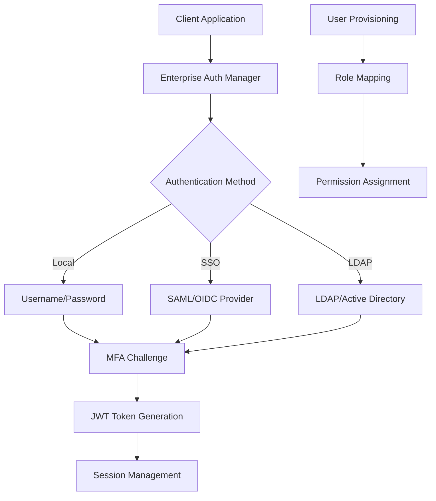

# Enterprise Authentication Integration Guide

## Overview

This comprehensive guide covers enterprise authentication integration for PRSM, including LDAP, SAML, OAuth 2.0/OpenID Connect, and Multi-Factor Authentication (MFA). PRSM's enterprise authentication framework provides unified identity management for organizations of all sizes.

## 🏗️ Architecture Overview

### **Enterprise Authentication Framework**



### **Key Components**

- **Enterprise Auth Manager**: Unified authentication orchestrator
- **SSO Provider**: SAML 2.0 and OpenID Connect integration
- **LDAP Provider**: Active Directory and LDAP server integration
- **MFA Provider**: Multi-factor authentication with TOTP, SMS, hardware tokens
- **User Provisioning**: Automatic user creation and synchronization
- **Session Management**: Enterprise-grade session handling

## 🔧 Configuration

### **Basic Configuration**

```python
# config/enterprise_auth.py
from prsm.auth.enterprise import EnterpriseAuthConfig, SSOConfig, LDAPConfig, MFAConfig

enterprise_auth_config = EnterpriseAuthConfig(
    # General settings
    enabled=True,
    allow_local_auth=True,
    require_mfa_for_admin=True,
    require_mfa_for_all=False,
    
    # Session settings
    session_timeout_hours=8,
    max_concurrent_sessions=5,
    
    # Security settings
    enforce_password_policy=True,
    audit_login_attempts=True
)
```

### **Environment Variables**

```bash
# Enterprise Authentication
PRSM_ENTERPRISE_AUTH_ENABLED=true
PRSM_ALLOW_LOCAL_AUTH=true
PRSM_REQUIRE_MFA_ADMIN=true

# SSO Configuration
PRSM_SSO_ENABLED=true
PRSM_SSO_AUTO_PROVISION=true

# LDAP Configuration
PRSM_LDAP_ENABLED=true
PRSM_LDAP_SERVER=ldap://dc.company.com:389
PRSM_LDAP_BIND_DN=cn=prsm-service,ou=services,dc=company,dc=com
PRSM_LDAP_BIND_PASSWORD=secure_password
PRSM_LDAP_USER_BASE=ou=users,dc=company,dc=com

# MFA Configuration
PRSM_MFA_ENABLED=true
PRSM_MFA_ISSUER=PRSM
```

## 🌐 SSO Integration (SAML & OpenID Connect)

### **SAML 2.0 Configuration**

#### **Identity Provider Setup**

```python
# SSO Provider Configuration
from prsm.auth.enterprise import SSOConfig, SSOProvider, SSOProtocol

# SAML Configuration
saml_config = SSOConfig(
    name="company_saml",
    display_name="Company SSO",
    protocol=SSOProtocol.SAML,
    enabled=True,
    settings={
        # Service Provider (PRSM) Configuration
        "sp": {
            "entityId": "https://prsm.company.com/auth/saml/metadata",
            "assertionConsumerService": {
                "url": "https://prsm.company.com/auth/saml/acs",
                "binding": "urn:oasis:names:tc:SAML:2.0:bindings:HTTP-POST"
            },
            "singleLogoutService": {
                "url": "https://prsm.company.com/auth/saml/sls",
                "binding": "urn:oasis:names:tc:SAML:2.0:bindings:HTTP-Redirect"
            },
            "NameIDFormat": "urn:oasis:names:tc:SAML:1.1:nameid-format:emailAddress",
            "x509cert": "",  # SP certificate
            "privateKey": ""  # SP private key
        },
        
        # Identity Provider Configuration
        "idp": {
            "entityId": "https://idp.company.com/saml/metadata",
            "singleSignOnService": {
                "url": "https://idp.company.com/saml/sso",
                "binding": "urn:oasis:names:tc:SAML:2.0:bindings:HTTP-Redirect"
            },
            "singleLogoutService": {
                "url": "https://idp.company.com/saml/slo",
                "binding": "urn:oasis:names:tc:SAML:2.0:bindings:HTTP-Redirect"
            },
            "x509cert": "MIICert..."  # IdP certificate
        }
    },
    
    # Attribute Mapping
    attribute_mapping={
        "email": "http://schemas.xmlsoap.org/ws/2005/05/identity/claims/emailaddress",
        "first_name": "http://schemas.xmlsoap.org/ws/2005/05/identity/claims/givenname",
        "last_name": "http://schemas.xmlsoap.org/ws/2005/05/identity/claims/surname",
        "groups": "http://schemas.microsoft.com/ws/2008/06/identity/claims/groups"
    },
    
    # Role Mapping
    role_mapping={
        "PRSM_Admins": "admin",
        "PRSM_Researchers": "researcher",
        "PRSM_Users": "user"
    }
)
```

#### **SAML Metadata Generation**

```python
# Generate SAML Metadata
from prsm.auth.enterprise.sso_provider import enterprise_sso

async def generate_saml_metadata():
    """Generate SAML Service Provider metadata"""
    metadata = await enterprise_sso.generate_saml_metadata("company_saml")
    return metadata

# Example API endpoint
@app.get("/auth/saml/metadata")
async def saml_metadata():
    metadata = await generate_saml_metadata()
    return Response(content=metadata, media_type="application/xml")
```

### **OpenID Connect Configuration**

```python
# OpenID Connect Configuration
oidc_config = SSOConfig(
    name="company_oidc",
    display_name="Company OpenID Connect",
    protocol=SSOProtocol.OIDC,
    enabled=True,
    settings={
        "client_id": "prsm-application",
        "client_secret": "secure_client_secret",
        "server_metadata_url": "https://oidc.company.com/.well-known/openid_configuration",
        "scope": ["openid", "email", "profile", "groups"],
        "response_type": "code",
        "redirect_uri": "https://prsm.company.com/auth/oidc/callback"
    },
    
    # Attribute and role mapping
    attribute_mapping={
        "email": "email",
        "first_name": "given_name",
        "last_name": "family_name",
        "groups": "groups"
    },
    
    role_mapping={
        "prsm-admins": "admin",
        "prsm-researchers": "researcher",
        "prsm-users": "user"
    }
)
```

### **SSO Implementation Example**

```python
# SSO Authentication Flow
from prsm.auth.enterprise import get_enterprise_auth_manager, AuthenticationMethod

async def sso_login_initiation(provider_name: str, return_url: str = None):
    """Initiate SSO login"""
    enterprise_auth = await get_enterprise_auth_manager()
    
    # Generate SSO login URL
    login_info = await enterprise_auth.initiate_sso_login(provider_name, return_url)
    
    return {
        "login_url": login_info["login_url"],
        "state": login_info["state"]
    }

async def sso_callback_handler(provider_name: str, request_data: dict):
    """Handle SSO callback"""
    enterprise_auth = await get_enterprise_auth_manager()
    
    # Process SSO response
    auth_result = await enterprise_auth.authenticate(
        method=AuthenticationMethod.SSO,
        credentials={
            "provider": provider_name,
            **request_data
        }
    )
    
    if auth_result.success:
        if auth_result.requires_mfa:
            return {
                "status": "mfa_required",
                "challenge_id": auth_result.mfa_challenge_id
            }
        else:
            return {
                "status": "success",
                "access_token": auth_result.token_response.access_token,
                "refresh_token": auth_result.token_response.refresh_token,
                "user": {
                    "id": str(auth_result.user.id),
                    "email": auth_result.user.email,
                    "role": auth_result.user.role.value
                }
            }
    else:
        return {"status": "error", "message": auth_result.error}
```

## 📁 LDAP/Active Directory Integration

### **LDAP Configuration**

```python
# LDAP Configuration
from prsm.auth.enterprise import LDAPConfig

ldap_config = LDAPConfig(
    # Server Configuration
    server_uri="ldaps://dc.company.com:636",
    use_tls=True,
    verify_certificates=True,
    ca_cert_file="/path/to/ca-certificates.crt",
    
    # Bind Configuration
    bind_dn="cn=prsm-service,ou=services,dc=company,dc=com",
    bind_password="secure_service_password",
    
    # User Search Configuration
    user_base_dn="ou=users,dc=company,dc=com",
    user_filter="(objectClass=user)",
    user_search_scope="subtree",
    username_attribute="sAMAccountName",
    
    # User Attribute Mapping
    user_attributes={
        "email": "mail",
        "first_name": "givenName",
        "last_name": "sn",
        "display_name": "displayName",
        "department": "department",
        "title": "title",
        "phone": "telephoneNumber"
    },
    
    # Group Configuration
    group_base_dn="ou=groups,dc=company,dc=com",
    group_filter="(objectClass=group)",
    group_member_attribute="member",
    
    # Connection Pool Settings
    pool_size=10,
    pool_keepalive=600,
    connection_timeout=30,
    
    # Auto-sync Settings
    auto_sync_enabled=True,
    sync_interval_hours=24,
    sync_deleted_users=True
)
```

### **LDAP Implementation**

```python
# LDAP Authentication
async def ldap_authentication_example():
    """Example LDAP authentication"""
    enterprise_auth = await get_enterprise_auth_manager()
    
    # Authenticate user
    auth_result = await enterprise_auth.authenticate(
        method=AuthenticationMethod.LDAP,
        credentials={
            "username": "john.doe",
            "password": "user_password"
        },
        client_info={
            "ip_address": "192.168.1.100",
            "user_agent": "PRSM Web Client"
        }
    )
    
    return auth_result

# LDAP User Synchronization
async def sync_ldap_users():
    """Synchronize users from LDAP"""
    enterprise_auth = await get_enterprise_auth_manager()
    
    sync_result = await enterprise_auth.sync_ldap_users(force=False)
    
    return {
        "users_synced": sync_result.get("users_synced", 0),
        "users_created": sync_result.get("users_created", 0),
        "users_updated": sync_result.get("users_updated", 0),
        "users_disabled": sync_result.get("users_disabled", 0),
        "errors": sync_result.get("errors", [])
    }
```

### **Active Directory Specific Configuration**

```python
# Active Directory Configuration
ad_config = LDAPConfig(
    server_uri="ldaps://ad.company.com:636",
    use_tls=True,
    
    # AD-specific settings
    bind_dn="cn=prsm-service,ou=service accounts,dc=company,dc=com",
    user_base_dn="cn=users,dc=company,dc=com",
    user_filter="(&(objectClass=user)(!(objectClass=computer)))",
    username_attribute="sAMAccountName",
    
    # AD attribute mapping
    user_attributes={
        "email": "mail",
        "first_name": "givenName", 
        "last_name": "sn",
        "display_name": "displayName",
        "department": "department",
        "title": "title",
        "manager": "manager",
        "employee_id": "employeeID",
        "groups": "memberOf"
    },
    
    # Group configuration for AD
    group_base_dn="cn=users,dc=company,dc=com",
    group_filter="(objectClass=group)",
    group_member_attribute="member",
    
    # Role mapping based on AD groups
    role_mapping={
        "cn=PRSM Administrators,ou=groups,dc=company,dc=com": "admin",
        "cn=PRSM Researchers,ou=groups,dc=company,dc=com": "researcher",
        "cn=PRSM Users,ou=groups,dc=company,dc=com": "user"
    }
)
```

## 🔐 OAuth 2.0 Integration

### **OAuth 2.0 Provider Configuration**

```python
# OAuth 2.0 Configuration (e.g., for Google Workspace, Microsoft 365)
oauth_config = SSOConfig(
    name="google_oauth",
    display_name="Google Workspace",
    protocol=SSOProtocol.OAUTH2,
    enabled=True,
    settings={
        "client_id": "123456789-abcdef.apps.googleusercontent.com",
        "client_secret": "secure_oauth_client_secret",
        "authorization_endpoint": "https://accounts.google.com/o/oauth2/v2/auth",
        "token_endpoint": "https://oauth2.googleapis.com/token",
        "userinfo_endpoint": "https://openidconnect.googleapis.com/v1/userinfo",
        "scope": ["openid", "email", "profile"],
        "redirect_uri": "https://prsm.company.com/auth/oauth/google/callback"
    },
    
    attribute_mapping={
        "email": "email",
        "first_name": "given_name",
        "last_name": "family_name",
        "avatar": "picture"
    }
)

# Microsoft 365 OAuth Configuration
microsoft_config = SSOConfig(
    name="microsoft_oauth",
    display_name="Microsoft 365",
    protocol=SSOProtocol.OAUTH2,
    enabled=True,
    settings={
        "client_id": "12345678-1234-1234-1234-123456789abc",
        "client_secret": "secure_microsoft_secret",
        "authorization_endpoint": "https://login.microsoftonline.com/common/oauth2/v2.0/authorize",
        "token_endpoint": "https://login.microsoftonline.com/common/oauth2/v2.0/token",
        "userinfo_endpoint": "https://graph.microsoft.com/v1.0/me",
        "scope": ["openid", "email", "profile", "User.Read"],
        "redirect_uri": "https://prsm.company.com/auth/oauth/microsoft/callback"
    },
    
    attribute_mapping={
        "email": "mail",
        "first_name": "givenName",
        "last_name": "surname",
        "display_name": "displayName"
    }
)
```

### **OAuth 2.0 Implementation Example**

```python
# OAuth 2.0 Flow Implementation
import aiohttp
import urllib.parse
from prsm.auth.enterprise.sso_provider import OAuthProvider

class OAuth2Handler:
    def __init__(self, config: SSOConfig):
        self.config = config
        self.settings = config.settings
    
    async def initiate_oauth_flow(self, state: str = None) -> str:
        """Generate OAuth authorization URL"""
        params = {
            "response_type": "code",
            "client_id": self.settings["client_id"],
            "redirect_uri": self.settings["redirect_uri"],
            "scope": " ".join(self.settings["scope"]),
            "state": state or self._generate_state()
        }
        
        auth_url = f"{self.settings['authorization_endpoint']}?{urllib.parse.urlencode(params)}"
        return auth_url
    
    async def handle_oauth_callback(self, code: str, state: str) -> dict:
        """Handle OAuth callback and exchange code for tokens"""
        # Exchange authorization code for access token
        token_data = await self._exchange_code_for_token(code)
        
        # Get user information
        user_info = await self._get_user_info(token_data["access_token"])
        
        return {
            "access_token": token_data["access_token"],
            "refresh_token": token_data.get("refresh_token"),
            "user_info": user_info
        }
    
    async def _exchange_code_for_token(self, code: str) -> dict:
        """Exchange authorization code for access token"""
        data = {
            "grant_type": "authorization_code",
            "client_id": self.settings["client_id"],
            "client_secret": self.settings["client_secret"],
            "code": code,
            "redirect_uri": self.settings["redirect_uri"]
        }
        
        async with aiohttp.ClientSession() as session:
            async with session.post(self.settings["token_endpoint"], data=data) as response:
                return await response.json()
    
    async def _get_user_info(self, access_token: str) -> dict:
        """Get user information from OAuth provider"""
        headers = {"Authorization": f"Bearer {access_token}"}
        
        async with aiohttp.ClientSession() as session:
            async with session.get(self.settings["userinfo_endpoint"], headers=headers) as response:
                return await response.json()
```

## 🔢 Multi-Factor Authentication (MFA)

### **MFA Configuration**

```python
# MFA Configuration
from prsm.auth.enterprise import MFAConfig, MFAMethod

mfa_config = MFAConfig(
    enabled=True,
    required_for_admin=True,
    required_for_all=False,
    allowed_methods=[MFAMethod.TOTP, MFAMethod.SMS, MFAMethod.EMAIL],
    
    # TOTP Configuration
    totp_settings={
        "issuer": "PRSM",
        "algorithm": "SHA1",
        "digits": 6,
        "period": 30,
        "window": 1
    },
    
    # SMS Configuration (Twilio example)
    sms_settings={
        "provider": "twilio",
        "account_sid": "AC123...",
        "auth_token": "secure_twilio_token",
        "from_number": "+1234567890"
    },
    
    # Email Configuration
    email_settings={
        "smtp_server": "smtp.company.com",
        "smtp_port": 587,
        "smtp_username": "noreply@company.com",
        "smtp_password": "secure_smtp_password",
        "from_address": "noreply@company.com"
    },
    
    # Security Settings
    max_attempts=3,
    lockout_duration_minutes=15,
    remember_device_days=30
)
```

### **MFA Implementation**

```python
# MFA Device Enrollment
async def enroll_mfa_device_example(user_id: str):
    """Example MFA device enrollment"""
    enterprise_auth = await get_enterprise_auth_manager()
    
    # Enroll TOTP device
    totp_device = await enterprise_auth.enroll_mfa_device(
        user_id=user_id,
        method=MFAMethod.TOTP,
        device_name="Mobile Authenticator"
    )
    
    return {
        "device_id": totp_device["device_id"],
        "qr_code": totp_device["qr_code"],  # Base64 encoded QR code
        "manual_entry_key": totp_device.get("manual_entry_key"),
        "backup_codes": totp_device.get("backup_codes")
    }

# MFA Challenge Completion
async def complete_mfa_challenge_example(challenge_id: str, code: str):
    """Complete MFA challenge"""
    enterprise_auth = await get_enterprise_auth_manager()
    
    auth_result = await enterprise_auth.complete_mfa_challenge(
        challenge_id=challenge_id,
        verification_code=code
    )
    
    return auth_result
```

### **MFA Methods Implementation**

#### **TOTP (Time-based One-Time Password)**

```python
# TOTP Implementation
import pyotp
import qrcode
from io import BytesIO

class TOTPProvider:
    def __init__(self, issuer: str = "PRSM"):
        self.issuer = issuer
    
    def generate_secret(self) -> str:
        """Generate TOTP secret"""
        return pyotp.random_base32()
    
    def generate_qr_code(self, secret: str, user_email: str) -> bytes:
        """Generate QR code for TOTP setup"""
        totp_uri = pyotp.totp.TOTP(secret).provisioning_uri(
            name=user_email,
            issuer_name=self.issuer
        )
        
        qr = qrcode.QRCode(version=1, box_size=10, border=5)
        qr.add_data(totp_uri)
        qr.make(fit=True)
        
        img = qr.make_image(fill_color="black", back_color="white")
        img_buffer = BytesIO()
        img.save(img_buffer, format='PNG')
        
        return img_buffer.getvalue()
    
    def verify_code(self, secret: str, code: str) -> bool:
        """Verify TOTP code"""
        totp = pyotp.TOTP(secret)
        return totp.verify(code, valid_window=1)
```

#### **SMS MFA**

```python
# SMS MFA Implementation (Twilio)
from twilio.rest import Client

class SMSMFAProvider:
    def __init__(self, account_sid: str, auth_token: str, from_number: str):
        self.client = Client(account_sid, auth_token)
        self.from_number = from_number
    
    async def send_code(self, phone_number: str, code: str) -> bool:
        """Send SMS verification code"""
        try:
            message = self.client.messages.create(
                body=f"Your PRSM verification code is: {code}",
                from_=self.from_number,
                to=phone_number
            )
            return message.status != "failed"
        except Exception:
            return False
```

## 🔗 API Endpoints

### **Authentication Endpoints**

```python
# FastAPI Endpoints for Enterprise Authentication
from fastapi import APIRouter, Depends, HTTPException, Request
from pydantic import BaseModel

router = APIRouter(prefix="/auth/enterprise", tags=["Enterprise Authentication"])

class LoginRequest(BaseModel):
    method: str  # "local", "sso", "ldap"
    username: str = None
    password: str = None
    provider: str = None  # For SSO
    return_url: str = None

class MFARequest(BaseModel):
    challenge_id: str
    code: str

@router.post("/login")
async def enterprise_login(request: LoginRequest, client_request: Request):
    """Enterprise authentication endpoint"""
    enterprise_auth = await get_enterprise_auth_manager()
    
    method = AuthenticationMethod(request.method)
    credentials = request.dict(exclude={"method"})
    
    client_info = {
        "ip_address": client_request.client.host,
        "user_agent": client_request.headers.get("user-agent")
    }
    
    auth_result = await enterprise_auth.authenticate(method, credentials, client_info)
    
    if not auth_result.success:
        raise HTTPException(status_code=401, detail=auth_result.error)
    
    if auth_result.requires_mfa:
        return {
            "status": "mfa_required",
            "challenge_id": auth_result.mfa_challenge_id,
            "methods": ["totp", "sms"]
        }
    
    return {
        "status": "success",
        "access_token": auth_result.token_response.access_token,
        "refresh_token": auth_result.token_response.refresh_token,
        "expires_in": auth_result.token_response.expires_in,
        "user": {
            "id": str(auth_result.user.id),
            "email": auth_result.user.email,
            "role": auth_result.user.role.value
        }
    }

@router.post("/mfa/complete")
async def complete_mfa(request: MFARequest):
    """Complete MFA challenge"""
    enterprise_auth = await get_enterprise_auth_manager()
    
    auth_result = await enterprise_auth.complete_mfa_challenge(
        request.challenge_id,
        request.code
    )
    
    if not auth_result.success:
        raise HTTPException(status_code=401, detail=auth_result.error)
    
    return {
        "access_token": auth_result.token_response.access_token,
        "refresh_token": auth_result.token_response.refresh_token,
        "expires_in": auth_result.token_response.expires_in
    }

@router.get("/methods")
async def get_auth_methods():
    """Get available authentication methods"""
    enterprise_auth = await get_enterprise_auth_manager()
    methods = await enterprise_auth.get_authentication_methods()
    return {"methods": methods}

@router.get("/sso/{provider}/login")
async def initiate_sso_login(provider: str, return_url: str = None):
    """Initiate SSO login"""
    enterprise_auth = await get_enterprise_auth_manager()
    login_info = await enterprise_auth.initiate_sso_login(provider, return_url)
    return login_info

@router.post("/sso/{provider}/callback")
async def sso_callback(provider: str, request: Request):
    """Handle SSO callback"""
    enterprise_auth = await get_enterprise_auth_manager()
    
    # Extract callback data based on SSO protocol
    if request.headers.get("content-type") == "application/x-www-form-urlencoded":
        form_data = await request.form()
        callback_data = dict(form_data)
    else:
        callback_data = await request.json()
    
    auth_result = await enterprise_auth.authenticate(
        method=AuthenticationMethod.SSO,
        credentials={"provider": provider, **callback_data}
    )
    
    # Handle result similar to login endpoint
    # ... (implementation continues)
```

### **MFA Management Endpoints**

```python
@router.post("/mfa/enroll")
async def enroll_mfa_device(
    method: str,
    device_name: str,
    current_user: User = Depends(get_current_user)
):
    """Enroll MFA device"""
    enterprise_auth = await get_enterprise_auth_manager()
    
    mfa_method = MFAMethod(method)
    device_info = await enterprise_auth.enroll_mfa_device(
        user_id=str(current_user.id),
        method=mfa_method,
        device_name=device_name
    )
    
    return device_info

@router.get("/mfa/devices")
async def get_mfa_devices(current_user: User = Depends(get_current_user)):
    """Get user's MFA devices"""
    enterprise_auth = await get_enterprise_auth_manager()
    devices = await enterprise_auth.get_user_mfa_devices(str(current_user.id))
    return {"devices": devices}

@router.delete("/mfa/devices/{device_id}")
async def remove_mfa_device(
    device_id: str,
    current_user: User = Depends(get_current_user)
):
    """Remove MFA device"""
    # Implementation for device removal
    pass
```

## 🔧 Deployment Examples

### **Docker Compose Configuration**

```yaml
# docker-compose.enterprise.yml
version: '3.8'

services:
  prsm-api:
    image: prsm:latest
    environment:
      # Enterprise Auth Configuration
      PRSM_ENTERPRISE_AUTH_ENABLED: "true"
      PRSM_ALLOW_LOCAL_AUTH: "true"
      PRSM_REQUIRE_MFA_ADMIN: "true"
      
      # SSO Configuration
      PRSM_SSO_ENABLED: "true"
      PRSM_SAML_SP_ENTITY_ID: "https://prsm.company.com/auth/saml/metadata"
      PRSM_SAML_ACS_URL: "https://prsm.company.com/auth/saml/acs"
      
      # LDAP Configuration
      PRSM_LDAP_ENABLED: "true"
      PRSM_LDAP_SERVER: "ldaps://dc.company.com:636"
      PRSM_LDAP_BIND_DN: "cn=prsm-service,ou=services,dc=company,dc=com"
      PRSM_LDAP_BIND_PASSWORD_FILE: "/run/secrets/ldap_password"
      PRSM_LDAP_USER_BASE: "ou=users,dc=company,dc=com"
      
      # MFA Configuration
      PRSM_MFA_ENABLED: "true"
      PRSM_MFA_TOTP_ISSUER: "PRSM Company"
      PRSM_MFA_SMS_PROVIDER: "twilio"
      PRSM_TWILIO_ACCOUNT_SID_FILE: "/run/secrets/twilio_sid"
      PRSM_TWILIO_AUTH_TOKEN_FILE: "/run/secrets/twilio_token"
    
    secrets:
      - ldap_password
      - twilio_sid
      - twilio_token
      - saml_sp_key
      - saml_sp_cert
    
    volumes:
      - ./config/enterprise:/app/config/enterprise:ro
    
    ports:
      - "8000:8000"

secrets:
  ldap_password:
    file: ./secrets/ldap_password.txt
  twilio_sid:
    file: ./secrets/twilio_sid.txt
  twilio_token:
    file: ./secrets/twilio_token.txt
  saml_sp_key:
    file: ./secrets/saml_sp.key
  saml_sp_cert:
    file: ./secrets/saml_sp.crt
```

### **Kubernetes Configuration**

```yaml
# k8s/enterprise-auth-config.yaml
apiVersion: v1
kind: ConfigMap
metadata:
  name: prsm-enterprise-auth-config
data:
  enterprise_auth.yaml: |
    enabled: true
    allow_local_auth: true
    require_mfa_for_admin: true
    
    sso:
      enabled: true
      auto_provision: true
      providers:
        - name: "company_saml"
          protocol: "saml"
          settings:
            sp:
              entityId: "https://prsm.company.com/auth/saml/metadata"
              assertionConsumerService:
                url: "https://prsm.company.com/auth/saml/acs"
    
    ldap:
      enabled: true
      server_uri: "ldaps://dc.company.com:636"
      user_base_dn: "ou=users,dc=company,dc=com"
      auto_sync: true
      sync_interval_hours: 24
    
    mfa:
      enabled: true
      allowed_methods: ["totp", "sms"]
      totp_issuer: "PRSM Company"

---
apiVersion: v1
kind: Secret
metadata:
  name: prsm-enterprise-auth-secrets
type: Opaque
data:
  ldap_bind_password: <base64-encoded-password>
  twilio_account_sid: <base64-encoded-sid>
  twilio_auth_token: <base64-encoded-token>
  saml_sp_private_key: <base64-encoded-key>
  saml_sp_certificate: <base64-encoded-cert>

---
apiVersion: apps/v1
kind: Deployment
metadata:
  name: prsm-api-enterprise
spec:
  replicas: 3
  selector:
    matchLabels:
      app: prsm-api
  template:
    metadata:
      labels:
        app: prsm-api
    spec:
      containers:
      - name: prsm-api
        image: prsm:latest
        env:
        - name: PRSM_ENTERPRISE_AUTH_CONFIG
          value: "/config/enterprise_auth.yaml"
        - name: PRSM_LDAP_BIND_PASSWORD
          valueFrom:
            secretKeyRef:
              name: prsm-enterprise-auth-secrets
              key: ldap_bind_password
        
        volumeMounts:
        - name: enterprise-config
          mountPath: /config
          readOnly: true
        - name: enterprise-secrets
          mountPath: /secrets
          readOnly: true
      
      volumes:
      - name: enterprise-config
        configMap:
          name: prsm-enterprise-auth-config
      - name: enterprise-secrets
        secret:
          secretName: prsm-enterprise-auth-secrets
```

## 🧪 Testing & Validation

### **Authentication Testing**

```python
# tests/test_enterprise_auth.py
import pytest
from prsm.auth.enterprise import get_enterprise_auth_manager, AuthenticationMethod

@pytest.mark.asyncio
async def test_local_authentication():
    """Test local authentication flow"""
    enterprise_auth = await get_enterprise_auth_manager()
    
    result = await enterprise_auth.authenticate(
        method=AuthenticationMethod.LOCAL,
        credentials={
            "username": "test@company.com",
            "password": "secure_password"
        }
    )
    
    assert result.success
    assert result.user is not None
    assert result.token_response is not None

@pytest.mark.asyncio
async def test_ldap_authentication():
    """Test LDAP authentication flow"""
    enterprise_auth = await get_enterprise_auth_manager()
    
    result = await enterprise_auth.authenticate(
        method=AuthenticationMethod.LDAP,
        credentials={
            "username": "john.doe",
            "password": "ldap_password"
        }
    )
    
    assert result.success
    assert result.user.email == "john.doe@company.com"

@pytest.mark.asyncio
async def test_mfa_flow():
    """Test MFA authentication flow"""
    enterprise_auth = await get_enterprise_auth_manager()
    
    # Initial authentication
    auth_result = await enterprise_auth.authenticate(
        method=AuthenticationMethod.LOCAL,
        credentials={
            "username": "admin@company.com",
            "password": "admin_password"
        }
    )
    
    assert auth_result.requires_mfa
    assert auth_result.mfa_challenge_id is not None
    
    # Complete MFA challenge
    mfa_result = await enterprise_auth.complete_mfa_challenge(
        challenge_id=auth_result.mfa_challenge_id,
        verification_code="123456"  # Mock TOTP code
    )
    
    assert mfa_result.success
    assert mfa_result.token_response is not None
```

### **Integration Testing Scripts**

```bash
#!/bin/bash
# scripts/test_enterprise_auth.sh

echo "Testing Enterprise Authentication Integration..."

# Test authentication methods endpoint
echo "Testing authentication methods..."
curl -X GET "http://localhost:8000/auth/enterprise/methods" \
  -H "Content-Type: application/json"

# Test local authentication
echo "Testing local authentication..."
curl -X POST "http://localhost:8000/auth/enterprise/login" \
  -H "Content-Type: application/json" \
  -d '{
    "method": "local",
    "username": "test@company.com",
    "password": "test_password"
  }'

# Test SSO initiation
echo "Testing SSO initiation..."
curl -X GET "http://localhost:8000/auth/enterprise/sso/company_saml/login" \
  -H "Content-Type: application/json"

# Test LDAP authentication
echo "Testing LDAP authentication..."
curl -X POST "http://localhost:8000/auth/enterprise/login" \
  -H "Content-Type: application/json" \
  -d '{
    "method": "ldap",
    "username": "john.doe",
    "password": "ldap_password"
  }'

echo "Enterprise authentication tests completed."
```

## 📚 Troubleshooting Guide

### **Common Issues**

#### **SAML Issues**

1. **Metadata Mismatch**
   ```bash
   # Verify SAML metadata
   curl -X GET "https://prsm.company.com/auth/saml/metadata"
   
   # Check IdP metadata
   curl -X GET "https://idp.company.com/saml/metadata"
   ```

2. **Certificate Issues**
   ```python
   # Validate SAML certificates
   from prsm.auth.enterprise.sso_provider import validate_saml_certificate
   
   is_valid = validate_saml_certificate("/path/to/cert.pem")
   print(f"Certificate valid: {is_valid}")
   ```

#### **LDAP Issues**

1. **Connection Problems**
   ```python
   # Test LDAP connection
   from prsm.auth.enterprise.ldap_provider import test_ldap_connection
   
   result = await test_ldap_connection({
       "server_uri": "ldaps://dc.company.com:636",
       "bind_dn": "cn=test,dc=company,dc=com",
       "bind_password": "password"
   })
   print(result)
   ```

2. **User Search Issues**
   ```python
   # Debug LDAP user search
   from prsm.auth.enterprise.ldap_provider import debug_user_search
   
   results = await debug_user_search("john.doe")
   print(f"Found users: {results}")
   ```

#### **MFA Issues**

1. **TOTP Sync Issues**
   ```python
   # Check TOTP time synchronization
   import time
   from prsm.auth.enterprise.mfa_provider import verify_totp_time_sync
   
   is_synced = verify_totp_time_sync()
   print(f"Time synchronized: {is_synced}")
   ```

### **Monitoring & Logging**

```python
# Enhanced logging for enterprise auth
import structlog

logger = structlog.get_logger("enterprise_auth")

# Authentication event logging
async def log_auth_event(event_type: str, user_id: str, method: str, success: bool, **kwargs):
    """Log authentication events for monitoring"""
    logger.info(
        "Authentication event",
        event_type=event_type,
        user_id=user_id,
        method=method,
        success=success,
        timestamp=datetime.utcnow().isoformat(),
        **kwargs
    )

# Audit log for compliance
async def create_audit_log(action: str, user_id: str, details: dict):
    """Create audit log entry for compliance"""
    audit_entry = {
        "timestamp": datetime.utcnow().isoformat(),
        "action": action,
        "user_id": user_id,
        "details": details,
        "ip_address": details.get("ip_address"),
        "user_agent": details.get("user_agent")
    }
    
    # Store in audit database
    # await audit_logger.log(audit_entry)
```

## 📋 Migration Guide

### **From Basic Auth to Enterprise Auth**

1. **Update Configuration**
   ```python
   # Before: Basic authentication
   auth_config = {
       "jwt_secret": "secret",
       "token_expire_hours": 24
   }
   
   # After: Enterprise authentication
   enterprise_config = EnterpriseAuthConfig(
       enabled=True,
       allow_local_auth=True,  # Keep existing auth during transition
       sso_enabled=True,
       ldap_enabled=True,
       mfa_enabled=True
   )
   ```

2. **Gradual Migration Process**
   ```python
   # Phase 1: Enable enterprise auth alongside existing auth
   # Phase 2: Migrate users to SSO/LDAP
   # Phase 3: Enable MFA for admin users
   # Phase 4: Disable local auth (optional)
   ```

3. **User Data Migration**
   ```python
   async def migrate_users_to_enterprise():
       """Migrate existing users to enterprise authentication"""
       # Map existing users to LDAP/SSO identities
       # Update user roles and permissions
       # Send migration notifications
       pass
   ```

---

## 📞 Support & Resources

### **Documentation Links**
- [SAML 2.0 Specification](https://docs.oasis-open.org/security/saml/v2.0/)
- [OpenID Connect Specification](https://openid.net/connect/)
- [RFC 6749 - OAuth 2.0](https://tools.ietf.org/html/rfc6749)
- [RFC 6238 - TOTP](https://tools.ietf.org/html/rfc6238)

### **Enterprise Support**
- **Technical Support**: enterprise-support@prsm-project.org
- **Implementation Services**: implementation@prsm-project.org
- **Security Questions**: security@prsm-project.org

> _"Enterprise authentication is the foundation of secure collaboration. PRSM's unified authentication framework ensures seamless integration with your existing identity infrastructure while maintaining the highest security standards."_