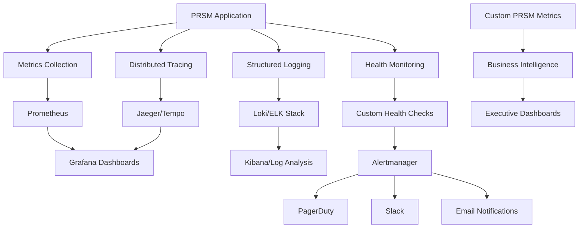

# Enterprise Monitoring & Observability Setup Guide

## Overview

PRSM includes a comprehensive, enterprise-grade monitoring and observability stack built on industry-standard tools. This guide covers deployment, configuration, and optimization of PRSM's monitoring infrastructure for enterprise environments.

## 🏗️ Architecture Overview

### **Complete Observability Stack**



### **Key Components**

| Component | Purpose | Enterprise Benefits |
|-----------|---------|-------------------|
| **Prometheus** | Metrics collection & storage | Industry standard, scalable time-series DB |
| **Grafana** | Visualization & dashboards | Rich visualizations, multi-tenancy support |
| **Jaeger/Tempo** | Distributed tracing | Request flow analysis, performance debugging |
| **Loki/ELK** | Log aggregation & analysis | Centralized logging, security analysis |
| **Alertmanager** | Alert routing & management | Multi-channel notifications, escalation policies |
| **Custom Exporters** | PRSM-specific metrics | Business logic monitoring, compliance reporting |

## 🚀 Quick Start Deployment

### **Single Command Enterprise Deployment**

```bash
# Deploy complete observability stack
docker-compose -f docker-compose.observability.yml up -d

# Verify deployment
docker-compose -f docker-compose.observability.yml ps

# Access dashboards
echo "Grafana: http://localhost:3000 (admin/admin)"
echo "Prometheus: http://localhost:9090"
echo "Jaeger: http://localhost:16686"
echo "Kibana: http://localhost:5601"
```

### **Production Deployment with Kubernetes**

```yaml
# k8s/monitoring-namespace.yaml
apiVersion: v1
kind: Namespace
metadata:
  name: prsm-monitoring
  labels:
    name: prsm-monitoring

---
# Deploy Prometheus Stack
apiVersion: v1
kind: ConfigMap
metadata:
  name: prometheus-config
  namespace: prsm-monitoring
data:
  prometheus.yml: |
    global:
      scrape_interval: 15s
      evaluation_interval: 15s
    
    rule_files:
      - "/etc/prometheus/alert_rules.yml"
      - "/etc/prometheus/prsm_rules.yml"
    
    alerting:
      alertmanagers:
        - static_configs:
            - targets:
              - alertmanager:9093
    
    scrape_configs:
      - job_name: 'prsm-api'
        static_configs:
          - targets: ['prsm-api:8000']
        metrics_path: '/metrics'
        scrape_interval: 5s
      
      - job_name: 'prsm-metrics-exporter'
        static_configs:
          - targets: ['prsm-metrics-exporter:8001']
        scrape_interval: 10s
      
      - job_name: 'kubernetes-pods'
        kubernetes_sd_configs:
          - role: pod
        relabel_configs:
          - source_labels: [__meta_kubernetes_pod_annotation_prometheus_io_scrape]
            action: keep
            regex: true

---
apiVersion: apps/v1
kind: Deployment
metadata:
  name: prometheus
  namespace: prsm-monitoring
spec:
  replicas: 1
  selector:
    matchLabels:
      app: prometheus
  template:
    metadata:
      labels:
        app: prometheus
    spec:
      containers:
      - name: prometheus
        image: prom/prometheus:latest
        ports:
        - containerPort: 9090
        volumeMounts:
        - name: prometheus-config
          mountPath: /etc/prometheus
        - name: prometheus-data
          mountPath: /prometheus
        args:
          - '--config.file=/etc/prometheus/prometheus.yml'
          - '--storage.tsdb.path=/prometheus'
          - '--web.console.libraries=/etc/prometheus/console_libraries'
          - '--web.console.templates=/etc/prometheus/consoles'
          - '--storage.tsdb.retention.time=30d'
          - '--web.enable-lifecycle'
      volumes:
      - name: prometheus-config
        configMap:
          name: prometheus-config
      - name: prometheus-data
        persistentVolumeClaim:
          claimName: prometheus-pvc
```

## 📊 Dashboard Configuration

### **Executive Dashboard Setup**

```python
# scripts/setup_executive_dashboard.py
import json
from pathlib import Path

def create_executive_dashboard():
    """Create executive-level monitoring dashboard"""
    dashboard = {
        "dashboard": {
            "title": "PRSM Executive Overview",
            "tags": ["prsm", "executive"],
            "timezone": "browser",
            "panels": [
                {
                    "title": "Active Users (24h)",
                    "type": "stat",
                    "targets": [
                        {
                            "expr": "increase(prsm_user_sessions_total[24h])",
                            "legendFormat": "Active Users"
                        }
                    ],
                    "gridPos": {"h": 8, "w": 6, "x": 0, "y": 0}
                },
                {
                    "title": "AI Query Success Rate",
                    "type": "stat",
                    "targets": [
                        {
                            "expr": "rate(prsm_query_success_total[5m]) / rate(prsm_query_total[5m]) * 100",
                            "legendFormat": "Success Rate %"
                        }
                    ],
                    "gridPos": {"h": 8, "w": 6, "x": 6, "y": 0}
                },
                {
                    "title": "FTNS Token Volume (24h)",
                    "type": "stat",
                    "targets": [
                        {
                            "expr": "increase(prsm_ftns_transactions_total[24h])",
                            "legendFormat": "Transactions"
                        }
                    ],
                    "gridPos": {"h": 8, "w": 6, "x": 12, "y": 0}
                },
                {
                    "title": "System Health Score",
                    "type": "gauge",
                    "targets": [
                        {
                            "expr": "prsm_system_health_score",
                            "legendFormat": "Health Score"
                        }
                    ],
                    "gridPos": {"h": 8, "w": 6, "x": 18, "y": 0}
                }
            ]
        }
    }
    
    # Save dashboard JSON
    dashboard_path = Path("config/grafana/dashboards/executive-overview.json")
    dashboard_path.parent.mkdir(parents=True, exist_ok=True)
    
    with open(dashboard_path, 'w') as f:
        json.dump(dashboard, f, indent=2)
    
    print(f"Executive dashboard created: {dashboard_path}")

if __name__ == "__main__":
    create_executive_dashboard()
```

### **Technical Operations Dashboard**

```json
{
  "dashboard": {
    "title": "PRSM Technical Operations",
    "tags": ["prsm", "operations"],
    "panels": [
      {
        "title": "API Response Times",
        "type": "graph",
        "targets": [
          {
            "expr": "histogram_quantile(0.95, rate(prsm_request_duration_seconds_bucket[5m]))",
            "legendFormat": "95th percentile"
          },
          {
            "expr": "histogram_quantile(0.50, rate(prsm_request_duration_seconds_bucket[5m]))",
            "legendFormat": "50th percentile"
          }
        ]
      },
      {
        "title": "Database Connection Pool",
        "type": "graph",
        "targets": [
          {
            "expr": "prsm_db_connections_active",
            "legendFormat": "Active Connections"
          },
          {
            "expr": "prsm_db_connections_idle",
            "legendFormat": "Idle Connections"
          }
        ]
      },
      {
        "title": "P2P Network Status",
        "type": "table",
        "targets": [
          {
            "expr": "prsm_p2p_peers_connected",
            "legendFormat": "Connected Peers"
          },
          {
            "expr": "prsm_p2p_consensus_participation_rate",
            "legendFormat": "Consensus Participation %"
          }
        ]
      }
    ]
  }
}
```

## 🚨 Enterprise Alerting Configuration

### **Multi-Tier Alert Routing**

```yaml
# config/alertmanager-enterprise.yml
global:
  smtp_smarthost: 'smtp.company.com:587'
  smtp_from: 'noreply@company.com'
  smtp_auth_username: 'noreply@company.com'
  smtp_auth_password: '${SMTP_PASSWORD}'

route:
  group_by: ['alertname', 'severity']
  group_wait: 10s
  group_interval: 10s
  repeat_interval: 1h
  receiver: 'default'
  routes:
    # Critical alerts go to PagerDuty
    - match:
        severity: critical
      receiver: 'pagerduty-critical'
      group_wait: 0s
      repeat_interval: 5m
    
    # Security alerts go to security team
    - match:
        category: security
      receiver: 'security-team'
      group_wait: 30s
    
    # Performance alerts during business hours
    - match:
        category: performance
      receiver: 'performance-team-business-hours'
      active_time_intervals:
        - business_hours
    
    # FTNS/Blockchain alerts
    - match:
        component: ftns
      receiver: 'blockchain-team'

receivers:
  - name: 'default'
    slack_configs:
      - api_url: '${SLACK_WEBHOOK_URL}'
        channel: '#prsm-alerts'
        title: 'PRSM Alert'
        text: '{{ range .Alerts }}{{ .Annotations.summary }}{{ end }}'

  - name: 'pagerduty-critical'
    pagerduty_configs:
      - routing_key: '${PAGERDUTY_INTEGRATION_KEY}'
        description: 'PRSM Critical Alert: {{ .GroupLabels.alertname }}'
        severity: 'critical'
        details:
          firing: '{{ .Alerts.Firing | len }}'
          resolved: '{{ .Alerts.Resolved | len }}'
    slack_configs:
      - api_url: '${SLACK_WEBHOOK_URL}'
        channel: '#prsm-critical'
        title: '🚨 CRITICAL: {{ .GroupLabels.alertname }}'
        color: 'danger'

  - name: 'security-team'
    email_configs:
      - to: 'security-team@company.com'
        subject: 'PRSM Security Alert: {{ .GroupLabels.alertname }}'
        body: |
          Security alert detected in PRSM:
          
          Alert: {{ .GroupLabels.alertname }}
          Severity: {{ .CommonLabels.severity }}
          Time: {{ .CommonAnnotations.timestamp }}
          
          Details:
          {{ range .Alerts }}
          - {{ .Annotations.summary }}
          {{ end }}
    slack_configs:
      - api_url: '${SECURITY_SLACK_WEBHOOK}'
        channel: '#security-alerts'
        title: '🔒 Security Alert'

time_intervals:
  - name: business_hours
    time_intervals:
      - times:
          - start_time: '09:00'
            end_time: '17:00'
        weekdays: ['monday:friday']
        location: 'America/New_York'
```

### **Comprehensive Alert Rules**

```yaml
# config/prometheus/enterprise-alert-rules.yml
groups:
  - name: prsm.critical
    rules:
      - alert: PRSMAPIDown
        expr: up{job="prsm-api"} == 0
        for: 1m
        labels:
          severity: critical
          category: availability
        annotations:
          summary: "PRSM API is down"
          description: "PRSM API has been down for more than 1 minute"
          runbook_url: "https://wiki.company.com/prsm/runbooks/api-down"

      - alert: HighErrorRate
        expr: rate(prsm_requests_failed_total[5m]) / rate(prsm_requests_total[5m]) > 0.1
        for: 2m
        labels:
          severity: critical
          category: performance
        annotations:
          summary: "High error rate detected"
          description: "Error rate is {{ $value | humanizePercentage }} for the last 5 minutes"

      - alert: DatabaseConnectionExhaustion
        expr: prsm_db_connections_active / prsm_db_connections_max > 0.9
        for: 1m
        labels:
          severity: critical
          category: database
        annotations:
          summary: "Database connection pool nearly exhausted"
          description: "Database connections are at {{ $value | humanizePercentage }} capacity"

  - name: prsm.warning
    rules:
      - alert: HighLatency
        expr: histogram_quantile(0.95, rate(prsm_request_duration_seconds_bucket[5m])) > 2
        for: 5m
        labels:
          severity: warning
          category: performance
        annotations:
          summary: "High API latency"
          description: "95th percentile latency is {{ $value }}s"

      - alert: FTNSTransactionBacklog
        expr: prsm_ftns_pending_transactions > 100
        for: 2m
        labels:
          severity: warning
          category: ftns
          component: ftns
        annotations:
          summary: "FTNS transaction backlog"
          description: "{{ $value }} FTNS transactions are pending"

  - name: prsm.security
    rules:
      - alert: SuspiciousLoginPattern
        expr: increase(prsm_failed_login_attempts_total[1h]) > 50
        for: 1m
        labels:
          severity: warning
          category: security
        annotations:
          summary: "Suspicious login pattern detected"
          description: "{{ $value }} failed login attempts in the last hour"

      - alert: UnauthorizedAPIAccess
        expr: increase(prsm_unauthorized_requests_total[5m]) > 10
        for: 1m
        labels:
          severity: critical
          category: security
        annotations:
          summary: "Unauthorized API access attempts"
          description: "{{ $value }} unauthorized requests in 5 minutes"
```

## 📈 Custom Metrics Development

### **PRSM-Specific Business Metrics**

```python
# prsm/monitoring/business_metrics.py
from prometheus_client import Counter, Histogram, Gauge, Summary
import time
from typing import Dict, Any

class PRSMBusinessMetrics:
    """PRSM-specific business logic metrics"""
    
    def __init__(self):
        # User engagement metrics
        self.user_queries = Counter(
            'prsm_user_queries_total',
            'Total number of user queries',
            ['user_type', 'query_type', 'model_provider']
        )
        
        self.query_duration = Histogram(
            'prsm_query_duration_seconds',
            'Time spent processing user queries',
            ['model_provider', 'complexity'],
            buckets=[0.1, 0.5, 1.0, 2.0, 5.0, 10.0, 30.0, float('inf')]
        )
        
        # FTNS token metrics
        self.ftns_transactions = Counter(
            'prsm_ftns_transactions_total',
            'Total FTNS token transactions',
            ['transaction_type', 'status']
        )
        
        self.ftns_balance = Gauge(
            'prsm_ftns_total_supply',
            'Total FTNS tokens in circulation'
        )
        
        self.ftns_transaction_value = Summary(
            'prsm_ftns_transaction_value',
            'Value of FTNS transactions'
        )
        
        # AI model performance
        self.model_inference_time = Histogram(
            'prsm_model_inference_duration_seconds',
            'Model inference time',
            ['model_id', 'model_type'],
            buckets=[0.01, 0.1, 0.5, 1.0, 2.0, 5.0, float('inf')]
        )
        
        self.model_accuracy = Gauge(
            'prsm_model_accuracy_score',
            'Model accuracy score',
            ['model_id', 'evaluation_type']
        )
        
        # P2P network metrics
        self.p2p_peers = Gauge(
            'prsm_p2p_peers_connected',
            'Number of connected P2P peers'
        )
        
        self.consensus_participation = Gauge(
            'prsm_consensus_participation_rate',
            'Consensus participation rate'
        )
        
        # Research collaboration metrics
        self.collaboration_sessions = Counter(
            'prsm_collaboration_sessions_total',
            'Research collaboration sessions',
            ['session_type', 'participant_count']
        )
        
        self.research_outputs = Counter(
            'prsm_research_outputs_total',
            'Research outputs generated',
            ['output_type', 'quality_score']
        )
    
    def record_user_query(self, user_type: str, query_type: str, 
                         model_provider: str, duration: float):
        """Record user query metrics"""
        self.user_queries.labels(
            user_type=user_type,
            query_type=query_type,
            model_provider=model_provider
        ).inc()
        
        complexity = self._determine_complexity(duration)
        self.query_duration.labels(
            model_provider=model_provider,
            complexity=complexity
        ).observe(duration)
    
    def record_ftns_transaction(self, transaction_type: str, 
                              status: str, value: float):
        """Record FTNS transaction metrics"""
        self.ftns_transactions.labels(
            transaction_type=transaction_type,
            status=status
        ).inc()
        
        if status == "success":
            self.ftns_transaction_value.observe(value)
    
    def record_model_inference(self, model_id: str, model_type: str, 
                             duration: float, accuracy: float = None):
        """Record AI model performance metrics"""
        self.model_inference_time.labels(
            model_id=model_id,
            model_type=model_type
        ).observe(duration)
        
        if accuracy is not None:
            self.model_accuracy.labels(
                model_id=model_id,
                evaluation_type="runtime"
            ).set(accuracy)
    
    def update_p2p_status(self, connected_peers: int, 
                         participation_rate: float):
        """Update P2P network status metrics"""
        self.p2p_peers.set(connected_peers)
        self.consensus_participation.set(participation_rate)
    
    def _determine_complexity(self, duration: float) -> str:
        """Determine query complexity based on duration"""
        if duration < 0.5:
            return "simple"
        elif duration < 2.0:
            return "medium"
        else:
            return "complex"

# Global metrics instance
business_metrics = PRSMBusinessMetrics()
```

### **Automated Metrics Collection**

```python
# scripts/metrics_collector.py
import asyncio
import structlog
from datetime import datetime, timedelta
from prsm.monitoring.business_metrics import business_metrics
from prsm.core.database import get_database
from prsm.tokenomics.ftns_service import FTNSService

logger = structlog.get_logger(__name__)

class MetricsCollector:
    """Automated metrics collection service"""
    
    def __init__(self):
        self.ftns_service = FTNSService()
        self.running = False
    
    async def start_collection(self):
        """Start metrics collection"""
        self.running = True
        logger.info("Starting metrics collection")
        
        # Start collection tasks
        tasks = [
            asyncio.create_task(self._collect_user_metrics()),
            asyncio.create_task(self._collect_ftns_metrics()),
            asyncio.create_task(self._collect_system_metrics()),
            asyncio.create_task(self._collect_business_metrics())
        ]
        
        await asyncio.gather(*tasks, return_exceptions=True)
    
    async def _collect_user_metrics(self):
        """Collect user engagement metrics"""
        while self.running:
            try:
                db = await get_database()
                
                # Collect user query statistics
                query_stats = await db.fetch("""
                    SELECT 
                        user_type, 
                        query_type, 
                        model_provider,
                        COUNT(*) as count,
                        AVG(duration) as avg_duration
                    FROM user_queries 
                    WHERE created_at > NOW() - INTERVAL '1 minute'
                    GROUP BY user_type, query_type, model_provider
                """)
                
                for stat in query_stats:
                    for _ in range(stat['count']):
                        business_metrics.record_user_query(
                            user_type=stat['user_type'],
                            query_type=stat['query_type'],
                            model_provider=stat['model_provider'],
                            duration=stat['avg_duration']
                        )
                
                await asyncio.sleep(60)  # Collect every minute
                
            except Exception as e:
                logger.error("Error collecting user metrics", error=str(e))
                await asyncio.sleep(60)
    
    async def _collect_ftns_metrics(self):
        """Collect FTNS token metrics"""
        while self.running:
            try:
                # Get FTNS statistics
                total_supply = await self.ftns_service.get_total_supply()
                business_metrics.ftns_balance.set(total_supply)
                
                # Get recent transactions
                transactions = await self.ftns_service.get_recent_transactions(limit=100)
                
                for tx in transactions:
                    business_metrics.record_ftns_transaction(
                        transaction_type=tx.transaction_type,
                        status=tx.status,
                        value=tx.amount
                    )
                
                await asyncio.sleep(30)  # Collect every 30 seconds
                
            except Exception as e:
                logger.error("Error collecting FTNS metrics", error=str(e))
                await asyncio.sleep(30)
    
    async def _collect_system_metrics(self):
        """Collect system performance metrics"""
        while self.running:
            try:
                # Implementation depends on your system monitoring needs
                # This is a placeholder for system-specific metrics
                
                await asyncio.sleep(15)  # Collect every 15 seconds
                
            except Exception as e:
                logger.error("Error collecting system metrics", error=str(e))
                await asyncio.sleep(15)
    
    async def _collect_business_metrics(self):
        """Collect business intelligence metrics"""
        while self.running:
            try:
                db = await get_database()
                
                # Collect research collaboration metrics
                collaborations = await db.fetch("""
                    SELECT 
                        session_type,
                        participant_count,
                        COUNT(*) as sessions
                    FROM collaboration_sessions 
                    WHERE created_at > NOW() - INTERVAL '5 minutes'
                    GROUP BY session_type, participant_count
                """)
                
                for collab in collaborations:
                    for _ in range(collab['sessions']):
                        business_metrics.collaboration_sessions.labels(
                            session_type=collab['session_type'],
                            participant_count=str(collab['participant_count'])
                        ).inc()
                
                await asyncio.sleep(300)  # Collect every 5 minutes
                
            except Exception as e:
                logger.error("Error collecting business metrics", error=str(e))
                await asyncio.sleep(300)

# Run metrics collector
if __name__ == "__main__":
    collector = MetricsCollector()
    asyncio.run(collector.start_collection())
```

## 🔍 Log Analysis & Security Monitoring

### **Centralized Log Analysis Setup**

```yaml
# config/loki-config-enterprise.yml
auth_enabled: false

server:
  http_listen_port: 3100

ingester:
  lifecycler:
    address: 127.0.0.1
    ring:
      kvstore:
        store: inmemory
      replication_factor: 1
    final_sleep: 0s
  chunk_idle_period: 5m
  chunk_retain_period: 30s

schema_config:
  configs:
    - from: 2020-10-24
      store: boltdb-shipper
      object_store: filesystem
      schema: v11
      index:
        prefix: index_
        period: 24h

storage_config:
  boltdb_shipper:
    active_index_directory: /loki/boltdb-shipper-active
    cache_location: /loki/boltdb-shipper-cache
    shared_store: filesystem
  filesystem:
    directory: /loki/chunks

limits_config:
  enforce_metric_name: false
  reject_old_samples: true
  reject_old_samples_max_age: 168h
  ingestion_rate_mb: 16
  ingestion_burst_size_mb: 32

chunk_store_config:
  max_look_back_period: 0s

table_manager:
  retention_deletes_enabled: true
  retention_period: 720h  # 30 days

# Enterprise-specific configuration
ruler:
  storage:
    type: local
    local:
      directory: /loki/rules
  rule_path: /tmp/loki-rules
  alertmanager_url: http://alertmanager:9093
  ring:
    kvstore:
      store: inmemory
  enable_api: true
```

### **Security Event Correlation**

```python
# prsm/monitoring/security_correlation.py
import re
from typing import List, Dict, Any
from datetime import datetime, timedelta
import structlog

logger = structlog.get_logger(__name__)

class SecurityEventCorrelator:
    """Correlate security events for threat detection"""
    
    def __init__(self):
        self.suspicious_patterns = {
            'brute_force': {
                'pattern': r'failed.*authentication',
                'threshold': 10,
                'timeframe': timedelta(minutes=5)
            },
            'sql_injection': {
                'pattern': r'(union|select|drop|insert|update).*from',
                'threshold': 3,
                'timeframe': timedelta(minutes=1)
            },
            'privilege_escalation': {
                'pattern': r'(sudo|admin|root).*unauthorized',
                'threshold': 1,
                'timeframe': timedelta(minutes=1)
            }
        }
        
        self.event_buffer = {}
    
    async def analyze_log_entry(self, log_entry: Dict[str, Any]) -> List[Dict[str, Any]]:
        """Analyze log entry for security threats"""
        alerts = []
        
        timestamp = datetime.fromisoformat(log_entry.get('timestamp', ''))
        message = log_entry.get('message', '').lower()
        source_ip = log_entry.get('source_ip', 'unknown')
        
        # Check each security pattern
        for threat_type, config in self.suspicious_patterns.items():
            if re.search(config['pattern'], message, re.IGNORECASE):
                # Track event in buffer
                key = f"{threat_type}_{source_ip}"
                if key not in self.event_buffer:
                    self.event_buffer[key] = []
                
                self.event_buffer[key].append(timestamp)
                
                # Clean old events
                cutoff = timestamp - config['timeframe']
                self.event_buffer[key] = [
                    t for t in self.event_buffer[key] if t > cutoff
                ]
                
                # Check if threshold exceeded
                if len(self.event_buffer[key]) >= config['threshold']:
                    alerts.append({
                        'alert_type': 'security_threat',
                        'threat_type': threat_type,
                        'severity': 'high',
                        'source_ip': source_ip,
                        'event_count': len(self.event_buffer[key]),
                        'timeframe': config['timeframe'].total_seconds(),
                        'message': f"Detected {threat_type} attack from {source_ip}",
                        'timestamp': timestamp.isoformat()
                    })
                    
                    # Reset buffer after alert
                    self.event_buffer[key] = []
        
        return alerts
    
    async def generate_security_report(self, timeframe_hours: int = 24) -> Dict[str, Any]:
        """Generate security analysis report"""
        end_time = datetime.utcnow()
        start_time = end_time - timedelta(hours=timeframe_hours)
        
        # This would typically query your log aggregation system
        # For now, returning a mock report structure
        
        return {
            'report_period': {
                'start': start_time.isoformat(),
                'end': end_time.isoformat()
            },
            'threat_summary': {
                'total_events': 0,
                'threat_types': {},
                'top_source_ips': {},
                'severity_breakdown': {
                    'critical': 0,
                    'high': 0,
                    'medium': 0,
                    'low': 0
                }
            },
            'recommendations': []
        }
```

## 📊 Performance Monitoring

### **Application Performance Monitoring (APM)**

```python
# prsm/monitoring/apm_integration.py
import time
from functools import wraps
from typing import Callable, Any
import structlog
from prometheus_client import Histogram, Counter

logger = structlog.get_logger(__name__)

# APM metrics
request_duration = Histogram(
    'prsm_apm_request_duration_seconds',
    'Request duration',
    ['method', 'endpoint', 'status_code']
)

request_count = Counter(
    'prsm_apm_requests_total',
    'Total requests',
    ['method', 'endpoint', 'status_code']
)

def monitor_performance(endpoint_name: str = None):
    """Decorator for automatic performance monitoring"""
    def decorator(func: Callable) -> Callable:
        @wraps(func)
        async def wrapper(*args, **kwargs):
            start_time = time.time()
            endpoint = endpoint_name or func.__name__
            status_code = "200"
            
            try:
                result = await func(*args, **kwargs)
                return result
            except Exception as e:
                status_code = "500"
                logger.error("Request failed", endpoint=endpoint, error=str(e))
                raise
            finally:
                duration = time.time() - start_time
                
                # Record metrics
                request_duration.labels(
                    method="POST",  # Could be extracted from context
                    endpoint=endpoint,
                    status_code=status_code
                ).observe(duration)
                
                request_count.labels(
                    method="POST",
                    endpoint=endpoint,
                    status_code=status_code
                ).inc()
                
                # Log performance data
                logger.info("Request completed",
                          endpoint=endpoint,
                          duration=duration,
                          status_code=status_code)
        
        return wrapper
    return decorator

# Usage example
@monitor_performance("ai_query_processing")
async def process_ai_query(query: str) -> str:
    """Example monitored function"""
    # Simulate AI processing
    await asyncio.sleep(0.1)
    return f"Processed: {query}"
```

## 🎯 Service Level Objectives (SLOs)

### **SLO Configuration & Monitoring**

```yaml
# config/slos.yaml
slos:
  api_availability:
    description: "API should be available 99.9% of the time"
    sli_query: "up{job='prsm-api'}"
    target: 0.999
    window: "30d"
    
  api_latency:
    description: "95% of API requests should complete within 2 seconds"
    sli_query: "histogram_quantile(0.95, rate(prsm_request_duration_seconds_bucket[5m]))"
    target: 2.0
    window: "24h"
    
  ftns_transaction_success:
    description: "99% of FTNS transactions should succeed"
    sli_query: "rate(prsm_ftns_transactions_total{status='success'}[5m]) / rate(prsm_ftns_transactions_total[5m])"
    target: 0.99
    window: "7d"
    
  query_processing_accuracy:
    description: "AI query processing should maintain 95% accuracy"
    sli_query: "avg(prsm_model_accuracy_score)"
    target: 0.95
    window: "24h"
```

### **SLO Dashboard Generator**

```python
# scripts/generate_slo_dashboard.py
import yaml
import json
from pathlib import Path

def generate_slo_dashboard(slos_config_path: str, output_path: str):
    """Generate Grafana dashboard for SLOs"""
    
    with open(slos_config_path) as f:
        slos = yaml.safe_load(f)
    
    panels = []
    
    for slo_name, slo_config in slos['slos'].items():
        panel = {
            "title": f"SLO: {slo_config['description']}",
            "type": "stat",
            "targets": [
                {
                    "expr": slo_config['sli_query'],
                    "legendFormat": f"{slo_name}"
                }
            ],
            "fieldConfig": {
                "defaults": {
                    "thresholds": {
                        "steps": [
                            {"color": "red", "value": None},
                            {"color": "yellow", "value": slo_config['target'] * 0.9},
                            {"color": "green", "value": slo_config['target']}
                        ]
                    },
                    "min": 0,
                    "max": slo_config['target'] * 1.1 if slo_config['target'] <= 1 else None
                }
            }
        }
        panels.append(panel)
    
    dashboard = {
        "dashboard": {
            "title": "PRSM Service Level Objectives",
            "tags": ["slo", "reliability"],
            "panels": panels
        }
    }
    
    with open(output_path, 'w') as f:
        json.dump(dashboard, f, indent=2)
    
    print(f"SLO dashboard generated: {output_path}")

if __name__ == "__main__":
    generate_slo_dashboard(
        "config/slos.yaml",
        "config/grafana/dashboards/slos.json"
    )
```

## 🚀 Deployment & Scaling

### **Production-Ready Monitoring Stack**

```yaml
# docker-compose.production.yml
version: '3.8'

services:
  prometheus:
    image: prom/prometheus:latest
    container_name: prsm-prometheus
    command:
      - '--config.file=/etc/prometheus/prometheus.yml'
      - '--storage.tsdb.path=/prometheus'
      - '--storage.tsdb.retention.time=30d'
      - '--web.console.libraries=/etc/prometheus/console_libraries'
      - '--web.console.templates=/etc/prometheus/consoles'
      - '--web.enable-lifecycle'
      - '--web.enable-admin-api'
    volumes:
      - ./config/prometheus:/etc/prometheus
      - prometheus_data:/prometheus
    ports:
      - "9090:9090"
    restart: unless-stopped
    deploy:
      resources:
        limits:
          memory: 2G
          cpus: '1.0'

  grafana:
    image: grafana/grafana:latest
    container_name: prsm-grafana
    environment:
      - GF_SECURITY_ADMIN_PASSWORD=${GRAFANA_ADMIN_PASSWORD}
      - GF_INSTALL_PLUGINS=grafana-piechart-panel,grafana-worldmap-panel
      - GF_AUTH_LDAP_ENABLED=true
      - GF_AUTH_LDAP_CONFIG_FILE=/etc/grafana/ldap.toml
    volumes:
      - grafana_data:/var/lib/grafana
      - ./config/grafana:/etc/grafana/provisioning
    ports:
      - "3000:3000"
    restart: unless-stopped
    depends_on:
      - prometheus

  jaeger:
    image: jaegertracing/all-in-one:latest
    container_name: prsm-jaeger
    environment:
      - COLLECTOR_ZIPKIN_HOST_PORT=:9411
    ports:
      - "16686:16686"
      - "14268:14268"
    restart: unless-stopped

  loki:
    image: grafana/loki:latest
    container_name: prsm-loki
    command: -config.file=/etc/loki/local-config.yaml
    volumes:
      - ./config/loki-config.yml:/etc/loki/local-config.yaml
      - loki_data:/loki
    ports:
      - "3100:3100"
    restart: unless-stopped

  promtail:
    image: grafana/promtail:latest
    container_name: prsm-promtail
    command: -config.file=/etc/promtail/config.yml
    volumes:
      - ./config/promtail-config.yml:/etc/promtail/config.yml
      - /var/log:/var/log:ro
      - /var/lib/docker/containers:/var/lib/docker/containers:ro
    restart: unless-stopped

  alertmanager:
    image: prom/alertmanager:latest
    container_name: prsm-alertmanager
    command:
      - '--config.file=/etc/alertmanager/alertmanager.yml'
      - '--storage.path=/alertmanager'
      - '--web.external-url=http://localhost:9093'
    volumes:
      - ./config/alertmanager.yml:/etc/alertmanager/alertmanager.yml
      - alertmanager_data:/alertmanager
    ports:
      - "9093:9093"
    restart: unless-stopped

volumes:
  prometheus_data:
  grafana_data:
  loki_data:
  alertmanager_data:
```

## 📞 Support & Maintenance

### **Monitoring Maintenance Scripts**

```bash
#!/bin/bash
# scripts/monitoring-maintenance.sh

echo "PRSM Monitoring Stack Maintenance"

# Backup Grafana dashboards
backup_grafana_dashboards() {
    echo "Backing up Grafana dashboards..."
    docker exec prsm-grafana grafana-cli admin export-dashboard \
        --homeDashboard > backups/grafana-dashboards-$(date +%Y%m%d).json
}

# Cleanup old metrics data
cleanup_old_data() {
    echo "Cleaning up old metrics data..."
    # Prometheus data cleanup is handled by retention settings
    # Clean up old logs
    find /var/log/prsm -name "*.log" -mtime +7 -delete
}

# Verify monitoring stack health
verify_stack_health() {
    echo "Verifying monitoring stack health..."
    
    services=("prometheus" "grafana" "jaeger" "loki" "alertmanager")
    
    for service in "${services[@]}"; do
        if docker ps | grep -q "prsm-$service"; then
            echo "✅ $service is running"
        else
            echo "❌ $service is not running"
        fi
    done
}

# Run maintenance tasks
case "$1" in
    backup)
        backup_grafana_dashboards
        ;;
    cleanup)
        cleanup_old_data
        ;;
    health)
        verify_stack_health
        ;;
    all)
        backup_grafana_dashboards
        cleanup_old_data
        verify_stack_health
        ;;
    *)
        echo "Usage: $0 {backup|cleanup|health|all}"
        exit 1
        ;;
esac
```

---

## 📋 Quick Reference

### **Key URLs**
- **Grafana**: http://localhost:3000 (admin/admin)
- **Prometheus**: http://localhost:9090
- **Jaeger**: http://localhost:16686
- **Alertmanager**: http://localhost:9093
- **PRSM Metrics**: http://localhost:8000/metrics

### **Important Metrics**
- `prsm_user_queries_total` - User engagement
- `prsm_ftns_transactions_total` - Token economics
- `prsm_request_duration_seconds` - API performance
- `prsm_model_accuracy_score` - AI model quality
- `prsm_p2p_peers_connected` - Network health

### **Critical Alerts**
- API downtime > 1 minute
- Error rate > 10%
- Database connections > 90%
- Security events (immediate escalation)

> _"Effective monitoring is the foundation of reliable systems. PRSM's comprehensive observability stack provides the insights needed to maintain exceptional service quality and user experience."_