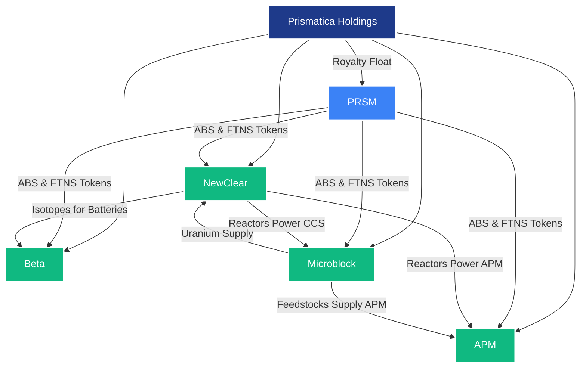

# Prismatica Holdings: Pioneering the Future of Atomically Precise Innovation

## Executive Summary
Prismatica Holdings stands at the vanguard of a new industrial era, harnessing the revolutionary potential of PRSM (Protocol for Recursive Scientific Modeling) to disrupt capitalist value circuits and forge a sustainable, equitable future. As PRSM’s for-profit sister, Prismatica leverages the Automated Bayesian Search (ABS) protocol—a recursive, AI-driven framework for scientific discovery—to accelerate breakthroughs in atomically precise manufacturing (APM), nuclear energy, betavoltaic batteries, and carbon-capture feedstocks. Through its subsidiaries—APM, NewClear, Beta, and Microblock—Prismatica monetizes these innovations via intellectual property (IP) licensing, reactor leasing, battery sales, and feedstock provision, capturing multi-trillion-dollar markets while advancing humanity toward a post-capitalist horizon. By generating a “float” of provenance royalties from PRSM’s FTNS token system, akin to Berkshire Hathaway’s insurance model, Prismatica ensures financial sustainability without reliance on extractive monopolies.[^1] Early investors in PRSM gain rights to Class A Preferred shares in Prismatica, offering anti-dilution protection and exposure to subsidiary IPOs, aligning profit with societal good.[^2] With PRSM’s open-source ethos and Prismatica’s commercial engine, this ecosystem redefines production, slashes costs, and decarbonizes the planet, fulfilling the promise of intelligent, ethical innovation.

## Market Opportunity
The global economy teeters on the edge of transformation. Current industrial paradigms—reliant on inefficient, carbon-intensive supply chains—face mounting pressures: climate change, resource scarcity, and the diminishing returns of large language models (LLMs).[^3] Prismatica targets four high-growth markets, collectively valued at over $2 trillion by 2030:
- **Atomically Precise Manufacturing (APM)**: The nanotech market, projected at $150 billion by 2028, demands precision and scalability.[^4] APM’s self-replicating systems promise to reduce production costs by orders of magnitude.
- **Nuclear Energy**: The small modular reactor market is expected to reach $72 billion by 2030, driven by demand for clean, scalable energy.[^5] Prismatica’s NewClear subsidiary delivers safe, efficient molten salt reactors.
- **Betavoltaic Batteries**: The global battery market, valued at $120 billion in 2025, seeks high-density, long-life solutions.[^6] Beta’s betavoltaic cells offer 50x the energy density of chemical batteries.
- **Carbon Capture and Feedstocks**: The carbon capture and storage (CCS) market, projected at $9 billion by 2030, aligns with global decarbonization goals.[^7] Microblock’s feedstock production via CCS taps oceanic uranium and desalinates water, addressing resource and climate challenges.

Prismatica’s ABS, powered by PRSM, accelerates innovation across these sectors, slashing development timelines from decades to 5–7 years by optimizing experimentation and leveraging negative results.[^8] This positions Prismatica to capture significant market share while dismantling the inefficiencies of capitalist production.

## Business Model
Prismatica’s economic engine rests on a symbiotic relationship with PRSM, generating revenue through a diversified, sustainable model:
- **Provenance Royalties (“Float”)**: Prismatica receives a continuous stream of FTNS tokens from PRSM’s ledger, rewarding contributions to ABS-driven discoveries, including negative results.[^9] This “float,” akin to Berkshire Hathaway’s insurance premiums, provides low-cost capital for investment in subsidiaries, eliminating reliance on debt or dilutive equity.[^10]
- **Subsidiary Revenue Streams**:
  - **APM**: Licenses IP for self-replicating machines, akin to ARM’s chip licensing model, generating royalties from manufacturers integrating APM into proprietary products.[^11]
  - **NewClear**: Leases small, modular molten salt reactors, charging flat rates based on power consumption, with centralized waste processing for safety and efficiency.[^12]
  - **Beta**: Sells betavoltaic batteries to medical, consumer electronics, and transportation sectors, offering 50x energy density and 10-year lifespans.[^13]
  - **Microblock**: Supplies microblock feedstocks (e.g., carbon, nitrogen) via CCS and oceanic uranium extraction, while providing desalinated water to utilities, creating dual revenue streams.[^14]
- **IP Commercialization**: Prismatica patents select ABS-driven discoveries before publishing to PRSM, monetizing through licensing, manufacturing rights, and spinout ventures, balancing profit with open science.[^15]
- **Investor Incentives**: Early PRSM investors receive rights to Class A Preferred shares in Prismatica, offering liquidation preference, anti-dilution protection, and exposure to subsidiary IPOs, ensuring alignment with long-term value creation.[^16]

This model disrupts capitalist value circuits by reducing production costs asymptotically toward zero, democratizing access to advanced technologies, and reinvesting profits into sustainable innovation.[^17]

## Technical Foundation: Automated Bayesian Search (ABS)
At Prismatica’s core lies ABS, a recursive scientific discovery protocol integrated with PRSM’s decentralized ledger. ABS reframes experimentation as a Bayesian optimization process, using the formula:

\[ P(H|D) = \frac{P(D|H)P(H)}{P(D)} \]

Where:
- \( H \): Hypothesis (e.g., “This molecular feedstock assembles into a carbon nanotube”).
- \( D \): Observed data (e.g., simulation or experimental results).
- \( P(H) \): Prior probability of the hypothesis.
- \( P(D|H) \): Likelihood of observing \( D \) given \( H \).
- \( P(H|D) \): Posterior belief, updated recursively.[^18]

ABS operates through a three-stage feedback loop:
1. **Simulation-Based Exploration**: Uses computational tools (e.g., Density Functional Theory, Molecular Dynamics) to explore hypothesis spaces rapidly, pruning unviable paths.[^19]
2. **Wet-Lab Validation**: Employs robotic lab-on-chip systems for high-throughput testing, logging results to PRSM.[^20]
3. **Bayesian Updating and Tokenized Publishing**: Updates priors via Bayesian optimization, rewarding contributors with FTNS tokens proportional to information gain, even for negative results.[^21]

**Example**: In carbon nanotube synthesis, ABS simulates reaction conditions, eliminates high-enthalpy paths, validates promising candidates in wet labs, and updates priors, reducing development time by 50%.[^22] This recursive approach, logged on PRSM’s IPFS-based ledger, ensures transparency, ethical data use, and compliance with *Bartz v. Anthropic* (2025).[^23]

## Subsidiaries: Driving Innovation
Prismatica’s four subsidiaries leverage ABS and PRSM to capture market opportunities:
- **APM**: Develops self-replicating machines, starting with 3D printers and robotic arms, scaling to micron-sized systems with 10-nanometer precision.[^24] By licensing IP, APM enables manufacturers to produce everything from consumer goods to factory equipment, reducing costs by factors of 10–1,000.[^25] ABS accelerates development, cutting nanotech timelines to 5–7 years.[^26]
- **NewClear**: Designs small, modular molten salt uranium-plutonium fast reactors, achieving 99% fuel burn-up and walk-away safety.[^27] Powered by APM, reactors fit in closets, produce 1 MW, and serve APM facilities, homes, or vehicles, with waste processed centrally.[^28] NewClear’s leasing model ensures steady revenue while advancing clean energy.
- **Beta**: Produces betavoltaic batteries using APM and NewClear’s reactors, offering 50x the energy density of chemical batteries and 10-year lifespans.[^29] Applications span medical devices, consumer electronics, and electric vehicles (e.g., 3.5 million-mile range cars).[^30]
- **Microblock**: Supplies microblock feedstocks (e.g., carbon, nitrogen) via CCS and oceanic uranium extraction, using NewClear reactors for power.[^31] Coastal facilities desalinate water, providing clean water to utilities and enabling agricultural expansion in water-scarce regions (e.g., inland California).[^32]

These subsidiaries synergize with PRSM’s federated learning and governance, ensuring collaborative, ethical innovation.

## Corporate Structure and Synergies
Prismatica Holdings orchestrates a symphony of innovation, uniting its subsidiaries under a cohesive vision while leveraging PRSM’s open-source infrastructure. Unlike the rigid hierarchies of capitalist monopolies, Prismatica’s structure fosters decentralized synergy, channeling PRSM’s Automated Bayesian Search (ABS) and FTNS tokens to drive progress. NewClear’s reactors power APM’s self-replicating machines and Microblock’s carbon-capture facilities, while Microblock supplies feedstocks to APM and uranium to NewClear. Beta leverages NewClear’s isotopes for high-density batteries, and PRSM’s ledger ensures equitable value distribution through royalty flows. Prismatica’s “float” of FTNS tokens funds all subsidiaries, creating a resilient, self-sustaining ecosystem.[^33]

### Organizational Chart
The following Mermaid.js diagram illustrates Prismatica’s corporate structure and synergies, renderable directly in GitHub:

This diagram depicts Prismatica Holdings as the parent, with PRSM and subsidiaries as nodes. Arrows highlight key synergies: PRSM’s ABS drives innovation across all subsidiaries, NewClear powers APM and Microblock, Microblock supplies feedstocks and uranium, and Beta utilizes NewClear’s isotopes. The royalty float fuels the ecosystem, ensuring financial and ethical alignment.[^34]

## Societal and Economic Impact
Prismatica dismantles capitalist contradictions, aligning with PRSM’s post-capitalist vision:
- **Cost Reduction**: APM reduces production costs toward energy and design licensing costs, democratizing access to goods and raising living standards.[^35]
- **Decarbonization**: Microblock’s CCS, powered by NewClear reactors, removes atmospheric carbon, potentially restoring pre-industrial levels, while desalinated water addresses global shortages.[^36]
- **Wealth Democratization**: Provenance royalties and open science incentivize global participation, redistributing value from monopolies to creators.[^37]
- **Energy Sustainability**: NewClear’s reactors and Beta’s batteries enable a nuclear-powered economy, sustaining the Henry Adams Curve (5–7% growth) for centuries via oceanic uranium and D-T fusion.[^38]

By integrating with PRSM’s democratic governance, Prismatica ensures innovations serve humanity, not profit-driven elites, echoing calls for equitable AI systems.[^39]

## Investment Proposition
Prismatica offers a compelling opportunity for investors:
- **Class A Preferred Shares**: Early PRSM investors gain rights to shares with liquidation preference and anti-dilution protection, ensuring priority in bankruptcy and exposure to subsidiary IPOs.[^40]
- **Financial Sustainability**: The royalty float provides stable capital, minimizing debt and equity dilution, while subsidiary revenues (e.g., IP licensing, reactor leasing) drive growth.[^41]
- **Market Potential**: Targeting $2T+ markets, Prismatica’s diversified portfolio mitigates risk while maximizing returns.[^42]
- **Societal Alignment**: Investments support decarbonization, cost reduction, and equitable innovation, appealing to ESG-focused funds.[^43]

Prismatica’s synergy with PRSM ensures a virtuous cycle: ABS accelerates discoveries, PRSM’s ledger rewards contributors, and Prismatica’s subsidiaries monetize outcomes, fueling further investment and innovation.

## Roadmap and Milestones
- **2026**: Prototype ABS-driven APM system (e.g., 3D printer with robotic arms), validating self-replication at millimeter scale.[^44]
- **2027**: Deploy NewClear’s first modular reactor (1 MW), powering Microblock’s CCS pilot.[^45]
- **2028**: Launch Beta’s betavoltaic battery for medical devices, securing initial contracts.[^46]
- **2030**: Scale Microblock’s coastal facilities, producing 1 billion tons of feedstock and 10 trillion gallons of desalinated water annually.[^47]
- **2032**: Achieve full APM scalability, enabling mass-market adoption and subsidiary IPOs.[^48]

## Conclusion
Prismatica Holdings is not merely a company; it is a catalyst for a new era of production, energy, and sustainability. By leveraging PRSM’s ABS and FTNS ecosystem, Prismatica transforms scientific discovery into tangible, market-disrupting innovations. Its subsidiaries—APM, NewClear, Beta, and Microblock—address humanity’s greatest challenges: climate change, resource scarcity, and economic inequality. Investors in PRSM gain access to a transformative opportunity, with Class A Preferred shares unlocking the value of a $2T+ market portfolio. Prismatica proves that profit and progress can coexist, forging a future where intelligence, not capital, shapes the world.

[^1]: Prismatica’s royalty float model. Prismatica Business Case Material (2025).
[^2]: Investor incentives via Class A shares. Prismatica Business Case Material (2025).
[^3]: LLMs’ inefficiencies. [The Guardian](https://www.theguardian.com/technology/2025/jan/15/ai-energy-consumption-forecast).
[^4]: Nanotech market projection. *Nanotechnology Market Report* (2025).
[^5]: Small modular reactor market. *Nuclear Energy Outlook* (2025).
[^6]: Battery market size. *Global Battery Market Report* (2025).
[^7]: CCS market projection. *Carbon Capture Market Analysis* (2025).
[^8]: ABS timeline reduction. Prismatica Business Case Material (2025).
[^9]: FTNS token rewards. [PRSM GitHub README](https://github.com/Ryno2390/PRSM) (2025).
[^10]: Berkshire Hathaway float analogy. Prismatica Business Case Material (2025).
[^11]: APM IP licensing model. Prismatica Business Case Material (2025).
[^12]: NewClear reactor leasing. Prismatica Business Case Material (2025).
[^13]: Beta battery specifications. Prismatica Business Case Material (2025).
[^14]: Microblock feedstock and water production. Prismatica Business Case Material (2025).
[^15]: IP commercialization strategy. Prismatica Business Case Material (2025).
[^16]: Class A share structure. Prismatica Business Case Material (2025).
[^17]: Cost reduction via APM. Prismatica Business Case Material (2025).
[^18]: ABS Bayesian framework. Prismatica Business Case Material (2025).
[^19]: Simulation-based exploration. Prismatica Business Case Material (2025).
[^20]: Wet-lab validation. Prismatica Business Case Material (2025).
[^21]: Tokenized publishing. Prismatica Business Case Material (2025).
[^22]: Carbon nanotube example. Prismatica Business Case Material (2025).
[^23]: Legal compliance. [PRSM GitHub README](https://github.com/Ryno2390/PRSM) (2025).
[^24]: APM self-replication. Prismatica Business Case Material (2025).
[^25]: APM cost reduction. Prismatica Business Case Material (2025).
[^26]: ABS timeline acceleration. Prismatica Business Case Material (2025).
[^27]: NewClear reactor specs. Prismatica Business Case Material (2025).
[^28]: Centralized waste processing. Prismatica Business Case Material (2025).
[^29]: Beta battery energy density. Prismatica Business Case Material (2025).
[^30]: Battery applications. Prismatica Business Case Material (2025).
[^31]: Microblock CCS and uranium extraction. Prismatica Business Case Material (2025).
[^32]: Desalination and agriculture. Prismatica Business Case Material (2025).
[^33]: Corporate synergies. Prismatica Business Case Material (2025).
[^34]: Organizational chart design. Prismatica Business Case Material (2025).
[^35]: Democratized production. Prismatica Business Case Material (2025).
[^36]: CCS decarbonization. Prismatica Business Case Material (2025).
[^37]: Provenance royalties. [PRSM GitHub README](https://github.com/Ryno2390/PRSM) (2025).
[^38]: Henry Adams Curve sustainability. Prismatica Business Case Material (2025).
[^39]: Equitable AI systems. *AI 2027* Report (2025).
[^40]: Investor share rights. Prismatica Business Case Material (2025).
[^41]: Financial sustainability. Prismatica Business Case Material (2025).
[^42]: Market potential. *Nanotechnology Market Report* (2025).
[^43]: ESG alignment. *Carbon Capture Market Analysis* (2025).
[^44]: APM prototype milestone. Prismatica Business Case Material (2025).
[^45]: NewClear reactor deployment. Prismatica Business Case Material (2025).
[^46]: Beta battery launch. Prismatica Business Case Material (2025).
[^47]: Microblock scale-up. Prismatica Business Case Material (2025).
[^48]: Subsidiary IPO timeline. Prismatica Business Case Material (2025).