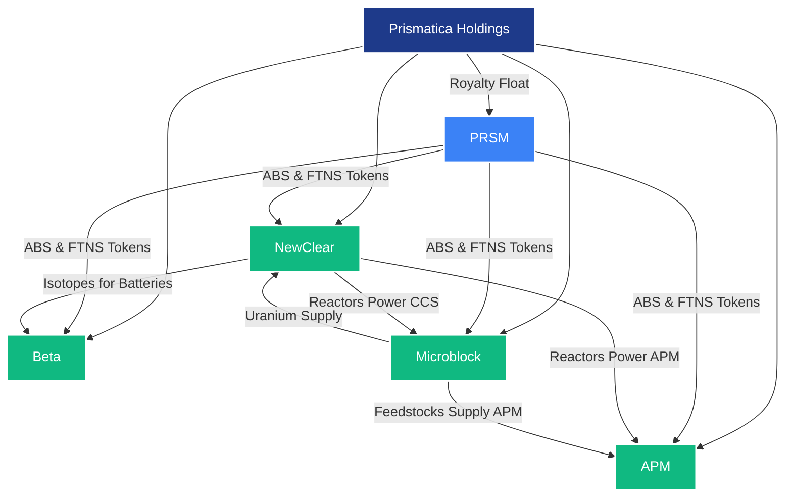

# Prismatica Holdings: Pioneering the Future of Atomically Precise Innovation

## Executive Summary
Prismatica Holdings stands at the vanguard of a new industrial era, harnessing the revolutionary potential of PRSM (Protocol for Recursive Scientific Modeling) to disrupt capitalist value circuits and forge a sustainable, equitable future. As PRSM’s for-profit sister, Prismatica leverages the Automated Bayesian Search (ABS) protocol—a recursive, AI-driven framework for scientific discovery—to accelerate breakthroughs in atomically precise manufacturing (APM), nuclear energy, betavoltaic batteries, and carbon-capture feedstocks. Through its subsidiaries—APM, NewClear, Beta, and Microblock—Prismatica monetizes these innovations via intellectual property (IP) licensing, reactor leasing, battery sales, and feedstock provision, capturing multi-trillion-dollar markets while advancing humanity toward a post-capitalist horizon. By generating a “float” of provenance royalties from PRSM’s FTNS token system, akin to Berkshire Hathaway’s insurance model, Prismatica ensures financial sustainability without reliance on extractive monopolies.[^1] Early investors in PRSM gain rights to Class A Preferred shares in Prismatica, offering anti-dilution protection and exposure to subsidiary IPOs, aligning profit with societal good.[^2] With PRSM’s open-source ethos and Prismatica’s commercial engine, this ecosystem redefines production, slashes costs, and decarbonizes the planet, fulfilling the promise of intelligent, ethical innovation.

## Market Opportunity
The global economy teeters on the edge of transformation. Current industrial paradigms—reliant on inefficient, carbon-intensive supply chains—face mounting pressures: climate change, resource scarcity, and the diminishing returns of large language models (LLMs).[^3] Prismatica targets four high-growth markets, collectively valued at over $2 trillion by 2030:
- **Atomically Precise Manufacturing (APM)**: The nanotech market, projected at $150 billion by 2028, demands precision and scalability.[^4] APM’s self-replicating systems promise to reduce production costs by orders of magnitude.
- **Nuclear Energy**: The small modular reactor market is expected to reach $72 billion by 2030, driven by demand for clean, scalable energy.[^5] Prismatica’s NewClear subsidiary delivers safe, efficient molten salt reactors.
- **Betavoltaic Batteries**: The global battery market, valued at $120 billion in 2025, seeks high-density, long-life solutions.[^6] Beta’s betavoltaic cells offer 50x the energy density of chemical batteries.
- **Carbon Capture and Feedstocks**: The carbon capture and storage (CCS) market, projected at $9 billion by 2030, aligns with global decarbonization goals.[^7] Microblock’s feedstock production via CCS taps oceanic uranium and desalinates water, addressing resource and climate challenges.

Prismatica’s ABS, powered by PRSM, accelerates innovation across these sectors, slashing development timelines from decades to 5–7 years by optimizing experimentation and leveraging negative results.[^8] This positions Prismatica to capture significant market share while dismantling the inefficiencies of capitalist production.

## Business Model
Prismatica’s economic engine rests on a symbiotic relationship with PRSM, generating revenue through a diversified, sustainable model:
- **Provenance Royalties (“Float”)**: Prismatica receives a continuous stream of FTNS tokens from PRSM’s ledger, rewarding contributions to ABS-driven discoveries, including negative results.[^9] This “float,” akin to Berkshire Hathaway’s insurance premiums, provides low-cost capital for investment in subsidiaries, eliminating reliance on debt or dilutive equity.[^10]
- **Subsidiary Revenue Streams**:
  - **APM**: Licenses IP for self-replicating machines, akin to ARM’s chip licensing model, generating royalties from manufacturers integrating APM into proprietary products.[^11]
  - **NewClear**: Leases small, modular molten salt reactors, charging flat rates based on power consumption, with centralized waste processing for safety and efficiency.[^12]
  - **Beta**: Sells betavoltaic batteries to medical, consumer electronics, and transportation sectors, offering 50x energy density and 10-year lifespans.[^13]
  - **Microblock**: Supplies microblock feedstocks (e.g., carbon, nitrogen) via CCS and oceanic uranium extraction, while providing desalinated water to utilities, creating dual revenue streams.[^14]
- **IP Commercialization**: Prismatica patents select ABS-driven discoveries before publishing to PRSM, monetizing through licensing, manufacturing rights, and spinout ventures, balancing profit with open science.[^15]
- **Investor Incentives**: Early PRSM investors receive rights to Class A Preferred shares in Prismatica, offering liquidation preference, anti-dilution protection, and exposure to subsidiary IPOs, ensuring alignment with long-term value creation.[^16]

This model disrupts capitalist value circuits by reducing production costs asymptotically toward zero, democratizing access to advanced technologies, and reinvesting profits into sustainable innovation.[^17]

## Technical Foundation: Revolutionary Hybrid AI Architecture Enabling True ABS

### The Paradigm Breakthrough: Beyond Large Language Models

At Prismatica's core lies a **revolutionary hybrid AI architecture** that makes Automated Bayesian Search (ABS) genuinely feasible for the first time. While the AI industry pursues ever-larger language models that optimize for text prediction rather than understanding, Prismatica leverages a fundamentally different approach: **combining transformer-based pattern recognition with first-principles world models** that actually reason about causal relationships in physical reality.

### The Hybrid Architecture: System 1 + System 2 Reasoning

Prismatica's ABS agents employ a dual-system architecture mirroring human cognition:

**System 1 (Transformer Component)**: Rapidly recognizes subjects, objects, and concepts (SOCs) in experimental data, research literature, and simulation results. Uses transformer models' pattern-matching strengths for fast, intuitive processing of complex scientific information.

**System 2 (First-Principles World Model)**: Maintains a structured model of physical reality based on fundamental principles (thermodynamics, quantum mechanics, materials science) to evaluate and contextualize SOCs. This system reasons about causal relationships, consistency with physical laws, and cross-scale interactions from atomic to macroscopic levels.

**Dynamic Learning Mechanism**: New SOCs are integrated into the world model when they reach a "threshold of concreteness" based on experimental validation. When conflicting SOCs emerge, both are maintained with evolving weights until sufficient evidence establishes the correct model.

### The Secret Sauce: Collective Intelligence Through Experimental Sharing

What makes Prismatica's ABS revolutionary is the **automated Bayesian search mechanism** where agents perform domain-specific experiments and share results—including failures—across PRSM's network to update collective understanding:

\[ P(H|D) = \frac{P(D|H)P(H)}{P(D)} \]

Where:
- \( H \): Hypothesis (e.g., "This molecular assembly pathway produces defect-free carbon nanotubes")
- \( D \): Observed experimental data (success or failure)
- \( P(H|D) \): Updated belief, refined across the entire agent network

**The Failure Revolution**: Unlike traditional research where negative results are buried, ABS agents are economically rewarded for publishing failures because they provide crucial information to update Bayesian priors across the network. When Dr. X publishes a failed nanotube synthesis attempt, she receives FTNS tokens—and receives additional retroactive rewards when ABS later identifies successful pathways that avoid her documented failure modes.

### Concrete Implementation for APM Development

**Specialized Agent Teams**: Prismatica deploys lightweight, domain-specific agents (materials science, thermodynamics, manufacturing processes) that share a common base world model but have specialized knowledge and slightly different "temperatures" (exploration parameters) to provide diverse perspectives on the same problems.

**Hive-Mind Knowledge Propagation**: When one agent validates a core principle (e.g., "surface energy minimization governs self-assembly at this scale"), it propagates to all agents' world models, making the entire network smarter. This creates exponential learning acceleration as the knowledge base grows.

**Experimental Loop Integration**:
1. **Hypothesis Generation**: Agents identify promising research directions using Bayesian optimization across the solution space
2. **Simulation Testing**: Computational experiments (DFT, molecular dynamics) rapidly evaluate hypotheses
3. **Physical Validation**: Robotic lab systems test promising candidates in controlled conditions
4. **Network Updates**: Results update Bayesian priors across all agents, with failures providing equal value to successes
5. **Knowledge Crystallization**: Validated principles become part of the shared world model

### Why This Enables APM Where Others Cannot

**Causal Understanding**: Unlike LLMs that pattern-match on manufacturing text, Prismatica's agents understand the **causal relationships** governing self-replication, precision assembly, and scaling laws—the fundamental requirements for APM.

**Cross-Scale Integration**: The world model bridges quantum-level interactions with macroscopic manufacturing outcomes, solving the "decoupling of scales" problem that limits conventional AI approaches.

**Efficient Learning**: By sharing experimental results and valuing failures, the system learns dramatically faster than traditional R&D approaches, potentially compressing the 20-year APM timeline to 5-7 years.

**Example**: In developing self-replicating manufacturing systems, agents might test thousands of assembly pathways in simulation, validate the most promising in wet labs, and share both successes and failures. A failed attempt at molecular gear assembly provides crucial information about binding energies that helps other agents avoid similar dead ends while focusing on viable alternatives.

This hybrid architecture transforms ABS from a theoretical concept into a practical system capable of achieving the recursive scientific discovery needed for APM, nuclear energy optimization, and the other technologies driving Prismatica's vision.[^18]

### Revolutionary Approach: Turning Failure into Information Gain

Traditional research suffers from a critical flaw: negative results are systematically undervalued and unpublished, leading to massive duplication of failed experiments. ABS transforms this inefficiency into a competitive advantage by making **every experiment—successful or failed—economically valuable**.

When Dr. X publishes a failed attempt to polymerize molecule M under UV light to PRSM, she receives FTNS tokens. A year later, when ABS identifies a successful synthesis method that avoids UV entirely, Dr. X receives additional retroactive rewards because her negative result ruled out a large portion of the design space. This economic incentive structure makes open science financially rational.

### Concrete Examples of ABS Acceleration

**Carbon Nanotube Assembly**: Initial prior probability P(H) for various reaction conditions starts uniform. DFT simulations show conditions A and B result in unstable intermediate compounds. These negative results drastically lower P(H|D) for those conditions, allowing ABS to refocus on promising parameters C and D with mathematical precision.

**Surface Binding Affinity in APM Substrates**: Given results from past experiments, ABS determines that testing boron-doped graphene (instead of silicon carbide) will yield the greatest information gain about binding energetics of carbon radicals. This hypothesis gets prioritized in the next experiment round using Bayesian optimization: x* = arg max(x)E[I(H;D(x))].

### Self-Replicating Systems: The Path to Exponential Manufacturing

ABS guides development of self-replicating machines (SRMs) that fundamentally alter production economics. As foundational research notes: "For a self-replicating system, the product is the system itself. You don't know what it has to build until you've finished the design."

The development path requires progressive precision improvement at each scale:
- **Lead screw lapping** against breakable nuts until accuracy matches larger-scale equivalents
- **Surface flattening** by rubbing rough surfaces in triplicates, creating flatter surfaces than starting materials  
- **Progressive miniaturization** with craftsmanship and experimentation guided by ABS

This mirrors how our industrial base developed—a chain of machines stretching back to blacksmiths shaping tools under chestnut trees—but accelerated through Bayesian optimization.

### Convergent Manufacturing: Where Top-Down Meets Bottom-Up

Revolutionary progress emerges from convergent approaches:
- **Top-down**: Nano-positioning stages with 50-picometer resolution, micro-grippers manipulating 1-micron parts, electron-beam lithography with 10-nanometer precision
- **Bottom-up**: Hijacking cellular molecular machinery to produce frames and boxes, starting with millimeter-size systems using 10-micron parts

When nanoscientists succeed in making atomically precise nanogears, top-down development can take these components "off the shelf." Bottom-up approaches make the parts; top-down approaches assemble them. **With ABS guiding development, the traditional 20-year nanotech timeline compresses to potentially 5-7 years.**

## Subsidiaries: Driving Innovation
Prismatica’s four subsidiaries leverage ABS and PRSM to capture market opportunities:
- **APM (Atomically Precise Manufacturing)**: The keystone subsidiary developing self-replicating machines that close the production circuit. Starting with a 3D printer, standard machine-shop items (lathes, milling machines), and robotic arms, APM progressively scales down while improving precision at each level. The goal: workable self-replicating machines where "the product is the system itself." Through ABS optimization, APM can achieve what traditionally takes decades in potentially 5-7 years. Using an ARM-like licensing model, APM enables manufacturers to integrate self-replication into proprietary product lines, capturing royalties while democratizing production capabilities. Ultimate vision: desktop APM systems producing everything from consumer goods to factory equipment at costs approaching energy and design licensing fees—factors of 10-1,000 cheaper than current manufacturing.[^24]
- **NewClear**: Designs small, modular molten salt uranium-plutonium fast reactors, achieving 99% fuel burn-up and walk-away safety.[^27] Powered by APM, reactors fit in closets, produce 1 MW, and serve APM facilities, homes, or vehicles, with waste processed centrally.[^28] NewClear’s leasing model ensures steady revenue while advancing clean energy.
- **Beta**: Produces betavoltaic batteries using APM and NewClear’s reactors, offering 50x the energy density of chemical batteries and 10-year lifespans.[^29] Applications span medical devices, consumer electronics, and electric vehicles (e.g., 3.5 million-mile range cars).[^30]
- **Microblock**: Supplies microblock feedstocks (e.g., carbon, nitrogen) via CCS and oceanic uranium extraction, using NewClear reactors for power.[^31] Coastal facilities desalinate water, providing clean water to utilities and enabling agricultural expansion in water-scarce regions (e.g., inland California).[^32]

These subsidiaries synergize with PRSM’s federated learning and governance, ensuring collaborative, ethical innovation.

### Enhanced Subsidiary Technology Deep-Dive

**NewClear's Three Revolutionary Advantages**: APM enables (1) **Isotopic Separation** at the atomic level—sorting atoms by weight or nuclear magnetic properties, making "low-level nuclear waste" cleanup straightforward and enabling clean nuclear technology; (2) **Precision Nuclear Architecture**—building structures with intense electric/magnetic fields that influence nuclear reactions, enabling transmutation processes impossible with bulk technology; (3) **Continuous Reconstruction**—APM's productive power allows complete reactor replacement daily, eliminating radiation damage buildup. Based on proven TRIGA safety principles and molten salt designs, these closet-sized reactors achieve 99% fuel burn-up (vs. 3% today) while producing only 1 ounce of waste annually per household.

**Beta's 50x Energy Density**: Betavoltaic batteries use high-energy electrons from beta decay to create electron-hole pairs in semiconductor devices. APM optimization achieves 50x chemical battery energy density with 10-year lifespans. Applications: medical devices never needing replacement, consumer electronics never requiring charging, electric vehicles with 3.5 million-mile ranges. Completely safe—beta radiation stopped by paper.

**Microblock's Carbon-Negative Production**: Revolutionary circular economy where increased production removes atmospheric carbon. CCS facilities extract 30 Terawatt-years of energy needed to process excess atmospheric CO2, powered by NewClear reactors. Ocean facilities extract uranium (4 billion tons dissolved in seawater) while desalinating water for inland agricultural expansion, potentially transforming deserts into farmland.

## Corporate Structure and Synergies
Prismatica Holdings orchestrates a symphony of innovation, uniting its subsidiaries under a cohesive vision while leveraging PRSM’s open-source infrastructure. Unlike the rigid hierarchies of capitalist monopolies, Prismatica’s structure fosters decentralized synergy, channeling PRSM’s Automated Bayesian Search (ABS) and FTNS tokens to drive progress. NewClear’s reactors power APM’s self-replicating machines and Microblock’s carbon-capture facilities, while Microblock supplies feedstocks to APM and uranium to NewClear. Beta leverages NewClear’s isotopes for high-density batteries, and PRSM’s ledger ensures equitable value distribution through royalty flows. Prismatica’s “float” of FTNS tokens funds all subsidiaries, creating a resilient, self-sustaining ecosystem.[^33]

### Organizational Chart
The following Mermaid.js diagram illustrates Prismatica’s corporate structure and synergies, renderable directly in GitHub:

This diagram depicts Prismatica Holdings as the parent, with PRSM and subsidiaries as nodes. Arrows highlight key synergies: PRSM’s ABS drives innovation across all subsidiaries, NewClear powers APM and Microblock, Microblock supplies feedstocks and uranium, and Beta utilizes NewClear’s isotopes. The royalty float fuels the ecosystem, ensuring financial and ethical alignment.[^34]

## The Physics of Exponential Productivity: Mechanical Scaling Laws

### Why Smaller Machines Are Exponentially Faster

APM's revolutionary potential stems from fundamental mechanical scaling laws that create exponential productivity advantages. The key insight: **all else being equal, the smaller a machine is, the faster it can run.**

Mechanical scaling laws apply to space and time together. In machines with parts of similar shape that move at equal linear speeds, smaller parts travel shorter distances in proportionally shorter times. Crucially, all dynamical properties (stress, strain, vibrational frequencies) scale in the same proportion, enabling identical mechanical motions at different scales.

### The Mathematics of Scale

Consider two wheels of different sizes rolling at the same linear speed. If one wheel has half the diameter, it must rotate at twice the frequency to cover the same distance. This principle extends to all mechanical motion: **reducing machinery scale by a factor of one-ten-millionth increases all motion frequencies by a factor of ten million.**

This creates extraordinary manufacturing advantages:
- **Processing Speed**: An item requiring 20 minutes to travel through a mile-long factory gets processed in **one microsecond** when the factory is scaled to cellular dimensions
- **Production Throughput**: Molecule-processing machines can guide streams of molecular encounters at **ten million operations per second**
- **Self-Replication Speed**: While current factories might take 33 years to pay for themselves through production, APM factories could replicate themselves in an hour

### Exponential Economic Growth Potential

The productivity implications are staggering:
- **Conservative APM Design**: Self-replication in one hour enables 40% annual growth in pure physical manufacturing capability
- **Moore's Law Equivalent**: Matching semiconductor's 60% growth curve requires machines to reproduce themselves every 1.5 years
- **Compound Interest Magic**: Instead of 33-year payback periods, daily self-replication creates exponential abundance

### Energy-Production Symbiosis

APM's power requirements perfectly match nuclear energy densities. While typical engines produce 1-6 horsepower per pound, **an APM electric motor would produce approximately three billion horsepower per pound.** This creates a natural symbiosis:
- **Nuclear power densities match APM power needs** like chemical fuels match steel machines  
- **Oceanic uranium supply**: 4 billion tons dissolved in seawater provides 100 quadrillion watt-years—enough for 10 billion people at American consumption levels for 10,000 years
- **Homeostatic equilibrium**: Ocean uranium concentration won't decline for millions of years due to geological replenishment from ocean-floor rocks (100 trillion tons deposited over Earth's history)

## Societal and Economic Impact
Prismatica dismantles capitalist contradictions, aligning with PRSM’s post-capitalist vision:
- **Cost Reduction**: APM reduces production costs toward energy and design licensing costs, democratizing access to goods and raising living standards.[^35]
- **Decarbonization**: Microblock’s CCS, powered by NewClear reactors, removes atmospheric carbon, potentially restoring pre-industrial levels, while desalinated water addresses global shortages.[^36]
- **Wealth Democratization**: Provenance royalties and open science incentivize global participation, redistributing value from monopolies to creators.[^37]
- **Energy Sustainability**: NewClear’s reactors and Beta’s batteries enable a nuclear-powered economy, sustaining the Henry Adams Curve (5–7% growth) for centuries via oceanic uranium and D-T fusion.[^38]

By integrating with PRSM’s democratic governance, Prismatica ensures innovations serve humanity, not profit-driven elites, echoing calls for equitable AI systems.[^39]

## Investment Proposition
Prismatica offers a compelling opportunity for investors:
- **Class A Preferred Shares**: Early PRSM investors gain rights to shares with liquidation preference and anti-dilution protection, ensuring priority in bankruptcy and exposure to subsidiary IPOs.[^40]
- **Financial Sustainability**: The royalty float provides stable capital, minimizing debt and equity dilution, while subsidiary revenues (e.g., IP licensing, reactor leasing) drive growth.[^41]
- **Market Potential**: Targeting $2T+ markets, Prismatica’s diversified portfolio mitigates risk while maximizing returns.[^42]
- **Societal Alignment**: Investments support decarbonization, cost reduction, and equitable innovation, appealing to ESG-focused funds.[^43]

Prismatica’s synergy with PRSM ensures a virtuous cycle: ABS accelerates discoveries, PRSM’s ledger rewards contributors, and Prismatica’s subsidiaries monetize outcomes, fueling further investment and innovation.

## Development Roadmap: From Prototype to Production
- **2026**: Prototype ABS-driven APM system (e.g., 3D printer with robotic arms), validating self-replication at millimeter scale.[^44]
- **2027**: Deploy NewClear’s first modular reactor (1 MW), powering Microblock’s CCS pilot.[^45]
- **2028**: Launch Beta’s betavoltaic battery for medical devices, securing initial contracts.[^46]
- **2030**: Scale Microblock’s coastal facilities, producing 1 billion tons of feedstock and 10 trillion gallons of desalinated water annually.[^47]
- **2032**: Achieve full APM scalability, enabling mass-market adoption and subsidiary IPOs.[^48]

## Conclusion
Prismatica Holdings is not merely a company; it is a catalyst for a new era of production, energy, and sustainability. By leveraging PRSM’s ABS and FTNS ecosystem, Prismatica transforms scientific discovery into tangible, market-disrupting innovations. Its subsidiaries—APM, NewClear, Beta, and Microblock—address humanity’s greatest challenges: climate change, resource scarcity, and economic inequality. Investors in PRSM gain access to a transformative opportunity, with Class A Preferred shares unlocking the value of a $2T+ market portfolio. Prismatica proves that profit and progress can coexist, forging a future where intelligence, not capital, shapes the world.

[^1]: Prismatica’s royalty float model. Prismatica Business Case Material (2025).
[^2]: Investor incentives via Class A shares. Prismatica Business Case Material (2025).
[^3]: LLMs’ inefficiencies. [The Guardian](https://www.theguardian.com/technology/2025/jan/15/ai-energy-consumption-forecast).
[^4]: Nanotech market projection. *Nanotechnology Market Report* (2025).
[^5]: Small modular reactor market. *Nuclear Energy Outlook* (2025).
[^6]: Battery market size. *Global Battery Market Report* (2025).
[^7]: CCS market projection. *Carbon Capture Market Analysis* (2025).
[^8]: ABS timeline reduction. Prismatica Business Case Material (2025).
[^9]: FTNS token rewards. [PRSM GitHub README](https://github.com/Ryno2390/PRSM) (2025).
[^10]: Berkshire Hathaway float analogy. Prismatica Business Case Material (2025).
[^11]: APM IP licensing model. Prismatica Business Case Material (2025).
[^12]: NewClear reactor leasing. Prismatica Business Case Material (2025).
[^13]: Beta battery specifications. Prismatica Business Case Material (2025).
[^14]: Microblock feedstock and water production. Prismatica Business Case Material (2025).
[^15]: IP commercialization strategy. Prismatica Business Case Material (2025).
[^16]: Class A share structure. Prismatica Business Case Material (2025).
[^17]: Cost reduction via APM. Prismatica Business Case Material (2025).
[^18]: ABS Bayesian framework. Prismatica Business Case Material (2025).
[^19]: Simulation-based exploration. Prismatica Business Case Material (2025).
[^20]: Wet-lab validation. Prismatica Business Case Material (2025).
[^21]: Tokenized publishing. Prismatica Business Case Material (2025).
[^22]: Carbon nanotube example. Prismatica Business Case Material (2025).
[^23]: Legal compliance. [PRSM GitHub README](https://github.com/Ryno2390/PRSM) (2025).
[^24]: APM self-replication. Prismatica Business Case Material (2025).
[^25]: APM cost reduction. Prismatica Business Case Material (2025).
[^26]: ABS timeline acceleration. Prismatica Business Case Material (2025).
[^27]: NewClear reactor specs. Prismatica Business Case Material (2025).
[^28]: Centralized waste processing. Prismatica Business Case Material (2025).
[^29]: Beta battery energy density. Prismatica Business Case Material (2025).
[^30]: Battery applications. Prismatica Business Case Material (2025).
[^31]: Microblock CCS and uranium extraction. Prismatica Business Case Material (2025).
[^32]: Desalination and agriculture. Prismatica Business Case Material (2025).
[^33]: Corporate synergies. Prismatica Business Case Material (2025).
[^34]: Organizational chart design. Prismatica Business Case Material (2025).
[^35]: Democratized production. Prismatica Business Case Material (2025).
[^36]: CCS decarbonization. Prismatica Business Case Material (2025).
[^37]: Provenance royalties. [PRSM GitHub README](https://github.com/Ryno2390/PRSM) (2025).
[^38]: Henry Adams Curve sustainability. Prismatica Business Case Material (2025).
[^39]: Equitable AI systems. *AI 2027* Report (2025).
[^40]: Investor share rights. Prismatica Business Case Material (2025).
[^41]: Financial sustainability. Prismatica Business Case Material (2025).
[^42]: Market potential. *Nanotechnology Market Report* (2025).
[^43]: ESG alignment. *Carbon Capture Market Analysis* (2025).
[^44]: APM prototype milestone. Prismatica Business Case Material (2025).
[^45]: NewClear reactor deployment. Prismatica Business Case Material (2025).
[^46]: Beta battery launch. Prismatica Business Case Material (2025).
[^47]: Microblock scale-up. Prismatica Business Case Material (2025).
[^48]: Subsidiary IPO timeline. Prismatica Business Case Material (2025).