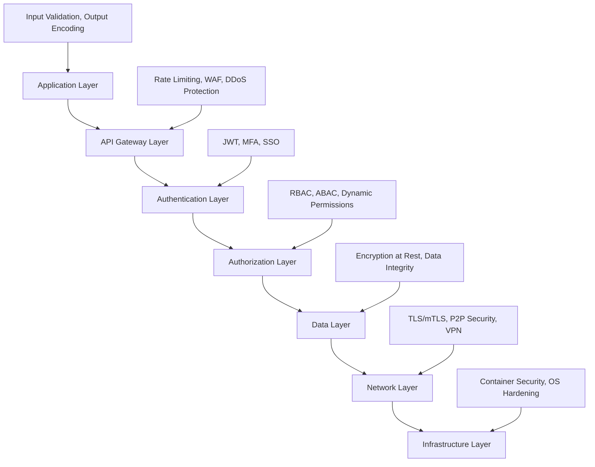
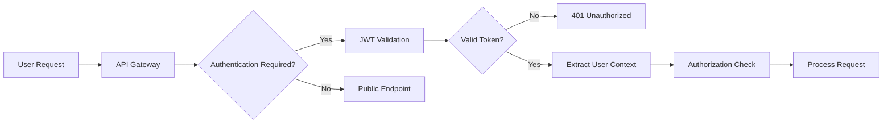
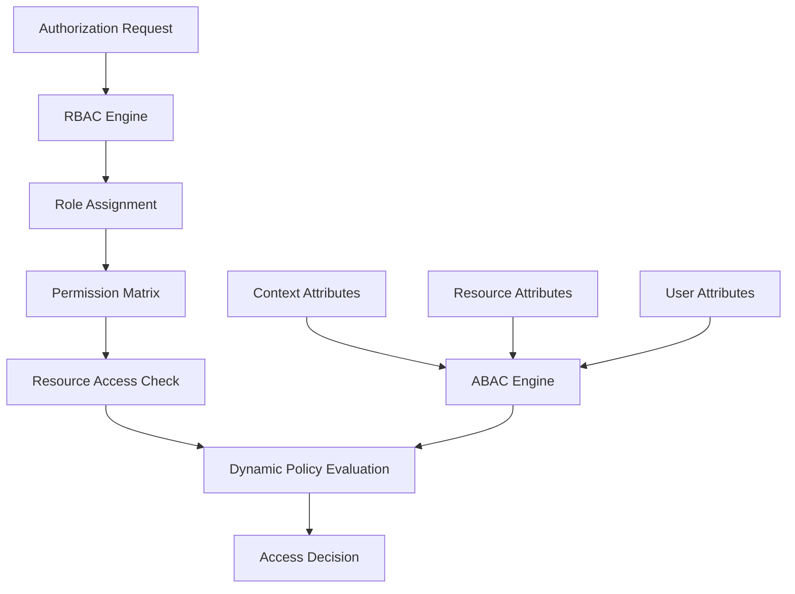
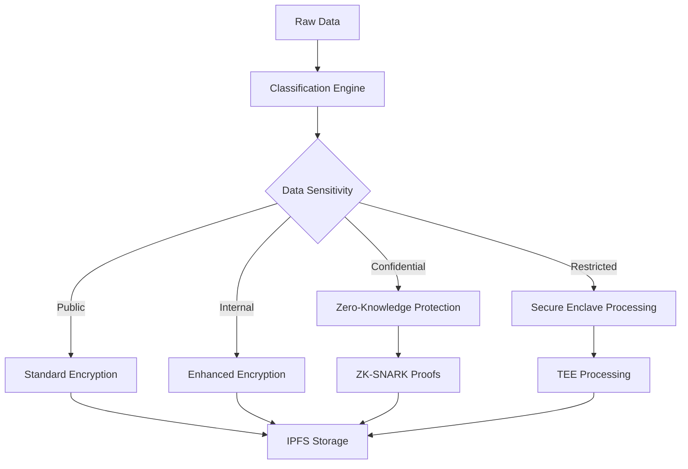
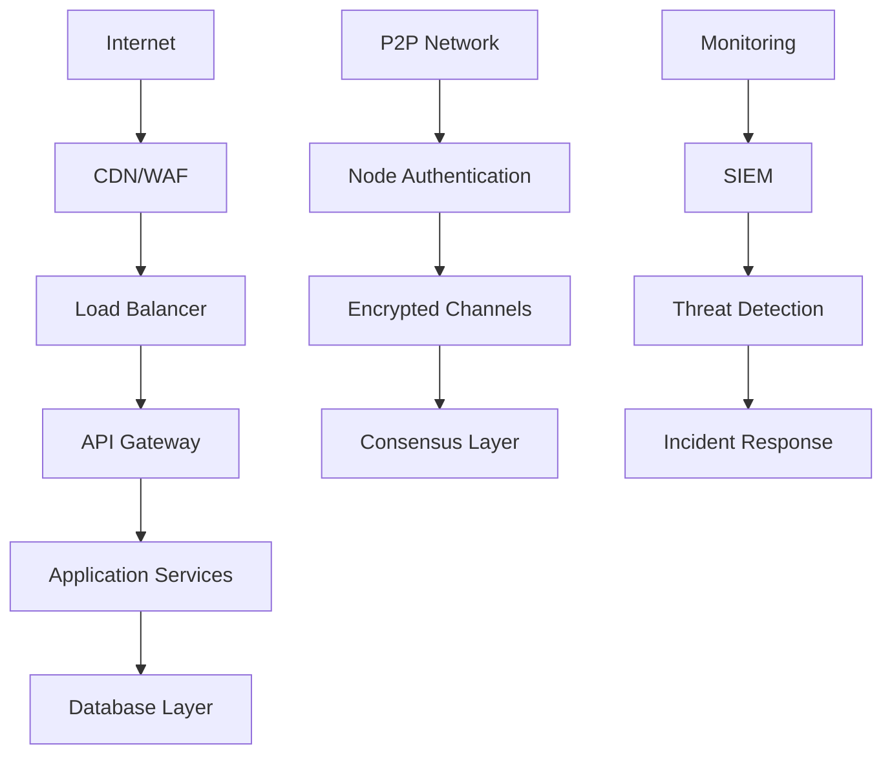
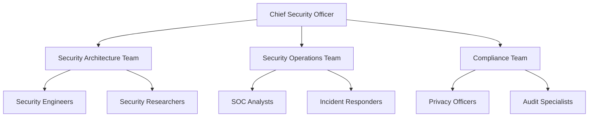
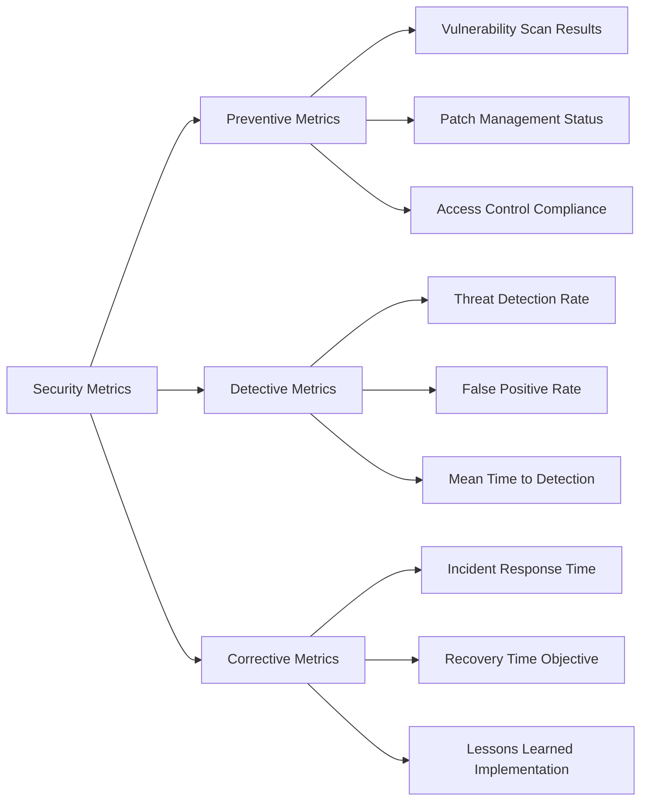

# PRSM Security Architecture & Threat Model

## Executive Summary

This document provides a comprehensive security architecture analysis for PRSM (Protocol for Recursive Scientific Modeling), including detailed threat models, security controls, and risk mitigation strategies. PRSM's distributed AI research platform requires enterprise-grade security to protect sensitive research data, AI models, and user privacy while enabling global collaboration.

## 🏗️ Security Architecture Overview

### **Multi-Layer Security Model**

PRSM implements defense-in-depth with seven distinct security layers:



### **Core Security Principles**

1. **Zero Trust Architecture**: No implicit trust; verify everything
2. **Principle of Least Privilege**: Minimal necessary access
3. **Defense in Depth**: Multiple security layers
4. **Security by Design**: Built-in security controls
5. **Continuous Monitoring**: Real-time threat detection
6. **Privacy by Design**: Data protection by default

## 🎯 Threat Model Analysis

### **STRIDE Threat Classification**

#### **Spoofing Identity Threats**

| Threat | Impact | Likelihood | Risk Level | Mitigation |
|--------|---------|------------|------------|------------|
| User account takeover | High | Medium | **High** | JWT + MFA, session management |
| API key theft | High | Medium | **High** | API key rotation, secure storage |
| Node identity spoofing | High | Low | **Medium** | Cryptographic node verification |
| AI model impersonation | Medium | Low | **Low** | Model signatures, provenance tracking |

**Controls Implemented**:
- Multi-factor authentication (MFA)
- JWT token validation with short expiration
- Cryptographic node identity verification
- API key rotation and secure storage
- Session management and anomaly detection

#### **Tampering with Data Threats**

| Threat | Impact | Likelihood | Risk Level | Mitigation |
|--------|---------|------------|------------|------------|
| AI model poisoning | Critical | Medium | **Critical** | Model validation, provenance tracking |
| Research data manipulation | High | Medium | **High** | IPFS content addressing, checksums |
| Configuration tampering | High | Low | **Medium** | Configuration signing, integrity checks |
| Network message tampering | Medium | Low | **Low** | TLS encryption, message authentication |

**Controls Implemented**:
- IPFS content-addressed storage with integrity verification
- Cryptographic model signatures and provenance tracking
- Configuration file integrity monitoring
- End-to-end encryption for sensitive communications
- Blockchain-based audit trails for critical operations

#### **Repudiation Threats**

| Threat | Impact | Likelihood | Risk Level | Mitigation |
|--------|---------|------------|------------|------------|
| Denied AI training participation | Medium | Medium | **Medium** | Blockchain audit trails |
| Disputed research contributions | Medium | Low | **Low** | Digital signatures, timestamping |
| False usage claims | Low | Low | **Low** | Comprehensive logging |

**Controls Implemented**:
- Comprehensive audit logging with digital signatures
- Blockchain-based immutable audit trails
- Multi-party attestation for critical operations
- Timestamping and non-repudiation protocols

#### **Information Disclosure Threats**

| Threat | Impact | Likelihood | Risk Level | Mitigation |
|--------|---------|------------|------------|------------|
| Sensitive research data exposure | Critical | Medium | **Critical** | Encryption, access controls |
| API key/token exposure | High | Medium | **High** | Secure storage, token rotation |
| User PII leakage | High | Low | **Medium** | Data minimization, encryption |
| Model parameter extraction | Medium | Medium | **Medium** | Secure enclaves, differential privacy |

**Controls Implemented**:
- AES-256 encryption for data at rest
- TLS 1.3 for data in transit
- Zero-knowledge proofs for privacy-preserving operations
- Differential privacy for model training
- Secure multi-party computation for sensitive operations

#### **Denial of Service Threats**

| Threat | Impact | Likelihood | Risk Level | Mitigation |
|--------|---------|------------|------------|------------|
| API flooding attacks | High | High | **High** | Rate limiting, auto-scaling |
| Resource exhaustion | High | Medium | **High** | Resource quotas, monitoring |
| P2P network disruption | Medium | Medium | **Medium** | Byzantine fault tolerance |
| Consensus mechanism attacks | High | Low | **Medium** | Economic incentives, slashing |

**Controls Implemented**:
- Multi-tier rate limiting with adaptive thresholds
- Request size limits and timeout controls
- Auto-scaling infrastructure with circuit breakers
- Byzantine fault-tolerant consensus mechanisms
- Economic penalties for malicious behavior

#### **Elevation of Privilege Threats**

| Threat | Impact | Likelihood | Risk Level | Mitigation |
|--------|---------|------------|------------|------------|
| Privilege escalation bugs | Critical | Low | **Medium** | Secure coding, regular audits |
| Container escape | High | Low | **Medium** | Container hardening, least privilege |
| Admin account compromise | Critical | Low | **Medium** | MFA, privileged access management |
| Smart contract vulnerabilities | High | Medium | **High** | Formal verification, audits |

**Controls Implemented**:
- Role-based access control (RBAC) with attribute-based controls
- Privileged access management (PAM) systems
- Container security scanning and runtime protection
- Smart contract formal verification and security audits
- Regular penetration testing and security assessments

## 🛡️ Security Components Architecture

### **Authentication & Identity Management**



**Components**:
- **JWT Handler**: Stateless token validation with RS256 signatures
- **MFA Provider**: TOTP, SMS, and hardware token support
- **SSO Integration**: SAML, OAuth 2.0, and OpenID Connect
- **Session Management**: Secure session handling with anomaly detection

### **Authorization & Access Control**



**Roles & Permissions**:
- **Admin**: Full system access, user management
- **Moderator**: Content moderation, limited admin functions  
- **Researcher**: AI model access, collaboration features
- **User**: Basic functionality, personal data access
- **Node Operator**: P2P network participation, consensus voting

### **Data Protection Architecture**



**Data Classification Levels**:
- **Public**: Open research data, public models
- **Internal**: User preferences, non-sensitive analytics
- **Confidential**: User PII, proprietary models
- **Restricted**: Payment data, cryptographic keys

### **Network Security Architecture**



## 📊 Risk Assessment Matrix

### **Risk Rating Calculation**
**Risk = Impact × Likelihood × Threat Capability**

| Impact Level | Description | Score |
|-------------|-------------|-------|
| Critical | System compromise, data breach | 5 |
| High | Significant functionality impact | 4 |
| Medium | Limited functionality impact | 3 |
| Low | Minimal impact | 2 |
| Negligible | No significant impact | 1 |

| Likelihood | Description | Score |
|------------|-------------|-------|
| Very High | Expected to occur frequently | 5 |
| High | Likely to occur | 4 |
| Medium | May occur occasionally | 3 |
| Low | Unlikely to occur | 2 |
| Very Low | Very unlikely to occur | 1 |

### **Top 10 Security Risks**

| Rank | Risk | Impact | Likelihood | Score | Status |
|------|------|---------|------------|-------|---------|
| 1 | AI Model Poisoning | 5 | 3 | 15 | **Mitigated** |
| 2 | Sensitive Data Exposure | 5 | 3 | 15 | **Mitigated** |
| 3 | API DDoS Attacks | 4 | 4 | 16 | **Mitigated** |
| 4 | Smart Contract Vulnerabilities | 4 | 3 | 12 | **Monitoring** |
| 5 | Privilege Escalation | 5 | 2 | 10 | **Mitigated** |
| 6 | P2P Network Attacks | 3 | 3 | 9 | **Mitigated** |
| 7 | Token/API Key Theft | 4 | 2 | 8 | **Mitigated** |
| 8 | Container Escape | 4 | 2 | 8 | **Mitigated** |
| 9 | Consensus Manipulation | 3 | 2 | 6 | **Mitigated** |
| 10 | User Account Takeover | 3 | 2 | 6 | **Mitigated** |

## 🔒 Security Controls Implementation

### **Preventive Controls**

#### **Input Validation & Sanitization**
```python
# Example from PRSM security implementation
from prsm.security import sanitize_string, validate_json_structure

async def secure_api_endpoint(user_input: str):
    # Multi-layer input validation
    sanitized_input = await sanitize_string(
        user_input,
        max_length=10000,
        allow_html=False,
        check_sql_injection=True,
        check_xss=True
    )
    
    # JSON structure validation
    if isinstance(user_input, dict):
        validated_json = await validate_json_structure(
            user_input,
            max_depth=10,
            max_keys=1000
        )
```

#### **Authentication & Authorization**
```python
# JWT-based authentication with role validation
from prsm.auth import require_auth, require_permission

@require_auth
@require_permission("model.train")
async def train_model_endpoint(current_user: User, model_config: dict):
    # Secure model training with verified user context
    pass
```

#### **Encryption & Data Protection**
```python
# End-to-end encryption for sensitive data
from prsm.cryptography import encrypt_sensitive_data, create_zk_proof

async def store_sensitive_research_data(data: bytes, user_id: str):
    # Encrypt with user-specific keys
    encrypted_data = await encrypt_sensitive_data(data, user_id)
    
    # Create zero-knowledge proof for data integrity
    zk_proof = await create_zk_proof(data)
    
    # Store with provenance tracking
    content_id = await ipfs_client.store_with_provenance(
        encrypted_data, 
        proof=zk_proof,
        user_id=user_id
    )
```

### **Detective Controls**

#### **Security Monitoring & Logging**
```python
# Comprehensive security event logging
from prsm.security import SecurityLogger

security_logger = SecurityLogger()

async def log_security_event(event_type: str, user_id: str, details: dict):
    await security_logger.log_event(
        event_type=event_type,
        user_id=user_id,
        details=details,
        severity="high" if "attack" in event_type else "info",
        timestamp=datetime.utcnow(),
        ip_address=request.client.host,
        user_agent=request.headers.get("user-agent")
    )
```

#### **Anomaly Detection**
```python
# Real-time threat detection
from prsm.safety.circuit_breaker import CircuitBreakerNetwork

async def monitor_ai_model_behavior(model_id: str, inputs: Any, outputs: Any):
    circuit_breaker = CircuitBreakerNetwork()
    
    # Detect anomalous model behavior
    threat_assessment = await circuit_breaker.analyze_model_output(
        model_id=model_id,
        inputs=inputs,
        outputs=outputs
    )
    
    if threat_assessment.threat_level > ThreatLevel.MEDIUM:
        await circuit_breaker.trigger_emergency_halt(
            model_id=model_id,
            reason=threat_assessment.reason
        )
```

### **Corrective Controls**

#### **Incident Response Automation**
```python
# Automated incident response
from prsm.security import IncidentResponseSystem

async def handle_security_incident(incident_type: str, severity: str, details: dict):
    incident_response = IncidentResponseSystem()
    
    # Immediate response actions
    if severity == "critical":
        await incident_response.isolate_affected_systems(details["affected_systems"])
        await incident_response.notify_security_team(incident_type, details)
        await incident_response.create_forensic_snapshot(details["evidence"])
    
    # Start investigation workflow
    await incident_response.start_investigation(incident_type, details)
```

## 🔍 Security Assessment Procedures

### **Continuous Security Testing**

#### **Automated Security Scanning**
- **SAST (Static Application Security Testing)**: Code vulnerability scanning
- **DAST (Dynamic Application Security Testing)**: Runtime security testing  
- **IAST (Interactive Application Security Testing)**: Real-time vulnerability detection
- **SCA (Software Composition Analysis)**: Dependency vulnerability scanning

#### **Penetration Testing Schedule**
- **Quarterly**: Automated penetration testing
- **Annually**: Professional third-party penetration testing
- **Ad-hoc**: Testing after major releases or security incidents

#### **Security Metrics & KPIs**
```python
# Security dashboard metrics
security_metrics = {
    "vulnerability_detection_time": "< 24 hours",
    "incident_response_time": "< 1 hour",
    "patch_deployment_time": "< 72 hours",
    "security_training_completion": "100%",
    "authentication_success_rate": "> 99.9%",
    "authorization_accuracy": "> 99.99%"
}
```

### **Security Compliance Monitoring**

#### **Automated Compliance Checks**
- **GDPR**: Data protection and privacy controls
- **SOC 2**: Security, availability, and confidentiality controls
- **ISO 27001**: Information security management
- **NIST Cybersecurity Framework**: Risk-based security controls

## 🚨 Incident Response Plan

### **Incident Classification**

| Severity | Description | Response Time | Escalation |
|----------|-------------|---------------|------------|
| **Critical** | Active attack, data breach | 15 minutes | CEO, CISO |
| **High** | Security vulnerability exploitation | 1 hour | Security Team Lead |
| **Medium** | Potential security issue | 4 hours | Security Analyst |
| **Low** | Security policy violation | 24 hours | Team Manager |

### **Response Procedures**

#### **Phase 1: Detection & Analysis (0-1 hour)**
1. **Automated Detection**: SIEM alerts, anomaly detection
2. **Initial Assessment**: Severity classification, impact analysis
3. **Team Notification**: Alert appropriate response team
4. **Evidence Collection**: Preserve logs, system snapshots

#### **Phase 2: Containment & Eradication (1-4 hours)**
1. **Immediate Containment**: Isolate affected systems
2. **Threat Analysis**: Identify attack vectors, IOCs
3. **System Hardening**: Apply emergency patches, configuration changes
4. **Continuous Monitoring**: Enhanced surveillance of affected areas

#### **Phase 3: Recovery & Lessons Learned (4-24 hours)**
1. **System Restoration**: Bring systems back online securely
2. **Validation Testing**: Confirm systems are clean and functional
3. **Post-Incident Analysis**: Root cause analysis, timeline reconstruction
4. **Process Improvement**: Update procedures, controls, and training

## 📋 Security Governance

### **Security Organization Structure**



### **Security Policies & Procedures**

#### **Information Security Policy**
- Data classification and handling procedures
- Access control and identity management
- Incident response and business continuity
- Third-party security requirements

#### **AI Safety & Ethics Policy**
- AI model validation and testing requirements
- Bias detection and mitigation procedures
- Ethical AI development guidelines
- Responsible disclosure for AI vulnerabilities

#### **Privacy Policy Implementation**
- Data minimization and purpose limitation
- Consent management and user rights
- Cross-border data transfer controls
- Privacy impact assessment procedures

### **Security Training Program**

#### **Role-Based Training Requirements**
- **All Staff**: Security awareness, phishing prevention
- **Developers**: Secure coding, OWASP Top 10
- **DevOps**: Infrastructure security, container hardening
- **Security Team**: Advanced threat hunting, incident response

#### **Continuous Education**
- Monthly security bulletins and updates
- Quarterly security workshops and training
- Annual security conference attendance
- Security certification maintenance

## 📊 Security Metrics Dashboard

### **Key Security Indicators**



### **Security Scorecard**

| Metric | Target | Current | Status |
|--------|---------|---------|---------|
| Vulnerability Detection Time | < 24h | 18h | ✅ |
| Critical Patch Deployment | < 72h | 48h | ✅ |
| Incident Response Time | < 1h | 45m | ✅ |
| Authentication Success Rate | > 99.9% | 99.95% | ✅ |
| Security Training Completion | 100% | 98% | ⚠️ |
| Penetration Test Pass Rate | > 95% | 97% | ✅ |

## 🔮 Future Security Enhancements

### **Roadmap (Next 12 Months)**

#### **Q1: Advanced AI Security**
- Federated learning security frameworks
- Homomorphic encryption for private computation
- Advanced differential privacy mechanisms
- AI model watermarking and provenance

#### **Q2: Zero Trust Implementation**
- Micro-segmentation for container workloads
- Identity-based network access control
- Continuous authentication and authorization
- Device trust and endpoint protection

#### **Q3: Quantum-Ready Cryptography**
- Post-quantum cryptographic algorithms
- Quantum key distribution (QKD) integration
- Hybrid classical-quantum security protocols
- Quantum-safe digital signatures

#### **Q4: Advanced Threat Detection**
- Machine learning-based anomaly detection
- Behavioral analysis for insider threats
- Threat intelligence integration
- Automated threat hunting capabilities

### **Emerging Security Considerations**

#### **AI-Specific Threats**
- Model inversion and extraction attacks
- Adversarial examples and data poisoning
- Privacy leakage in federated learning
- AI supply chain security

#### **Quantum Computing Threats**
- Current cryptographic algorithm vulnerabilities
- Quantum supremacy timeline considerations
- Migration strategies for quantum-safe systems
- Hybrid security approaches during transition

## 📞 Security Contacts & Resources

### **Emergency Security Contacts**
- **Security Hotline**: +1-XXX-XXX-XXXX (24/7)
- **Email**: security@prsm-project.org
- **Escalation**: ciso@prsm-project.org

### **Security Resources**
- **Internal Security Portal**: https://security.prsm.internal
- **Incident Reporting**: https://security.prsm.internal/incidents
- **Security Training**: https://training.prsm.internal/security
- **Policy Documentation**: https://docs.prsm.internal/security

---

## 🔐 Document Security

**Classification**: Internal Use  
**Document Owner**: Chief Security Officer  
**Last Updated**: June 21, 2025  
**Next Review**: December 21, 2025  
**Approved By**: Security Architecture Review Board

> _"Security is not a destination, but a journey. This architecture provides the foundation for protecting PRSM's mission of democratizing AI research while maintaining the highest security standards."_