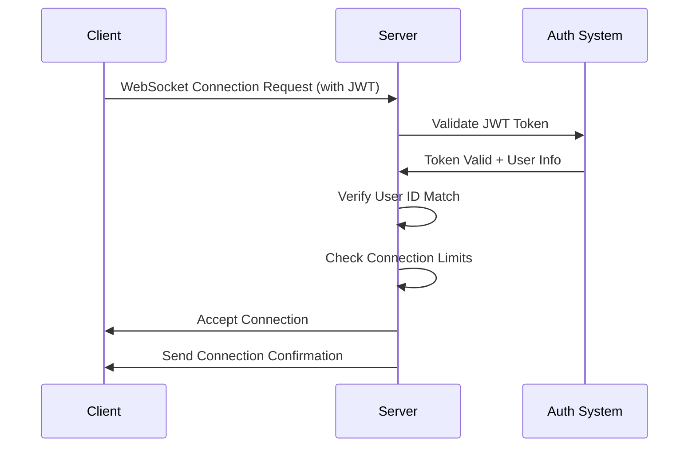
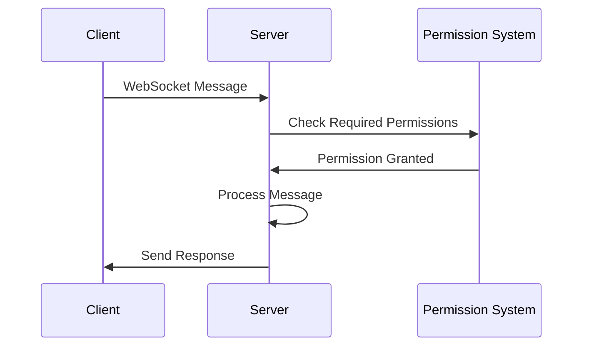

# WebSocket Security Implementation

## Overview

PRSM's WebSocket endpoints are now protected with comprehensive authentication and authorization to ensure secure real-time communication. This document outlines the security features and usage patterns for WebSocket connections.

## Security Features

### 🔐 Authentication Requirements

All WebSocket endpoints require JWT authentication before connection acceptance:

- **JWT Token Validation**: Tokens are validated using the existing PRSM JWT handler
- **Token Source Options**: Tokens can be provided via query parameters, Authorization headers, or cookies
- **Connection-Level Auth**: Authentication occurs before the WebSocket connection is accepted
- **User ID Verification**: Path parameter user IDs are verified against token claims

### 🛡️ Authorization & Permissions

- **Role-Based Access Control**: Connections include user role and permission information
- **Permission Checks**: Specific WebSocket operations require appropriate permissions
- **Conversation Access Control**: Conversation-specific WebSocket connections verify user access rights
- **Connection Limits**: Maximum connections per user to prevent abuse

### 📊 Audit Logging

- **Security Event Logging**: All authentication events are logged for security monitoring
- **Connection Tracking**: Detailed metadata for each connection (IP, user agent, timestamps)
- **Failed Authentication Alerts**: Failed authentication attempts are logged with security level indicators

## WebSocket Endpoints

### Main WebSocket Endpoint
```
WS /ws/{user_id}
```

**Purpose**: General real-time communication
**Authentication**: Required
**Permissions**: Basic user permissions
**Features**:
- Real-time notifications
- Live data updates
- System status updates
- Conversation subscription management

### Conversation WebSocket
```
WS /ws/conversation/{user_id}/{conversation_id}
```

**Purpose**: Conversation-specific streaming
**Authentication**: Required
**Permissions**: Conversation access verification
**Features**:
- Token-by-token AI response streaming
- Live typing indicators
- Message status updates
- Context usage tracking

### Web3 WebSocket
```
WS /api/v1/web3/ws/{user_id}
```

**Purpose**: Real-time Web3 updates
**Authentication**: Required
**Permissions**: Wallet permissions for specific operations
**Features**:
- Real-time balance updates
- Transaction notifications
- Smart contract event monitoring

## Authentication Methods

### Method 1: Query Parameter
```javascript
const ws = new WebSocket('ws://localhost:8000/ws/user123?token=your_jwt_token_here');
```

### Method 2: Authorization Header
```javascript
const ws = new WebSocket('ws://localhost:8000/ws/user123', [], {
    headers: {
        'Authorization': 'Bearer your_jwt_token_here'
    }
});
```

### Method 3: Cookie (Automatic)
If the JWT token is stored in an `access_token` cookie, it will be automatically used.

## Connection Flow

### 1. Authentication Phase


### 2. Message Handling


## Error Codes

WebSocket authentication failures use specific error codes:

- **4001**: Authentication required or invalid token
- **4003**: Access denied or insufficient permissions  
- **4008**: Too many connections (rate limiting)

## Usage Examples

### JavaScript Client Example
```javascript
class PRSMWebSocketClient {
    constructor(userId, token) {
        this.userId = userId;
        this.token = token;
        this.ws = null;
    }
    
    connect() {
        const wsUrl = `ws://localhost:8000/ws/${this.userId}?token=${this.token}`;
        this.ws = new WebSocket(wsUrl);
        
        this.ws.onopen = (event) => {
            console.log('Secure WebSocket connected');
        };
        
        this.ws.onmessage = (event) => {
            const message = JSON.parse(event.data);
            this.handleMessage(message);
        };
        
        this.ws.onerror = (error) => {
            console.error('WebSocket error:', error);
        };
        
        this.ws.onclose = (event) => {
            if (event.code === 4001) {
                console.error('Authentication failed');
                // Redirect to login
            } else if (event.code === 4003) {
                console.error('Access denied');
            }
        };
    }
    
    subscribeToConversation(conversationId) {
        this.send({
            type: 'subscribe_conversation',
            conversation_id: conversationId
        });
    }
    
    send(message) {
        if (this.ws && this.ws.readyState === WebSocket.OPEN) {
            this.ws.send(JSON.stringify(message));
        }
    }
    
    handleMessage(message) {
        switch (message.type) {
            case 'connected':
                console.log('Connection confirmed:', message);
                break;
            case 'error':
                console.error('Server error:', message.message);
                break;
            // Handle other message types...
        }
    }
}

// Usage
const client = new PRSMWebSocketClient('user123', 'your_jwt_token');
client.connect();
```

### Python Client Example
```python
import asyncio
import websockets
import json

class PRSMWebSocketClient:
    def __init__(self, user_id: str, token: str):
        self.user_id = user_id
        self.token = token
        self.websocket = None
    
    async def connect(self):
        uri = f"ws://localhost:8000/ws/{self.user_id}?token={self.token}"
        
        try:
            self.websocket = await websockets.connect(uri)
            print("Secure WebSocket connected")
            
            # Listen for messages
            async for message in self.websocket:
                data = json.loads(message)
                await self.handle_message(data)
                
        except websockets.exceptions.ConnectionClosedError as e:
            if e.code == 4001:
                print("Authentication failed")
            elif e.code == 4003:
                print("Access denied")
    
    async def send_message(self, message: dict):
        if self.websocket:
            await self.websocket.send(json.dumps(message))
    
    async def handle_message(self, message: dict):
        msg_type = message.get('type')
        
        if msg_type == 'connected':
            print(f"Connection confirmed: {message}")
        elif msg_type == 'error':
            print(f"Server error: {message.get('message')}")
        # Handle other message types...

# Usage
async def main():
    client = PRSMWebSocketClient('user123', 'your_jwt_token')
    await client.connect()

asyncio.run(main())
```

## Security Best Practices

### For Developers

1. **Always Authenticate**: Never accept unauthenticated WebSocket connections
2. **Validate Permissions**: Check user permissions for specific operations
3. **Log Security Events**: Monitor and log all authentication and authorization events
4. **Rate Limiting**: Implement connection limits to prevent abuse
5. **Token Refresh**: Handle token expiration gracefully in long-lived connections

### For Frontend Applications

1. **Secure Token Storage**: Store JWT tokens securely (avoid localStorage for sensitive apps)
2. **Handle Auth Errors**: Implement proper error handling for authentication failures
3. **Automatic Reconnection**: Implement reconnection logic with fresh tokens
4. **Permission Awareness**: Check user permissions before attempting restricted operations

### For System Administrators

1. **Monitor Connections**: Regularly check WebSocket connection statistics
2. **Audit Logs**: Review security event logs for suspicious activity
3. **Connection Limits**: Adjust per-user connection limits based on usage patterns
4. **Token Management**: Implement appropriate token expiration and refresh policies

## Monitoring & Statistics

### Connection Statistics Endpoint
```
GET /ws/stats
```

**Authentication**: Required (Admin/Moderator only)
**Returns**: Real-time WebSocket connection statistics

Example response:
```json
{
    "success": true,
    "stats": {
        "websocket_manager": {
            "active_connections": 45,
            "unique_users": 23,
            "connection_types": {
                "general": 20,
                "conversation": 15,
                "web3": 10
            }
        },
        "authentication": {
            "active_connections": 45,
            "unique_users": 23,
            "max_connections_per_user": 10,
            "connection_types": {
                "general": 20,
                "conversation": 15, 
                "web3": 10
            }
        },
        "security": {
            "authenticated_connections": 45,
            "unique_authenticated_users": 23,
            "max_connections_per_user": 10
        }
    },
    "timestamp": 1649123456.789
}
```

## Migration from Unsecured WebSockets

If you have existing WebSocket client code, update it to include authentication:

### Before (Unsecured)
```javascript
const ws = new WebSocket('ws://localhost:8000/ws/user123');
```

### After (Secured)
```javascript
const token = getJWTToken(); // Get token from your auth system
const ws = new WebSocket(`ws://localhost:8000/ws/user123?token=${token}`);
```

## Troubleshooting

### Common Issues

1. **4001 Authentication Error**
   - Check if JWT token is valid and not expired
   - Verify token is included in the connection request
   - Ensure user exists in the system

2. **4003 Access Denied**
   - Verify user has required permissions
   - Check if user has access to the specific conversation (for conversation WebSockets)
   - Ensure user role allows the requested operation

3. **4008 Too Many Connections**
   - User has exceeded maximum connection limit
   - Close unused connections or increase limits

### Debug Steps

1. Check browser developer tools for WebSocket errors
2. Review server logs for authentication failures
3. Verify JWT token contents using JWT debugger
4. Test with curl or WebSocket testing tools
5. Check user permissions in the database

## Configuration

WebSocket authentication can be configured in the `WebSocketAuthManager`:

```python
# Connection limits
websocket_auth.max_connections_per_user = 10

# Permission requirements (can be customized per endpoint)
required_permissions = {
    "conversation.read": ["user", "admin", "moderator"],
    "wallet.read": ["user", "admin"], 
    "system.monitor": ["admin", "moderator"]
}
```

This comprehensive security implementation ensures that all WebSocket communications in PRSM are authenticated, authorized, and audited for maximum security in production environments.