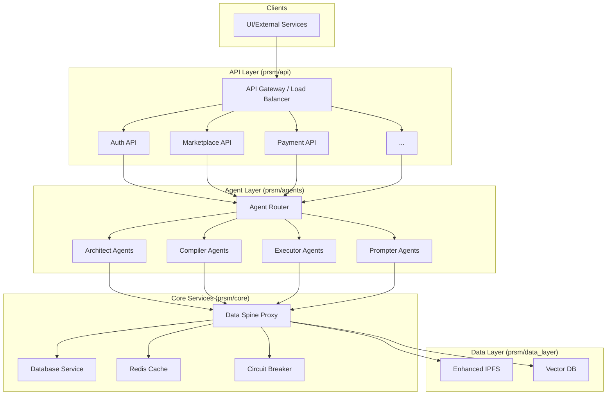

# PRSM Architectural Analysis

## Overall Architecture: Modular, Agent-Based, and Service-Oriented

The PRSM codebase is organized around a **modular, agent-based architecture** with a strong **service-oriented** design. This is evident from the clear separation of concerns into distinct directories like `core`, `agents`, `api`, and `data_layer`. This structure promotes scalability, maintainability, and independent development of different parts of the system.

## Key Architectural Components and Patterns:

*   **Core Services (`prsm/core/`):** This directory houses the foundational services of the application. The presence of `database_service.py`, `redis_client.py`, and `production_cache.py` indicates a standard approach to data management and caching. The inclusion of `circuit_breaker.py` points to a resilient architecture that can handle service failures gracefully.

*   **Agent-Based System (`prsm/agents/`):** The system relies on a sophisticated agent-based model. The subdirectories (`architects`, `compilers`, `executors`, `prompters`, `routers`) represent specialized agents that likely collaborate to perform complex tasks. This is a common pattern for building autonomous, intelligent systems.

*   **Centralized Data Access (`prsm/spine/` and `prsm/data_layer/`):** The `data_spine_proxy.py` file suggests a **Proxy or Facade pattern** for data access. This centralizes and simplifies how the various agents and services interact with the underlying data sources. The `data_layer`'s focus on `enhanced_ipfs.py` highlights the system's reliance on a **decentralized storage** solution, with custom enhancements to suit its needs.

*   **Microservices/Service-Oriented API (`prsm/api/`):** The API is structured as a collection of domain-specific services (e.g., `auth_api.py`, `payment_api.py`, `marketplace_api.py`). This strongly suggests a **microservices or service-oriented architecture**, where each service is responsible for a specific business capability. This design allows for independent deployment, scaling, and maintenance of each service.

## Architectural Diagram

## Summary of Design Philosophy

The architectural choices in the PRSM codebase reflect a modern, sophisticated approach to building a complex, intelligent system. The key design philosophies appear to be:

*   **Decentralization:** The prominent use of IPFS suggests that data ownership and control are core tenets of the system.
*   **Modularity and Separation of Concerns:** The codebase is well-organized, with clear boundaries between different components. This makes the system easier to understand, maintain, and extend.
*   **Intelligence and Autonomy:** The agent-based architecture allows for complex, autonomous workflows and decision-making processes.
*   **Resilience and Scalability:** The use of patterns like circuit breakers and a microservices-based API layer indicates that the system is designed to be robust and scalable.