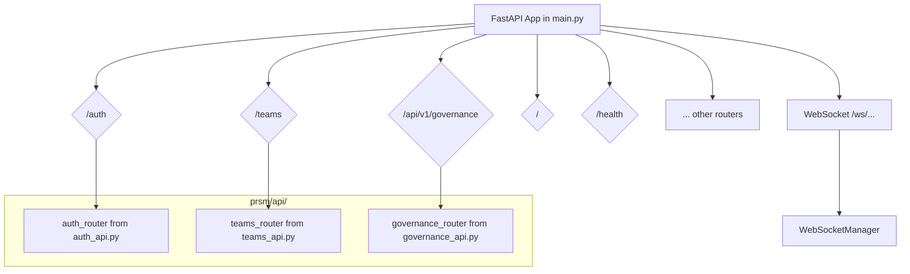

# PRSM API Architecture

This document provides a detailed analysis of the PRSM application's API structure, focusing on its architectural style, routing conventions, data modeling, and versioning strategy.

## 1. Overview

The PRSM API is a modern, hybrid system built on the **FastAPI** framework. It primarily follows a **RESTful** architectural style for its core functionalities while leveraging **WebSockets** for real-time communication features. The design is modular, with clear separation of concerns, and it uses strong data contracts to ensure reliability and maintainability.

## 2. Architectural Style

The API employs two primary architectural styles:

*   **REST (Representational State Transfer)**: The majority of the API is RESTful. It uses standard HTTP methods (`GET`, `POST`, `PUT`, `DELETE`) for resource manipulation, and endpoints are organized around resources (e.g., Teams, Users, Governance Proposals). The use of FastAPI simplifies the implementation of these principles.
*   **WebSocket**: For features requiring real-time, bidirectional communication, the API uses WebSockets. A central `WebSocketManager` in [`prsm/api/main.py`](prsm/api/main.py) handles connection lifecycles, message broadcasting, and conversation-specific subscriptions.

## 3. Framework and Tooling

*   **FastAPI**: The core of the API is built with FastAPI, a high-performance Python web framework. This choice provides asynchronous request handling (via ASGI), dependency injection, and automatic generation of interactive API documentation (Swagger UI and ReDoc).
*   **Pydantic**: Pydantic `BaseModel`s are used extensively for data validation, serialization, and settings management. This ensures that all data flowing into and out of the API conforms to a strict, predefined schema, reducing errors and improving developer experience.

## 4. Routing and Modularity

The API is structured in a highly modular fashion. The main application instance is created in [`prsm/api/main.py`](prsm/api/main.py), which then imports and includes `APIRouter` instances from various other modules within the `/prsm/api/` directory.

This approach allows for a clean separation of concerns, where each file represents a distinct functional domain of the API (e.g., `auth_api.py`, `teams_api.py`).

### Routing Aggregation

The following diagram illustrates how the different API modules are aggregated into the main FastAPI application:



## 5. Data Modeling

Request and response data models are strictly defined using Pydantic's `BaseModel`. This is a consistent pattern across the entire API.

**Example from [`prsm/api/governance_api.py`](prsm/api/governance_api.py):**
```python
class CreateProposalRequest(BaseModel):
    """Request to create a governance proposal"""
    title: str = Field(min_length=10, max_length=200)
    description: str = Field(min_length=100, max_length=5000)
    proposal_type: str
    implementation_details: Optional[Dict[str, Any]] = None
    budget_impact: Optional[Dict[str, Any]] = None
```

This ensures that incoming requests are automatically validated against the model, and outgoing responses are serialized according to the defined schema.

## 6. API Versioning

The API's versioning strategy is **inconsistent**.

*   Some modules, like [`governance_api.py`](prsm/api/governance_api.py), use a clear, versioned URL prefix: `/api/v1/governance`.
*   Other core modules, such as [`auth_api.py`](prsm/api/auth_api.py) and [`teams_api.py`](prsm/api/teams_api.py), do not have a version in their router prefix (`/auth`, `/teams`).

This inconsistency could pose challenges for future API evolution and client integrations. A standardized versioning scheme across all endpoints is recommended.

## 7. Key API Modules

The `/prsm/api/` directory is organized by functionality. Key modules include:

*   **`main.py`**: The main entry point that initializes the FastAPI application and includes all other routers.
*   **`auth_api.py`**: Manages user authentication, registration, token handling, and authorization.
*   **`teams_api.py`**: Provides endpoints for team creation, membership management, and collaboration.
*   **`governance_api.py`**: Handles governance-related operations, including proposals, voting, and token staking.
*   **`websocket_auth.py` and `main.py`'s `WebSocketManager`**: Together, they manage real-time communication channels.

## 8. Real-Time Communication

The `WebSocketManager` class in `main.py` provides a robust system for handling real-time client communication. Its key responsibilities include:

*   Managing WebSocket connection lifecycles (`connect`, `disconnect`).
*   Subscribing clients to specific "conversation" channels.
*   Broadcasting messages to all clients, specific users, or subscribers of a conversation.
*   Maintaining connection metadata and statistics.