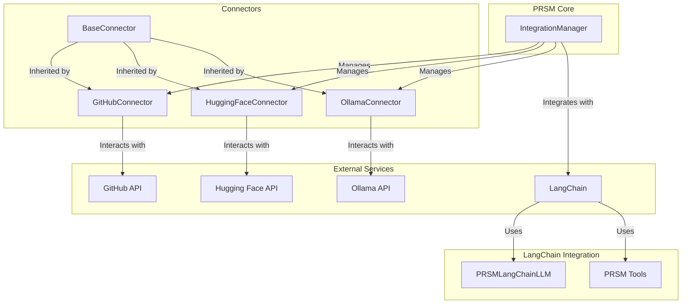

# PRSM Integrations and SDKs Analysis

## 1. Introduction

This document provides a comprehensive analysis of the PRSM application's integration capabilities and the quality of its Software Development Kits (SDKs). The analysis covers the primary integration points, the design of the integration architecture, and the structure and quality of the Go, Python, and JavaScript SDKs.

## 2. SDK Analysis

PRSM provides high-quality SDKs for Go, Python, and JavaScript, all of which are well-documented, feature-rich, and follow idiomatic best practices for their respective languages.

### 2.1. Go SDK

The Go SDK is robust and well-documented. The `README.md` provides clear examples for all major features, and the client implementation in `sdks/go/client/client.go` is well-structured with a modular design, a centralized request helper, and comprehensive error handling.

### 2.2. Python SDK

The Python SDK is also of high quality, with an async-first design that uses `asyncio` and `aiohttp` for non-blocking I/O. The client implementation in `sdks/python/prsm_sdk/client.py` has a clean, modular design and uses `pydantic` for robust data modeling.

### 2.3. JavaScript SDK

The JavaScript SDK is comprehensive and well-developed, with extensive examples in the `README.md`. The client, implemented in `sdks/javascript/src/client.ts`, is well-structured with a modular, class-based approach, robust error handling, and TypeScript support.

## 3. Integration Architecture Analysis

The integration architecture is a key strength of the PRSM application. It is designed to be modular, extensible, and robust, with a clear separation of concerns.

### 3.1. Core Integration Components

The core of the integration architecture is comprised of two key components:

-   **`IntegrationManager`**: The `prsm/integrations/core/integration_manager.py` serves as the central orchestrator for all integrations. It manages the entire lifecycle of connectors, including registration, health monitoring, and import coordination.
-   **`BaseConnector`**: The `prsm/integrations/core/base_connector.py` is an abstract base class that enforces a standardized, consistent interface for all connectors. This is a critical architectural feature that makes the system highly modular and extensible.

### 3.2. Connector Implementations

The connector implementations for GitHub, Hugging Face, and Ollama are excellent examples of the architecture in practice. Each connector faithfully adheres to the `BaseConnector` interface while providing robust, platform-specific functionality.

### 3.3. LangChain Integration

The LangChain integration is another highlight of the architecture. It provides multiple levels of integration, from a drop-in `LLM` replacement to high-level, custom `Chains` and `Tools`. This multi-layered approach makes the integration both powerful and flexible.

## 4. Architectural Diagram

The following Mermaid diagram illustrates the PRSM integration architecture:

## 5. Conclusion

The integration capabilities and SDK quality of the PRSM application are exceptionally high. The architecture is well-designed, modular, and extensible, and the SDKs are robust, well-documented, and feature-rich. This strong foundation enables seamless integration with a wide range of external services and provides a solid platform for future expansion.