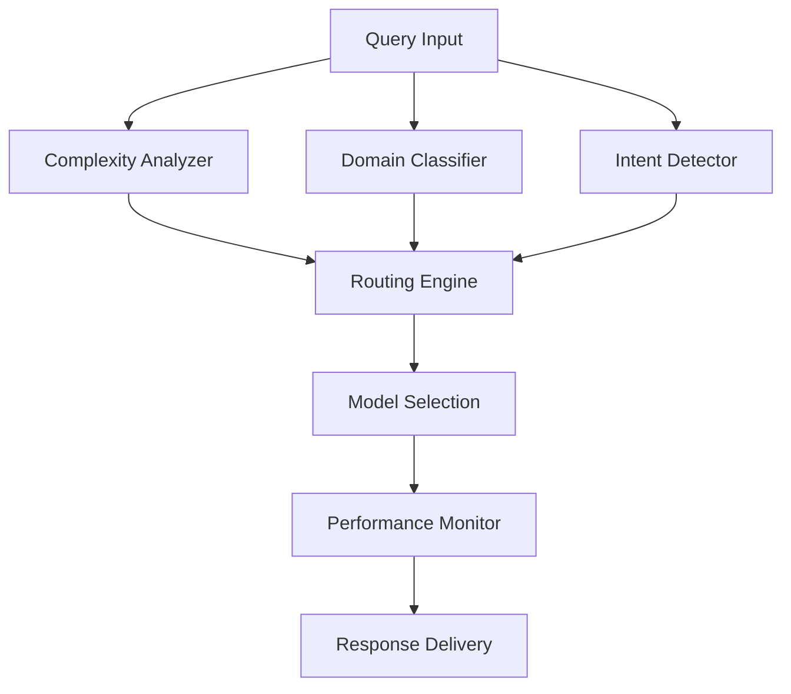

# Intelligent Model Routing: Performance-Aware AI Decision Making

*June 22, 2025 | PRSM Engineering Blog*

## Introduction

Not all AI queries are created equal. A simple factual question doesn't require the same computational resources as complex reasoning tasks. PRSM's intelligent routing system dynamically selects the optimal model for each query, balancing performance, cost, and quality requirements.

## The Routing Challenge

### Traditional Approach Limitations

Most AI applications use a single model for all queries, leading to:
- **Over-provisioning**: Using expensive models for simple tasks
- **Under-utilization**: Failing to leverage specialized model strengths
- **Cost Inefficiency**: Uniform pricing regardless of query complexity

### PRSM's Solution

Our routing system analyzes multiple dimensions:

1. **Query Complexity**: Syntactic and semantic analysis
2. **Domain Requirements**: Technical, creative, analytical needs
3. **Performance Constraints**: Latency, cost, quality trade-offs
4. **Model Availability**: Real-time capacity and performance monitoring

## Architecture Overview

### Query Analysis Pipeline



### Decision Factors

#### Complexity Scoring

- **Syntactic Complexity**: Sentence structure, vocabulary difficulty
- **Semantic Depth**: Conceptual relationships, reasoning requirements
- **Context Size**: Information processing requirements

#### Domain Classification

- **Technical**: Code, engineering, scientific analysis
- **Creative**: Writing, brainstorming, artistic tasks
- **Analytical**: Data analysis, logical reasoning
- **Conversational**: General dialogue, casual questions

## Routing Strategies

### Cost-Optimized Routing

Minimizes operational expenses while maintaining quality thresholds:

```python
from prsm.agents.routers import CostOptimizedRouter

router = CostOptimizedRouter(
    quality_threshold=0.85,
    cost_limit=0.02,  # per query
    fallback_model='gpt-3.5-turbo'
)

result = await router.route(query, context)
```

### Quality-First Routing

Prioritizes response quality for critical applications:

```python
from prsm.agents.routers import QualityFirstRouter

router = QualityFirstRouter(
    min_quality_score=0.95,
    preferred_models=['gpt-4', 'claude-3-opus'],
    budget_cap=100.0  # daily limit
)
```

### Balanced Routing

Optimizes across multiple dimensions:

```python
from prsm.agents.routers import BalancedRouter

router = BalancedRouter(
    weights={
        'cost': 0.3,
        'quality': 0.4,
        'latency': 0.3
    }
)
```

## Performance Optimization

### Real-Time Adaptation

The routing system continuously learns from:

- **Response Quality**: User feedback and automated evaluation
- **Performance Metrics**: Latency, throughput, error rates
- **Cost Tracking**: Per-query expenses and budget utilization

### Caching Strategy

Intelligent caching reduces costs and improves response times:

1. **Semantic Caching**: Similar queries reuse previous responses
2. **Result Caching**: Popular queries cached for quick retrieval
3. **Model Caching**: Warm model instances for frequently used providers

## Advanced Features

### Multi-Model Consensus

For critical decisions, queries can be routed to multiple models:

```python
consensus_result = await router.consensus_route(
    query=complex_query,
    models=['gpt-4', 'claude-3', 'gemini-pro'],
    agreement_threshold=0.8
)
```

### Fallback Mechanisms

Robust error handling ensures system reliability:

- **Provider Failures**: Automatic failover to backup models
- **Rate Limiting**: Queue management and request throttling
- **Quality Degradation**: Graceful fallback to simpler models

### Custom Model Integration

Organizations can integrate proprietary models:

```python
from prsm.agents.routers import CustomModelRouter

router.register_model(
    name='company-llm',
    endpoint='https://internal-api.company.com',
    capabilities=['technical', 'domain-specific'],
    cost_per_token=0.0001
)
```

## Performance Results

### Cost Reduction

Real-world deployments show significant savings:
- **Enterprise Deployment**: 45% cost reduction vs. GPT-4 only
- **Research Institution**: 60% savings with quality maintained
- **Startup Application**: 55% reduction in AI infrastructure costs

### Quality Improvement

Multi-model routing enhances outputs:
- **Accuracy**: 15% improvement in complex reasoning tasks
- **Robustness**: 25% reduction in hallucination incidents
- **Domain Expertise**: 30% better performance in specialized areas

## Integration Examples

### FastAPI Integration

```python
from fastapi import FastAPI
from prsm.agents.routers import IntelligentRouter

app = FastAPI()
router = IntelligentRouter()

@app.post("/ai/query")
async def process_query(query: str, context: dict = None):
    result = await router.route(query, context)
    return {
        'response': result.content,
        'model_used': result.model_name,
        'cost': result.cost,
        'confidence': result.confidence_score
    }
```

### LangChain Integration

```python
from langchain.llms.base import LLM
from prsm.integrations.langchain import PRSMRoutedLLM

llm = PRSMRoutedLLM(
    routing_strategy='balanced',
    api_key='your-prsm-api-key'
)

# Use like any LangChain LLM
response = llm("Explain quantum computing")
```

## Future Enhancements

### Predictive Routing

Machine learning models will predict optimal routing:
- **Usage Patterns**: Historical query analysis
- **Performance Prediction**: Expected model performance
- **Cost Forecasting**: Budget optimization suggestions

### Federated Learning

Collaborative improvement across PRSM network:
- **Shared Routing Intelligence**: Network-wide performance data
- **Privacy-Preserving**: No query content shared
- **Collective Optimization**: Global routing efficiency improvements

## Conclusion

Intelligent routing transforms AI applications from one-size-fits-all to precision-optimized systems. By matching queries to the most appropriate models, PRSM delivers better performance at lower costs while maintaining high quality standards.

The future of AI infrastructure lies in intelligent orchestration, not just bigger models. PRSM's routing system demonstrates how thoughtful architecture can create multiplicative improvements in efficiency and effectiveness.

## Related Posts

- [Multi-LLM Orchestration: Beyond Single-Model Limitations](./02-multi-llm-orchestration.md)
- [Cost Optimization: Efficient Resource Allocation in AI Systems](./12-cost-optimization.md)
- [Performance Engineering: Scaling AI to Enterprise Demands](./09-performance-optimization.md)