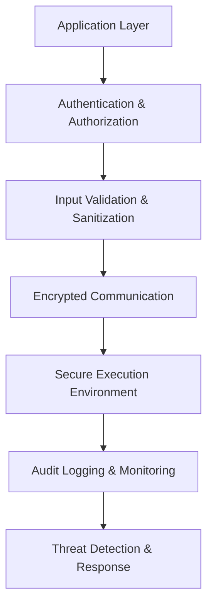

# Enterprise-Grade Security: Zero-Trust AI Infrastructure

*June 22, 2025 | PRSM Engineering Blog*

## Introduction

Distributed AI systems present unique security challenges that traditional cybersecurity approaches cannot fully address. PRSM implements a comprehensive zero-trust security architecture designed specifically for AI workloads, protecting against both conventional attacks and AI-specific threats.

## Zero-Trust Principles for AI

### Traditional Security vs. AI Security

Traditional perimeter-based security fails with AI systems because:
- **Distributed Execution**: AI workloads span multiple nodes and organizations
- **Dynamic Trust**: Node reliability changes based on performance and behavior
- **Data Sensitivity**: Training data and model weights require special protection
- **Inference Attacks**: AI models themselves can leak sensitive information

### PRSM's Zero-Trust Approach

Our security model follows core principles:
1. **Never Trust, Always Verify**: Every request authenticated and authorized
2. **Least Privilege Access**: Minimal permissions for each operation
3. **Continuous Monitoring**: Real-time threat detection and response
4. **Cryptographic Verification**: All data and computations cryptographically verified

## Security Architecture Overview

### Multi-Layer Defense



### Core Security Components

```python
from prsm.security import SecurityOrchestrator

security = SecurityOrchestrator(
    authentication=MultiFactorAuth(),
    authorization=RoleBasedAccessControl(),
    encryption=EndToEndEncryption(),
    monitoring=ThreatDetectionSystem(),
    audit=ComprehensiveAuditLogger()
)

# Secure AI task execution
async def secure_ai_task(task, user_context):
    # Multi-layer security validation
    await security.authenticate(user_context)
    await security.authorize(task, user_context)
    await security.validate_inputs(task.inputs)
    
    # Execute in secure environment
    result = await security.execute_sandboxed(task)
    
    # Audit and monitor
    await security.audit_log(task, result, user_context)
    await security.monitor_result(result)
    
    return result
```

## Authentication and Authorization

### Multi-Factor Authentication

PRSM supports various authentication methods:

```python
class MultiFactorAuth:
    def __init__(self):
        self.providers = {
            'password': PasswordProvider(),
            'totp': TOTPProvider(),
            'hardware_key': HardwareKeyProvider(),
            'biometric': BiometricProvider(),
            'certificate': X509CertificateProvider()
        }
    
    async def authenticate(self, user_id, credentials):
        # Require at least 2 factors for sensitive operations
        required_factors = self.get_required_factors(user_id)
        
        verified_factors = []
        for factor_type, factor_data in credentials.items():
            if factor_type in self.providers:
                provider = self.providers[factor_type]
                if await provider.verify(user_id, factor_data):
                    verified_factors.append(factor_type)
        
        if len(verified_factors) >= required_factors:
            return await self.issue_token(user_id, verified_factors)
        else:
            raise AuthenticationError("Insufficient authentication factors")
```

### Role-Based Access Control (RBAC)

Fine-grained permissions for AI operations:

```python
class AIRoleBasedAccessControl:
    def __init__(self):
        self.roles = {
            'data_scientist': {
                'permissions': [
                    'model.train', 'model.infer', 'data.read',
                    'experiment.create', 'experiment.read'
                ]
            },
            'ml_engineer': {
                'permissions': [
                    'model.deploy', 'model.version', 'infrastructure.configure',
                    'pipeline.create', 'pipeline.execute'
                ]
            },
            'security_admin': {
                'permissions': [
                    'security.audit', 'access.manage', 'threat.investigate',
                    'policy.configure'
                ]
            }
        }
    
    async def authorize(self, user_context, operation):
        user_roles = await self.get_user_roles(user_context.user_id)
        
        # Check if any role grants permission
        for role in user_roles:
            if self.role_has_permission(role, operation):
                # Additional context-based checks
                if await self.check_context(user_context, operation):
                    return True
        
        raise AuthorizationError(f"Access denied for operation: {operation}")
    
    async def check_context(self, user_context, operation):
        # Contextual authorization checks
        if operation.startswith('model.') and operation.endswith('.sensitive'):
            # Require additional verification for sensitive models
            return await self.verify_additional_approval(user_context)
        
        if operation == 'data.export':
            # Check data export policies
            return await self.check_export_policy(user_context, operation.data)
        
        return True
```

## Input Validation and Sanitization

### AI-Specific Input Validation

Protecting against adversarial inputs:

```python
class AIInputValidator:
    def __init__(self):
        self.validators = {
            'text': TextValidator(),
            'image': ImageValidator(),
            'audio': AudioValidator(),
            'tabular': TabularValidator()
        }
        self.adversarial_detector = AdversarialInputDetector()
    
    async def validate_input(self, input_data, input_type):
        # Basic format validation
        validator = self.validators.get(input_type)
        if not validator:
            raise ValidationError(f"Unsupported input type: {input_type}")
        
        if not await validator.validate_format(input_data):
            raise ValidationError("Invalid input format")
        
        # Content safety checks
        if not await validator.validate_content(input_data):
            raise ValidationError("Unsafe content detected")
        
        # Adversarial input detection
        adversarial_score = await self.adversarial_detector.analyze(input_data)
        if adversarial_score > 0.8:  # High confidence adversarial
            raise ValidationError("Potential adversarial input detected")
        
        # Size and complexity limits
        if not await validator.validate_limits(input_data):
            raise ValidationError("Input exceeds size or complexity limits")
        
        return True

class TextValidator:
    async def validate_format(self, text):
        # Check encoding, length, character set
        if not isinstance(text, str):
            return False
        if len(text) > 1_000_000:  # 1MB limit
            return False
        return True
    
    async def validate_content(self, text):
        # Check for malicious content
        if await self.contains_malicious_patterns(text):
            return False
        if await self.contains_personal_info(text):
            return False
        return True
    
    async def validate_limits(self, text):
        # Token count limits
        token_count = await self.count_tokens(text)
        return token_count <= 100_000  # Reasonable limit
```

## Secure Communication

### End-to-End Encryption

All communications encrypted using modern cryptography:

```python
from cryptography.hazmat.primitives import hashes, serialization
from cryptography.hazmat.primitives.asymmetric import rsa, padding
from cryptography.hazmat.primitives.ciphers import Cipher, algorithms, modes

class SecureChannel:
    def __init__(self):
        # Generate ephemeral key pair for each session
        self.private_key = rsa.generate_private_key(
            public_exponent=65537,
            key_size=4096
        )
        self.public_key = self.private_key.public_key()
    
    async def establish_secure_channel(self, peer_public_key):
        # Perform key exchange
        shared_secret = await self.ecdh_key_exchange(peer_public_key)
        
        # Derive encryption keys
        encryption_key = await self.derive_key(shared_secret, b'encryption')
        mac_key = await self.derive_key(shared_secret, b'authentication')
        
        return SecureSession(encryption_key, mac_key)
    
    async def encrypt_message(self, message, session):
        # Generate random IV
        iv = os.urandom(16)
        
        # Encrypt message
        cipher = Cipher(
            algorithms.AES(session.encryption_key),
            modes.GCM(iv)
        )
        encryptor = cipher.encryptor()
        ciphertext = encryptor.update(message) + encryptor.finalize()
        
        # Generate authentication tag
        auth_tag = encryptor.tag
        
        return {
            'iv': iv,
            'ciphertext': ciphertext,
            'auth_tag': auth_tag
        }
```

### Certificate Management

Automatic certificate management for node authentication:

```python
class CertificateManager:
    def __init__(self, ca_cert, ca_key):
        self.ca_cert = ca_cert
        self.ca_key = ca_key
        self.issued_certs = {}
    
    async def issue_node_certificate(self, node_id, public_key):
        # Create certificate for node
        cert = x509.CertificateBuilder()
        cert = cert.subject_name(x509.Name([
            x509.NameAttribute(NameOID.COMMON_NAME, f"prsm-node-{node_id}")
        ]))
        cert = cert.issuer_name(self.ca_cert.subject)
        cert = cert.public_key(public_key)
        cert = cert.serial_number(x509.random_serial_number())
        cert = cert.not_valid_before(datetime.utcnow())
        cert = cert.not_valid_after(datetime.utcnow() + timedelta(days=365))
        
        # Add extensions
        cert = cert.add_extension(
            x509.SubjectAlternativeName([
                x509.DNSName(f"node-{node_id}.prsm.network")
            ]),
            critical=False
        )
        
        # Sign certificate
        signed_cert = cert.sign(self.ca_key, hashes.SHA256())
        
        # Store and return
        self.issued_certs[node_id] = signed_cert
        return signed_cert
    
    async def revoke_certificate(self, node_id, reason):
        if node_id in self.issued_certs:
            # Add to CRL
            await self.add_to_crl(node_id, reason)
            del self.issued_certs[node_id]
```

## Secure Execution Environment

### Sandboxed AI Execution

Isolated environments for AI model execution:

```python
class AISandbox:
    def __init__(self):
        self.containers = DockerManager()
        self.resource_limits = ResourceLimiter()
        self.network_isolation = NetworkIsolator()
    
    async def execute_model(self, model_hash, inputs, constraints):
        # Create isolated container
        container_id = await self.containers.create(
            image='prsm/ai-sandbox:latest',
            cpu_limit=constraints.max_cpu,
            memory_limit=constraints.max_memory,
            network='none',  # No network access by default
            read_only=True
        )
        
        try:
            # Copy model and inputs securely
            await self.copy_to_container(container_id, model_hash, inputs)
            
            # Execute with timeout
            result = await self.containers.exec(
                container_id,
                ['python', '/sandbox/run_model.py'],
                timeout=constraints.max_execution_time
            )
            
            # Validate outputs
            validated_result = await self.validate_outputs(result)
            
            return validated_result
            
        finally:
            # Always cleanup
            await self.containers.remove(container_id)
    
    async def validate_outputs(self, outputs):
        # Check for data exfiltration attempts
        if await self.detect_exfiltration(outputs):
            raise SecurityError("Data exfiltration attempt detected")
        
        # Validate output format and size
        if not await self.validate_output_format(outputs):
            raise ValidationError("Invalid output format")
        
        return outputs
```

### Resource Isolation

Strict resource limits prevent abuse:

```python
class ResourceLimiter:
    def __init__(self):
        self.limits = {
            'cpu_percent': 80,
            'memory_mb': 8192,
            'disk_mb': 1024,
            'network_mbps': 100,
            'execution_time_seconds': 300
        }
    
    async def enforce_limits(self, process_id):
        # Set CPU limits
        await self.set_cpu_limit(process_id, self.limits['cpu_percent'])
        
        # Set memory limits
        await self.set_memory_limit(process_id, self.limits['memory_mb'])
        
        # Monitor and enforce limits
        monitor_task = asyncio.create_task(
            self.monitor_resource_usage(process_id)
        )
        
        return monitor_task
    
    async def monitor_resource_usage(self, process_id):
        while True:
            usage = await self.get_resource_usage(process_id)
            
            if usage.cpu_percent > self.limits['cpu_percent']:
                await self.throttle_process(process_id)
            
            if usage.memory_mb > self.limits['memory_mb']:
                await self.terminate_process(process_id, "Memory limit exceeded")
            
            await asyncio.sleep(1)  # Check every second
```

## Threat Detection and Monitoring

### Real-Time Threat Detection

ML-powered threat detection for AI workloads:

```python
class ThreatDetectionSystem:
    def __init__(self):
        self.anomaly_detector = AnomalyDetector()
        self.pattern_matcher = ThreatPatternMatcher()
        self.behavioral_analyzer = BehavioralAnalyzer()
    
    async def analyze_request(self, request, user_context):
        threat_score = 0.0
        
        # Anomaly detection
        anomaly_score = await self.anomaly_detector.analyze(
            request, user_context
        )
        threat_score += anomaly_score * 0.4
        
        # Pattern matching
        pattern_score = await self.pattern_matcher.check_patterns(request)
        threat_score += pattern_score * 0.3
        
        # Behavioral analysis
        behavior_score = await self.behavioral_analyzer.analyze_behavior(
            user_context
        )
        threat_score += behavior_score * 0.3
        
        # Take action based on threat score
        if threat_score > 0.8:
            await self.block_request(request, "High threat score")
        elif threat_score > 0.6:
            await self.flag_for_review(request, threat_score)
        
        return threat_score
    
    async def analyze_response(self, response, request_context):
        # Check for data leakage
        if await self.detect_data_leakage(response):
            await self.quarantine_response(response)
            return True
        
        # Check for malicious outputs
        if await self.detect_malicious_output(response):
            await self.alert_security_team(response, request_context)
            return True
        
        return False
```

### Comprehensive Audit Logging

Detailed logging for security analysis:

```python
class SecurityAuditLogger:
    def __init__(self, storage_backend):
        self.storage = storage_backend
        self.encryption = AuditLogEncryption()
    
    async def log_security_event(self, event_type, details, user_context):
        audit_record = {
            'timestamp': datetime.utcnow().isoformat(),
            'event_type': event_type,
            'user_id': user_context.user_id,
            'session_id': user_context.session_id,
            'ip_address': user_context.ip_address,
            'user_agent': user_context.user_agent,
            'details': details,
            'risk_score': await self.calculate_risk_score(event_type, details)
        }
        
        # Encrypt sensitive audit data
        encrypted_record = await self.encryption.encrypt(audit_record)
        
        # Store with integrity protection
        await self.storage.store_with_integrity(encrypted_record)
        
        # Real-time alerting for critical events
        if audit_record['risk_score'] > 0.8:
            await self.send_alert(audit_record)
    
    async def generate_security_report(self, time_period):
        # Retrieve and decrypt audit logs
        logs = await self.storage.retrieve_logs(time_period)
        decrypted_logs = []
        
        for log in logs:
            decrypted = await self.encryption.decrypt(log)
            decrypted_logs.append(decrypted)
        
        # Generate security metrics
        report = {
            'period': time_period,
            'total_events': len(decrypted_logs),
            'high_risk_events': len([l for l in decrypted_logs if l['risk_score'] > 0.8]),
            'authentication_failures': len([l for l in decrypted_logs if l['event_type'] == 'auth_failure']),
            'authorization_violations': len([l for l in decrypted_logs if l['event_type'] == 'authz_violation']),
            'top_threat_sources': self.analyze_threat_sources(decrypted_logs)
        }
        
        return report
```

## AI-Specific Security Measures

### Model Integrity Protection

Ensuring AI models haven't been tampered with:

```python
class ModelIntegrityProtection:
    def __init__(self):
        self.signing_key = self.load_signing_key()
        self.verification_key = self.signing_key.public_key()
    
    async def sign_model(self, model_weights):
        # Calculate model hash
        model_hash = hashlib.sha256(model_weights).hexdigest()
        
        # Create signature
        signature = self.signing_key.sign(
            model_hash.encode(),
            padding.PSS(
                mgf=padding.MGF1(hashes.SHA256()),
                salt_length=padding.PSS.MAX_LENGTH
            ),
            hashes.SHA256()
        )
        
        return {
            'model_hash': model_hash,
            'signature': signature,
            'signed_at': datetime.utcnow().isoformat(),
            'signer': 'prsm-model-signer'
        }
    
    async def verify_model(self, model_weights, signature_data):
        # Calculate current model hash
        current_hash = hashlib.sha256(model_weights).hexdigest()
        
        # Verify hash matches
        if current_hash != signature_data['model_hash']:
            raise IntegrityError("Model hash mismatch")
        
        # Verify signature
        try:
            self.verification_key.verify(
                signature_data['signature'],
                current_hash.encode(),
                padding.PSS(
                    mgf=padding.MGF1(hashes.SHA256()),
                    salt_length=padding.PSS.MAX_LENGTH
                ),
                hashes.SHA256()
            )
            return True
        except Exception:
            raise IntegrityError("Invalid model signature")
```

### Privacy-Preserving Computation

Protecting sensitive data during AI inference:

```python
class PrivacyPreservingInference:
    def __init__(self):
        self.homomorphic_encryption = HomomorphicEncryption()
        self.secure_multiparty = SecureMultipartyComputation()
    
    async def encrypted_inference(self, encrypted_inputs, model):
        # Perform inference on encrypted data
        encrypted_outputs = await model.infer_encrypted(
            encrypted_inputs,
            encryption_scheme=self.homomorphic_encryption
        )
        
        return encrypted_outputs
    
    async def federated_inference(self, inputs, participating_nodes):
        # Split computation across multiple nodes
        computation_shares = await self.secure_multiparty.create_shares(
            inputs, len(participating_nodes)
        )
        
        # Distribute computation
        partial_results = await asyncio.gather(*[
            node.compute_share(share) 
            for node, share in zip(participating_nodes, computation_shares)
        ])
        
        # Combine results
        final_result = await self.secure_multiparty.combine_shares(
            partial_results
        )
        
        return final_result
```

## Compliance and Governance

### Regulatory Compliance

Built-in compliance with data protection regulations:

```python
class ComplianceManager:
    def __init__(self):
        self.regulations = {
            'GDPR': GDPRCompliance(),
            'CCPA': CCPACompliance(),
            'HIPAA': HIPAACompliance(),
            'SOX': SOXCompliance()
        }
    
    async def ensure_compliance(self, data_processing_request):
        applicable_regulations = await self.identify_regulations(
            data_processing_request
        )
        
        for regulation_name in applicable_regulations:
            regulation = self.regulations[regulation_name]
            
            # Check compliance requirements
            if not await regulation.check_compliance(data_processing_request):
                raise ComplianceError(
                    f"Request violates {regulation_name} requirements"
                )
            
            # Apply required protections
            await regulation.apply_protections(data_processing_request)
    
    async def handle_data_subject_request(self, request_type, subject_id):
        if request_type == 'deletion':
            # Right to be forgotten
            await self.delete_subject_data(subject_id)
        elif request_type == 'access':
            # Right to access
            return await self.export_subject_data(subject_id)
        elif request_type == 'portability':
            # Right to data portability
            return await self.export_portable_data(subject_id)
```

## Security Operations

### Incident Response

Automated incident response for security events:

```python
class SecurityIncidentResponse:
    def __init__(self):
        self.alert_manager = AlertManager()
        self.response_playbooks = ResponsePlaybooks()
        self.forensics = DigitalForensics()
    
    async def handle_security_incident(self, incident):
        # Classify incident severity
        severity = await self.classify_incident(incident)
        
        # Execute appropriate response playbook
        playbook = self.response_playbooks.get_playbook(incident.type)
        
        if severity == 'critical':
            # Immediate response for critical incidents
            await self.emergency_response(incident)
        
        # Standard incident response
        response_actions = await playbook.execute(incident)
        
        # Collect forensic evidence
        evidence = await self.forensics.collect_evidence(incident)
        
        # Generate incident report
        report = await self.generate_incident_report(
            incident, response_actions, evidence
        )
        
        return report
    
    async def emergency_response(self, incident):
        # Immediate containment actions
        if incident.type == 'data_breach':
            await self.isolate_affected_systems(incident.affected_systems)
            await self.revoke_compromised_credentials(incident.credentials)
        
        elif incident.type == 'model_compromise':
            await self.quarantine_model(incident.model_id)
            await self.notify_model_users(incident.model_id)
        
        # Alert security team
        await self.alert_manager.send_critical_alert(incident)
```

## Conclusion

PRSM's zero-trust security architecture provides comprehensive protection for distributed AI systems. By implementing security at every layer and designing specifically for AI workloads, PRSM creates a secure foundation for collaborative intelligence.

The combination of cryptographic protection, behavioral monitoring, and AI-specific security measures ensures that PRSM can safely coordinate intelligence across a global network of participants. This security foundation is essential for the trustworthy AI coordination that PRSM enables.

## Related Posts

- [Multi-LLM Orchestration: Beyond Single-Model Limitations](./02-multi-llm-orchestration.md)
- [Consensus Mechanisms for Distributed AI: Byzantine Fault Tolerance](./05-distributed-consensus.md)
- [FTNS Tokenomics: Economic Incentives for Distributed AI](./10-ftns-tokenomics.md)