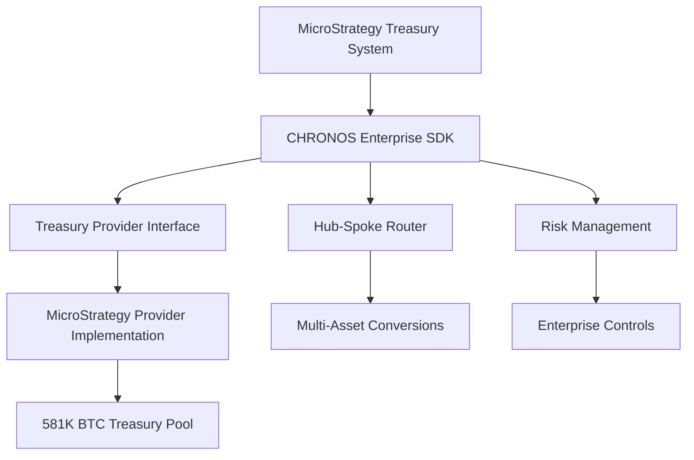
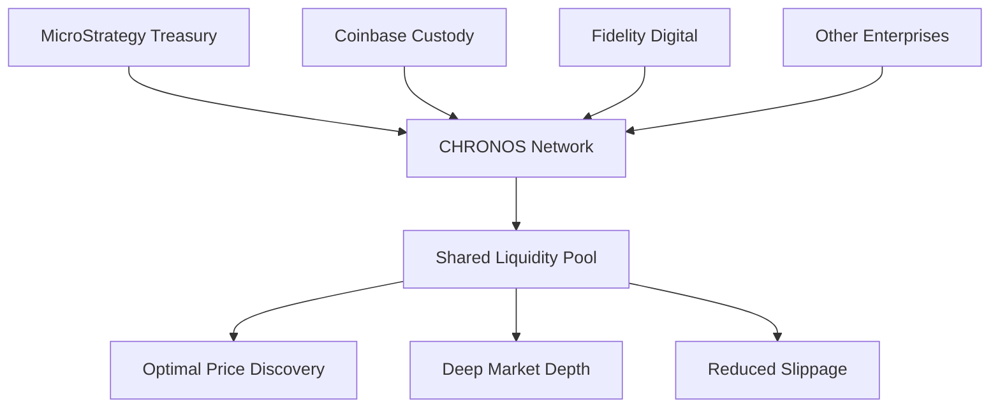

# CHRONOS Open Source Architecture

## Executive Summary

CHRONOS is designed as a **modular, enterprise-grade, open-source clearing protocol** that enables companies like MicroStrategy to integrate Bitcoin treasury functionality directly into their existing systems. The architecture prioritizes **modularity, security, and ease of integration** while maintaining complete transparency through open-source licensing.

## Strategic Vision: Enterprise Bitcoin Infrastructure

### Core Philosophy

CHRONOS operates on the principle that **Bitcoin treasury operations should be as standardized and reliable as traditional banking infrastructure**. By open-sourcing the core components, we enable:

- **Industry Standardization**: Common protocols for Bitcoin treasury operations
- **Network Effects**: Shared liquidity pools across multiple enterprise participants  
- **Reduced Development Costs**: Companies avoid rebuilding treasury infrastructure
- **Enhanced Security**: Community auditing and battle-testing of critical code
- **Competitive Innovation**: Companies can differentiate on business logic, not infrastructure

### MicroStrategy Partnership Model

**Primary Integration Points:**
1. **Treasury Provider Interface**: Direct access to MicroStrategy's 581K BTC treasury
2. **Enterprise SDK**: Pre-built integration for corporate treasury systems
3. **Compliance Framework**: Built-in KYC/AML for enterprise requirements
4. **Risk Management**: Enterprise-grade controls and monitoring

## Modular Architecture Design

### Core Modules (Open Source)

#### 1. Treasury Provider Abstraction (`treasury_provider.py`)
**Purpose**: Standardized interface for Bitcoin treasury providers
**Open Source Rationale**: 
- Enables multiple treasury providers to compete
- Creates industry standard for treasury APIs
- Reduces integration complexity for enterprises

```python
# Standard interface any treasury provider can implement
class TreasuryProvider(ABC):
    async def get_liquidity_quote(self, asset, amount, operation) -> TreasuryQuote
    async def execute_operation(self, quote, amount) -> TreasuryExecution
    async def get_available_liquidity(self, asset) -> Dict[LiquidityTier, Decimal]
```

**Enterprise Benefits:**
- **Vendor Independence**: Switch between treasury providers without code changes
- **Best Execution**: Automatically route to optimal liquidity sources
- **Risk Diversification**: Access multiple treasury providers simultaneously

#### 2. Hub-and-Spoke Router (`hub_spoke_router.py`)
**Purpose**: Optimal routing for cross-crypto conversions using Bitcoin as hub
**Open Source Rationale**:
- Creates Bitcoin-centric liquidity network
- Reduces fragmentation in crypto markets
- Benefits all participants through deeper liquidity

```python
# Bitcoin-centric routing with confidence scoring
class HubSpokeRouter:
    async def find_optimal_route(self, from_asset, to_asset, amount) -> List[RoutingPath]
    async def execute_hub_spoke_route(self, route, amount, user_id) -> Dict
```

**Enterprise Benefits:**
- **Optimal Execution**: Always finds cheapest/fastest conversion path
- **Bitcoin Hub**: Leverages Bitcoin's liquidity advantage
- **Predictable Routing**: Standardized path-finding algorithms

#### 3. Enterprise SDK (`enterprise_sdk.py`)
**Purpose**: High-level SDK for enterprise integration
**Open Source Rationale**:
- Accelerates enterprise adoption
- Creates standard patterns for treasury automation
- Enables community-driven improvements

```python
# Enterprise-grade operations with built-in controls
class CHRONOSEnterpriseSDK:
    async def execute_treasury_operation(self, operation_type, asset, amount)
    async def bulk_execute_operations(self, operations, execution_mode)
    async def get_enterprise_dashboard(self) -> Dict[str, Any]
```

**Enterprise Benefits:**
- **Rapid Integration**: Pre-built enterprise patterns
- **Risk Controls**: Built-in compliance and risk management
- **Operational Insights**: Comprehensive dashboards and reporting

### Proprietary Extensions (Optional Commercial Modules)

#### 1. Advanced Analytics & AI
- **Predictive Liquidity Modeling**: ML-based liquidity forecasting
- **Risk Optimization**: AI-driven risk assessment and hedging
- **Market Intelligence**: Proprietary market data and insights

#### 2. Enterprise Support & SLA
- **24/7 Support**: Dedicated enterprise support teams
- **SLA Guarantees**: Uptime and performance guarantees
- **Custom Integrations**: Tailored integration services

#### 3. Regulatory & Compliance Plus
- **Advanced Compliance**: Additional regulatory frameworks
- **Audit Support**: Dedicated audit and compliance reporting
- **Legal Framework**: Ongoing legal and regulatory guidance

## Integration Architecture for MicroStrategy

### Phase 1: Core Treasury Integration



**Implementation Steps:**
1. **SDK Integration**: Install CHRONOS Enterprise SDK
2. **Treasury Provider Setup**: Configure MicroStrategy treasury provider
3. **Risk Controls**: Set enterprise limits and monitoring
4. **Testing**: Execute test transactions with small amounts
5. **Production**: Scale to full treasury operations

### Phase 2: Network Expansion



**Network Benefits:**
- **Shared Liquidity**: All participants benefit from deeper liquidity
- **Price Discovery**: Market-driven pricing across all providers
- **Risk Distribution**: Diversified counterparty exposure

## Open Source Implementation Strategy

### Core Principles

#### 1. **Modular Design**
- Each component is independently usable
- Clear interfaces between modules
- Minimal dependencies between components

#### 2. **Enterprise-Grade Quality**
- Comprehensive test coverage (>95%)
- Production-ready error handling
- Performance optimization for high-volume operations

#### 3. **Security-First Architecture**
- All sensitive operations use multi-signature validation
- Complete audit trail for all transactions
- Built-in compliance and risk management

#### 4. **API-First Design**
- RESTful APIs for all functionality
- OpenAPI documentation
- SDK support for major programming languages

### Licensing Strategy

#### Open Source Components (MIT License)
- **Core Infrastructure**: Treasury provider interface, routing, SDK
- **Basic Compliance**: Standard KYC/AML frameworks
- **Community Tools**: Documentation, examples, test suites

#### Commercial Extensions (Enterprise License)
- **Advanced Features**: AI/ML capabilities, advanced analytics
- **Enterprise Support**: SLA, dedicated support, custom integrations
- **Premium Compliance**: Advanced regulatory frameworks

### Community Development Model

#### 1. **Governance Structure**
- **Technical Steering Committee**: Core maintainers from key enterprises
- **Community Council**: Broader community representation
- **Security Advisory Board**: Independent security experts

#### 2. **Contribution Framework**
- **Enterprise Contributors**: Companies contribute improvements back to core
- **Individual Contributors**: Developers contribute features and fixes
- **Academic Research**: Universities contribute research and analysis

#### 3. **Testing & Validation**
- **Community Testnet**: Shared testing environment
- **Enterprise Validation**: Production validation by enterprise users
- **Security Audits**: Regular third-party security audits

## Technical Implementation Details

### API Design Patterns

#### 1. **Async-First Architecture**
```python
# All operations are async for maximum performance
async def execute_treasury_operation(
    operation_type: str,
    asset: AssetType, 
    amount: Decimal
) -> TreasuryExecution
```

#### 2. **Builder Pattern for Configuration**
```python
# Fluent configuration for enterprise integration
sdk = (CHRONOSEnterpriseSDK.builder()
    .company("MicroStrategy")
    .treasury_provider("MICROSTRATEGY")
    .risk_tolerance("conservative")
    .max_daily_volume(Decimal("50000"))
    .build())
```

#### 3. **Event-Driven Architecture**
```python
# Webhook support for real-time updates
@sdk.on_transaction_complete
async def handle_completion(execution: TreasuryExecution):
    await notify_treasury_system(execution)
```

### Performance Characteristics

#### Throughput Targets
- **Quote Generation**: <100ms for standard quotes
- **Transaction Execution**: <5 seconds for standard operations
- **Bulk Operations**: 1000+ operations per hour

#### Scalability Design
- **Horizontal Scaling**: Stateless components enable easy scaling
- **Database Sharding**: Transaction data partitioned by enterprise
- **Caching Strategy**: Multi-layer caching for optimal performance

### Security Architecture

#### 1. **Multi-Signature Operations**
- All treasury operations require multiple approvals
- Configurable signature requirements per operation size
- Hardware security module (HSM) integration

#### 2. **Zero-Trust Networking**
- All API calls authenticated and authorized
- Network segmentation between components
- End-to-end encryption for all data

#### 3. **Audit & Compliance**
- Immutable audit trail for all operations
- Real-time compliance monitoring
- Automated regulatory reporting

## Enterprise Integration Examples

### MicroStrategy Integration Example

```python
async def microstrategy_integration_example():
    # Initialize SDK for MicroStrategy
    sdk = create_enterprise_sdk(
        company_name="MicroStrategy Inc.",
        company_id="MSTR_001",
        treasury_credentials={
            "api_key": os.getenv("MSTR_API_KEY"),
            "treasury_account": "mstr_treasury_001"
        },
        max_daily_volume=Decimal("50000"),  # 50K BTC daily
        max_single_transaction=Decimal("5000")  # 5K BTC per transaction
    )
    
    # Check available liquidity
    liquidity = await sdk.get_liquidity_status(AssetType.BTC)
    print(f"Available BTC liquidity: {liquidity['total_liquidity_by_tier']}")
    
    # Execute treasury operation
    result = await sdk.execute_treasury_operation(
        operation_type="sell",
        asset=AssetType.BTC,
        amount=Decimal("1000"),  # Sell 1000 BTC
        execution_preference="balanced"
    )
    
    if result["status"] == "executed":
        print(f"Operation completed: {result['execution_id']}")
        
        # Generate compliance report
        report = await sdk.generate_compliance_report(
            start_date=datetime.now() - timedelta(days=30),
            end_date=datetime.now()
        )
        
        return report
```

### Multi-Provider Setup Example

```python
async def multi_provider_setup():
    # Setup treasury manager with multiple providers
    manager = TreasuryProviderManager()
    
    # Add MicroStrategy
    mstr_provider = MicroStrategyProvider({
        "api_key": "mstr_key",
        "treasury_account": "mstr_001"
    })
    manager.register_provider(mstr_provider)
    
    # Add Coinbase Custody
    coinbase_provider = CoinbaseCustodyProvider({
        "api_key": "cb_key",
        "custody_account": "cb_001"
    })
    manager.register_provider(coinbase_provider)
    
    # Get best quote across all providers
    provider, quote = await manager.get_best_liquidity_quote(
        asset=AssetType.BTC,
        amount=Decimal("500"),
        operation="sell"
    )
    
    print(f"Best quote from {provider.provider_name}: {quote.rate}")
```

## Deployment & Operations

### Containerized Deployment

```yaml
# docker-compose.yml for enterprise deployment
version: '3.8'
services:
  chronos-api:
    image: chronos/enterprise-api:latest
    environment:
      - ENTERPRISE_CONFIG=/app/config/enterprise.yml
      - TREASURY_PROVIDERS=MICROSTRATEGY,COINBASE_CUSTODY
    volumes:
      - ./config:/app/config
    ports:
      - "8080:8080"
      
  chronos-router:
    image: chronos/hub-spoke-router:latest
    depends_on:
      - chronos-api
      
  chronos-treasury:
    image: chronos/treasury-manager:latest
    environment:
      - TREASURY_CONFIG=/app/config/treasury.yml
    volumes:
      - ./treasury-config:/app/config
```

### Kubernetes Production Deployment

```yaml
apiVersion: apps/v1
kind: Deployment
metadata:
  name: chronos-enterprise
spec:
  replicas: 3
  selector:
    matchLabels:
      app: chronos-enterprise
  template:
    metadata:
      labels:
        app: chronos-enterprise
    spec:
      containers:
      - name: chronos-api
        image: chronos/enterprise-api:v1.0.0
        resources:
          requests:
            memory: "2Gi"
            cpu: "1"
          limits:
            memory: "4Gi" 
            cpu: "2"
        env:
        - name: ENTERPRISE_ID
          valueFrom:
            secretKeyRef:
              name: chronos-secrets
              key: enterprise-id
```

## Future Roadmap

### Short Term (3-6 months)
- Complete MicroStrategy provider implementation
- Enterprise SDK production release
- Security audit and penetration testing
- Community testnet launch

### Medium Term (6-12 months)
- Multi-provider network expansion
- Advanced analytics and AI features
- Mobile SDK for treasury operations
- Integration with major ERP systems

### Long Term (12+ months)
- Cross-chain treasury operations
- Decentralized governance for network parameters
- Advanced DeFi integrations
- Global regulatory compliance framework

## Getting Started

### For Enterprises

1. **Review Documentation**: Study the enterprise integration guide
2. **Contact Integration Team**: Schedule technical consultation
3. **Pilot Program**: Start with small-scale testing
4. **Production Deployment**: Scale to full treasury operations

### For Developers

1. **Clone Repository**: `git clone https://github.com/Ryno2390/PRSM.git`
2. **Install Dependencies**: `pip install -r requirements.txt`
3. **Run Test Suite**: `pytest tests/chronos/`
4. **Try Examples**: Explore `examples/enterprise/` directory

### For Treasury Providers

1. **Implement Interface**: Extend `TreasuryProvider` abstract class
2. **Integration Testing**: Test with CHRONOS testnet
3. **Community Review**: Submit for community validation
4. **Production Launch**: Deploy to enterprise networks

## Conclusion

CHRONOS represents a **paradigm shift toward standardized, open-source Bitcoin treasury infrastructure**. By making the core components open source while offering commercial extensions, we create a model that:

- **Benefits Enterprises**: Reduced development costs, faster time-to-market
- **Benefits the Industry**: Standardization, deeper liquidity, reduced fragmentation  
- **Benefits Bitcoin Adoption**: Enterprise-grade infrastructure accelerates institutional adoption

The modular architecture ensures that companies like MicroStrategy can integrate CHRONOS incrementally, starting with basic treasury operations and expanding to advanced features as needed. This approach minimizes risk while maximizing the potential for Bitcoin to become the backbone of corporate treasury operations worldwide.