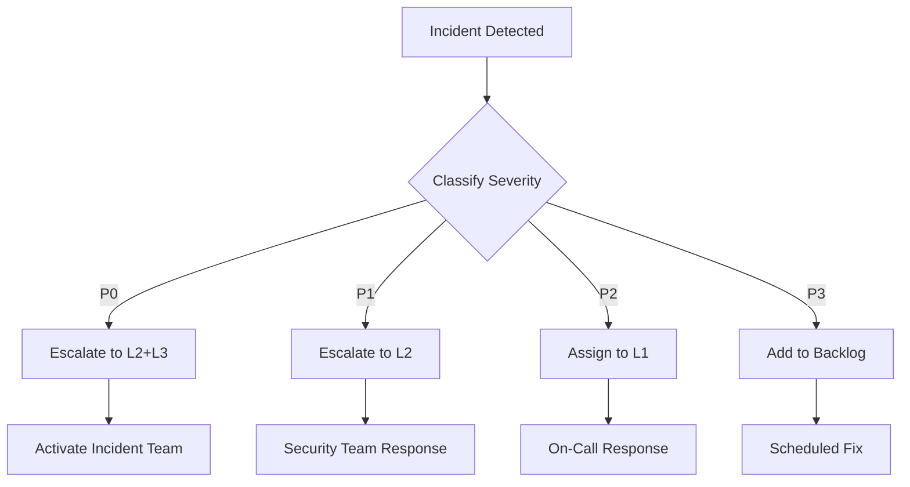

# PRSM Security Runbook

**Version:** 1.0  
**Last Updated:** 2025-06-30  
**Status:** Active

## Overview

This runbook provides step-by-step procedures for handling security incidents in the PRSM project. It is designed for use by the security team, operations team, and on-call engineers.

## Table of Contents

1. [Incident Classification](#incident-classification)
2. [Response Procedures](#response-procedures)
3. [Escalation Matrix](#escalation-matrix)
4. [Communication Templates](#communication-templates)
5. [Post-Incident Procedures](#post-incident-procedures)
6. [Security Tools](#security-tools)
7. [Contact Information](#contact-information)

---

## Incident Classification

### Severity Levels

| Level | Name | Description | Response Time | Examples |
|-------|------|-------------|---------------|----------|
| **P0** | Critical | Active exploitation, data breach, system compromise | 15 minutes | - Active data exfiltration<br>- Ransomware attack<br>- Publicly exploited vulnerability |
| **P1** | High | Vulnerability discovered, potential breach | 1 hour | - Critical CVE disclosed<br>- Unauthorized access detected<br>- Security control bypass |
| **P2** | Medium | Potential issue, limited impact | 4 hours | - Suspicious activity detected<br>- Non-critical vulnerability<br>- Policy violation |
| **P3** | Low | Hardening opportunity, minor issue | 24 hours | - Security recommendation<br>- Documentation update<br>- Best practice improvement |

### Incident Types

| Type | Description | Typical Severity |
|------|-------------|------------------|
| **Data Breach** | Unauthorized access to sensitive data | P0-P1 |
| **Account Compromise** | User or admin account takeover | P0-P1 |
| **Vulnerability** | Security flaw discovered | P1-P3 |
| **Malware** | Malicious software detected | P0-P1 |
| **DDoS** | Denial of service attack | P1-P2 |
| **Insider Threat** | Malicious insider activity | P0-P1 |
| **Policy Violation** | Security policy breach | P2-P3 |
| **Configuration Issue** | Misconfiguration detected | P2-P3 |

---

## Response Procedures

### P0 - Critical Incident Response

#### Immediate Actions (0-15 minutes)

1. **Activate Incident Response Team**
   ```bash
   # Notify on-call team
   ./scripts/security/notify-incident-team.sh --severity P0 --incident-id $INCIDENT_ID
   
   # Create incident channel
   ./scripts/security/create-incident-channel.sh --name "incident-$INCIDENT_ID"
   ```

2. **Assess and Contain**
   ```bash
   # Check system status
   ./scripts/security/assess-system-status.sh
   
   # Isolate affected systems
   ./scripts/security/isolate-systems.sh --systems $AFFECTED_SYSTEMS
   
   # Preserve evidence
   ./scripts/security/preserve-evidence.sh --incident-id $INCIDENT_ID
   ```

3. **Initial Communication**
   - Notify security lead
   - Notify executive sponsor
   - Send initial status to incident channel

#### Containment Phase (15-60 minutes)

1. **Stop the Bleeding**
   ```bash
   # Block malicious IPs
   ./scripts/security/block-ips.sh --ips $MALICIOUS_IPS
   
   # Revoke compromised credentials
   ./scripts/security/revoke-credentials.sh --users $AFFECTED_USERS
   
   # Disable compromised services
   ./scripts/security/disable-services.sh --services $AFFECTED_SERVICES
   ```

2. **Evidence Collection**
   ```bash
   # Capture system state
   ./scripts/security/capture-system-state.sh --incident-id $INCIDENT_ID
   
   # Export logs
   ./scripts/security/export-logs.sh --start-time $INCIDENT_START --incident-id $INCIDENT_ID
   
   # Create forensic snapshot
   ./scripts/security/create-forensic-snapshot.sh --systems $AFFECTED_SYSTEMS
   ```

3. **Status Updates**
   - Update incident channel every 15 minutes
   - Document all actions taken
   - Maintain chain of custody

#### Remediation Phase (1-4 hours)

1. **Develop Fix**
   ```bash
   # Create hotfix branch
   git checkout -b security/hotfix-$INCIDENT_ID
   
   # Implement fix
   # ... code changes ...
   
   # Run security tests
   pytest tests/security/ -v
   
   # Deploy to staging
   ./scripts/deploy.sh --env staging --branch security/hotfix-$INCIDENT_ID
   ```

2. **Validate Fix**
   ```bash
   # Run security validation
   ./scripts/security/validate-fix.sh --incident-id $INCIDENT_ID
   
   # Perform penetration test
   ./scripts/security/pentest.sh --target staging
   
   # Review with security team
   ./scripts/security/review-fix.sh --incident-id $INCIDENT_ID
   ```

3. **Deploy Fix**
   ```bash
   # Deploy to production
   ./scripts/deploy.sh --env production --branch security/hotfix-$INCIDENT_ID
   
   # Verify deployment
   ./scripts/security/verify-deployment.sh --incident-id $INCIDENT_ID
   
   # Monitor for issues
   ./scripts/security/monitor-deployment.sh --incident-id $INCIDENT_ID
   ```

#### Recovery Phase (4-24 hours)

1. **Restore Services**
   ```bash
   # Re-enable services
   ./scripts/security/enable-services.sh --services $AFFECTED_SERVICES
   
   # Restore access
   ./scripts/security/restore-access.sh --users $AFFECTED_USERS
   
   # Verify functionality
   ./scripts/security/verify-functionality.sh
   ```

2. **Post-Incident Actions**
   ```bash
   # Rotate all credentials
   ./scripts/security/rotate-credentials.sh --scope all
   
   # Review access logs
   ./scripts/security/review-access-logs.sh --incident-id $INCIDENT_ID
   
   # Update security measures
   ./scripts/security/update-security-measures.sh --incident-id $INCIDENT_ID
   ```

---

### P1 - High Severity Response

#### Initial Response (0-1 hour)

1. **Assess Vulnerability**
   ```bash
   # Run vulnerability assessment
   python -m prsm.security.scanner
   
   # Check affected systems
   ./scripts/security/check-systems.sh --vulnerability $CVE_ID
   ```

2. **Implement Mitigation**
   ```bash
   # Apply temporary mitigation
   ./scripts/security/apply-mitigation.sh --vulnerability $CVE_ID
   
   # Monitor for exploitation
   ./scripts/security/monitor-exploitation.sh --vulnerability $CVE_ID
   ```

#### Remediation (1-24 hours)

1. **Develop Patch**
   ```bash
   # Create fix branch
   git checkout -b security/patch-$CVE_ID
   
   # Implement fix
   # ... code changes ...
   
   # Run tests
   pytest tests/ -v
   ```

2. **Deploy Patch**
   ```bash
   # Deploy to staging
   ./scripts/deploy.sh --env staging
   
   # Validate fix
   ./scripts/security/validate-patch.sh --vulnerability $CVE_ID
   
   # Deploy to production
   ./scripts/deploy.sh --env production
   ```

---

### P2 - Medium Severity Response

#### Assessment (0-4 hours)

1. **Investigate Issue**
   ```bash
   # Run security audit
   python -m prsm.security.audit_checklist
   
   # Analyze logs
   ./scripts/security/analyze-logs.sh --issue $ISSUE_ID
   ```

2. **Plan Remediation**
   - Document findings
   - Create remediation plan
   - Schedule fix deployment

#### Remediation (24-72 hours)

1. **Implement Fix**
   ```bash
   # Create fix branch
   git checkout -b security/fix-$ISSUE_ID
   
   # Implement changes
   # ... code changes ...
   
   # Run tests
   pytest tests/ -v
   ```

2. **Deploy and Monitor**
   ```bash
   # Deploy
   ./scripts/deploy.sh --env production
   
   # Monitor
   ./scripts/security/monitor.sh --issue $ISSUE_ID
   ```

---

### P3 - Low Severity Response

#### Assessment (0-24 hours)

1. **Document Issue**
   - Create security ticket
   - Document findings
   - Assign to appropriate team

2. **Plan Improvement**
   - Add to security backlog
   - Prioritize against other work
   - Schedule implementation

#### Remediation (As scheduled)

1. **Implement Improvement**
   ```bash
   # Create improvement branch
   git checkout -b security/improvement-$ISSUE_ID
   
   # Implement changes
   # ... code changes ...
   
   # Run tests
   pytest tests/ -v
   ```

2. **Deploy and Document**
   ```bash
   # Deploy
   ./scripts/deploy.sh --env production
   
   # Update documentation
   ./scripts/security/update-docs.sh --issue $ISSUE_ID
   ```

---

## Escalation Matrix

### Escalation Contacts

| Level | Role | Contact | Response Time |
|-------|------|---------|----------------|
| L1 | On-Call Engineer | oncall@prsm-network.com | 15 minutes |
| L2 | Security Team Lead | security-lead@prsm-network.com | 30 minutes |
| L3 | CISO | ciso@prsm-network.com | 1 hour |
| L4 | Executive Team | exec@prsm-network.com | 2 hours |

### Escalation Triggers

| Trigger | Action |
|---------|--------|
| P0 incident | Immediately escalate to L2 and L3 |
| P1 incident | Escalate to L2 within 30 minutes |
| L1 unavailable | Escalate to L2 after 15 minutes |
| L2 unavailable | Escalate to L3 after 30 minutes |
| Data breach suspected | Immediately escalate to L3 and L4 |
| Customer impact | Immediately notify L4 |

### Escalation Procedure



---

## Communication Templates

### Internal Notification Template

```
SECURITY INCIDENT - [SEVERITY]

Incident ID: [ID]
Time Detected: [TIMESTAMP]
Time Confirmed: [TIMESTAMP]

SUMMARY:
[Brief description of the incident]

AFFECTED SYSTEMS:
- [System 1]
- [System 2]

CURRENT STATUS:
[Investigating/Contained/Remediating/Resolved]

IMPACT:
- [User impact]
- [Data impact]
- [Business impact]

ACTIONS TAKEN:
1. [Action 1]
2. [Action 2]

NEXT STEPS:
1. [Next step 1]
2. [Next step 2]

INCIDENT LEAD: [Name]
NEXT UPDATE: [Time]

---
This is an automated message from the PRSM Security Incident System.
```

### External Notification Template

```
PRSM Security Advisory

Advisory ID: PRSM-SEC-[YEAR]-[NUMBER]
Published: [DATE]
Last Updated: [DATE]

SUMMARY:
[Non-technical description of the vulnerability]

AFFECTED VERSIONS:
- PRSM [version range]

SEVERITY: [Critical/High/Medium/Low]
CVSS SCORE: [Score]

TECHNICAL DETAILS:
[Technical description for administrators]

IMPACT:
[Description of potential impact]

MITIGATION:
[Steps to mitigate before patching]

SOLUTION:
[Steps to resolve]

REFERENCES:
- CVE: [CVE ID]
- CWE: [CWE ID]

CREDITS:
[Credit to reporter if applicable]

---
PRSM Security Team
security@prsm-network.com
```

### Status Update Template

```
INCIDENT STATUS UPDATE

Incident ID: [ID]
Time: [TIMESTAMP]
Update Number: [N]

CURRENT STATUS: [Investigating/Contained/Remediating/Resolved]

PROGRESS SINCE LAST UPDATE:
- [Progress item 1]
- [Progress item 2]

CURRENT ACTIONS:
- [Current action 1]
- [Current action 2]

NEXT ACTIONS:
- [Next action 1]
- [Next action 2]

ESTIMATED TIME TO RESOLUTION: [Time]

ADDITIONAL INFORMATION:
[Any additional context]

NEXT UPDATE: [Time]
```

---

## Post-Incident Procedures

### Post-Mortem Meeting

**Schedule:** Within 48 hours of incident resolution  
**Duration:** 1-2 hours  
**Attendees:** Incident responders, stakeholders, management

#### Agenda

1. **Incident Overview** (10 minutes)
   - Timeline of events
   - Impact summary
   - Resolution summary

2. **Root Cause Analysis** (20 minutes)
   - What happened?
   - Why did it happen?
   - How was it detected?

3. **Response Analysis** (20 minutes)
   - What went well?
   - What could be improved?
   - Were procedures followed?

4. **Action Items** (20 minutes)
   - Immediate fixes
   - Long-term improvements
   - Process changes

5. **Documentation** (10 minutes)
   - Update runbooks
   - Update policies
   - Knowledge sharing

### Post-Mortem Report Template

```markdown
# Post-Mortem: [Incident Title]

**Incident ID:** [ID]  
**Date:** [Date]  
**Duration:** [Duration]  
**Severity:** [P0/P1/P2/P3]

## Summary
[2-3 sentence summary]

## Timeline
| Time | Event |
|------|-------|
| HH:MM | [Event 1] |
| HH:MM | [Event 2] |

## Root Cause
[Detailed root cause analysis]

## Impact
- **Users Affected:** [Number]
- **Duration:** [Time]
- **Data Impact:** [Description]

## Resolution
[How the incident was resolved]

## Action Items
| Action | Owner | Due Date |
|--------|-------|----------|
| [Action 1] | [Name] | [Date] |
| [Action 2] | [Name] | [Date] |

## Lessons Learned
### What Went Well
- [Item 1]
- [Item 2]

### What Could Be Improved
- [Item 1]
- [Item 2]

## Appendix
- [Links to logs, screenshots, etc.]
```

### Incident Closure Checklist

- [ ] Incident resolved and verified
- [ ] All affected systems restored
- [ ] Credentials rotated if compromised
- [ ] Logs archived for retention
- [ ] Post-mortem completed
- [ ] Action items created
- [ ] Documentation updated
- [ ] Stakeholders notified
- [ ] Incident ticket closed

---

## Security Tools

### Security Scanner

```bash
# Run full security scan
python -m prsm.security.scanner

# Scan dependencies only
python -m prsm.security.scanner --dependencies

# Scan code only
python -m prsm.security.scanner --code

# Scan for secrets
python -m prsm.security.scanner --secrets
```

### Security Audit

```bash
# Run full security audit
python -m prsm.security.audit_checklist

# Run specific category
python -m prsm.security.audit_checklist --category authentication

# Run specific checks
python -m prsm.security.audit_checklist --checks auth_jwt_expiry,auth_password_hashing
```

### Penetration Testing

```bash
# Run all penetration tests
python -m prsm.security.pentest

# Run specific test
python -m prsm.security.pentest --test authentication_bypass

# Run with custom target
python -m prsm.security.pentest --target https://staging.prsm-network.com
```

### Secrets Management

```bash
# Validate secrets
python -m prsm.security.secrets --validate

# Check secret strength
python -m prsm.security.secrets --check-strength

# Generate new secret
python -m prsm.security.secrets --generate --length 32
```

### Environment Validation

```bash
# Validate environment
python -m prsm.security.env_config --validate

# Generate env template
python -m prsm.security.env_config --template > .env.template

# Scan for secrets in code
python -m prsm.security.env_config --scan ./prsm
```

---

## Contact Information

### Security Team

| Role | Name | Email | Phone |
|------|------|-------|-------|
| Security Lead | [Name] | security-lead@prsm-network.com | [Phone] |
| Security Engineer | [Name] | security@prsm-network.com | [Phone] |
| Security Analyst | [Name] | security@prsm-network.com | [Phone] |

### External Resources

| Resource | Contact |
|----------|---------|
| Law Enforcement | [Local FBI Cyber Division] |
| Legal Counsel | [Legal firm contact] |
| Insurance | [Cyber insurance contact] |
| PR/Communications | [PR firm contact] |

### Vendor Contacts

| Vendor | Purpose | Contact |
|--------|---------|---------|
| Cloud Provider | Infrastructure | [Support contact] |
| Security Tools | Tools support | [Support contact] |
| CDN | DDoS mitigation | [Support contact] |

---

## Appendix

### Useful Commands

```bash
# Check system status
systemctl status prsm

# View recent logs
journalctl -u prsm -n 100

# Check network connections
netstat -tulpn

# Check running processes
ps aux | grep prsm

# Check disk space
df -h

# Check memory usage
free -m

# Check CPU usage
top -n 1
```

### Log Locations

| Log | Location |
|-----|----------|
| Application | /var/log/prsm/application.log |
| Security | /var/log/prsm/security.log |
| Access | /var/log/prsm/access.log |
| Error | /var/log/prsm/error.log |
| Audit | /var/log/prsm/audit.log |

### Configuration Files

| Config | Location |
|--------|----------|
| Main | /etc/prsm/config.yaml |
| Security | /etc/prsm/security.yaml |
| Logging | /etc/prsm/logging.yaml |

---

*This runbook is maintained by the PRSM Security Team. For questions or updates, contact security@prsm-network.com.*