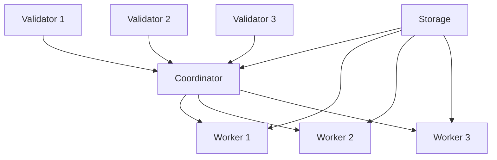

# Distribution Path

Welcome to the PRSM Distribution Path! This path teaches you how to build and deploy distributed AI systems that scale across networks and leverage collective intelligence.

## What You'll Learn

- **P2P Network Architecture**: Understanding distributed AI networks
- **Node Management**: Running and managing PRSM nodes
- **Consensus Mechanisms**: Coordinating distributed decisions
- **Resource Sharing**: Contributing and consuming network resources
- **Network Economics**: Understanding FTNS tokenomics

## Prerequisites

Before starting this path, you should have completed:
- [Development Path](../03-development/) - Advanced API usage and applications
- Have experience with distributed systems concepts
- Understanding of networking and system administration

## Distribution Path Modules

### 1. Network Fundamentals
- P2P network architecture
- Node types and roles
- Network topology
- Communication protocols

### 2. Node Deployment
- Setting up PRSM nodes
- Configuration management
- Resource allocation
- Monitoring and maintenance

### 3. Consensus and Coordination
- Byzantine fault tolerance
- Decision-making algorithms
- Quality assessment
- Conflict resolution

### 4. Resource Economics
- FTNS token mechanics
- Contribution tracking
- Reward distribution
- Economic incentives

### 5. Network Optimization
- Performance tuning
- Load balancing
- Fault tolerance
- Scaling strategies

## Practical Exercises

### Exercise 1: Deploy a Network Node
Set up and configure your first PRSM node:
```bash
# Install node software
npm install -g @prsm/node

# Initialize node
prsm-node init --type=worker

# Configure resources
prsm-node config set cpu-cores 4
prsm-node config set memory 8GB
prsm-node config set gpu-enabled true

# Start node
prsm-node start --network=testnet
```

### Exercise 2: Network Participation
Contribute to and benefit from the network:
```python
from prsm_sdk import NetworkClient

# Connect to network
network = NetworkClient(node_id="your-node-id")

# Contribute computational resources
contribution = await network.contribute_compute(
    cpu_cores=2,
    memory_gb=4,
    duration_hours=24
)

# Participate in consensus
await network.join_consensus_group("model-evaluation")

# Earn FTNS tokens
earnings = await network.get_earnings_summary()
```

### Exercise 3: Multi-Node Coordination
Coordinate tasks across multiple nodes:
```python
# Distribute workload
task_distribution = await network.distribute_task(
    task_type="model_training",
    data_shards=10,
    required_nodes=5
)

# Monitor progress
for shard_id, progress in task_distribution.monitor():
    print(f"Shard {shard_id}: {progress}% complete")

# Aggregate results
final_model = await task_distribution.aggregate_results()
```

## Network Architecture

### Node Types

1. **Coordinator Nodes**
   - Task orchestration
   - Resource allocation
   - Network governance

2. **Worker Nodes**
   - Model inference
   - Training computation
   - Data processing

3. **Validator Nodes**
   - Quality assessment
   - Consensus participation
   - Network security

4. **Storage Nodes**
   - Data persistence
   - Model storage
   - Backup services

### Communication Patterns



## Economic Model

### FTNS Token Flow

1. **Contribution Rewards**
   - Compute provision: 10-50 FTNS/hour
   - Data contribution: 100-1000 FTNS/dataset
   - Model development: 500-5000 FTNS/model

2. **Consumption Costs**
   - Model inference: 1-10 FTNS/request
   - Training jobs: 100-1000 FTNS/job
   - Data access: 10-100 FTNS/dataset

3. **Network Services**
   - Transaction fees: 0.1% of transaction value
   - Consensus participation: 5-20 FTNS/vote
   - Network governance: Variable rewards

## Advanced Topics

### Custom Consensus Algorithms

Implement custom consensus for specialized use cases:
```python
from prsm_sdk import ConsensusAlgorithm

class QualityWeightedConsensus(ConsensusAlgorithm):
    async def reach_consensus(self, proposals, node_weights):
        # Weight votes by historical quality scores
        weighted_votes = {}
        
        for proposal_id, votes in proposals.items():
            score = 0
            total_weight = 0
            
            for node_id, vote in votes.items():
                node_quality = await self.get_node_quality(node_id)
                weight = node_weights[node_id] * node_quality
                
                score += vote * weight
                total_weight += weight
            
            weighted_votes[proposal_id] = score / total_weight
        
        return max(weighted_votes, key=weighted_votes.get)

# Register custom algorithm
network.register_consensus_algorithm("quality_weighted", QualityWeightedConsensus())
```

### Network Monitoring

Set up comprehensive network monitoring:
```python
from prsm_sdk import NetworkMonitor

monitor = NetworkMonitor(
    metrics=["latency", "throughput", "consensus_time", "node_health"],
    alert_thresholds={
        "latency": 1000,  # ms
        "throughput": 100,  # requests/sec
        "consensus_time": 5000,  # ms
        "node_health": 0.95  # fraction
    }
)

# Real-time monitoring
async for metric_update in monitor.stream():
    if metric_update.alert:
        await send_alert(metric_update)
    
    await update_dashboard(metric_update)
```

## Security Considerations

### Node Security
- Secure key management
- Network access controls
- Resource isolation
- Audit logging

### Network Security
- Byzantine fault tolerance
- Sybil attack prevention
- Eclipse attack mitigation
- Consensus security

### Data Security
- End-to-end encryption
- Zero-knowledge proofs
- Secure multi-party computation
- Privacy-preserving protocols

## Troubleshooting

### Common Issues

1. **Node Connectivity Problems**
   ```bash
   # Check network connectivity
   prsm-node network-test
   
   # Verify firewall settings
   prsm-node check-ports
   
   # Test peer discovery
   prsm-node discover-peers
   ```

2. **Consensus Failures**
   ```bash
   # Check consensus participation
   prsm-node consensus-status
   
   # Verify node reputation
   prsm-node reputation-check
   
   # Test voting capability
   prsm-node test-consensus
   ```

3. **Resource Allocation Issues**
   ```bash
   # Monitor resource usage
   prsm-node resources
   
   # Check allocation efficiency
   prsm-node allocation-stats
   
   # Optimize resource distribution
   prsm-node optimize-resources
   ```

## Next Steps

After completing the Distribution Path:

1. **Deploy Production Network** → Move to [Production Path](../../PRODUCTION_OPERATIONS_MANUAL.md)
2. **Contribute to Protocol** → Join PRSM development
3. **Research Applications** → Explore novel distributed AI patterns

## Resources

- **Network Explorer**: Visualize network topology and activity
- **Node Dashboard**: Monitor your node performance
- **Economics Simulator**: Model token economics scenarios
- **Community Forum**: Connect with other network operators

---

*The Distribution Path typically takes 3-6 weeks to complete and requires running network nodes for practical experience.*