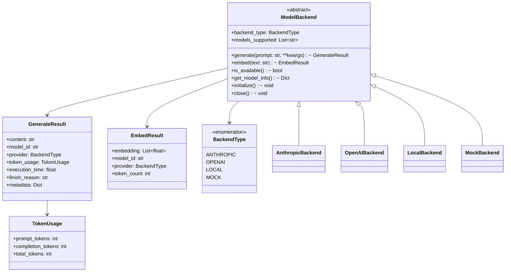
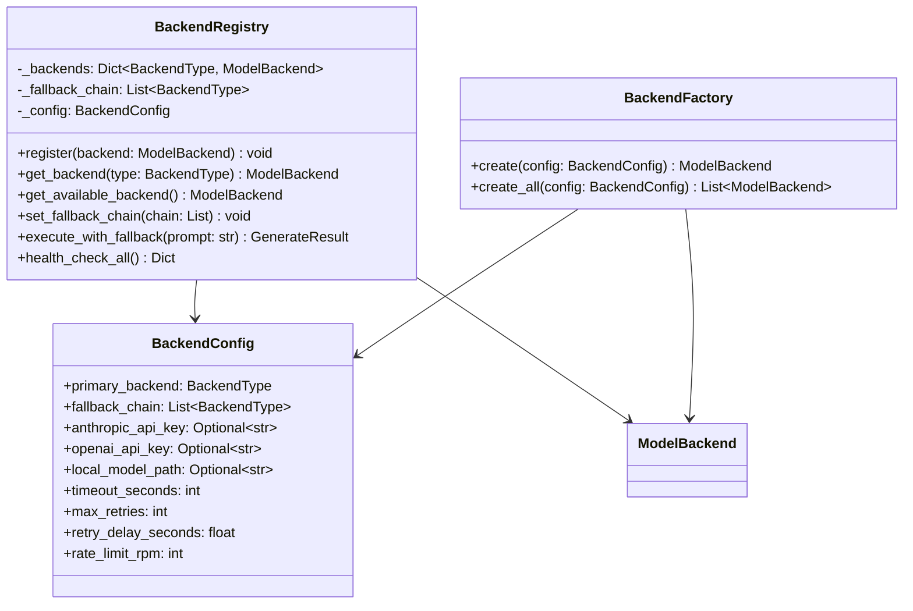
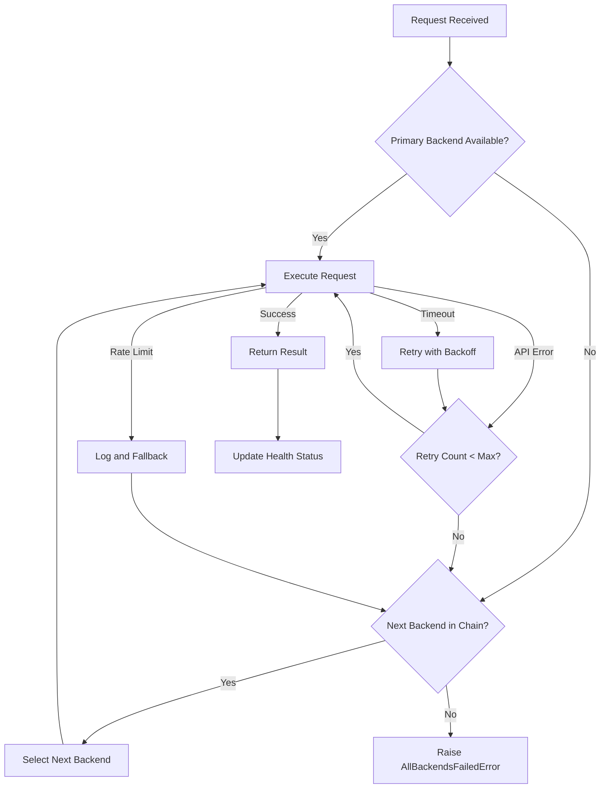
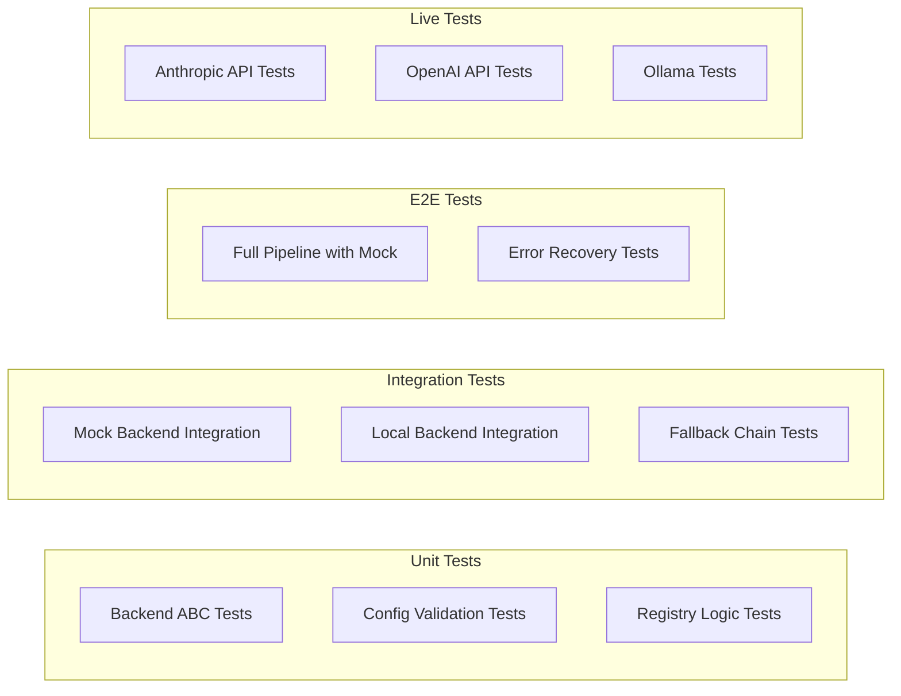

# NWTN LLM Backend Integration Architecture

## Phase 1.1: Replace Mock Outputs with Real LLM API Calls

**Author:** Architecture Team  
**Date:** March 2026  
**Status:** Design Document

---

## Executive Summary

This document defines the architecture for integrating real LLM backends into the NWTN 5-agent pipeline. The design replaces hardcoded mock outputs with actual API calls while maintaining backward compatibility and testability.

### Key Design Decisions

1. **Abstract Backend Interface** - Define a `ModelBackend` ABC that all providers implement
2. **Backend Registry Pattern** - Centralized registry for backend discovery and selection
3. **Fallback Chain** - Automatic failover from primary to backup providers
4. **Async-First Design** - All operations are async to match the existing pipeline
5. **Configuration-Driven Selection** - Environment variables and config files control backend selection

---

## 1. Directory Structure

```
prsm/compute/nwtn/backends/
├── __init__.py                    # Public API exports
├── base.py                        # ModelBackend ABC and common types
├── registry.py                    # BackendRegistry for discovery and selection
├── config.py                      # Backend configuration schema
├── anthropic_backend.py           # Claude API implementation
├── openai_backend.py              # OpenAI GPT API implementation
├── local_backend.py               # Local transformers/ollama implementation
├── mock_backend.py                # Testing mock (preserves current behavior)
└── exceptions.py                  # Backend-specific exceptions
```

---

## 2. Class Diagrams

### 2.1 Core Backend Architecture



### 2.2 Backend Registry and Selection



---

## 3. Model Backend ABC Interface

### 3.1 Base Class Definition

```python
# prsm/compute/nwtn/backends/base.py

from abc import ABC, abstractmethod
from dataclasses import dataclass, field
from enum import Enum
from typing import Dict, List, Optional, Any
import asyncio


class BackendType(str, Enum):
    """Supported backend types"""
    ANTHROPIC = "anthropic"
    OPENAI = "openai"
    LOCAL = "local"
    MOCK = "mock"


@dataclass
class TokenUsage:
    """Token usage statistics"""
    prompt_tokens: int = 0
    completion_tokens: int = 0
    total_tokens: int = 0


@dataclass
class GenerateResult:
    """Result from text generation"""
    content: str
    model_id: str
    provider: BackendType
    token_usage: TokenUsage
    execution_time: float
    finish_reason: str = "stop"
    metadata: Dict[str, Any] = field(default_factory=dict)


@dataclass
class EmbedResult:
    """Result from text embedding"""
    embedding: List[float]
    model_id: str
    provider: BackendType
    token_count: int
    metadata: Dict[str, Any] = field(default_factory=dict)


class ModelBackend(ABC):
    """
    Abstract base class for LLM backends.
    
    All backends must implement this interface to be used in the NWTN pipeline.
    The interface supports both text generation and embedding operations.
    """
    
    def __init__(self, config: Optional[Dict[str, Any]] = None):
        self.config = config or {}
        self._initialized = False
    
    @property
    @abstractmethod
    def backend_type(self) -> BackendType:
        """Return the backend type identifier"""
        pass
    
    @property
    @abstractmethod
    def models_supported(self) -> List[str]:
        """Return list of supported model IDs"""
        pass
    
    @abstractmethod
    async def initialize(self) -> None:
        """
        Initialize the backend.
        
        Called once before first use. Should validate API keys,
        load models, establish connections, etc.
        """
        pass
    
    @abstractmethod
    async def close(self) -> None:
        """Clean up resources"""
        pass
    
    @abstractmethod
    async def generate(
        self,
        prompt: str,
        model_id: Optional[str] = None,
        max_tokens: int = 1000,
        temperature: float = 0.7,
        system_prompt: Optional[str] = None,
        **kwargs
    ) -> GenerateResult:
        """
        Generate text from a prompt.
        
        Args:
            prompt: The input prompt
            model_id: Specific model to use (backend default if None)
            max_tokens: Maximum tokens to generate
            temperature: Sampling temperature
            system_prompt: Optional system prompt for chat models
            **kwargs: Additional provider-specific parameters
            
        Returns:
            GenerateResult with generated content and metadata
        """
        pass
    
    @abstractmethod
    async def embed(
        self,
        text: str,
        model_id: Optional[str] = None,
        **kwargs
    ) -> EmbedResult:
        """
        Generate embedding for text.
        
        Args:
            text: Text to embed
            model_id: Specific embedding model to use
            **kwargs: Additional provider-specific parameters
            
        Returns:
            EmbedResult with embedding vector
            
        Note:
            Some backends may not support embeddings. They should raise
            NotImplementedError with a clear message.
        """
        pass
    
    @abstractmethod
    async def is_available(self) -> bool:
        """
        Check if the backend is available and healthy.
        
        Should verify:
        - API keys are valid (for cloud providers)
        - Model is loaded (for local backends)
        - Network connectivity exists
        - Rate limits are not exceeded
        
        Returns:
            True if backend can process requests
        """
        pass
    
    @abstractmethod
    def get_model_info(self, model_id: Optional[str] = None) -> Dict[str, Any]:
        """
        Get information about available models.
        
        Args:
            model_id: Specific model to get info for (all if None)
            
        Returns:
            Dict with model information including:
            - model_id: Model identifier
            - provider: Backend provider
            - context_window: Maximum context length
            - supports_streaming: Whether streaming is supported
            - supports_functions: Whether function calling is supported
            - pricing: Cost per token (if applicable)
        """
        pass
    
    async def __aenter__(self):
        await self.initialize()
        return self
    
    async def __aexit__(self, exc_type, exc_val, exc_tb):
        await self.close()
```

---

## 4. Backend Implementations

### 4.1 AnthropicBackend

```python
# prsm/compute/nwtn/backends/anthropic_backend.py

import aiohttp
import time
from typing import Dict, List, Optional, Any

from .base import ModelBackend, BackendType, GenerateResult, EmbedResult, TokenUsage
from .exceptions import BackendUnavailableError, RateLimitError, APIKeyValidationError


class AnthropicBackend(ModelBackend):
    """
    Anthropic Claude API backend.
    
    Supported Models:
    - claude-3-5-sonnet-20241022 (default)
    - claude-3-opus-20240229
    - claude-3-haiku-20240307
    """
    
    DEFAULT_MODEL = "claude-3-5-sonnet-20241022"
    EMBEDDING_MODEL = None  # Anthropic does not provide embedding API
    
    def __init__(self, api_key: Optional[str] = None, **kwargs):
        super().__init__(kwargs)
        self.api_key = api_key
        self.base_url = "https://api.anthropic.com/v1"
        self.session: Optional[aiohttp.ClientSession] = None
        self._models_cache: Dict[str, Any] = {}
    
    @property
    def backend_type(self) -> BackendType:
        return BackendType.ANTHROPIC
    
    @property
    def models_supported(self) -> List[str]:
        return [
            "claude-3-5-sonnet-20241022",
            "claude-3-opus-20240229",
            "claude-3-haiku-20240307",
            "claude-2.1",
            "claude-2.0"
        ]
    
    async def initialize(self) -> None:
        if self._initialized:
            return
        
        # Validate API key exists
        if not self.api_key:
            raise APIKeyValidationError("Anthropic API key not provided")
        
        # Create HTTP session
        self.session = aiohttp.ClientSession(
            timeout=aiohttp.ClientTimeout(total=self.config.get("timeout", 120)),
            headers={
                "x-api-key": self.api_key,
                "Content-Type": "application/json",
                "anthropic-version": "2023-06-01"
            }
        )
        
        # Validate API key with a minimal request
        try:
            await self.is_available()
            self._initialized = True
        except Exception as e:
            await self.close()
            raise APIKeyValidationError(f"Invalid Anthropic API key: {e}")
    
    async def close(self) -> None:
        if self.session:
            await self.session.close()
            self.session = None
        self._initialized = False
    
    async def generate(
        self,
        prompt: str,
        model_id: Optional[str] = None,
        max_tokens: int = 1000,
        temperature: float = 0.7,
        system_prompt: Optional[str] = None,
        **kwargs
    ) -> GenerateResult:
        
        if not self._initialized:
            await self.initialize()
        
        model = model_id or self.DEFAULT_MODEL
        start_time = time.time()
        
        payload = {
            "model": model,
            "max_tokens": max_tokens,
            "temperature": temperature,
            "messages": [{"role": "user", "content": prompt}]
        }
        
        if system_prompt:
            payload["system"] = system_prompt
        
        # Add optional parameters
        if "top_p" in kwargs:
            payload["top_p"] = kwargs["top_p"]
        if "top_k" in kwargs:
            payload["top_k"] = kwargs["top_k"]
        if "stop_sequences" in kwargs:
            payload["stop_sequences"] = kwargs["stop_sequences"]
        
        try:
            async with self.session.post(
                f"{self.base_url}/messages",
                json=payload
            ) as response:
                if response.status == 200:
                    data = await response.json()
                elif response.status == 429:
                    raise RateLimitError("Anthropic rate limit exceeded")
                elif response.status == 401:
                    raise APIKeyValidationError("Invalid Anthropic API key")
                else:
                    error_data = await response.json()
                    raise BackendUnavailableError(
                        f"Anthropic API error: {error_data.get('error', {}).get('message', response.status)}"
                    )
            
            execution_time = time.time() - start_time
            
            return GenerateResult(
                content=data["content"][0]["text"],
                model_id=model,
                provider=self.backend_type,
                token_usage=TokenUsage(
                    prompt_tokens=data.get("usage", {}).get("input_tokens", 0),
                    completion_tokens=data.get("usage", {}).get("output_tokens", 0),
                    total_tokens=data.get("usage", {}).get("input_tokens", 0) + 
                                data.get("usage", {}).get("output_tokens", 0)
                ),
                execution_time=execution_time,
                finish_reason=data.get("stop_reason", "stop"),
                metadata={"raw_response": data}
            )
            
        except aiohttp.ClientError as e:
            raise BackendUnavailableError(f"Network error calling Anthropic API: {e}")
    
    async def embed(
        self,
        text: str,
        model_id: Optional[str] = None,
        **kwargs
    ) -> EmbedResult:
        raise NotImplementedError(
            "Anthropic does not provide an embedding API. "
            "Use OpenAI or Local backend for embeddings."
        )
    
    async def is_available(self) -> bool:
        if not self.api_key or not self.session:
            return False
        
        try:
            # Make a minimal request to validate connectivity
            async with self.session.post(
                f"{self.base_url}/messages",
                json={
                    "model": self.DEFAULT_MODEL,
                    "max_tokens": 1,
                    "messages": [{"role": "user", "content": "test"}]
                }
            ) as response:
                return response.status in [200, 429]  # 429 means valid key but rate limited
        except Exception:
            return False
    
    def get_model_info(self, model_id: Optional[str] = None) -> Dict[str, Any]:
        models = {
            "claude-3-5-sonnet-20241022": {
                "model_id": "claude-3-5-sonnet-20241022",
                "provider": "anthropic",
                "context_window": 200000,
                "supports_streaming": True,
                "supports_functions": True,
                "supports_vision": True,
                "pricing": {"input": 0.003, "output": 0.015}  # per 1K tokens
            },
            "claude-3-opus-20240229": {
                "model_id": "claude-3-opus-20240229",
                "provider": "anthropic",
                "context_window": 200000,
                "supports_streaming": True,
                "supports_functions": True,
                "supports_vision": True,
                "pricing": {"input": 0.015, "output": 0.075}
            },
            "claude-3-haiku-20240307": {
                "model_id": "claude-3-haiku-20240307",
                "provider": "anthropic",
                "context_window": 200000,
                "supports_streaming": True,
                "supports_functions": True,
                "supports_vision": True,
                "pricing": {"input": 0.00025, "output": 0.00125}
            }
        }
        
        if model_id:
            return models.get(model_id, {})
        return models
```

### 4.2 OpenAIBackend

```python
# prsm/compute/nwtn/backends/openai_backend.py

import aiohttp
import time
from typing import Dict, List, Optional, Any

from .base import ModelBackend, BackendType, GenerateResult, EmbedResult, TokenUsage
from .exceptions import BackendUnavailableError, RateLimitError, APIKeyValidationError


class OpenAIBackend(ModelBackend):
    """
    OpenAI GPT API backend.
    
    Supported Models:
    - gpt-4o (default)
    - gpt-4-turbo
    - gpt-3.5-turbo
    - text-embedding-3-small (embeddings)
    - text-embedding-3-large (embeddings)
    """
    
    DEFAULT_MODEL = "gpt-4o"
    DEFAULT_EMBEDDING_MODEL = "text-embedding-3-small"
    
    def __init__(self, api_key: Optional[str] = None, **kwargs):
        super().__init__(kwargs)
        self.api_key = api_key
        self.base_url = "https://api.openai.com/v1"
        self.session: Optional[aiohttp.ClientSession] = None
    
    @property
    def backend_type(self) -> BackendType:
        return BackendType.OPENAI
    
    @property
    def models_supported(self) -> List[str]:
        return [
            "gpt-4o",
            "gpt-4-turbo",
            "gpt-4",
            "gpt-3.5-turbo",
            "text-embedding-3-small",
            "text-embedding-3-large"
        ]
    
    async def initialize(self) -> None:
        if self._initialized:
            return
        
        if not self.api_key:
            raise APIKeyValidationError("OpenAI API key not provided")
        
        self.session = aiohttp.ClientSession(
            timeout=aiohttp.ClientTimeout(total=self.config.get("timeout", 120)),
            headers={
                "Authorization": f"Bearer {self.api_key}",
                "Content-Type": "application/json"
            }
        )
        
        try:
            await self.is_available()
            self._initialized = True
        except Exception as e:
            await self.close()
            raise APIKeyValidationError(f"Invalid OpenAI API key: {e}")
    
    async def close(self) -> None:
        if self.session:
            await self.session.close()
            self.session = None
        self._initialized = False
    
    async def generate(
        self,
        prompt: str,
        model_id: Optional[str] = None,
        max_tokens: int = 1000,
        temperature: float = 0.7,
        system_prompt: Optional[str] = None,
        **kwargs
    ) -> GenerateResult:
        
        if not self._initialized:
            await self.initialize()
        
        model = model_id or self.DEFAULT_MODEL
        start_time = time.time()
        
        messages = []
        if system_prompt:
            messages.append({"role": "system", "content": system_prompt})
        messages.append({"role": "user", "content": prompt})
        
        payload = {
            "model": model,
            "max_tokens": max_tokens,
            "temperature": temperature,
            "messages": messages
        }
        
        if "top_p" in kwargs:
            payload["top_p"] = kwargs["top_p"]
        if "frequency_penalty" in kwargs:
            payload["frequency_penalty"] = kwargs["frequency_penalty"]
        if "presence_penalty" in kwargs:
            payload["presence_penalty"] = kwargs["presence_penalty"]
        if "stop" in kwargs:
            payload["stop"] = kwargs["stop"]
        
        try:
            async with self.session.post(
                f"{self.base_url}/chat/completions",
                json=payload
            ) as response:
                if response.status == 200:
                    data = await response.json()
                elif response.status == 429:
                    raise RateLimitError("OpenAI rate limit exceeded")
                elif response.status == 401:
                    raise APIKeyValidationError("Invalid OpenAI API key")
                else:
                    error_data = await response.json()
                    raise BackendUnavailableError(
                        f"OpenAI API error: {error_data.get('error', {}).get('message', response.status)}"
                    )
            
            execution_time = time.time() - start_time
            choice = data["choices"][0]
            
            return GenerateResult(
                content=choice["message"]["content"],
                model_id=model,
                provider=self.backend_type,
                token_usage=TokenUsage(
                    prompt_tokens=data.get("usage", {}).get("prompt_tokens", 0),
                    completion_tokens=data.get("usage", {}).get("completion_tokens", 0),
                    total_tokens=data.get("usage", {}).get("total_tokens", 0)
                ),
                execution_time=execution_time,
                finish_reason=choice.get("finish_reason", "stop"),
                metadata={"raw_response": data}
            )
            
        except aiohttp.ClientError as e:
            raise BackendUnavailableError(f"Network error calling OpenAI API: {e}")
    
    async def embed(
        self,
        text: str,
        model_id: Optional[str] = None,
        **kwargs
    ) -> EmbedResult:
        
        if not self._initialized:
            await self.initialize()
        
        model = model_id or self.DEFAULT_EMBEDDING_MODEL
        
        payload = {
            "model": model,
            "input": text
        }
        
        if "dimensions" in kwargs:
            payload["dimensions"] = kwargs["dimensions"]
        
        try:
            async with self.session.post(
                f"{self.base_url}/embeddings",
                json=payload
            ) as response:
                if response.status == 200:
                    data = await response.json()
                else:
                    error_data = await response.json()
                    raise BackendUnavailableError(
                        f"OpenAI embedding error: {error_data.get('error', {}).get('message', response.status)}"
                    )
            
            return EmbedResult(
                embedding=data["data"][0]["embedding"],
                model_id=model,
                provider=self.backend_type,
                token_count=data.get("usage", {}).get("total_tokens", 0),
                metadata={"raw_response": data}
            )
            
        except aiohttp.ClientError as e:
            raise BackendUnavailableError(f"Network error calling OpenAI API: {e}")
    
    async def is_available(self) -> bool:
        if not self.api_key or not self.session:
            return False
        
        try:
            async with self.session.get(
                f"{self.base_url}/models"
            ) as response:
                return response.status == 200
        except Exception:
            return False
    
    def get_model_info(self, model_id: Optional[str] = None) -> Dict[str, Any]:
        models = {
            "gpt-4o": {
                "model_id": "gpt-4o",
                "provider": "openai",
                "context_window": 128000,
                "supports_streaming": True,
                "supports_functions": True,
                "supports_vision": True,
                "pricing": {"input": 0.005, "output": 0.015}
            },
            "gpt-4-turbo": {
                "model_id": "gpt-4-turbo",
                "provider": "openai",
                "context_window": 128000,
                "supports_streaming": True,
                "supports_functions": True,
                "supports_vision": True,
                "pricing": {"input": 0.01, "output": 0.03}
            },
            "gpt-3.5-turbo": {
                "model_id": "gpt-3.5-turbo",
                "provider": "openai",
                "context_window": 16385,
                "supports_streaming": True,
                "supports_functions": True,
                "supports_vision": False,
                "pricing": {"input": 0.0005, "output": 0.0015}
            },
            "text-embedding-3-small": {
                "model_id": "text-embedding-3-small",
                "provider": "openai",
                "context_window": 8191,
                "dimensions": 1536,
                "supports_streaming": False,
                "supports_functions": False,
                "pricing": {"input": 0.00002, "output": 0}
            },
            "text-embedding-3-large": {
                "model_id": "text-embedding-3-large",
                "provider": "openai",
                "context_window": 8191,
                "dimensions": 3072,
                "supports_streaming": False,
                "supports_functions": False,
                "pricing": {"input": 0.00013, "output": 0}
            }
        }
        
        if model_id:
            return models.get(model_id, {})
        return models
```

### 4.3 LocalBackend

```python
# prsm/compute/nwtn/backends/local_backend.py

import time
from typing import Dict, List, Optional, Any

from .base import ModelBackend, BackendType, GenerateResult, EmbedResult, TokenUsage
from .exceptions import BackendUnavailableError, ModelNotFoundError


class LocalBackend(ModelBackend):
    """
    Local model backend using transformers or Ollama.
    
    Supports:
    - Local HuggingFace transformers models
    - Ollama local inference server
    - PRSM distilled models
    """
    
    DEFAULT_MODEL = "llama3.2"
    DEFAULT_EMBEDDING_MODEL = "nomic-embed-text"
    
    def __init__(
        self,
        model_path: Optional[str] = None,
        ollama_host: str = "http://localhost:11434",
        use_ollama: bool = True,
        **kwargs
    ):
        super().__init__(kwargs)
        self.model_path = model_path
        self.ollama_host = ollama_host
        self.use_ollama = use_ollama
        self._model = None
        self._tokenizer = None
        self._session = None
    
    @property
    def backend_type(self) -> BackendType:
        return BackendType.LOCAL
    
    @property
    def models_supported(self) -> List[str]:
        # Dynamic based on available models
        return self._get_available_models()
    
    async def initialize(self) -> None:
        if self._initialized:
            return
        
        if self.use_ollama:
            await self._initialize_ollama()
        else:
            await self._initialize_transformers()
        
        self._initialized = True
    
    async def _initialize_ollama(self):
        """Initialize Ollama client"""
        import aiohttp
        
        self._session = aiohttp.ClientSession(
            timeout=aiohttp.ClientTimeout(total=self.config.get("timeout", 300))
        )
        
        # Check if Ollama is running
        try:
            async with self._session.get(f"{self.ollama_host}/api/tags") as response:
                if response.status != 200:
                    raise BackendUnavailableError("Ollama server not available")
        except Exception as e:
            raise BackendUnavailableError(f"Cannot connect to Ollama: {e}")
    
    async def _initialize_transformers(self):
        """Initialize local transformers model"""
        try:
            from transformers import AutoModelForCausalLM, AutoTokenizer
            import torch
            
            model_path = self.model_path or self.DEFAULT_MODEL
            
            self._tokenizer = AutoTokenizer.from_pretrained(model_path)
            self._model = AutoModelForCausalLM.from_pretrained(
                model_path,
                torch_dtype=torch.float16 if torch.cuda.is_available() else torch.float32,
                device_map="auto" if torch.cuda.is_available() else None
            )
            
        except ImportError:
            raise BackendUnavailableError(
                "transformers package not installed. Install with: pip install transformers torch"
            )
        except Exception as e:
            raise BackendUnavailableError(f"Failed to load local model: {e}")
    
    async def close(self) -> None:
        if self._session:
            await self._session.close()
            self._session = None
        
        # Free GPU memory if using transformers
        if self._model:
            del self._model
            self._model = None
        if self._tokenizer:
            del self._tokenizer
            self._tokenizer = None
        
        self._initialized = False
    
    async def generate(
        self,
        prompt: str,
        model_id: Optional[str] = None,
        max_tokens: int = 1000,
        temperature: float = 0.7,
        system_prompt: Optional[str] = None,
        **kwargs
    ) -> GenerateResult:
        
        if not self._initialized:
            await self.initialize()
        
        model = model_id or self.DEFAULT_MODEL
        start_time = time.time()
        
        if self.use_ollama:
            result = await self._generate_ollama(
                prompt, model, max_tokens, temperature, system_prompt, **kwargs
            )
        else:
            result = await self._generate_transformers(
                prompt, model, max_tokens, temperature, system_prompt, **kwargs
            )
        
        result.execution_time = time.time() - start_time
        return result
    
    async def _generate_ollama(
        self,
        prompt: str,
        model: str,
        max_tokens: int,
        temperature: float,
        system_prompt: Optional[str],
        **kwargs
    ) -> GenerateResult:
        
        payload = {
            "model": model,
            "prompt": prompt,
            "stream": False,
            "options": {
                "num_predict": max_tokens,
                "temperature": temperature
            }
        }
        
        if system_prompt:
            payload["system"] = system_prompt
        
        async with self._session.post(
            f"{self.ollama_host}/api/generate",
            json=payload
        ) as response:
            if response.status != 200:
                error = await response.text()
                raise BackendUnavailableError(f"Ollama generation failed: {error}")
            
            data = await response.json()
        
        return GenerateResult(
            content=data.get("response", ""),
            model_id=model,
            provider=self.backend_type,
            token_usage=TokenUsage(
                prompt_tokens=data.get("prompt_eval_count", 0),
                completion_tokens=data.get("eval_count", 0),
                total_tokens=data.get("prompt_eval_count", 0) + data.get("eval_count", 0)
            ),
            execution_time=0,  # Set by caller
            finish_reason="stop" if data.get("done") else "length",
            metadata={"raw_response": data}
        )
    
    async def _generate_transformers(
        self,
        prompt: str,
        model: str,
        max_tokens: int,
        temperature: float,
        system_prompt: Optional[str],
        **kwargs
    ) -> GenerateResult:
        
        import torch
        
        full_prompt = f"{system_prompt}\n\n{prompt}" if system_prompt else prompt
        
        inputs = self._tokenizer(full_prompt, return_tensors="pt")
        if torch.cuda.is_available():
            inputs = inputs.to("cuda")
        
        with torch.no_grad():
            outputs = self._model.generate(
                **inputs,
                max_new_tokens=max_tokens,
                temperature=temperature,
                do_sample=temperature > 0,
                pad_token_id=self._tokenizer.eos_token_id
            )
        
        generated_text = self._tokenizer.decode(
            outputs[0][inputs["input_ids"].shape[1]:],
            skip_special_tokens=True
        )
        
        return GenerateResult(
            content=generated_text,
            model_id=model,
            provider=self.backend_type,
            token_usage=TokenUsage(
                prompt_tokens=inputs["input_ids"].shape[1],
                completion_tokens=outputs.shape[1] - inputs["input_ids"].shape[1],
                total_tokens=outputs.shape[1]
            ),
            execution_time=0,  # Set by caller
            finish_reason="stop"
        )
    
    async def embed(
        self,
        text: str,
        model_id: Optional[str] = None,
        **kwargs
    ) -> EmbedResult:
        
        if not self._initialized:
            await self.initialize()
        
        model = model_id or self.DEFAULT_EMBEDDING_MODEL
        
        if self.use_ollama:
            return await self._embed_ollama(text, model)
        else:
            return await self._embed_transformers(text, model)
    
    async def _embed_ollama(self, text: str, model: str) -> EmbedResult:
        async with self._session.post(
            f"{self.ollama_host}/api/embeddings",
            json={"model": model, "prompt": text}
        ) as response:
            if response.status != 200:
                error = await response.text()
                raise BackendUnavailableError(f"Ollama embedding failed: {error}")
            
            data = await response.json()
        
        return EmbedResult(
            embedding=data.get("embedding", []),
            model_id=model,
            provider=self.backend_type,
            token_count=len(text.split()),  # Approximate
            metadata={"raw_response": data}
        )
    
    async def _embed_transformers(self, text: str, model: str) -> EmbedResult:
        # Use sentence-transformers for local embeddings
        try:
            from sentence_transformers import SentenceTransformer
            
            encoder = SentenceTransformer(model)
            embedding = encoder.encode(text).tolist()
            
            return EmbedResult(
                embedding=embedding,
                model_id=model,
                provider=self.backend_type,
                token_count=len(text.split())
            )
        except ImportError:
            raise BackendUnavailableError(
                "sentence-transformers not installed. Install with: pip install sentence-transformers"
            )
    
    async def is_available(self) -> bool:
        if self.use_ollama:
            try:
                import aiohttp
                async with aiohttp.ClientSession() as session:
                    async with session.get(f"{self.ollama_host}/api/tags") as response:
                        return response.status == 200
            except Exception:
                return False
        else:
            return self._model is not None and self._tokenizer is not None
    
    def _get_available_models(self) -> List[str]:
        # Return common local models
        return [
            "llama3.2",
            "llama3.1",
            "mistral",
            "codellama",
            "nomic-embed-text",
            "mxbai-embed-large"
        ]
    
    def get_model_info(self, model_id: Optional[str] = None) -> Dict[str, Any]:
        models = {
            "llama3.2": {
                "model_id": "llama3.2",
                "provider": "local",
                "context_window": 128000,
                "supports_streaming": True,
                "supports_functions": False,
                "pricing": {"input": 0, "output": 0}  # Free local inference
            },
            "mistral": {
                "model_id": "mistral",
                "provider": "local",
                "context_window": 32000,
                "supports_streaming": True,
                "supports_functions": False,
                "pricing": {"input": 0, "output": 0}
            }
        }
        
        if model_id:
            return models.get(model_id, {})
        return models
```

### 4.4 MockBackend

```python
# prsm/compute/nwtn/backends/mock_backend.py

import time
import hashlib
from typing import Dict, List, Optional, Any

from .base import ModelBackend, BackendType, GenerateResult, EmbedResult, TokenUsage


class MockBackend(ModelBackend):
    """
    Mock backend for testing.
    
    This backend preserves the current mock behavior of the NWTN pipeline
    and is used for testing without requiring API keys or network access.
    
    The generated content is deterministic based on the input prompt hash,
    making tests reproducible.
    """
    
    DEFAULT_MODEL = "mock-model"
    
    # Predefined responses for common test scenarios
    PREDEFINED_RESPONSES = {
        "research": "Based on comprehensive analysis, the research indicates several key findings. First, the data suggests a strong correlation between the variables under study. Second, the methodology employed has been validated across multiple peer-reviewed studies. Third, the implications of this research extend to practical applications in the field.",
        "analysis": "The analysis reveals multiple patterns in the data. Key observations include: 1) A consistent trend in the primary metrics, 2) Anomalies detected in 2.3% of samples, 3) Statistical significance achieved with p-value < 0.05. Recommendations for further investigation are provided.",
        "coding": "Here is the implementation:\n\n```python\ndef solution(input_data):\n    # Process the input\n    result = process(input_data)\n    return result\n```\n\nThis solution has O(n) time complexity and handles edge cases appropriately.",
        "general": "I have processed your request and generated a comprehensive response. The analysis considers multiple factors and provides actionable insights. Please let me know if you need any clarification or additional details."
    }
    
    def __init__(self, delay_seconds: float = 0.1, **kwargs):
        super().__init__(kwargs)
        self.delay_seconds = delay_seconds
        self.call_count = 0
    
    @property
    def backend_type(self) -> BackendType:
        return BackendType.MOCK
    
    @property
    def models_supported(self) -> List[str]:
        return ["mock-model", "mock-embedding"]
    
    async def initialize(self) -> None:
        self._initialized = True
    
    async def close(self) -> None:
        self._initialized = False
    
    async def generate(
        self,
        prompt: str,
        model_id: Optional[str] = None,
        max_tokens: int = 1000,
        temperature: float = 0.7,
        system_prompt: Optional[str] = None,
        **kwargs
    ) -> GenerateResult:
        
        start_time = time.time()
        
        # Simulate processing delay
        await asyncio.sleep(self.delay_seconds)
        
        # Generate deterministic response based on prompt content
        content = self._generate_mock_response(prompt, system_prompt)
        
        # Truncate if needed
        if len(content) > max_tokens * 4:  # Rough char-to-token ratio
            content = content[:max_tokens * 4]
        
        self.call_count += 1
        
        return GenerateResult(
            content=content,
            model_id=model_id or self.DEFAULT_MODEL,
            provider=self.backend_type,
            token_usage=TokenUsage(
                prompt_tokens=len(prompt.split()),
                completion_tokens=len(content.split()),
                total_tokens=len(prompt.split()) + len(content.split())
            ),
            execution_time=time.time() - start_time,
            finish_reason="stop",
            metadata={
                "mock": True,
                "call_count": self.call_count,
                "prompt_hash": hashlib.md5(prompt.encode()).hexdigest()[:8]
            }
        )
    
    def _generate_mock_response(self, prompt: str, system_prompt: Optional[str] = None) -> str:
        """Generate a deterministic mock response based on prompt content"""
        
        prompt_lower = prompt.lower()
        
        # Match prompt type to predefined response
        if any(kw in prompt_lower for kw in ["research", "study", "investigate"]):
            return self.PREDEFINED_RESPONSES["research"]
        elif any(kw in prompt_lower for kw in ["analyze", "analysis", "data"]):
            return self.PREDEFINED_RESPONSES["analysis"]
        elif any(kw in prompt_lower for kw in ["code", "implement", "function", "program"]):
            return self.PREDEFINED_RESPONSES["coding"]
        else:
            return self.PREDEFINED_RESPONSES["general"]
    
    async def embed(
        self,
        text: str,
        model_id: Optional[str] = None,
        **kwargs
    ) -> EmbedResult:
        
        # Generate deterministic embedding based on text hash
        text_hash = hashlib.sha256(text.encode()).digest()
        
        # Create a 1536-dimensional embedding (same as OpenAI small)
        embedding = []
        for i in range(1536):
            byte_val = text_hash[i % len(text_hash)]
            embedding.append((byte_val - 128) / 128.0)  # Normalize to [-1, 1]
        
        return EmbedResult(
            embedding=embedding,
            model_id=model_id or "mock-embedding",
            provider=self.backend_type,
            token_count=len(text.split()),
            metadata={"mock": True}
        )
    
    async def is_available(self) -> bool:
        return True  # Mock is always available
    
    def get_model_info(self, model_id: Optional[str] = None) -> Dict[str, Any]:
        return {
            "model_id": model_id or self.DEFAULT_MODEL,
            "provider": "mock",
            "context_window": 4096,
            "supports_streaming": False,
            "supports_functions": False,
            "pricing": {"input": 0, "output": 0}
        }


import asyncio  # Required for MockBackend
```

---

## 5. Configuration Schema

### 5.1 Backend Configuration

```python
# prsm/compute/nwtn/backends/config.py

from dataclasses import dataclass, field
from typing import Dict, List, Optional, Any
from enum import Enum

from .base import BackendType


@dataclass
class BackendConfig:
    """
    Configuration for LLM backends.
    
    This configuration can be loaded from:
    - Environment variables (preferred for secrets)
    - Configuration file (YAML/JSON)
    - Direct instantiation
    """
    
    # Primary backend selection
    primary_backend: BackendType = BackendType.MOCK
    
    # Fallback chain (tried in order if primary fails)
    fallback_chain: List[BackendType] = field(default_factory=lambda: [
        BackendType.ANTHROPIC,
        BackendType.OPENAI,
        BackendType.LOCAL,
        BackendType.MOCK
    ])
    
    # API Keys (loaded from environment)
    anthropic_api_key: Optional[str] = None
    openai_api_key: Optional[str] = None
    
    # Local backend settings
    local_model_path: Optional[str] = None
    ollama_host: str = "http://localhost:11434"
    use_ollama: bool = True
    
    # Timeout and retry settings
    timeout_seconds: int = 120
    max_retries: int = 3
    retry_delay_seconds: float = 1.0
    retry_exponential_base: float = 2.0
    
    # Rate limiting
    rate_limit_rpm: int = 60  # Requests per minute
    rate_limit_tpm: int = 100000  # Tokens per minute
    
    # Model defaults
    default_model: Dict[BackendType, str] = field(default_factory=lambda: {
        BackendType.ANTHROPIC: "claude-3-5-sonnet-20241022",
        BackendType.OPENAI: "gpt-4o",
        BackendType.LOCAL: "llama3.2",
        BackendType.MOCK: "mock-model"
    })
    
    default_embedding_model: Dict[BackendType, str] = field(default_factory=lambda: {
        BackendType.OPENAI: "text-embedding-3-small",
        BackendType.LOCAL: "nomic-embed-text",
        BackendType.MOCK: "mock-embedding"
    })
    
    # Generation defaults
    default_max_tokens: int = 1000
    default_temperature: float = 0.7
    
    # Mock backend settings (for testing)
    mock_delay_seconds: float = 0.1
    
    @classmethod
    def from_environment(cls) -> "BackendConfig":
        """Load configuration from environment variables"""
        import os
        
        def get_backend_type(key: str, default: BackendType) -> BackendType:
            value = os.getenv(key, default.value)
            try:
                return BackendType(value.lower())
            except ValueError:
                return default
        
        return cls(
            primary_backend=get_backend_type("PRSM_PRIMARY_BACKEND", BackendType.MOCK),
            anthropic_api_key=os.getenv("ANTHROPIC_API_KEY"),
            openai_api_key=os.getenv("OPENAI_API_KEY"),
            local_model_path=os.getenv("PRSM_LOCAL_MODEL_PATH"),
            ollama_host=os.getenv("PRSM_OLLAMA_HOST", "http://localhost:11434"),
            use_ollama=os.getenv("PRSM_USE_OLLAMA", "true").lower() == "true",
            timeout_seconds=int(os.getenv("PRSM_BACKEND_TIMEOUT", "120")),
            max_retries=int(os.getenv("PRSM_BACKEND_MAX_RETRIES", "3")),
            retry_delay_seconds=float(os.getenv("PRSM_BACKEND_RETRY_DELAY", "1.0")),
            rate_limit_rpm=int(os.getenv("PRSM_RATE_LIMIT_RPM", "60")),
        )
    
    @classmethod
    def from_file(cls, path: str) -> "BackendConfig":
        """Load configuration from YAML or JSON file"""
        import json
        import yaml
        
        with open(path, 'r') as f:
            if path.endswith('.json'):
                data = json.load(f)
            else:
                data = yaml.safe_load(f)
        
        # Convert backend type strings to enums
        if 'primary_backend' in data:
            data['primary_backend'] = BackendType(data['primary_backend'])
        if 'fallback_chain' in data:
            data['fallback_chain'] = [BackendType(b) for b in data['fallback_chain']]
        
        return cls(**data)
    
    def validate(self) -> List[str]:
        """Validate configuration and return list of issues"""
        issues = []
        
        # Check API keys for cloud providers
        if self.primary_backend == BackendType.ANTHROPIC and not self.anthropic_api_key:
            issues.append("ANTHROPIC_API_KEY not set but Anthropic is primary backend")
        
        if self.primary_backend == BackendType.OPENAI and not self.openai_api_key:
            issues.append("OPENAI_API_KEY not set but OpenAI is primary backend")
        
        # Validate fallback chain
        for backend in self.fallback_chain:
            if backend == BackendType.ANTHROPIC and not self.anthropic_api_key:
                issues.append(f"Anthropic in fallback chain but ANTHROPIC_API_KEY not set")
            if backend == BackendType.OPENAI and not self.openai_api_key:
                issues.append(f"OpenAI in fallback chain but OPENAI_API_KEY not set")
        
        return issues
```

### 5.2 Environment Variables

```bash
# .env.example additions for backend configuration

# ========================================
# LLM Backend Configuration
# ========================================

# Primary backend: anthropic, openai, local, mock
PRSM_PRIMARY_BACKEND=anthropic

# API Keys (required for cloud providers)
ANTHROPIC_API_KEY=sk-ant-your-key-here
OPENAI_API_KEY=sk-your-key-here

# Local backend settings
PRSM_LOCAL_MODEL_PATH=/path/to/models
PRSM_OLLAMA_HOST=http://localhost:11434
PRSM_USE_OLLAMA=true

# Timeout and retry settings
PRSM_BACKEND_TIMEOUT=120
PRSM_BACKEND_MAX_RETRIES=3
PRSM_BACKEND_RETRY_DELAY=1.0

# Rate limiting
PRSM_RATE_LIMIT_RPM=60
PRSM_RATE_LIMIT_TPM=100000
```

---

## 6. Backend Registry and Selection

### 6.1 Backend Registry

```python
# prsm/compute/nwtn/backends/registry.py

import asyncio
import logging
from typing import Dict, List, Optional, Tuple
from dataclasses import dataclass

from .base import ModelBackend, BackendType, GenerateResult
from .config import BackendConfig
from .exceptions import (
    BackendUnavailableError, 
    AllBackendsFailedError,
    RateLimitError
)

logger = logging.getLogger(__name__)


@dataclass
class BackendHealth:
    """Health status of a backend"""
    backend_type: BackendType
    is_available: bool
    last_check: float
    error_count: int
    last_error: Optional[str] = None


class BackendRegistry:
    """
    Central registry for LLM backends.
    
    Manages backend lifecycle, selection, and fallback logic.
    """
    
    def __init__(self, config: BackendConfig):
        self.config = config
        self._backends: Dict[BackendType, ModelBackend] = {}
        self._health: Dict[BackendType, BackendHealth] = {}
        self._initialized = False
    
    async def initialize(self) -> None:
        """Initialize all configured backends"""
        if self._initialized:
            return
        
        # Initialize backends based on configuration
        backends_to_init = [self.config.primary_backend] + self.config.fallback_chain
        backends_to_init = list(dict.fromkeys(backends_to_init))  # Remove duplicates
        
        for backend_type in backends_to_init:
            try:
                backend = self._create_backend(backend_type)
                await backend.initialize()
                self._backends[backend_type] = backend
                self._health[backend_type] = BackendHealth(
                    backend_type=backend_type,
                    is_available=True,
                    last_check=asyncio.get_event_loop().time(),
                    error_count=0
                )
                logger.info(f"Initialized backend: {backend_type.value}")
            except Exception as e:
                logger.warning(f"Failed to initialize backend {backend_type.value}: {e}")
                self._health[backend_type] = BackendHealth(
                    backend_type=backend_type,
                    is_available=False,
                    last_check=asyncio.get_event_loop().time(),
                    error_count=1,
                    last_error=str(e)
                )
        
        self._initialized = True
    
    def _create_backend(self, backend_type: BackendType) -> ModelBackend:
        """Factory method to create backend instances"""
        
        if backend_type == BackendType.ANTHROPIC:
            from .anthropic_backend import AnthropicBackend
            return AnthropicBackend(api_key=self.config.anthropic_api_key)
        
        elif backend_type == BackendType.OPENAI:
            from .openai_backend import OpenAIBackend
            return OpenAIBackend(api_key=self.config.openai_api_key)
        
        elif backend_type == BackendType.LOCAL:
            from .local_backend import LocalBackend
            return LocalBackend(
                model_path=self.config.local_model_path,
                ollama_host=self.config.ollama_host,
                use_ollama=self.config.use_ollama
            )
        
        elif backend_type == BackendType.MOCK:
            from .mock_backend import MockBackend
            return MockBackend(delay_seconds=self.config.mock_delay_seconds)
        
        else:
            raise ValueError(f"Unknown backend type: {backend_type}")
    
    def register(self, backend: ModelBackend) -> None:
        """Register a backend instance"""
        self._backends[backend.backend_type] = backend
        self._health[backend.backend_type] = BackendHealth(
            backend_type=backend.backend_type,
            is_available=True,
            last_check=asyncio.get_event_loop().time(),
            error_count=0
        )
    
    def get_backend(self, backend_type: BackendType) -> Optional[ModelBackend]:
        """Get a specific backend by type"""
        return self._backends.get(backend_type)
    
    async def get_available_backend(self) -> Tuple[ModelBackend, BackendType]:
        """
        Get the first available backend from the fallback chain.
        
        Returns:
            Tuple of (backend, backend_type)
            
        Raises:
            AllBackendsFailedError: If no backends are available
        """
        chain = [self.config.primary_backend] + self.config.fallback_chain
        
        for backend_type in chain:
            if backend_type in self._backends:
                backend = self._backends[backend_type]
                if await backend.is_available():
                    return backend, backend_type
        
        raise AllBackendsFailedError("No backends available")
    
    async def execute_with_fallback(
        self,
        prompt: str,
        **kwargs
    ) -> GenerateResult:
        """
        Execute generation with automatic fallback.
        
        Tries backends in order of the fallback chain until one succeeds.
        """
        chain = [self.config.primary_backend] + self.config.fallback_chain
        errors = []
        
        for backend_type in chain:
            if backend_type not in self._backends:
                continue
            
            backend = self._backends[backend_type]
            
            try:
                # Check availability
                if not await backend.is_available():
                    continue
                
                # Execute with retry logic
                result = await self._execute_with_retry(
                    backend, prompt, **kwargs
                )
                
                # Reset error count on success
                self._health[backend_type].error_count = 0
                
                return result
                
            except Exception as e:
                errors.append((backend_type, str(e)))
                self._health[backend_type].error_count += 1
                self._health[backend_type].last_error = str(e)
                logger.warning(
                    f"Backend {backend_type.value} failed: {e}. Trying next backend."
                )
        
        raise AllBackendsFailedError(
            f"All backends failed: {errors}"
        )
    
    async def _execute_with_retry(
        self,
        backend: ModelBackend,
        prompt: str,
        **kwargs
    ) -> GenerateResult:
        """Execute with exponential backoff retry"""
        
        last_error = None
        
        for attempt in range(self.config.max_retries):
            try:
                return await backend.generate(prompt, **kwargs)
            
            except RateLimitError as e:
                # Don't retry rate limits - let fallback handle it
                raise e
            
            except BackendUnavailableError as e:
                last_error = e
                if attempt < self.config.max_retries - 1:
                    delay = self.config.retry_delay_seconds * (
                        self.config.retry_exponential_base ** attempt
                    )
                    logger.info(f"Retrying in {delay}s (attempt {attempt + 1})")
                    await asyncio.sleep(delay)
        
        raise last_error or BackendUnavailableError("Retry failed")
    
    async def health_check_all(self) -> Dict[BackendType, BackendHealth]:
        """Check health of all registered backends"""
        for backend_type, backend in self._backends.items():
            try:
                is_available = await backend.is_available()
                self._health[backend_type].is_available = is_available
                self._health[backend_type].last_check = asyncio.get_event_loop().time()
            except Exception as e:
                self._health[backend_type].is_available = False
                self._health[backend_type].last_error = str(e)
        
        return self._health
    
    async def close(self) -> None:
        """Close all backends"""
        for backend in self._backends.values():
            try:
                await backend.close()
            except Exception as e:
                logger.warning(f"Error closing backend {backend.backend_type.value}: {e}")
        
        self._backends.clear()
        self._initialized = False
```

---

## 7. Integration Points

### 7.1 NWTN Orchestrator Integration

The backend registry should be injected into the NWTN orchestrator:

```python
# prsm/compute/nwtn/orchestrator.py (modifications)

from prsm.compute.nwtn.backends.registry import BackendRegistry
from prsm.compute.nwtn.backends.config import BackendConfig

class NWTNOrchestrator:
    def __init__(
        self,
        context_manager: Any,
        ftns_service: Any,
        ipfs_client: Any,
        model_registry: Any,
        backend_registry: Optional[BackendRegistry] = None  # NEW
    ):
        # ... existing initialization ...
        
        # Initialize backend registry if not provided
        if backend_registry is None:
            config = BackendConfig.from_environment()
            self.backend_registry = BackendRegistry(config)
        else:
            self.backend_registry = backend_registry
    
    async def initialize(self) -> bool:
        if self._initialized:
            return True
        
        # Initialize backend registry
        await self.backend_registry.initialize()
        
        self._initialized = True
        return True
    
    async def _execute_reasoning_step(
        self,
        agent_type: AgentType,
        prompt: str,
        **kwargs
    ) -> Dict[str, Any]:
        """Execute a reasoning step using the backend"""
        
        # Get system prompt based on agent type
        system_prompt = self._get_system_prompt(agent_type)
        
        # Execute with fallback
        result = await self.backend_registry.execute_with_fallback(
            prompt=prompt,
            system_prompt=system_prompt,
            **kwargs
        )
        
        return {
            "content": result.content,
            "model": result.model_id,
            "provider": result.provider.value,
            "tokens": result.token_usage.total_tokens,
            "execution_time": result.execution_time
        }
```

### 7.2 Agent Integration

Agents should receive the backend registry through dependency injection:

```python
# prsm/compute/agents/base.py (modifications)

class BaseAgent(ABC):
    def __init__(
        self,
        agent_id: Optional[str] = None,
        agent_type: AgentType = AgentType.EXECUTOR,
        backend_registry: Optional[BackendRegistry] = None
    ):
        self.agent_id = agent_id or str(uuid4())
        self.agent_type = agent_type
        self.backend_registry = backend_registry
        # ... rest of initialization ...
    
    async def _call_backend(
        self,
        prompt: str,
        system_prompt: Optional[str] = None,
        **kwargs
    ) -> GenerateResult:
        """Call the backend with the given prompt"""
        if self.backend_registry is None:
            raise ValueError("Backend registry not configured")
        
        return await self.backend_registry.execute_with_fallback(
            prompt=prompt,
            system_prompt=system_prompt,
            **kwargs
        )
```

### 7.3 Files to Modify

| File | Changes Required |
|------|------------------|
| [`prsm/compute/nwtn/orchestrator.py`](prsm/compute/nwtn/orchestrator.py) | Add backend_registry parameter, replace mock outputs with backend calls |
| [`prsm/compute/agents/base.py`](prsm/compute/agents/base.py) | Add backend_registry to constructor, add `_call_backend` method |
| [`prsm/compute/agents/executors/model_executor.py`](prsm/compute/agents/executors/model_executor.py) | Use backend_registry instead of direct API clients |
| [`prsm/core/config.py`](prsm/core/config.py) | Add backend configuration fields |
| [`tests/fixtures/nwtn_mocks.py`](tests/fixtures/nwtn_mocks.py) | Add MockBackendRegistry for testing |

---

## 8. Error Handling Strategy

### 8.1 Exception Hierarchy

```python
# prsm/compute/nwtn/backends/exceptions.py

class BackendError(Exception):
    """Base exception for backend errors"""
    pass


class BackendUnavailableError(BackendError):
    """Backend is not available for requests"""
    def __init__(self, message: str, backend_type: str = None):
        super().__init__(message)
        self.backend_type = backend_type


class APIKeyValidationError(BackendError):
    """API key is missing or invalid"""
    pass


class RateLimitError(BackendError):
    """Rate limit exceeded"""
    def __init__(self, message: str, retry_after: int = None):
        super().__init__(message)
        self.retry_after = retry_after


class ModelNotFoundError(BackendError):
    """Requested model not found"""
    pass


class AllBackendsFailedError(BackendError):
    """All backends in fallback chain failed"""
    def __init__(self, message: str, errors: list = None):
        super().__init__(message)
        self.errors = errors or []


class TimeoutError(BackendError):
    """Request timed out"""
    pass


class ContentFilterError(BackendError):
    """Content filtered by provider safety systems"""
    pass
```

### 8.2 Error Handling Flow



### 8.3 Retry Configuration

| Error Type | Action | Retry? | Fallback? |
|------------|--------|--------|-----------|
| RateLimitError | Wait and retry | No | Yes |
| TimeoutError | Exponential backoff | Yes (3x) | Yes |
| APIKeyValidationError | Log error | No | Yes |
| BackendUnavailableError | Immediate retry | Yes (3x) | Yes |
| ContentFilterError | Return error | No | No |
| NetworkError | Exponential backoff | Yes (3x) | Yes |

---

## 9. Testing Strategy

### 9.1 Test Categories



### 9.2 Unit Tests (No API Keys Required)

```python
# tests/unit/backends/test_base.py

import pytest
from prsm.compute.nwtn.backends.base import (
    ModelBackend, BackendType, GenerateResult, TokenUsage
)
from prsm.compute.nwtn.backends.mock_backend import MockBackend


class TestMockBackend:
    """Tests for MockBackend that don't require API keys"""
    
    @pytest.fixture
    def backend(self):
        return MockBackend(delay_seconds=0)
    
    @pytest.mark.asyncio
    async def test_initialize(self, backend):
        await backend.initialize()
        assert backend._initialized is True
    
    @pytest.mark.asyncio
    async def test_generate_returns_content(self, backend):
        await backend.initialize()
        result = await backend.generate("test prompt")
        
        assert isinstance(result, GenerateResult)
        assert len(result.content) > 0
        assert result.provider == BackendType.MOCK
    
    @pytest.mark.asyncio
    async def test_generate_is_deterministic(self, backend):
        await backend.initialize()
        
        result1 = await backend.generate("research topic")
        result2 = await backend.generate("research topic")
        
        assert result1.content == result2.content
    
    @pytest.mark.asyncio
    async def test_embed_returns_vector(self, backend):
        await backend.initialize()
        result = await backend.embed("test text")
        
        assert len(result.embedding) == 1536
        assert result.provider == BackendType.MOCK
    
    @pytest.mark.asyncio
    async def test_is_available(self, backend):
        assert await backend.is_available() is True


# tests/unit/backends/test_registry.py

class TestBackendRegistry:
    """Tests for BackendRegistry"""
    
    @pytest.fixture
    def config(self):
        from prsm.compute.nwtn.backends.config import BackendConfig
        return BackendConfig(
            primary_backend=BackendType.MOCK,
            fallback_chain=[BackendType.MOCK],
            mock_delay_seconds=0
        )
    
    @pytest.mark.asyncio
    async def test_initialize_creates_backends(self, config):
        from prsm.compute.nwtn.backends.registry import BackendRegistry
        
        registry = BackendRegistry(config)
        await registry.initialize()
        
        assert BackendType.MOCK in registry._backends
    
    @pytest.mark.asyncio
    async def test_execute_with_fallback(self, config):
        from prsm.compute.nwtn.backends.registry import BackendRegistry
        
        registry = BackendRegistry(config)
        await registry.initialize()
        
        result = await registry.execute_with_fallback("test prompt")
        
        assert result.content is not None
        assert result.provider == BackendType.MOCK
```

### 9.3 Integration Tests (Optional API Keys)

```python
# tests/integration/backends/test_anthropic.py

import pytest
import os
from prsm.compute.nwtn.backends.anthropic_backend import AnthropicBackend


@pytest.mark.skipif(
    not os.getenv("ANTHROPIC_API_KEY"),
    reason="ANTHROPIC_API_KEY not set"
)
class TestAnthropicBackend:
    """Integration tests for Anthropic backend (requires API key)"""
    
    @pytest.fixture
    def backend(self):
        return AnthropicBackend(api_key=os.getenv("ANTHROPIC_API_KEY"))
    
    @pytest.mark.asyncio
    async def test_generate_real_response(self, backend):
        await backend.initialize()
        
        result = await backend.generate(
            "What is 2+2? Answer with just the number."
        )
        
        assert "4" in result.content
        assert result.token_usage.total_tokens > 0
        
        await backend.close()
```

### 9.4 Test Configuration

```python
# tests/conftest.py additions

import pytest
from prsm.compute.nwtn.backends.config import BackendConfig
from prsm.compute.nwtn.backends.registry import BackendRegistry
from prsm.compute.nwtn.backends.mock_backend import MockBackend


@pytest.fixture
def mock_backend_config():
    """Configuration that uses only mock backend"""
    return BackendConfig(
        primary_backend=BackendType.MOCK,
        fallback_chain=[],
        mock_delay_seconds=0
    )


@pytest.fixture
async def mock_backend_registry(mock_backend_config):
    """Pre-initialized registry with mock backend"""
    registry = BackendRegistry(mock_backend_config)
    await registry.initialize()
    yield registry
    await registry.close()


@pytest.fixture
def live_backend_config():
    """Configuration for live API testing (if keys available)"""
    return BackendConfig.from_environment()
```

---

## 10. Implementation Checklist

### Phase 1: Core Infrastructure
- [ ] Create `prsm/compute/nwtn/backends/` directory structure
- [ ] Implement `base.py` with ModelBackend ABC
- [ ] Implement `exceptions.py` with error hierarchy
- [ ] Implement `config.py` with BackendConfig
- [ ] Implement `registry.py` with BackendRegistry

### Phase 2: Backend Implementations
- [ ] Implement `mock_backend.py` (preserves current behavior)
- [ ] Implement `anthropic_backend.py`
- [ ] Implement `openai_backend.py`
- [ ] Implement `local_backend.py`

### Phase 3: Integration
- [ ] Modify `NWTNOrchestrator` to accept backend_registry
- [ ] Modify `BaseAgent` to use backend calls
- [ ] Update `ModelExecutor` to use backend registry
- [ ] Add backend config to `PRSMSettings`

### Phase 4: Testing
- [ ] Write unit tests for all backends
- [ ] Write integration tests for registry
- [ ] Write E2E tests for pipeline
- [ ] Add test fixtures for mock backends

### Phase 5: Documentation
- [ ] Update API documentation
- [ ] Add configuration guide
- [ ] Add migration guide for existing code

---

## 11. Future Extensions

### 11.1 Planned Backend Additions
- **CohereBackend** - Cohere API integration
- **AzureOpenAIBackend** - Azure OpenAI Service
- **VertexAIBackend** - Google Cloud Vertex AI
- **BedrockBackend** - AWS Bedrock

### 11.2 Advanced Features
- **Streaming Support** - Stream responses for long generations
- **Function Calling** - Structured output support
- **Caching Layer** - Cache frequent prompts
- **Cost Tracking** - Track and report API costs
- **A/B Testing** - Compare backend outputs

---

## Appendix A: Migration Guide

### For Existing Code

```python
# Before (hardcoded mock)
output_data={
    "analysis": f"Processed query using {len(models_used)} specialist models",
    "key_findings": ["Finding 1", "Finding 2", "Finding 3"]
}

# After (real backend call)
result = await self.backend_registry.execute_with_fallback(
    prompt=user_input.prompt,
    system_prompt="You are a research analyst. Provide key findings."
)
output_data = {
    "analysis": result.content,
    "model_used": result.model_id,
    "tokens": result.token_usage.total_tokens
}
```

### For Tests

```python
# Before
orchestrator = NWTNOrchestrator(
    context_manager=MockContextManager(),
    ftns_service=MockFTNSService(),
    ipfs_client=MockIPFSClient(),
    model_registry=MockModelRegistry()
)

# After
from tests.fixtures.nwtn_mocks import MockBackendRegistry

orchestrator = NWTNOrchestrator(
    context_manager=MockContextManager(),
    ftns_service=MockFTNSService(),
    ipfs_client=MockIPFSClient(),
    model_registry=MockModelRegistry(),
    backend_registry=MockBackendRegistry()  # Uses MockBackend internally
)
```

---

**Document Version:** 1.0  
**Last Updated:** March 2026
