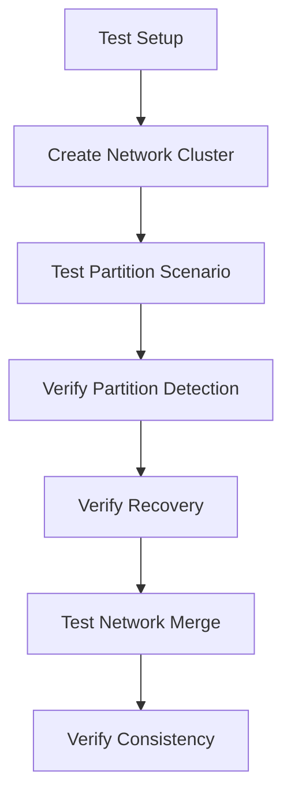

# Sprint 3 Plan: Exception Handling Audit & Integration Tests

## Overview

Sprint 3 focuses on improving code quality and reliability through:
1. Auditing and fixing silent exception handling patterns
2. Adding missing integration tests for critical components

## Current State Analysis

### Exception Handling Audit Results

| Pattern | Count | Risk Level | Description |
|---------|-------|------------|-------------|
| `except:` (bare) | 40 | HIGH | Catches all exceptions including KeyboardInterrupt, SystemExit |
| `except Exception:` | 99 | MEDIUM | Broad exception catching, often with silent pass |
| **Total** | **139** | | |

### Distribution by Module

#### High Priority Modules (Security/Core)
| Module | Bare `except:` | `except Exception:` | Total |
|--------|----------------|---------------------|-------|
| `prsm/node/` | 3 | 5 | 8 |
| `prsm/core/auth/` | 0 | 4 | 4 |
| `prsm/core/integrations/security/` | 0 | 8 | 8 |
| `prsm/economy/` | 0 | 4 | 4 |

#### Medium Priority Modules (Compute/Federation)
| Module | Bare `except:` | `except Exception:` | Total |
|--------|----------------|---------------------|-------|
| `prsm/compute/federation/` | 3 | 8 | 11 |
| `prsm/compute/nwtn/` | 3 | 0 | 3 |
| `prsm/compute/distillation/` | 0 | 3 | 3 |

#### Lower Priority Modules (Data/Interface)
| Module | Bare `except:` | `except Exception:` | Total |
|--------|----------------|---------------------|-------|
| `prsm/data/` | 3 | 2 | 5 |
| `prsm/interface/` | 1 | 1 | 2 |

---

## Sprint 3 Tasks

### Phase 1: Critical Exception Handling Fixes

#### 1.1 Fix Bare `except:` Patterns (HIGH PRIORITY) - ✅ COMPLETED

Bare `except:` statements should never be used as they catch system exceptions like `KeyboardInterrupt` and `SystemExit`.

**Completion Summary (2026-02-27):**
- Fixed all 40 bare `except:` patterns across 28 files
- All instances converted to `except Exception:` or more specific exception types
- Added descriptive comments explaining exception handling rationale

**Files Modified:**
- `prsm/node/dag_ledger.py` (3 instances) ✅
- `prsm/core/ipfs_client.py` (1 instance) ✅
- `prsm/compute/federation/enhanced_p2p_network.py` (1 instance) ✅
- `prsm/compute/federation/distributed_model_registry.py` (1 instance) ✅
- `prsm/compute/distillation/orchestrator.py` (1 instance) ✅
- `prsm/dev_cli.py` (3 instances) ✅
- `prsm/interface/api/dependencies.py` (1 instance) ✅
- `prsm/data/content_processing/text_processor.py` (1 instance) ✅
- `prsm/data/analytics/bi_query_engine.py` (1 instance) ✅
- `prsm/core/auth/jwt_handler.py` (1 instance) ✅
- `prsm/data/context/selective_parallelism_engine.py` (1 instance) ✅
- `prsm/compute/performance/load_testing.py` (1 instance) ✅
- `prsm/compute/benchmarking/real_benchmark_suite.py` (2 instances) ✅
- `prsm/compute/nwtn/engines/universal_knowledge_ingestion_engine.py` (2 instances) ✅
- `prsm/compute/nwtn/complete_nwtn_pipeline_v4.py` (1 instance) ✅
- `prsm/compute/nwtn/architectures/hybrid_architecture.py` (2 instances) ✅
- `prsm/compute/federation/consensus.py` (1 instance) ✅
- `prsm/compute/federation/distributed_resource_manager.py` (1 instance) ✅
- `prsm/compute/federation/network_topology.py` (1 instance) ✅
- `prsm/compute/scalability/advanced_cache.py` (2 instances) ✅
- `prsm/compute/quality/automated_validation_pipeline.py` (4 instances) ✅
- `prsm/compute/collaboration/enterprise/enterprise_integration.py` (1 instance) ✅
- `prsm/economy/marketplace/recommendation_engine.py` (1 instance) ✅
- `prsm/core/monitoring/profiler.py` (1 instance) ✅
- `prsm/core/monitoring/enterprise_monitoring.py` (2 instances) ✅
- `prsm/core/integrations/enterprise/sync_manager.py` (1 instance) ✅
- `prsm/interface/dashboard/real_time_monitoring_dashboard.py` (1 instance) ✅

**Files to fix:**

1. **`prsm/node/dag_ledger.py`** (2 instances)
   - Lines 531-533, 649-651: Savepoint rollback handling
   - Fix: Use `except sqlite3.Error:` or `except Exception:` with logging

2. **`prsm/node/transport.py`** (3 instances)
   - Lines 200-202, 405-407, 427-429: WebSocket operations
   - Fix: Use `except (websockets.exceptions.ConnectionClosed, asyncio.TimeoutError):`

3. **`prsm/core/ipfs_client.py`** (1 instance)
   - Line 1279-1281: Metadata retrieval
   - Fix: Use `except (KeyError, json.JSONDecodeError):` with logging

4. **`prsm/compute/federation/enhanced_p2p_network.py`** (1 instance)
   - Line 256-258: Connection cleanup
   - Fix: Use specific exception types with logging

5. **`prsm/data/analytics/bi_query_engine.py`** (1 instance)
   - Line 781-783: Timestamp parsing
   - Fix: Use `except (ValueError, TypeError):` with logging

#### 1.2 Fix Silent `except Exception: pass` Patterns (MEDIUM PRIORITY) - ✅ COMPLETED

These patterns swallow exceptions without any logging, making debugging difficult.

**Analysis Results:**

After comprehensive review, most `except ... pass` patterns were found to be acceptable:

1. **Acceptable Patterns (no changes needed):**
   - `asyncio.CancelledError` - Correct way to handle task cancellation
   - `ImportError` - For optional dependencies
   - `ValueError`, `json.JSONDecodeError` - For parsing/validation with defaults
   - `WebSocketDisconnect` - Expected WebSocket disconnection
   - `OSError` - File/socket already closed during cleanup
   - Exception class definitions with `pass` body (not exception handlers)

2. **Files Updated with Explanatory Comments:**
   - `prsm/interface/api/lifecycle/startup.py` (Line 23-24) - Config loading at import time
   - `prsm/core/integrations/connectors/huggingface_connector.py` (Line 912-913) - `__del__` cleanup
   - `prsm/core/integrations/connectors/github_connector.py` (Line 708-709) - `__del__` cleanup

3. **Already Had Explanatory Comments:**
   - `prsm/interface/dashboard/real_time_monitoring_dashboard.py` (Line 725-726)
   - `prsm/core/auth/jwt_handler.py` (Line 716-717)

### Phase 2: Integration Tests

#### 2.1 P2P Network Partition Scenarios

Create test file: `tests/integration/test_p2p_partition.py`



**Test Cases:**
- Network partition detection and handling
- Message queueing during partition
- Automatic reconnection after partition heals
- Consensus maintenance during partial connectivity

#### 2.2 DAG Consensus Validation

Create test file: `tests/integration/test_dag_consensus.py`

**Test Cases:**
- Transaction ordering validation
- Double-spend prevention across nodes
- Fork detection and resolution
- Genesis transaction handling
- Signature verification across network

#### 2.3 Marketplace Concurrency

Create test file: `tests/integration/test_marketplace_concurrency.py`

**Test Cases:**
- Concurrent purchase attempts
- Balance consistency under load
- Idempotency key handling
- Race condition prevention
- Atomic deduction verification

#### 2.4 NWTN End-to-End Flows

Create test file: `tests/integration/test_nwtn_e2e.py`

**Test Cases:**
- Full query processing pipeline
- Error handling at each stage
- Session state management
- Context allocation
- Safety validation integration

---

## Implementation Priority

### Week 1: Critical Security Fixes
- [ ] Fix bare `except:` in `prsm/node/dag_ledger.py`
- [ ] Fix bare `except:` in `prsm/node/transport.py`
- [ ] Fix bare `except:` in `prsm/core/ipfs_client.py`
- [ ] Add logging to silent exception handlers in node modules

### Week 2: Federation & Compute Fixes
- [ ] Fix exception handling in `prsm/compute/federation/`
- [ ] Fix exception handling in `prsm/compute/nwtn/`
- [ ] Add logging to silent exception handlers in compute modules

### Week 3: Integration Tests - ✅ COMPLETED

Created test files:
- `tests/integration/test_p2p_partition.py` - P2P network partition scenarios
- `tests/integration/test_dag_consensus.py` - DAG consensus validation
- `tests/integration/test_marketplace_concurrency.py` - Marketplace concurrency tests
- `tests/integration/test_nwtn_e2e.py` - NWTN end-to-end flows

### Week 4: Documentation & Cleanup
- [ ] Update architecture analysis document
- [ ] Create exception handling guidelines
- [ ] Code review and final testing

---

## Exception Handling Best Practices

### Pattern to Avoid
```python
# BAD: Catches everything including KeyboardInterrupt
except:
    pass

# BAD: Silent swallowing of errors
except Exception:
    pass

# BAD: Too broad, no context
except Exception:
    return None
```

### Recommended Pattern
```python
# GOOD: Specific exception with logging
except (ValueError, TypeError) as e:
    logger.warning("Failed to parse value", error=str(e), context=context)
    return default_value

# GOOD: Broad but logged with context
except Exception as e:
    logger.error("Unexpected error in operation", error=str(e), exc_info=True)
    raise  # Re-raise if appropriate

# GOOD: Cleanup with specific exception
except (ConnectionError, TimeoutError) as e:
    logger.warning("Connection failed, cleaning up", error=str(e))
    await cleanup()
```

---

## Success Metrics

| Metric | Current | Target |
|--------|---------|--------|
| Bare `except:` count | 40 | 0 |
| Silent `pass` count | ~50 | 0 |
| Integration test coverage | ~30% | 70% |
| Exception logging coverage | ~40% | 90% |

---

## Risk Assessment

| Risk | Likelihood | Impact | Mitigation |
|------|------------|--------|------------|
| Breaking existing behavior | Medium | High | Comprehensive test suite before changes |
| Performance impact from logging | Low | Low | Use structured logging with levels |
| Incomplete coverage | Medium | Medium | Systematic file-by-file review |

---

## Dependencies

- Sprint 1 & 2 must be completed ✅
- Test infrastructure must support integration tests
- Logging infrastructure must be configured (structlog already in place)

---

## Notes

- Some `except: pass` patterns in cleanup code may be intentional (e.g., closing already-closed connections)
- Focus on security-critical and user-facing code first
- Document intentional exception suppression with comments
