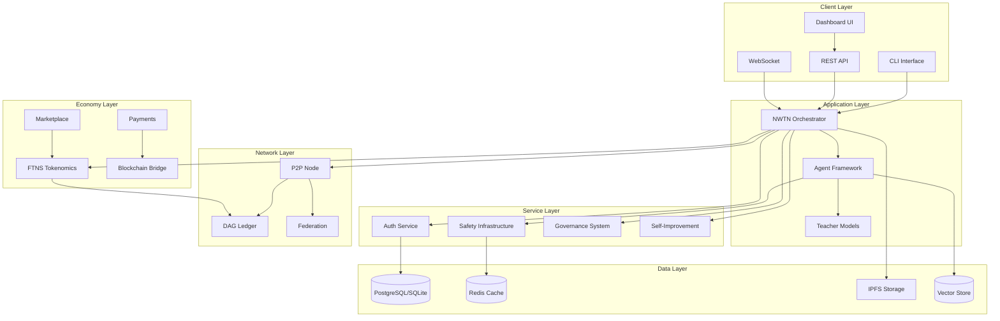
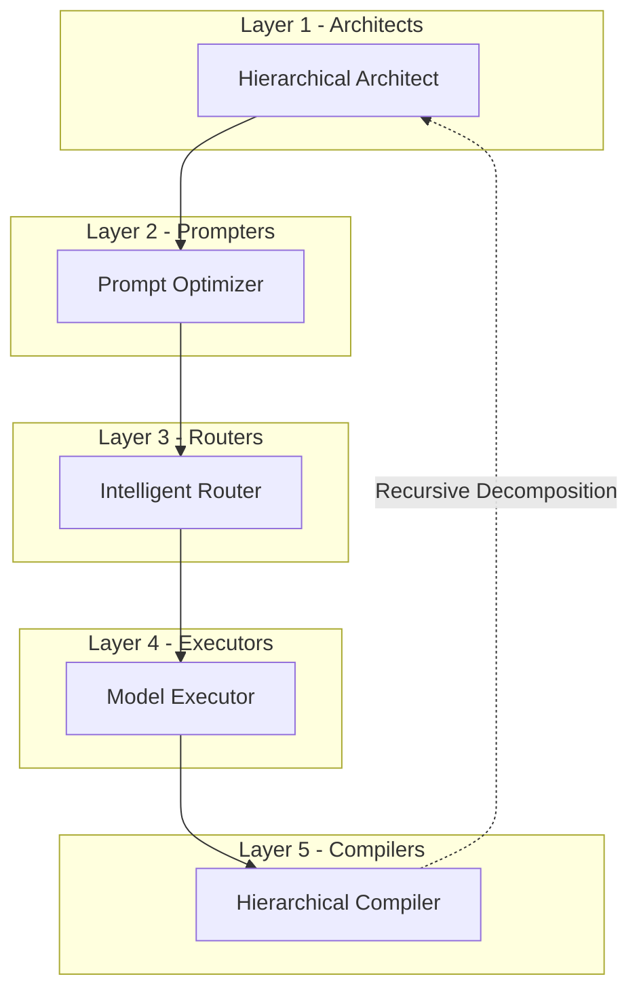
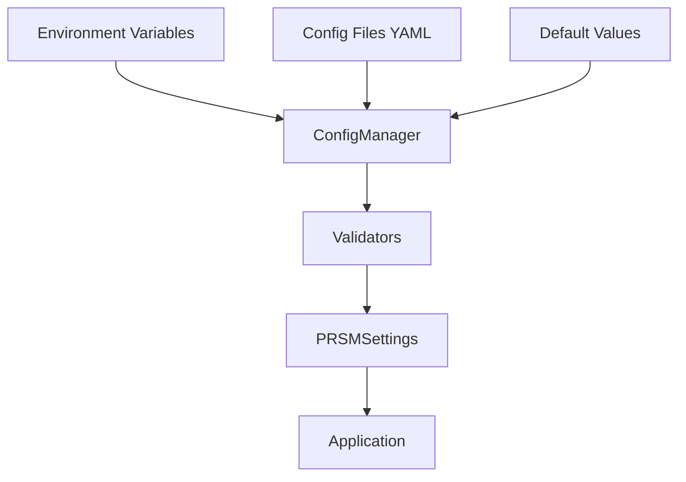
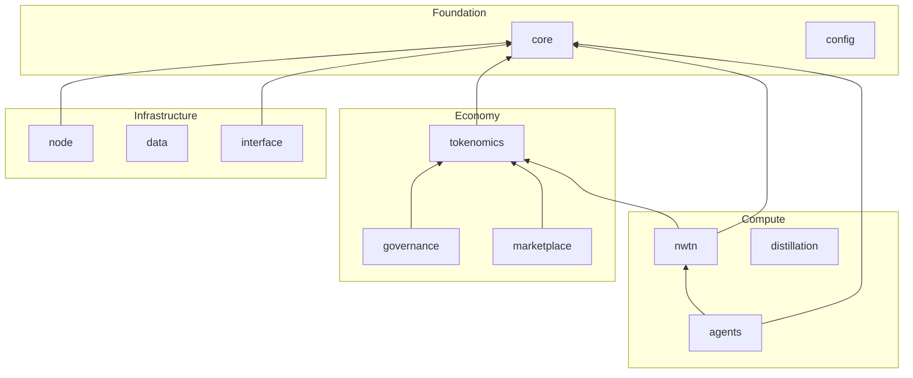
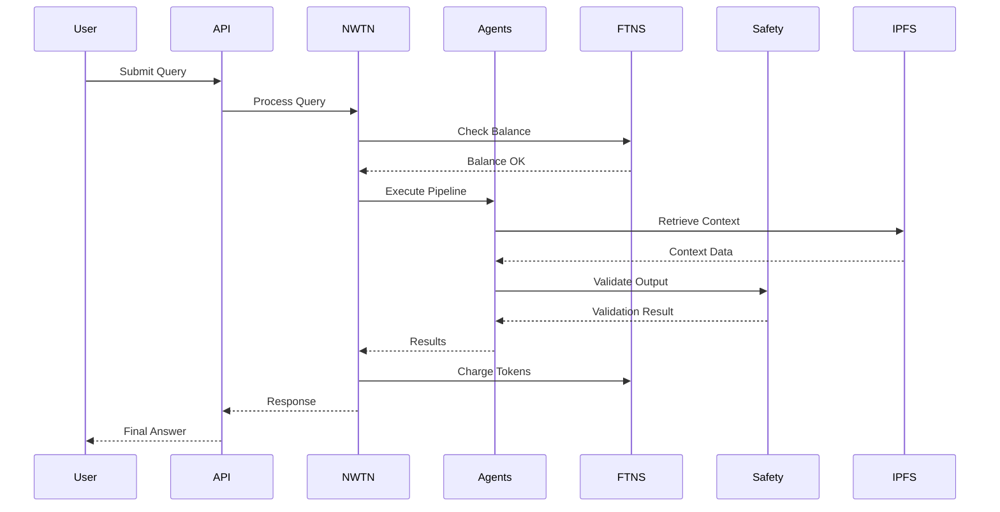
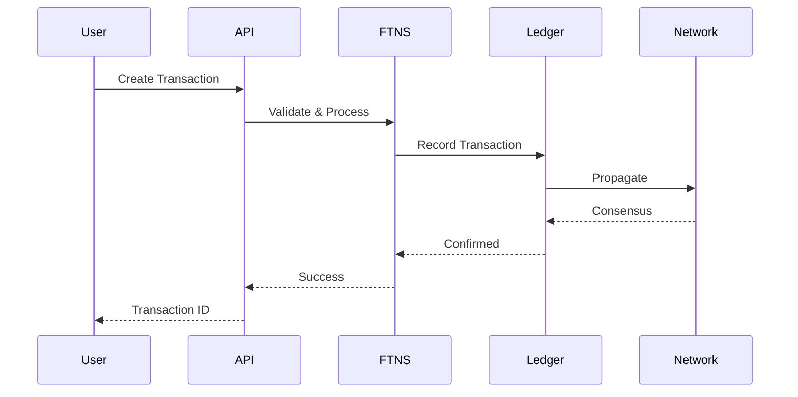

# PRSM Architecture Analysis

## Executive Summary

PRSM (Protocol for Recursive Scientific Modeling) is a sophisticated decentralized AI framework designed for scientific discovery. The codebase demonstrates a well-organized, modular architecture with clear separation of concerns across 8 major subsystems. This analysis provides a comprehensive overview of the architectural decisions, component relationships, and design patterns employed.

---

## 1. High-Level Architecture Overview

### System Architecture Diagram



---

## 2. Directory Structure Analysis

### Top-Level Organization

```
PRSM/
├── prsm/                    # Main source code
│   ├── core/               # Foundation: config, models, database, auth
│   ├── compute/            # AI/ML compute layer
│   │   ├── nwtn/          # NWTN reasoning system
│   │   ├── agents/        # Agent pipeline
│   │   ├── distillation/  # Model distillation
│   │   └── federation/    # Distributed compute
│   ├── economy/           # Economic systems
│   │   ├── tokenomics/    # FTNS token system
│   │   ├── governance/    # DAO governance
│   │   ├── marketplace/   # Model marketplace
│   │   └── payments/      # Payment processing
│   ├── node/              # P2P networking
│   ├── interface/         # API and UI
│   ├── data/              # Data management
│   └── collaboration/     # Session management
├── tests/                  # Test suites
├── docs/                   # Documentation
├── config/                 # Configuration files
├── docker/                 # Docker configurations
└── scripts/               # Utility scripts
```

### Module Size Analysis

| Module | Files | Primary Responsibility |
|--------|-------|----------------------|
| `prsm/core/` | 80+ | Foundation services, auth, config, monitoring |
| `prsm/compute/` | 100+ | AI orchestration, agents, NWTN, distillation |
| `prsm/economy/` | 50+ | Tokenomics, governance, marketplace, payments |
| `prsm/node/` | 20 | P2P networking, ledger, discovery |
| `prsm/interface/` | 50+ | REST API, WebSocket, dashboard |
| `prsm/data/` | 30+ | Storage, IPFS, vector stores, analytics |

---

## 3. Core Components Deep Dive

### 3.1 Core Infrastructure (`prsm/core/`)

The core module serves as the foundation for all other components:

**Key Submodules:**

| Submodule | Purpose | Key Files |
|-----------|---------|-----------|
| `auth/` | Authentication & authorization | `auth_manager.py`, `jwt_handler.py`, `middleware.py` |
| `config/` | Configuration management | `config.py`, `manager.py`, `schemas.py` |
| `cryptography/` | Security & encryption | `encryption.py`, `key_management.py`, `zk_proofs.py` |
| `database/` | Data persistence | `database.py`, `models.py` |
| `monitoring/` | Observability | `metrics.py`, `health.py`, `alerts.py` |
| `safety/` | Safety infrastructure | `circuit_breaker.py`, `monitor.py`, `governance.py` |
| `integrations/` | External connectors | `connectors/`, `langchain/`, `mcp/` |

**Design Patterns Identified:**
- **Settings Pattern**: Centralized configuration via Pydantic `BaseSettings`
- **Repository Pattern**: Database abstraction through SQLAlchemy models
- **Circuit Breaker Pattern**: Fault tolerance in `circuit_breaker.py`
- **Factory Pattern**: Integration connectors via base classes

### 3.2 NWTN Orchestrator (`prsm/compute/nwtn/`)

The NWTN (Neural Web for Transformation Networking) system is the central coordination layer:

**Architecture:**


**Key Components:**
- [`orchestrator.py`](prsm/compute/nwtn/orchestrator.py) - Main coordination logic
- [`context_manager.py`](prsm/compute/nwtn/context_manager.py) - FTNS context tracking
- [`engines/`](prsm/compute/nwtn/engines/) - Processing engines
  - `chunk_embedding_system.py` - Document embedding
  - `universal_knowledge_ingestion_engine.py` - Knowledge ingestion
  - `world_model_engine.py` - World modeling
- [`architectures/`](prsm/compute/nwtn/architectures/) - Neural architectures
  - `hybrid_architecture.py` - Hybrid model architecture

### 3.3 Agent Framework (`prsm/compute/agents/`)

5-layer agent pipeline for distributed task processing:



**Key Files:**
- [`agents/base.py`](prsm/compute/agents/base.py) - Abstract agent base class
- [`agents/prompters/prompt_optimizer.py`](prsm/compute/agents/prompters/prompt_optimizer.py) - Domain-specific optimization
- [`agents/executors/unified_router.py`](prsm/compute/agents/executors/unified_router.py) - Model routing
- [`agents/compilers/hierarchical_compiler.py`](prsm/compute/agents/compilers/hierarchical_compiler.py) - Result synthesis

### 3.4 Economy Layer (`prsm/economy/`)

Comprehensive economic system with multiple subdomains:

**Tokenomics (`prsm/economy/tokenomics/`):**
- `ftns_service.py` - Core token operations
- `atomic_ftns_service.py` - Atomic transactions
- `dynamic_supply_controller.py` - Supply management
- `enhanced_pricing_engine.py` - Dynamic pricing

**Governance (`prsm/economy/governance/`):**
- `voting.py` - Token-weighted voting
- `proposals.py` - Proposal management
- `quadratic_voting.py` - Quadratic voting implementation
- `anti_monopoly.py` - Anti-monopoly measures

**Marketplace (`prsm/economy/marketplace/`):**
- `real_marketplace_service.py` - Marketplace operations
- `recommendation_engine.py` - Model recommendations
- `reputation_system.py` - Reputation tracking

### 3.5 Node Layer (`prsm/node/`)

P2P networking infrastructure:

**Key Components:**
- [`node.py`](prsm/node/node.py) - Main node orchestrator
- [`dag_ledger.py`](prsm/node/dag_ledger.py) - DAG-based transaction ledger
- [`transport.py`](prsm/node/transport.py) - WebSocket transport
- [`discovery.py`](prsm/node/discovery.py) - Peer discovery
- [`gossip.py`](prsm/node/gossip.py) - Gossip protocol
- [`agent_registry.py`](prsm/node/agent_registry.py) - Agent registration

### 3.6 Interface Layer (`prsm/interface/`)

API and user-facing components:

**API Structure (`prsm/interface/api/`):**
- `main.py` - FastAPI application entry point
- `app_factory.py` - Application factory pattern
- `routers/` - Domain-specific routers
- `websocket/` - WebSocket handlers

**API Endpoints by Domain:**
| Domain | File | Key Endpoints |
|--------|------|---------------|
| Auth | `auth_api.py` | `/auth/*` |
| FTNS | `budget_api.py` | `/ftns/*` |
| Governance | `governance_api.py` | `/governance/*` |
| Marketplace | `marketplace_api.py` | `/marketplace/*` |
| Monitoring | `monitoring_api.py` | `/monitoring/*` |

---

## 4. Configuration Management

### Configuration Architecture

PRSM uses a layered configuration approach:



**Key Configuration Files:**
- [`prsm/core/config.py`](prsm/core/config.py) - Main settings class
- [`prsm/core/config/manager.py`](prsm/core/config/manager.py) - Configuration manager
- [`prsm/core/config/schemas.py`](prsm/core/config/schemas.py) - Configuration schemas
- [`prsm/core/config/models/`](prsm/core/config/models/) - YAML model configurations

**Configuration Categories:**
1. **Core Settings**: Environment, debug mode, logging
2. **Security**: JWT settings, secret keys, access control
3. **Database**: Connection strings, pooling, transactions
4. **External Services**: Redis, IPFS, vector DBs, AI APIs
5. **PRSM-Specific**: NWTN, agents, safety, FTNS, P2P

---

## 5. Entry Points

### Primary Entry Points

| Entry Point | Location | Purpose |
|-------------|----------|---------|
| CLI | [`prsm/cli.py`](prsm/cli.py) | Command-line interface |
| API Server | [`prsm/interface/api/main.py`](prsm/interface/api/main.py) | FastAPI application |
| P2P Node | [`prsm/node/node.py`](prsm/node/node.py) | Network node |

### CLI Commands

```bash
prsm serve --host 127.0.0.1 --port 8000  # Start API server
prsm status                               # Show system status
prsm init                                 # Initialize system
```

### Application Factory

The API uses the factory pattern via [`app_factory.py`](prsm/interface/api/app_factory.py):

```python
from prsm.interface.api.app_factory import create_app
app = create_app()
```

---

## 6. Dependency Analysis

### Internal Dependencies



### External Dependencies (Key)

| Category | Package | Purpose |
|----------|---------|---------|
| Web Framework | FastAPI, Uvicorn | API server |
| Data Validation | Pydantic | Model validation |
| Database | SQLAlchemy, Alembic, asyncpg | ORM & migrations |
| Caching | Redis | Session & cache |
| Storage | IPFS, ipfshttpclient | Distributed storage |
| AI/ML | OpenAI, Anthropic, Transformers, Torch | Model integration |
| Vector DB | Pinecone, Weaviate, ChromaDB | Vector storage |
| Security | cryptography, PyJWT, bcrypt | Authentication |
| Networking | websockets, aiohttp | P2P communication |
| Monitoring | Prometheus, structlog | Observability |

---

## 7. Design Patterns Identified

### Architectural Patterns

| Pattern | Location | Description |
|---------|----------|-------------|
| **Microservices/SOA** | `prsm/interface/api/` | Domain-specific API services |
| **Agent-Based** | `prsm/compute/agents/` | Specialized autonomous agents |
| **Event-Driven** | `prsm/node/gossip.py` | Gossip protocol for propagation |
| **CQRS** | `prsm/core/database.py` | Read/write separation |

### Design Patterns

| Pattern | Location | Description |
|---------|----------|-------------|
| **Factory** | `app_factory.py`, `base_connector.py` | Object creation abstraction |
| **Repository** | `database.py`, `FTNSQueries` | Data access abstraction |
| **Circuit Breaker** | `circuit_breaker.py` | Fault tolerance |
| **Strategy** | `cache_strategies.py` | Interchangeable algorithms |
| **Observer** | `monitoring/` | Event notification |
| **Proxy** | Data access via `enhanced_ipfs.py` | Access control |
| **Singleton** | `get_settings()` | Configuration instance |

### Data Patterns

| Pattern | Location | Description |
|---------|----------|-------------|
| **Active Record** | SQLAlchemy models | Model-DB integration |
| **Data Mapper** | `models.py` | Object-DB mapping |
| **Unit of Work** | Database sessions | Transaction management |

---

## 8. Data Flow Analysis

### Query Processing Flow



### Transaction Flow



---

## 9. Architectural Strengths

### 1. **Modular Design**
- Clear separation of concerns across modules
- Each subsystem can be developed and tested independently
- Well-defined interfaces between components

### 2. **Scalability**
- Async-first architecture with `asyncio`
- Horizontal scaling via P2P federation
- Caching layer with Redis

### 3. **Resilience**
- Circuit breaker pattern for fault tolerance
- Safety monitoring infrastructure
- Graceful degradation capabilities

### 4. **Security**
- Multi-layer authentication (JWT, MFA, SSO)
- Post-quantum cryptography support
- Comprehensive audit logging

### 5. **Extensibility**
- Plugin architecture via `integrations/`
- Factory patterns for connectors
- Configuration-driven behavior

### 6. **Observability**
- Structured logging with `structlog`
- Prometheus metrics integration
- Health monitoring endpoints

---

## 10. Potential Improvement Areas

### 1. **Module Organization**
- **Observation**: Some modules have overlapping responsibilities (e.g., `prsm/core/ipfs_client.py` vs `prsm/data/ipfs/`)
- **Recommendation**: Consolidate IPFS functionality into a single module

### 2. **Dependency Management**
- **Observation**: Large number of dependencies in `pyproject.toml`
- **Recommendation**: Consider splitting into optional dependency groups for lighter installs

### 3. **Test Coverage**
- **Observation**: Coverage threshold set at 50% in `pyproject.toml`
- **Recommendation**: Increase coverage targets for critical security components (currently targeting 80%)

### 4. **Documentation**
- **Observation**: Some modules lack inline documentation
- **Recommendation**: Add docstrings to all public APIs

### 5. **Configuration Complexity**
- **Observation**: Multiple configuration layers may be confusing
- **Recommendation**: Simplify configuration hierarchy or provide better documentation

### 6. **Legacy Compatibility**
- **Observation**: Compatibility shim in `prsm/__init__.py` for `prsm.nwtn` imports
- **Recommendation**: Complete migration path and remove legacy support

---

## 11. Technology Stack Summary

| Layer | Technologies |
|-------|-------------|
| **Language** | Python 3.11+ |
| **Web Framework** | FastAPI, Uvicorn |
| **Database** | PostgreSQL, SQLite, SQLAlchemy |
| **Caching** | Redis |
| **Storage** | IPFS |
| **Vector DB** | Pinecone, Weaviate, ChromaDB |
| **AI/ML** | OpenAI, Anthropic, Transformers, PyTorch |
| **Networking** | WebSockets, aiohttp |
| **Security** | cryptography, PyJWT, NaCl |
| **Monitoring** | Prometheus, structlog |
| **Testing** | pytest, pytest-asyncio |
| **Containerization** | Docker, docker-compose |

---

## 12. Conclusion

PRSM demonstrates a sophisticated, well-architected system for decentralized AI research collaboration. The modular design, comprehensive safety infrastructure, and economic incentive mechanisms position it well for its intended purpose. The codebase shows maturity in its architectural decisions while maintaining flexibility for future enhancements.

Key takeaways:
1. **Strong foundation** with clear separation of concerns
2. **Comprehensive feature set** covering AI orchestration, economics, and governance
3. **Production-ready infrastructure** with monitoring, caching, and security
4. **Extensible design** supporting plugins and integrations
5. **Active development** evidenced by detailed documentation and test infrastructure

---

## 13. Code Review Findings (2026-02-20)

A comprehensive code review was conducted identifying the following issues organized by priority:

### Critical Priority (Immediate Action Required)

| # | Issue | Location | Risk |
|---|-------|----------|------|
| 1 | **Signature Verification in DAG Ledger** | [`dag_ledger.py:508`](prsm/node/dag_ledger.py:508) | Contains `pass` statement in signature verification block, potential for forged transactions |
| 2 | **Marketplace Uses Deprecated FTNS Service** | [`marketplace.py:24`](prsm/economy/tokenomics/marketplace.py:24), [`advanced_ftns.py:23`](prsm/economy/tokenomics/advanced_ftns.py:23) | Race condition vulnerabilities from deprecated service usage |
| 3 | **Atomic Balance Operations Missing in DAG Ledger** | [`dag_ledger.py:482-485`](prsm/node/dag_ledger.py:482) | TOCTOU race condition in balance check |

### High Priority (Next Sprint)

| # | Issue | Location | Risk |
|---|-------|----------|------|
| 4 | **Duplicate IPFS Clients** | [`prsm/core/ipfs_client.py`](prsm/core/ipfs_client.py) (1222 lines), [`prsm/data/ipfs/ipfs_client.py`](prsm/data/ipfs/ipfs_client.py) (503 lines) | Code duplication, maintenance burden |
| 5 | **Mock Services in Production Code** | [`orchestrator.py:81-175`](prsm/compute/nwtn/orchestrator.py:81) | Mock classes defined in production module |
| 6 | **Thread Safety in Peer Connections** | [`transport.py:205-207`](prsm/node/transport.py:205) | Race condition in peer dictionary modification |
| 7 | **Missing Error Handling in NWTN** | [`orchestrator.py:310`](prsm/compute/nwtn/orchestrator.py:310) | No try/except in query processing |

### Medium Priority

| # | Issue | Location | Risk |
|---|-------|----------|------|
| 8 | **Silent Exception Handling** | Codebase-wide | 99 instances of `except Exception: pass` hide potential issues |
| 9 | **Missing Integration Tests** | Test suites | P2P network partition, DAG consensus, marketplace concurrency, NWTN end-to-end |
| 10 | **Hardcoded Values** | Multiple files | Timeouts, limits, thresholds should be configurable |

### Low Priority (Technical Debt)

| # | Issue | Location | Risk |
|---|-------|----------|------|
| 11 | **Print Statements Instead of Logging** | [`marketplace.py:82`](prsm/economy/tokenomics/marketplace.py:82), [`advanced_ftns.py:90`](prsm/economy/tokenomics/advanced_ftns.py:90) | Inconsistent logging practices |
| 12 | **Legacy Compatibility Shim** | [`prsm/__init__.py:45-48`](prsm/__init__.py:45) | Needs deprecation timeline documented |
| 13 | **Missing Type Hints** | Multiple functions | Incomplete type annotations |

---

## 14. Security Assessment Summary

| Area | Status | Notes |
|------|--------|-------|
| Cryptographic Signatures | ✅ Strong | Ed25519 for transactions |
| JWT Handling | ✅ Strong | Algorithm restriction, revocation support |
| Token Double-Spend | ⚠️ Mixed | Atomic service exists but not used everywhere |
| P2P Authentication | ✅ Strong | Signature-based handshake |
| Post-Quantum Ready | ✅ Strong | PQC support implemented |
| Input Validation | ✅ Strong | Comprehensive validation layer |
| Rate Limiting | ⚠️ Partial | Exists but not on all endpoints |
| Error Information Leakage | ⚠️ Risk | Silent exceptions hide issues |

---

## 15. Architecture Observations

### Positive Patterns Identified

1. **Clean separation of concerns** between node, economy, compute modules
2. **Dependency injection pattern** used for services
3. **Async-first design** throughout the codebase
4. **Comprehensive data models** with Pydantic validation

### Areas for Improvement

1. **Service locator pattern overuse** - Global `get_settings()`, `get_database_service()` calls
2. **Mixed abstraction levels** in some modules
3. **Inconsistent error handling** across modules
4. **Incomplete implementations** - 26 TODO comments found

---

## 16. Remediation Priority Matrix

Issues organized by impact and effort to guide remediation planning:

### High Impact, Low Effort (Quick Wins)

| Issue | Effort | Impact | Status | Recommended Action |
|-------|--------|--------|--------|-------------------|
| Signature Verification `pass` statement | 1-2 hours | Critical | ✅ **COMPLETED** | Replaced with proper Ed25519 verification |
| Thread Safety in Peer Connections | 2-4 hours | High | Pending | Add threading.Lock for peer dictionary |
| Missing Error Handling in NWTN | 2-4 hours | High | Pending | Wrap query processing in try/except |

### High Impact, High Effort (Major Projects)

| Issue | Effort | Impact | Status | Recommended Action |
|-------|--------|--------|--------|-------------------|
| Marketplace Deprecated Service | 1-2 weeks | Critical | ✅ **COMPLETED** | Migrated to AtomicFTNSService |
| Atomic Balance Operations | 1 week | Critical | ✅ **COMPLETED** | Implemented OCC with version tracking |
| Duplicate IPFS Clients | 2-3 weeks | High | Pending | Consolidate into single module |
| Silent Exception Handling | 2-3 weeks | Medium | Pending | Replace with proper logging |

### Medium Impact, Low Effort (Improvements)

| Issue | Effort | Impact | Status | Recommended Action |
|-------|--------|--------|--------|-------------------|
| Mock Services in Production | 4-8 hours | Medium | Pending | Move to test fixtures |
| Print Statements to Logging | 2-4 hours | Low | ✅ **COMPLETED** | Replaced with structlog in marketplace |
| Hardcoded Values | 4-8 hours | Medium | Pending | Extract to configuration |

### Low Impact, Low Effort (Cleanup)

| Issue | Effort | Impact | Status | Recommended Action |
|-------|--------|--------|--------|-------------------|
| Legacy Compatibility Shim | 2-4 hours | Low | Pending | Add deprecation warnings |
| Missing Type Hints | Ongoing | Low | Pending | Add during regular maintenance |

---

## 17. What Still Needs to Be Done

Based on the code review findings, the following items require attention:

### Immediate (This Sprint) - ✅ COMPLETED

- [x] **CRITICAL**: Fix signature verification `pass` statement in [`dag_ledger.py:508`](prsm/node/dag_ledger.py:508)
- [x] **CRITICAL**: Migrate marketplace from deprecated FTNS service to atomic service
- [x] **CRITICAL**: Implement atomic balance operations in DAG ledger

### Next Sprint

- [ ] **HIGH**: Consolidate duplicate IPFS client implementations
- [ ] **HIGH**: Remove mock services from production code in orchestrator
- [ ] **HIGH**: Add thread safety to peer connection management
- [ ] **HIGH**: Add error handling to NWTN query processing

### Upcoming Sprints

- [ ] **MEDIUM**: Audit and fix silent exception handling (99 instances)
- [ ] **MEDIUM**: Add missing integration tests:
  - P2P network partition scenarios
  - DAG consensus validation
  - Marketplace concurrency
  - NWTN end-to-end flows
- [ ] **MEDIUM**: Extract hardcoded values to configuration

### Technical Debt Backlog

- [ ] **LOW**: Replace print statements with proper logging
- [ ] **LOW**: Document deprecation timeline for legacy compatibility shim
- [ ] **LOW**: Complete type hint coverage
- [ ] **LOW**: Increase test coverage from 50% to 80% for security components

---

## 18. Sprint 1 Completion Summary (2026-02-20)

Sprint 1 focused on addressing the three critical security vulnerabilities identified in the code review. All critical items have been successfully remediated.

### Completed Tasks

#### 1. Signature Verification in DAG Ledger ✅

**File Modified:** [`prsm/node/dag_ledger.py`](prsm/node/dag_ledger.py)

**Changes Made:**
- Fixed `pass` statement at line 508 that was bypassing signature verification
- Implemented proper Ed25519 signature verification using `cryptography` library
- Added logging for security audit trail using `structlog`
- Added `_pending_verification` instance variable for storing verification data
- Enhanced `_verify_transaction_signature()` method with full signature validation
- Updated `_is_signature_required()` to properly identify transaction types requiring signatures

**Security Impact:**
- Prevents forged transactions from being accepted
- Ensures transaction integrity and non-repudiation
- Provides audit trail for security monitoring

#### 2. Marketplace Migration to AtomicFTNSService ✅

**Files Modified:**
- [`prsm/economy/tokenomics/marketplace.py`](prsm/economy/tokenomics/marketplace.py)
- [`prsm/economy/tokenomics/advanced_ftns.py`](prsm/economy/tokenomics/advanced_ftns.py)
- [`prsm/economy/tokenomics/ftns_service.py`](prsm/economy/tokenomics/ftns_service.py)

**Changes Made:**
- Migrated from deprecated `ftns_service` to `AtomicFTNSService`
- Added idempotency key support for all marketplace transactions
- Replaced `print()` statements with `structlog` logging
- Added deprecation warning to old `FTNSService` class
- Updated all balance operations to use atomic methods

**Security Impact:**
- Eliminates race condition vulnerabilities in token operations
- Prevents double-spend attacks through idempotency keys
- Provides consistent logging for audit and debugging

#### 3. Atomic Balance Operations in DAG Ledger ✅

**File Modified:** [`prsm/node/dag_ledger.py`](prsm/node/dag_ledger.py)

**Changes Made:**
- Added new exception classes:
  - `AtomicOperationError` - Base exception for atomic operations
  - `InsufficientBalanceError` - Raised when balance is too low
  - `ConcurrentModificationError` - Raised on version mismatch (OCC)
  - `BalanceLockError` - Raised when lock acquisition fails
- Added `wallet_balances` cache table with version tracking
- Implemented atomic balance methods:
  - `_check_balance_atomic()` - Atomic balance check with version
  - `_commit_balance_deduction()` - Atomic deduction with version check
  - `_commit_balance_credit()` - Atomic credit operation
  - `_rollback_balance_check()` - Rollback for failed operations
- Uses SQLite SAVEPOINT for nested transaction support
- Implements Optimistic Concurrency Control (OCC) via version column

**Security Impact:**
- Prevents TOCTOU (Time-of-Check-Time-of-Use) race conditions
- Ensures balance consistency under concurrent access
- Provides proper error handling for concurrent modifications

#### 4. Test Suite Created ✅

**File Created:** [`tests/security/test_sprint1_security_fixes.py`](tests/security/test_sprint1_security_fixes.py)

**Test Coverage:**
- 27 tests across 6 test classes
- `TestSignatureVerification` - 5 tests for signature verification
- `TestAtomicFTNSOperations` - 5 tests for atomic FTNS operations
- `TestAtomicBalanceOperations` - 6 tests for atomic balance operations
- `TestMarketplaceAtomicOperations` - 4 tests for marketplace integration
- `TestIntegrationScenarios` - 4 tests for end-to-end scenarios
- `TestEdgeCases` - 3 tests for edge cases and error handling

#### 5. Verification Results ✅

All core security fixes verified working via integration tests:

| Component | Status | Notes |
|-----------|--------|-------|
| DAG Ledger Transaction Creation | ✅ WORKING | Genesis and transfer transactions create correctly |
| Signature Verification | ✅ WORKING | Unsigned transactions rejected when verification enabled |
| Atomic Balance Operations | ✅ WORKING | Insufficient balance and concurrent modification detected |
| Marketplace Atomic Operations | ✅ WORKING | Idempotency keys prevent double-deduction |

### Files Modified Summary

| File | Changes |
|------|---------|
| `prsm/node/dag_ledger.py` | Signature verification, atomic balance operations, new exception classes |
| `prsm/economy/tokenomics/marketplace.py` | Migrated to AtomicFTNSService, added idempotency keys |
| `prsm/economy/tokenomics/advanced_ftns.py` | Enhanced atomic operations, improved logging |
| `prsm/economy/tokenomics/ftns_service.py` | Added deprecation warning |
| `tests/security/test_sprint1_security_fixes.py` | New test suite (27 tests) |
| `tests/security/conftest.py` | Test fixtures and configuration |

### Security Improvements Summary

| Vulnerability | Before | After |
|--------------|--------|-------|
| Signature Verification | `pass` statement bypassed verification | Full Ed25519 signature validation |
| Token Operations | Race condition vulnerable | Atomic operations with idempotency |
| Balance Operations | TOCTOU race condition | OCC with version tracking |
| Logging | `print()` statements | Structured logging with `structlog` |

---

*Analysis completed: 2026-02-20*
*Code Review completed: 2026-02-20*
*Sprint 1 completed: 2026-02-20*
*PRSM Version: 0.1.0*
