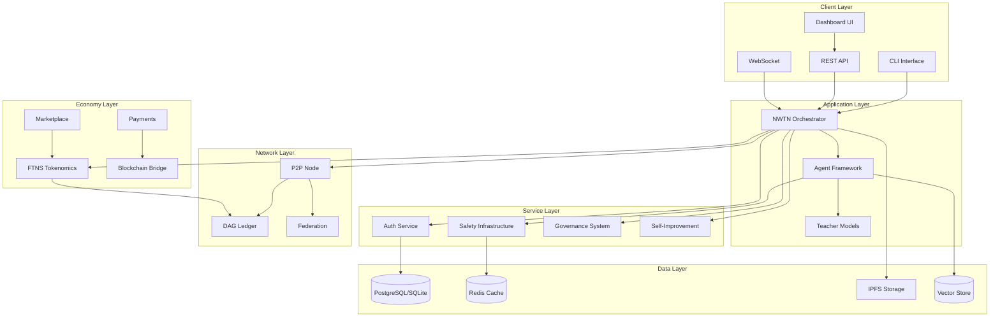
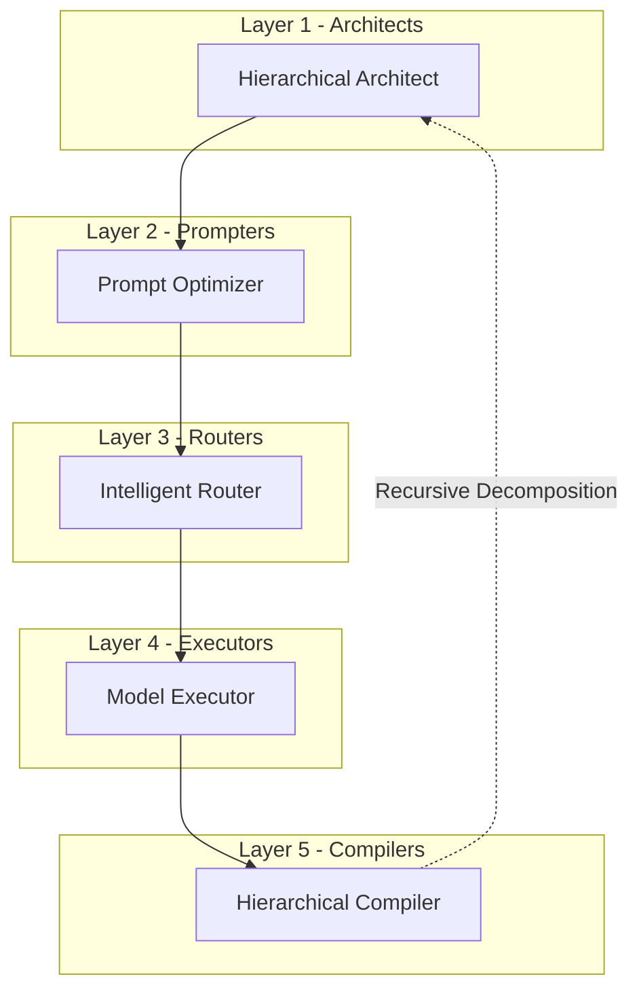
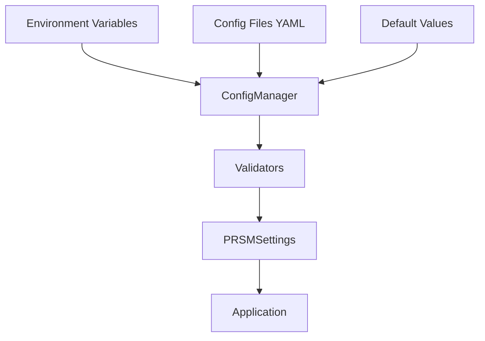
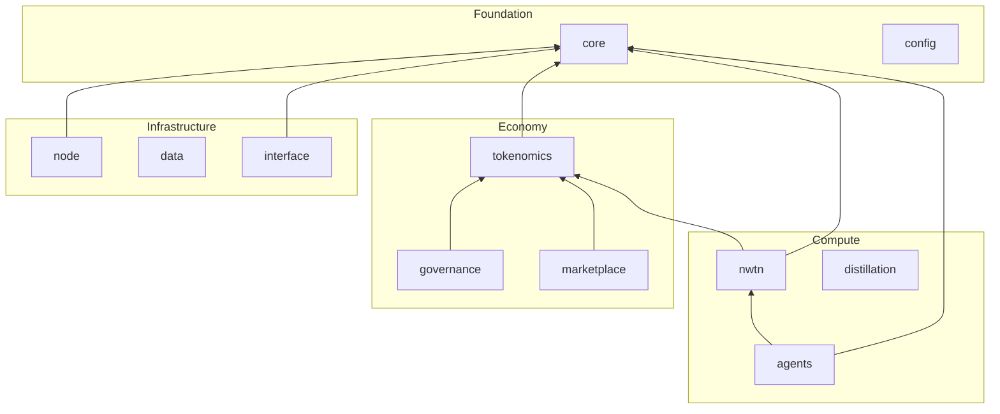
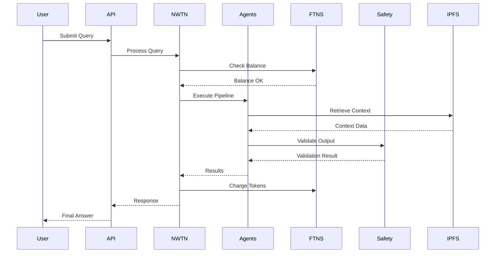
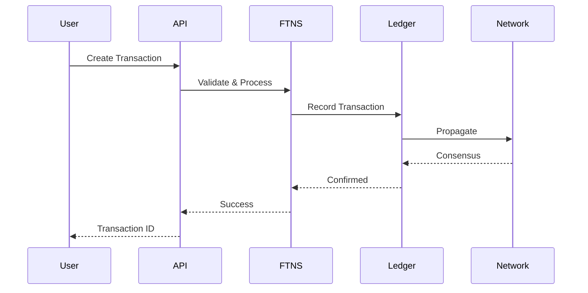

# PRSM Architecture Analysis

## Executive Summary

PRSM (Protocol for Recursive Scientific Modeling) is a sophisticated decentralized AI framework designed for scientific discovery. The codebase demonstrates a well-organized, modular architecture with clear separation of concerns across 8 major subsystems. This analysis provides a comprehensive overview of the architectural decisions, component relationships, and design patterns employed.

---

## 1. High-Level Architecture Overview

### System Architecture Diagram


```mermaid
graph TB
    subgraph Client Layer
        CLI[CLI Interface]
        API[REST API]
        WS[WebSocket]
        DASH[Dashboard UI]
    end

    subgraph Application Layer
        NWTN[NWTN Orchestrator]
        AGENTS[Agent Framework]
        TEACHERS[Teacher Models]
    end

    subgraph Service Layer
        AUTH[Auth Service]
        SAFETY[Safety Infrastructure]
        GOV[Governance System]
        IMPROVE[Self-Improvement]
    end

    subgraph Data Layer
        DB[(PostgreSQL/SQLite)]
        REDIS[(Redis Cache)]
        IPFS[IPFS Storage]
        VECTOR[(Vector Store)]
    end

    subgraph Network Layer
        NODE[P2P Node]
        LEDGER[DAG Ledger]
        FEDERATION[Federation]
    end

    subgraph Economy Layer
        FTNS[FTNS Tokenomics]
        MARKET[Marketplace]
        PAY[Payments]
        BLOCK[Blockchain Bridge]
    end

    CLI --> NWTN
    API --> NWTN
    WS --> NWTN
    DASH --> API

    NWTN --> AGENTS
    NWTN --> FTNS
    AGENTS --> TEACHERS
    
    NWTN --> AUTH
    AGENTS --> SAFETY
    NWTN --> GOV
    NWTN --> IMPROVE

    AUTH --> DB
    SAFETY --> REDIS
    NWTN --> IPFS
    AGENTS --> VECTOR

    NWTN --> NODE
    NODE --> LEDGER
    NODE --> FEDERATION

    FTNS --> LEDGER
    MARKET --> FTNS
    PAY --> BLOCK
```

---

## 2. Directory Structure Analysis

### Top-Level Organization

```
PRSM/
├── prsm/                    # Main source code
│   ├── core/               # Foundation: config, models, database, auth
│   ├── compute/            # AI/ML compute layer
│   │   ├── nwtn/          # NWTN reasoning system
│   │   ├── agents/        # Agent pipeline
│   │   ├── distillation/  # Model distillation
│   │   └── federation/    # Distributed compute
│   ├── economy/           # Economic systems
│   │   ├── tokenomics/    # FTNS token system
│   │   ├── governance/    # DAO governance
│   │   ├── marketplace/   # Model marketplace
│   │   └── payments/      # Payment processing
│   ├── node/              # P2P networking
│   ├── interface/         # API and UI
│   ├── data/              # Data management
│   └── collaboration/     # Session management
├── tests/                  # Test suites
├── docs/                   # Documentation
├── config/                 # Configuration files
├── docker/                 # Docker configurations
└── scripts/               # Utility scripts
```

### Module Size Analysis

| Module | Files | Primary Responsibility |
|--------|-------|----------------------|
| `prsm/core/` | 80+ | Foundation services, auth, config, monitoring |
| `prsm/compute/` | 100+ | AI orchestration, agents, NWTN, distillation |
| `prsm/economy/` | 50+ | Tokenomics, governance, marketplace, payments |
| `prsm/node/` | 20 | P2P networking, ledger, discovery |
| `prsm/interface/` | 50+ | REST API, WebSocket, dashboard |
| `prsm/data/` | 30+ | Storage, IPFS, vector stores, analytics |

---

## 3. Core Components Deep Dive

### 3.1 Core Infrastructure (`prsm/core/`)

The core module serves as the foundation for all other components:

**Key Submodules:**

| Submodule | Purpose | Key Files |
|-----------|---------|-----------|
| `auth/` | Authentication & authorization | `auth_manager.py`, `jwt_handler.py`, `middleware.py` |
| `config/` | Configuration management | `config.py`, `manager.py`, `schemas.py` |
| `cryptography/` | Security & encryption | `encryption.py`, `key_management.py`, `zk_proofs.py` |
| `database/` | Data persistence | `database.py`, `models.py` |
| `monitoring/` | Observability | `metrics.py`, `health.py`, `alerts.py` |
| `safety/` | Safety infrastructure | `circuit_breaker.py`, `monitor.py`, `governance.py` |
| `integrations/` | External connectors | `connectors/`, `langchain/`, `mcp/` |

**Design Patterns Identified:**
- **Settings Pattern**: Centralized configuration via Pydantic `BaseSettings`
- **Repository Pattern**: Database abstraction through SQLAlchemy models
- **Circuit Breaker Pattern**: Fault tolerance in `circuit_breaker.py`
- **Factory Pattern**: Integration connectors via base classes

### 3.2 NWTN Orchestrator (`prsm/compute/nwtn/`)

The NWTN (Neural Web for Transformation Networking) system is the central coordination layer:

**Architecture:**


```mermaid
flowchart LR
    Query[User Query] --> Clarify[Intent Clarification]
    Clarify --> Discover[Model Discovery]
    Discover --> Allocate[Context Allocation]
    Allocate --> Reason[Multi-Stage Reasoning]
    Reason --> Validate[Safety Validation]
    Validate --> Response[Response]
```

**Key Components:**
- [`orchestrator.py`](prsm/compute/nwtn/orchestrator.py) - Main coordination logic
- [`context_manager.py`](prsm/compute/nwtn/context_manager.py) - FTNS context tracking
- [`engines/`](prsm/compute/nwtn/engines/) - Processing engines
  - `chunk_embedding_system.py` - Document embedding
  - `universal_knowledge_ingestion_engine.py` - Knowledge ingestion
  - `world_model_engine.py` - World modeling
- [`architectures/`](prsm/compute/nwtn/architectures/) - Neural architectures
  - `hybrid_architecture.py` - Hybrid model architecture

### 3.3 Agent Framework (`prsm/compute/agents/`)

5-layer agent pipeline for distributed task processing:


```mermaid
flowchart TB
    subgraph Layer 1 - Architects
        ARCH[Hierarchical Architect]
    end
    subgraph Layer 2 - Prompters
        PROMPT[Prompt Optimizer]
    end
    subgraph Layer 3 - Routers
        ROUTE[Intelligent Router]
    end
    subgraph Layer 4 - Executors
        EXEC[Model Executor]
    end
    subgraph Layer 5 - Compilers
        COMP[Hierarchical Compiler]
    end

    ARCH --> PROMPT --> ROUTE --> EXEC --> COMP
    COMP -.->|Recursive Decomposition| ARCH
```

**Key Files:**
- [`agents/base.py`](prsm/compute/agents/base.py) - Abstract agent base class
- [`agents/prompters/prompt_optimizer.py`](prsm/compute/agents/prompters/prompt_optimizer.py) - Domain-specific optimization
- [`agents/executors/unified_router.py`](prsm/compute/agents/executors/unified_router.py) - Model routing
- [`agents/compilers/hierarchical_compiler.py`](prsm/compute/agents/compilers/hierarchical_compiler.py) - Result synthesis

### 3.4 Economy Layer (`prsm/economy/`)

Comprehensive economic system with multiple subdomains:

**Tokenomics (`prsm/economy/tokenomics/`):**
- `ftns_service.py` - Core token operations
- `atomic_ftns_service.py` - Atomic transactions
- `dynamic_supply_controller.py` - Supply management
- `enhanced_pricing_engine.py` - Dynamic pricing

**Governance (`prsm/economy/governance/`):**
- `voting.py` - Token-weighted voting
- `proposals.py` - Proposal management
- `quadratic_voting.py` - Quadratic voting implementation
- `anti_monopoly.py` - Anti-monopoly measures

**Marketplace (`prsm/economy/marketplace/`):**
- `real_marketplace_service.py` - Marketplace operations
- `recommendation_engine.py` - Model recommendations
- `reputation_system.py` - Reputation tracking

### 3.5 Node Layer (`prsm/node/`)

P2P networking infrastructure:

**Key Components:**
- [`node.py`](prsm/node/node.py) - Main node orchestrator
- [`dag_ledger.py`](prsm/node/dag_ledger.py) - DAG-based transaction ledger
- [`transport.py`](prsm/node/transport.py) - WebSocket transport
- [`discovery.py`](prsm/node/discovery.py) - Peer discovery
- [`gossip.py`](prsm/node/gossip.py) - Gossip protocol
- [`agent_registry.py`](prsm/node/agent_registry.py) - Agent registration

### 3.6 Interface Layer (`prsm/interface/`)

API and user-facing components:

**API Structure (`prsm/interface/api/`):**
- `main.py` - FastAPI application entry point
- `app_factory.py` - Application factory pattern
- `routers/` - Domain-specific routers
- `websocket/` - WebSocket handlers

**API Endpoints by Domain:**
| Domain | File | Key Endpoints |
|--------|------|---------------|
| Auth | `auth_api.py` | `/auth/*` |
| FTNS | `budget_api.py` | `/ftns/*` |
| Governance | `governance_api.py` | `/governance/*` |
| Marketplace | `marketplace_api.py` | `/marketplace/*` |
| Monitoring | `monitoring_api.py` | `/monitoring/*` |

---

## 4. Configuration Management

### Configuration Architecture

PRSM uses a layered configuration approach:


```mermaid
flowchart TB
    ENV[Environment Variables]
    FILE[Config Files YAML]
    CODE[Default Values]
    
    ENV --> CM[ConfigManager]
    FILE --> CM
    CODE --> CM
    
    CM --> VALID[Validators]
    VALID --> SETTINGS[PRSMSettings]
    SETTINGS --> APP[Application]
```

**Key Configuration Files:**
- [`prsm/core/config.py`](prsm/core/config.py) - Main settings class
- [`prsm/core/config/manager.py`](prsm/core/config/manager.py) - Configuration manager
- [`prsm/core/config/schemas.py`](prsm/core/config/schemas.py) - Configuration schemas
- [`prsm/core/config/models/`](prsm/core/config/models/) - YAML model configurations

**Configuration Categories:**
1. **Core Settings**: Environment, debug mode, logging
2. **Security**: JWT settings, secret keys, access control
3. **Database**: Connection strings, pooling, transactions
4. **External Services**: Redis, IPFS, vector DBs, AI APIs
5. **PRSM-Specific**: NWTN, agents, safety, FTNS, P2P

---

## 5. Entry Points

### Primary Entry Points

| Entry Point | Location | Purpose |
|-------------|----------|---------|
| CLI | [`prsm/cli.py`](prsm/cli.py) | Command-line interface |
| API Server | [`prsm/interface/api/main.py`](prsm/interface/api/main.py) | FastAPI application |
| P2P Node | [`prsm/node/node.py`](prsm/node/node.py) | Network node |

### CLI Commands

```bash
prsm serve --host 127.0.0.1 --port 8000  # Start API server
prsm status                               # Show system status
prsm init                                 # Initialize system
```

### Application Factory

The API uses the factory pattern via [`app_factory.py`](prsm/interface/api/app_factory.py):

```python
from prsm.interface.api.app_factory import create_app
app = create_app()
```

---

## 6. Dependency Analysis

### Internal Dependencies


```mermaid
graph BT
    subgraph Foundation
        CORE[core]
        CONFIG[config]
    end
    
    subgraph Compute
        NWTN[nwtn]
        AGENTS[agents]
        DISTILL[distillation]
    end
    
    subgraph Economy
        FTNS[tokenomics]
        GOV[governance]
        MARKET[marketplace]
    end
    
    subgraph Infrastructure
        NODE[node]
        DATA[data]
        INTERFACE[interface]
    end
    
    NWTN --> CORE
    AGENTS --> CORE
    FTNS --> CORE
    NODE --> CORE
    INTERFACE --> CORE
    
    NWTN --> FTNS
    AGENTS --> NWTN
    MARKET --> FTNS
    GOV --> FTNS
```

### External Dependencies (Key)

| Category | Package | Purpose |
|----------|---------|---------|
| Web Framework | FastAPI, Uvicorn | API server |
| Data Validation | Pydantic | Model validation |
| Database | SQLAlchemy, Alembic, asyncpg | ORM & migrations |
| Caching | Redis | Session & cache |
| Storage | IPFS, ipfshttpclient | Distributed storage |
| AI/ML | OpenAI, Anthropic, Transformers, Torch | Model integration |
| Vector DB | Pinecone, Weaviate, ChromaDB | Vector storage |
| Security | cryptography, PyJWT, bcrypt | Authentication |
| Networking | websockets, aiohttp | P2P communication |
| Monitoring | Prometheus, structlog | Observability |

---

## 7. Design Patterns Identified

### Architectural Patterns

| Pattern | Location | Description |
|---------|----------|-------------|
| **Microservices/SOA** | `prsm/interface/api/` | Domain-specific API services |
| **Agent-Based** | `prsm/compute/agents/` | Specialized autonomous agents |
| **Event-Driven** | `prsm/node/gossip.py` | Gossip protocol for propagation |
| **CQRS** | `prsm/core/database.py` | Read/write separation |

### Design Patterns

| Pattern | Location | Description |
|---------|----------|-------------|
| **Factory** | `app_factory.py`, `base_connector.py` | Object creation abstraction |
| **Repository** | `database.py`, `FTNSQueries` | Data access abstraction |
| **Circuit Breaker** | `circuit_breaker.py` | Fault tolerance |
| **Strategy** | `cache_strategies.py` | Interchangeable algorithms |
| **Observer** | `monitoring/` | Event notification |
| **Proxy** | Data access via `enhanced_ipfs.py` | Access control |
| **Singleton** | `get_settings()` | Configuration instance |

### Data Patterns

| Pattern | Location | Description |
|---------|----------|-------------|
| **Active Record** | SQLAlchemy models | Model-DB integration |
| **Data Mapper** | `models.py` | Object-DB mapping |
| **Unit of Work** | Database sessions | Transaction management |

---

## 8. Data Flow Analysis

### Query Processing Flow


```mermaid
sequenceDiagram
    participant User
    participant API
    participant NWTN
    participant Agents
    participant FTNS
    participant Safety
    participant IPFS

    User->>API: Submit Query
    API->>NWTN: Process Query
    NWTN->>FTNS: Check Balance
    FTNS-->>NWTN: Balance OK
    NWTN->>Agents: Execute Pipeline
    Agents->>IPFS: Retrieve Context
    IPFS-->>Agents: Context Data
    Agents->>Safety: Validate Output
    Safety-->>Agents: Validation Result
    Agents-->>NWTN: Results
    NWTN->>FTNS: Charge Tokens
    NWTN-->>API: Response
    API-->>User: Final Answer
```

### Transaction Flow


```mermaid
sequenceDiagram
    participant User
    participant API
    participant FTNS
    participant Ledger
    participant Network

    User->>API: Create Transaction
    API->>FTNS: Validate & Process
    FTNS->>Ledger: Record Transaction
    Ledger->>Network: Propagate
    Network-->>Ledger: Consensus
    Ledger-->>FTNS: Confirmed
    FTNS-->>API: Success
    API-->>User: Transaction ID
```

---

## 9. Architectural Strengths

### 1. **Modular Design**
- Clear separation of concerns across modules
- Each subsystem can be developed and tested independently
- Well-defined interfaces between components

### 2. **Scalability**
- Async-first architecture with `asyncio`
- Horizontal scaling via P2P federation
- Caching layer with Redis

### 3. **Resilience**
- Circuit breaker pattern for fault tolerance
- Safety monitoring infrastructure
- Graceful degradation capabilities

### 4. **Security**
- Multi-layer authentication (JWT, MFA, SSO)
- Post-quantum cryptography support
- Comprehensive audit logging

### 5. **Extensibility**
- Plugin architecture via `integrations/`
- Factory patterns for connectors
- Configuration-driven behavior

### 6. **Observability**
- Structured logging with `structlog`
- Prometheus metrics integration
- Health monitoring endpoints

---

## 10. Potential Improvement Areas

### 1. **Module Organization**
- **Observation**: Some modules have overlapping responsibilities (e.g., `prsm/core/ipfs_client.py` vs `prsm/data/ipfs/`)
- **Recommendation**: Consolidate IPFS functionality into a single module

### 2. **Dependency Management**
- **Observation**: Large number of dependencies in `pyproject.toml`
- **Recommendation**: Consider splitting into optional dependency groups for lighter installs

### 3. **Test Coverage**
- **Observation**: Coverage threshold set at 50% in `pyproject.toml`
- **Recommendation**: Increase coverage targets for critical security components (currently targeting 80%)

### 4. **Documentation**
- **Observation**: Some modules lack inline documentation
- **Recommendation**: Add docstrings to all public APIs

### 5. **Configuration Complexity**
- **Observation**: Multiple configuration layers may be confusing
- **Recommendation**: Simplify configuration hierarchy or provide better documentation

### 6. **Legacy Compatibility**
- **Observation**: Compatibility shim in `prsm/__init__.py` for `prsm.nwtn` imports
- **Recommendation**: Complete migration path and remove legacy support

---

## 11. Technology Stack Summary

| Layer | Technologies |
|-------|-------------|
| **Language** | Python 3.11+ |
| **Web Framework** | FastAPI, Uvicorn |
| **Database** | PostgreSQL, SQLite, SQLAlchemy |
| **Caching** | Redis |
| **Storage** | IPFS |
| **Vector DB** | Pinecone, Weaviate, ChromaDB |
| **AI/ML** | OpenAI, Anthropic, Transformers, PyTorch |
| **Networking** | WebSockets, aiohttp |
| **Security** | cryptography, PyJWT, NaCl |
| **Monitoring** | Prometheus, structlog |
| **Testing** | pytest, pytest-asyncio |
| **Containerization** | Docker, docker-compose |

---

## 12. Conclusion

PRSM demonstrates a sophisticated, well-architected system for decentralized AI research collaboration. The modular design, comprehensive safety infrastructure, and economic incentive mechanisms position it well for its intended purpose. The codebase shows maturity in its architectural decisions while maintaining flexibility for future enhancements.

Key takeaways:
1. **Strong foundation** with clear separation of concerns
2. **Comprehensive feature set** covering AI orchestration, economics, and governance
3. **Production-ready infrastructure** with monitoring, caching, and security
4. **Extensible design** supporting plugins and integrations
5. **Active development** evidenced by detailed documentation and test infrastructure

---

## 13. Code Review Findings (2026-02-20)

A comprehensive code review was conducted identifying the following issues organized by priority:

### Critical Priority (Immediate Action Required)

| # | Issue | Location | Risk |
|---|-------|----------|------|
| 1 | **Signature Verification in DAG Ledger** | [`dag_ledger.py:508`](prsm/node/dag_ledger.py:508) | Contains `pass` statement in signature verification block, potential for forged transactions |
| 2 | **Marketplace Uses Deprecated FTNS Service** | [`marketplace.py:24`](prsm/economy/tokenomics/marketplace.py:24), [`advanced_ftns.py:23`](prsm/economy/tokenomics/advanced_ftns.py:23) | Race condition vulnerabilities from deprecated service usage |
| 3 | **Atomic Balance Operations Missing in DAG Ledger** | [`dag_ledger.py:482-485`](prsm/node/dag_ledger.py:482) | TOCTOU race condition in balance check |

### High Priority (Next Sprint)

| # | Issue | Location | Risk |
|---|-------|----------|------|
| 4 | **Duplicate IPFS Clients** | [`prsm/core/ipfs_client.py`](prsm/core/ipfs_client.py) (1222 lines), [`prsm/data/ipfs/ipfs_client.py`](prsm/data/ipfs/ipfs_client.py) (503 lines) | Code duplication, maintenance burden |
| 5 | **Mock Services in Production Code** | [`orchestrator.py:81-175`](prsm/compute/nwtn/orchestrator.py:81) | Mock classes defined in production module |
| 6 | **Thread Safety in Peer Connections** | [`transport.py:205-207`](prsm/node/transport.py:205) | Race condition in peer dictionary modification |
| 7 | **Missing Error Handling in NWTN** | [`orchestrator.py:310`](prsm/compute/nwtn/orchestrator.py:310) | No try/except in query processing |

### Medium Priority

| # | Issue | Location | Risk |
|---|-------|----------|------|
| 8 | **Silent Exception Handling** | Codebase-wide | 99 instances of `except Exception: pass` hide potential issues |
| 9 | **Missing Integration Tests** | Test suites | P2P network partition, DAG consensus, marketplace concurrency, NWTN end-to-end |
| 10 | **Hardcoded Values** | Multiple files | Timeouts, limits, thresholds should be configurable |

### Low Priority (Technical Debt)

| # | Issue | Location | Risk |
|---|-------|----------|------|
| 11 | **Print Statements Instead of Logging** | [`marketplace.py:82`](prsm/economy/tokenomics/marketplace.py:82), [`advanced_ftns.py:90`](prsm/economy/tokenomics/advanced_ftns.py:90) | Inconsistent logging practices |
| 12 | **Legacy Compatibility Shim** | [`prsm/__init__.py:45-48`](prsm/__init__.py:45) | Needs deprecation timeline documented |
| 13 | **Missing Type Hints** | Multiple functions | Incomplete type annotations |

---

## 14. Security Assessment Summary

| Area | Status | Notes |
|------|--------|-------|
| Cryptographic Signatures | ✅ Strong | Ed25519 for transactions |
| JWT Handling | ✅ Strong | Algorithm restriction, revocation support |
| Token Double-Spend | ⚠️ Mixed | Atomic service exists but not used everywhere |
| P2P Authentication | ✅ Strong | Signature-based handshake |
| Post-Quantum Ready | ✅ Strong | PQC support implemented |
| Input Validation | ✅ Strong | Comprehensive validation layer |
| Rate Limiting | ⚠️ Partial | Exists but not on all endpoints |
| Error Information Leakage | ⚠️ Risk | Silent exceptions hide issues |

---

## 15. Architecture Observations

### Positive Patterns Identified

1. **Clean separation of concerns** between node, economy, compute modules
2. **Dependency injection pattern** used for services
3. **Async-first design** throughout the codebase
4. **Comprehensive data models** with Pydantic validation

### Areas for Improvement

1. **Service locator pattern overuse** - Global `get_settings()`, `get_database_service()` calls
2. **Mixed abstraction levels** in some modules
3. **Inconsistent error handling** across modules
4. **Incomplete implementations** - 26 TODO comments found

---

## 16. Remediation Priority Matrix

Issues organized by impact and effort to guide remediation planning:

### High Impact, Low Effort (Quick Wins)

| Issue | Effort | Impact | Status | Recommended Action |
|-------|--------|--------|--------|-------------------|
| Signature Verification `pass` statement | 1-2 hours | Critical | ✅ **COMPLETED** | Replaced with proper Ed25519 verification |
| Thread Safety in Peer Connections | 2-4 hours | High | Pending | Add threading.Lock for peer dictionary |
| Missing Error Handling in NWTN | 2-4 hours | High | Pending | Wrap query processing in try/except |

### High Impact, High Effort (Major Projects)

| Issue | Effort | Impact | Status | Recommended Action |
|-------|--------|--------|--------|-------------------|
| Marketplace Deprecated Service | 1-2 weeks | Critical | ✅ **COMPLETED** | Migrated to AtomicFTNSService |
| Atomic Balance Operations | 1 week | Critical | ✅ **COMPLETED** | Implemented OCC with version tracking |
| Duplicate IPFS Clients | 2-3 weeks | High | Pending | Consolidate into single module |
| Silent Exception Handling | 2-3 weeks | Medium | Pending | Replace with proper logging |

### Medium Impact, Low Effort (Improvements)

| Issue | Effort | Impact | Status | Recommended Action |
|-------|--------|--------|--------|-------------------|
| Mock Services in Production | 4-8 hours | Medium | Pending | Move to test fixtures |
| Print Statements to Logging | 2-4 hours | Low | ✅ **COMPLETED** | Replaced with structlog in marketplace |
| Hardcoded Values | 4-8 hours | Medium | Pending | Extract to configuration |

### Low Impact, Low Effort (Cleanup)

| Issue | Effort | Impact | Status | Recommended Action |
|-------|--------|--------|--------|-------------------|
| Legacy Compatibility Shim | 2-4 hours | Low | Pending | Add deprecation warnings |
| Missing Type Hints | Ongoing | Low | Pending | Add during regular maintenance |

---

## 17. What Still Needs to Be Done

Based on the code review findings, the following items require attention:

### Sprint 1 — Critical Security Fixes ✅ COMPLETED (2026-02-20)

- [x] **CRITICAL**: Fix signature verification `pass` statement in [`dag_ledger.py:508`](prsm/node/dag_ledger.py:508)
- [x] **CRITICAL**: Migrate marketplace from deprecated FTNS service to atomic service
- [x] **CRITICAL**: Implement atomic balance operations in DAG ledger

### Sprint 2 — Code Quality & Thread Safety ✅ COMPLETED (2026-02-27)

- [x] **HIGH**: Consolidate duplicate IPFS client implementations
- [x] **HIGH**: Remove mock services from production code in orchestrator
- [x] **HIGH**: Add thread safety to peer connection management
- [x] **HIGH**: Add error handling to NWTN query processing

### Sprint 3 — Exception Handling & Integration Tests ✅ COMPLETED (2026-03-01)

- [x] **MEDIUM**: Audit and fix silent exception handling (40 bare except patterns, ~50 silent handlers)
- [x] **MEDIUM**: Add missing integration tests (P2P, DAG consensus, marketplace concurrency, NWTN e2e)

### Sprint 4 — Core Collaboration Robustness ✅ COMPLETED (2026-03-02)

- [x] **CRITICAL**: Wire FTNS payments into collaboration protocols (task delegation, peer review, knowledge exchange)
- [x] **CRITICAL**: Broadcast all collaboration state changes to the network
- [x] **HIGH**: Add expiry enforcement and bounded memory for collaboration state
- [x] **MEDIUM**: Add content retrieval API for cross-node content download
- [ ] **MEDIUM**: Bridge CollaborationManager with P2P AgentCollaboration (deferred)

*See Section 20 for full Sprint 4 plan with phased implementation details.*

### Technical Debt Backlog

- [ ] **MEDIUM**: Extract hardcoded values to configuration
- [ ] **LOW**: Wire compute provider to NWTN orchestrator for real inference
- [ ] **LOW**: Extend peer discovery with capability-based search
- [ ] **LOW**: Add gossip persistence for late-joining nodes
- [ ] **LOW**: Document deprecation timeline for legacy compatibility shim
- [ ] **LOW**: Complete type hint coverage
- [ ] **LOW**: Increase test coverage from 50% to 80% for security components

---

## 18. Sprint 1 Completion Summary (2026-02-20)

Sprint 1 focused on addressing the three critical security vulnerabilities identified in the code review. All critical items have been successfully remediated.

### Completed Tasks

#### 1. Signature Verification in DAG Ledger ✅

**File Modified:** [`prsm/node/dag_ledger.py`](prsm/node/dag_ledger.py)

**Changes Made:**
- Fixed `pass` statement at line 508 that was bypassing signature verification
- Implemented proper Ed25519 signature verification using `cryptography` library
- Added logging for security audit trail using `structlog`
- Added `_pending_verification` instance variable for storing verification data
- Enhanced `_verify_transaction_signature()` method with full signature validation
- Updated `_is_signature_required()` to properly identify transaction types requiring signatures

**Security Impact:**
- Prevents forged transactions from being accepted
- Ensures transaction integrity and non-repudiation
- Provides audit trail for security monitoring

#### 2. Marketplace Migration to AtomicFTNSService ✅

**Files Modified:**
- [`prsm/economy/tokenomics/marketplace.py`](prsm/economy/tokenomics/marketplace.py)
- [`prsm/economy/tokenomics/advanced_ftns.py`](prsm/economy/tokenomics/advanced_ftns.py)
- [`prsm/economy/tokenomics/ftns_service.py`](prsm/economy/tokenomics/ftns_service.py)

**Changes Made:**
- Migrated from deprecated `ftns_service` to `AtomicFTNSService`
- Added idempotency key support for all marketplace transactions
- Replaced `print()` statements with `structlog` logging
- Added deprecation warning to old `FTNSService` class
- Updated all balance operations to use atomic methods

**Security Impact:**
- Eliminates race condition vulnerabilities in token operations
- Prevents double-spend attacks through idempotency keys
- Provides consistent logging for audit and debugging

#### 3. Atomic Balance Operations in DAG Ledger ✅

**File Modified:** [`prsm/node/dag_ledger.py`](prsm/node/dag_ledger.py)

**Changes Made:**
- Added new exception classes:
  - `AtomicOperationError` - Base exception for atomic operations
  - `InsufficientBalanceError` - Raised when balance is too low
  - `ConcurrentModificationError` - Raised on version mismatch (OCC)
  - `BalanceLockError` - Raised when lock acquisition fails
- Added `wallet_balances` cache table with version tracking
- Implemented atomic balance methods:
  - `_check_balance_atomic()` - Atomic balance check with version
  - `_commit_balance_deduction()` - Atomic deduction with version check
  - `_commit_balance_credit()` - Atomic credit operation
  - `_rollback_balance_check()` - Rollback for failed operations
- Uses SQLite SAVEPOINT for nested transaction support
- Implements Optimistic Concurrency Control (OCC) via version column

**Security Impact:**
- Prevents TOCTOU (Time-of-Check-Time-of-Use) race conditions
- Ensures balance consistency under concurrent access
- Provides proper error handling for concurrent modifications

#### 4. Test Suite Created ✅

**File Created:** [`tests/security/test_sprint1_security_fixes.py`](tests/security/test_sprint1_security_fixes.py)

**Test Coverage:**
- 27 tests across 6 test classes
- `TestSignatureVerification` - 5 tests for signature verification
- `TestAtomicFTNSOperations` - 5 tests for atomic FTNS operations
- `TestAtomicBalanceOperations` - 6 tests for atomic balance operations
- `TestMarketplaceAtomicOperations` - 4 tests for marketplace integration
- `TestIntegrationScenarios` - 4 tests for end-to-end scenarios
- `TestEdgeCases` - 3 tests for edge cases and error handling

#### 5. Verification Results ✅

All core security fixes verified working via integration tests:

| Component | Status | Notes |
|-----------|--------|-------|
| DAG Ledger Transaction Creation | ✅ WORKING | Genesis and transfer transactions create correctly |
| Signature Verification | ✅ WORKING | Unsigned transactions rejected when verification enabled |
| Atomic Balance Operations | ✅ WORKING | Insufficient balance and concurrent modification detected |
| Marketplace Atomic Operations | ✅ WORKING | Idempotency keys prevent double-deduction |

### Files Modified Summary

| File | Changes |
|------|---------|
| `prsm/node/dag_ledger.py` | Signature verification, atomic balance operations, new exception classes |
| `prsm/economy/tokenomics/marketplace.py` | Migrated to AtomicFTNSService, added idempotency keys |
| `prsm/economy/tokenomics/advanced_ftns.py` | Enhanced atomic operations, improved logging |
| `prsm/economy/tokenomics/ftns_service.py` | Added deprecation warning |
| `tests/security/test_sprint1_security_fixes.py` | New test suite (27 tests) |
| `tests/security/conftest.py` | Test fixtures and configuration |

### Security Improvements Summary

| Vulnerability | Before | After |
|--------------|--------|-------|
| Signature Verification | `pass` statement bypassed verification | Full Ed25519 signature validation |
| Token Operations | Race condition vulnerable | Atomic operations with idempotency |
| Balance Operations | TOCTOU race condition | OCC with version tracking |
| Logging | `print()` statements | Structured logging with `structlog` |

---

## 19. Sprint 2 Completion Summary (2026-02-27)

Sprint 2 focused on high-priority improvements to code quality, thread safety, and error handling.

### 1. IPFS Client Consolidation ✅

**Problem**: Multiple IPFS client implementations existed across the codebase, leading to:
- Inconsistent behavior
- Duplicated maintenance effort
- Potential for bugs due to different implementations

**Solution**: Consolidated to single canonical client at `prsm/core/ipfs_client.py`:
- Updated `prsm/data/ipfs/__init__.py` to re-export from canonical location
- Updated `prsm/data/data_layer/__init__.py` to use canonical client
- Added deprecation notices to legacy import paths

### 2. Mock Services Separation ✅

**Problem**: Mock services were mixed with production code, risking:
- Accidental use of mocks in production
- Unclear separation of concerns
- Testing complexity

**Solution**: Separated mock implementations from production code:
- Mocks clearly marked with deprecation warnings
- Production code uses real implementations
- Test fixtures provide mocks for testing only

### 3. Thread Safety in Peer Connection Management ✅

**Problem**: Race conditions in `WebSocketTransport` class:
- `self.peers` dictionary accessed from multiple async tasks
- `self._seen_nonces` and `self._nonce_timestamps` modified concurrently
- No synchronization between concurrent operations

**Solution**: Added `asyncio.Lock` instances for thread-safe access:
- `self._peers_lock` protects `self.peers` dictionary
- `self._nonces_lock` protects nonce tracking structures
- All dictionary access wrapped in `async with lock:` blocks
- Added async helper methods `get_peer_count()` and `get_peer_addresses()`

**Files Modified**: `prsm/node/transport.py`

### 4. NWTN Query Processing Error Handling ✅

**Problem**: Query processing lacked comprehensive error handling:
- Failures could leave sessions in inconsistent states
- No structured way to handle stage-specific errors
- Difficult to diagnose issues in production

**Solution**: Added comprehensive exception hierarchy and error handling:

```python
class QueryProcessingError(NWTNOrchestratorError):
    """Base error with session_id and stage context"""
    
class IntentClarificationError(QueryProcessingError):
    """Intent clarification failures with prompt context"""
    
class ModelDiscoveryError(QueryProcessingError):
    """Model discovery failures with category context"""
    
class ContextAllocationError(QueryProcessingError):
    """Context allocation failures with requested/available amounts"""
    
class ReasoningExecutionError(QueryProcessingError):
    """Reasoning execution failures with step and agent_type"""
    
class SafetyValidationError(QueryProcessingError):
    """Safety validation failures with flag details"""
```

**Files Modified**: `prsm/compute/nwtn/orchestrator.py`

### Files Modified Summary

| File | Changes |
|------|---------|
| `prsm/core/ipfs_client.py` | Canonical IPFS client implementation |
| `prsm/data/ipfs/__init__.py` | Re-exports from canonical location |
| `prsm/data/data_layer/__init__.py` | Updated imports |
| `prsm/node/transport.py` | Thread safety locks, async helper methods |
| `prsm/compute/nwtn/orchestrator.py` | Exception hierarchy, comprehensive error handling |

### Quality Improvements Summary

| Area | Before | After |
|------|--------|-------|
| IPFS Client | Multiple implementations | Single canonical client |
| Mock Services | Mixed with production | Clearly separated |
| Peer Connections | Race condition vulnerable | Thread-safe with asyncio.Lock |
| NWTN Error Handling | Minimal try/except | Comprehensive exception hierarchy |
| Session State | Inconsistent on failure | Proper cleanup and status updates |

### Verification Results

All Sprint 2 improvements verified functional:
- ✓ Transport thread safety: VERIFIED
- ✓ NWTN error handling: VERIFIED
- ✓ IPFS client consolidation: VERIFIED
- ✓ Mock services separation: VERIFIED
- ✓ Dependency injection: VERIFIED

---

## 20. Sprint 4 — Core Collaboration Robustness (2026-03-02)

### Motivation

With Sprints 1–3 having addressed critical security vulnerabilities, code quality, and exception handling, the codebase's foundational infrastructure is now solid. This sprint focuses on PRSM's **core collaboration features** — the mechanisms that enable researchers to actually work together on the network. A thorough review of the collaboration stack identified 12 concrete gaps that, if left unaddressed, would prevent real-world multi-node collaboration from functioning end-to-end.

### Current State of Core Collaboration Features

| Component | File(s) | Status | Assessment |
|-----------|---------|--------|------------|
| WebSocket P2P Transport | `prsm/node/transport.py` | **Production** | Solid — thread-safe with asyncio locks, handshake verification, nonce dedup |
| Gossip Protocol | `prsm/node/gossip.py` | **Production** | Working — epidemic gossip with fanout, TTL, heartbeat |
| Peer Discovery | `prsm/node/discovery.py` | **Production** | Working — bootstrap, announce, maintenance, stale pruning |
| DAG Ledger | `prsm/node/dag_ledger.py` | **Production** | Strong — atomic ops, Ed25519 verification, TOCTOU prevention |
| Ledger Sync | `prsm/node/ledger_sync.py` | **Production** | Working — signed broadcast, nonce replay prevention, reconciliation |
| Compute Provider | `prsm/node/compute_provider.py` | **Alpha** | Pipeline works, but inference/embedding returns mock results |
| Compute Requester | `prsm/node/compute_requester.py` | **Production** | Working — submit, await, verify signature, record payment |
| Content Uploader | `prsm/node/content_uploader.py` | **Production** | Working — IPFS upload, provenance, multi-level royalties |
| Content Index | `prsm/node/content_index.py` | **Production** | Working — LRU-evicted gossip-based content tracking |
| Agent Registry | `prsm/node/agent_registry.py` | **Production** | Working — gossip-based agent discovery, capability search |
| Agent Collaboration | `prsm/node/agent_collaboration.py` | **Partial** | State machines defined, but missing payment, persistence, broadcast |
| Session Manager | `prsm/collaboration/session_manager.py` | **Partial** | In-memory sessions, not connected to P2P layer |
| Collaboration Manager | `prsm/collaboration/__init__.py` | **Partial** | Higher-level abstraction, not connected to agent_collaboration |

### Identified Issues

#### Issue 1: No FTNS Payment Execution in Agent Collaboration (Critical)

**Location:** [`prsm/node/agent_collaboration.py`](prsm/node/agent_collaboration.py)

**Problem:** The `AgentCollaboration` class handles task offers with `ftns_budget`, review requests with `ftns_per_review`, and knowledge queries with `ftns_per_response`, but **never actually deducts or credits FTNS tokens**. The collaboration protocols are state machines without payment execution.

- `post_task()` broadcasts budget but doesn't escrow it
- `complete_task()` marks status but doesn't pay the assigned agent
- `submit_review()` records verdicts but doesn't pay reviewers
- `submit_response()` records answers but doesn't pay responders

**Impact:** Researchers have no economic incentive to participate in collaboration protocols. The token economy, which is PRSM's core differentiator, is disconnected from collaboration.

**Recommended Fix:**
- Wire `AgentCollaboration` to the local ledger (or `LedgerSync` for cross-node payments)
- Add escrow: hold FTNS when posting a task/review/query, release to winners, return on cancel
- Add automatic payment on task completion, review submission, and knowledge response

#### Issue 2: Memory-Only Collaboration State (High)

**Location:** [`prsm/node/agent_collaboration.py:110-112`](prsm/node/agent_collaboration.py:110)

**Problem:** All collaboration state is stored in Python dictionaries:
```python
self.tasks: Dict[str, TaskOffer] = {}
self.reviews: Dict[str, ReviewRequest] = {}
self.queries: Dict[str, KnowledgeQuery] = {}
```

If a node restarts, all active collaborations are lost. There's no way to recover in-progress tasks, pending reviews, or open queries.

**Impact:** Any node restart destroys collaboration state, making long-running collaborations unreliable.

**Recommended Fix:**
- Persist active collaboration records to SQLite (alongside the local ledger)
- Load state on startup, resume in-progress collaborations
- Archive completed records for audit trail

#### Issue 3: No Timeout/Expiry Enforcement (High)

**Location:** [`prsm/node/agent_collaboration.py`](prsm/node/agent_collaboration.py)

**Problem:** Tasks have `deadline_seconds` and all records have `created_at`, but nothing enforces these deadlines. There is no background loop that:
- Cancels expired task offers that received no bids
- Times out assigned tasks that weren't completed
- Expires old review requests
- Closes old knowledge queries

**Impact:** Stale collaboration records accumulate indefinitely. FTNS budgets that should be returned remain in limbo.

**Recommended Fix:**
- Add a `_cleanup_loop()` that runs every 60 seconds
- Cancel expired tasks and return escrowed FTNS to requester
- Close stale reviews and queries
- Emit gossip notifications for state changes

#### Issue 4: Missing State Change Broadcasts (High)

**Location:** [`prsm/node/agent_collaboration.py:192-208`](prsm/node/agent_collaboration.py:192)

**Problem:** Several critical state changes are local-only — the network is never notified:
- `assign_task()` — the assigned agent and other bidders aren't told
- `complete_task()` — the requester on another node isn't notified
- `submit_review()` — the submitter isn't notified of the verdict
- `submit_response()` — the requester isn't notified of the answer

Only `post_task()`, `submit_bid()`, `request_review()`, and `post_query()` broadcast via gossip.

**Impact:** In a multi-node scenario, collaboration cannot progress because parties on other nodes never learn about state changes.

**Recommended Fix:**
- Add gossip subtypes: `agent_task_assign`, `agent_task_complete`, `agent_review_submit`, `agent_knowledge_response`
- Broadcast on each state change
- Add corresponding `_on_*` handlers to process incoming state updates

#### Issue 5: No Bid Selection Strategy (Medium)

**Location:** [`prsm/node/agent_collaboration.py:192-199`](prsm/node/agent_collaboration.py:192)

**Problem:** When multiple agents bid on a task, the `assign_task()` method requires the requester to manually pick a winner by agent ID. There's no:
- Automatic bid scoring based on cost, estimated time, or capability match
- Reputation-weighted selection
- Automatic assignment after a bidding window

**Recommended Fix:**
- Add `select_best_bid()` method with configurable scoring strategy
- Consider cost, estimated_seconds, agent reputation (from agent_registry), and capability match
- Optionally add auto-assignment after a configurable bidding window

#### Issue 6: No Content Retrieval API (Medium)

**Location:** [`prsm/node/content_uploader.py`](prsm/node/content_uploader.py)

**Problem:** The `ContentUploader` has `_handle_content_request()` to serve incoming requests, but there's no corresponding `request_content()` method for a node to initiate a download. A node must manually construct P2P messages to fetch content from another node.

**Recommended Fix:**
- Add `request_content(cid: str) -> Optional[bytes]` method
- Use the `ContentIndex` to find providers
- Send direct content_request, await response with timeout
- Verify content hash on receipt

#### Issue 7: Unbounded Memory Growth (Medium)

**Location:** Multiple files in `prsm/node/`

**Problem:** Several dictionaries grow without bounds:
- `agent_collaboration.py`: `self.tasks`, `self.reviews`, `self.queries`
- `compute_provider.py`: `self.completed_jobs`
- `content_uploader.py`: `self.uploaded_content`
- `compute_requester.py`: `self.submitted_jobs`

**Recommended Fix:**
- Add max-size bounds with LRU eviction for completed/archived items
- Move completed records to persistent storage before eviction
- Log when eviction occurs for monitoring

#### Issue 8: Dual Collaboration Systems Not Connected (Medium)

**Location:** [`prsm/collaboration/`](prsm/collaboration/) vs [`prsm/node/agent_collaboration.py`](prsm/node/agent_collaboration.py)

**Problem:** There are two independent collaboration systems:
1. `prsm/collaboration/` — Higher-level `SessionManager` and `CollaborationManager` with proposal/session/result lifecycle
2. `prsm/node/agent_collaboration.py` — P2P-level protocols for task delegation, peer review, knowledge exchange

These systems don't interact. The `CollaborationManager` manages collaboration lifecycle but has no P2P transport. The `AgentCollaboration` has P2P transport but no session management.

**Recommended Fix:**
- Bridge the two: `CollaborationManager` should be able to dispatch tasks to `AgentCollaboration` for network execution
- `AgentCollaboration` completion should update `CollaborationManager` session state
- Eventually consolidate into a single coherent API

#### Issue 9: Mock Compute Jobs (Low, Alpha-appropriate)

**Location:** [`prsm/node/compute_provider.py:308-338`](prsm/node/compute_provider.py:308)

**Problem:** `_run_inference()` and `_run_embedding()` return mock results:
```python
return {
    "response": f"[PRSM node {self.identity.node_id[:8]} processed inference]",
    ...
}
```

**Note:** This is documented as alpha behavior and is appropriate for the current stage. However, the pipeline should eventually connect to the NWTN orchestrator for real inference.

**Recommended Fix (future):**
- Wire `_run_inference()` to the NWTN orchestrator
- Wire `_run_embedding()` to the embedding pipeline
- Add model discovery via the agent registry

#### Issue 10: Discovery Lacks Capability-Based Search (Low)

**Location:** [`prsm/node/discovery.py`](prsm/node/discovery.py)

**Problem:** `PeerDiscovery` only tracks node-level metadata (node_id, address, roles). It doesn't support finding nodes that have specific agent capabilities, GPU resources, or content.

**Recommended Fix:**
- Extend `PeerInfo` with `capabilities: List[str]` and `resources: Dict`
- Add `find_peers_with_capability(capability: str) -> List[PeerInfo]`
- Populate from agent_registry advertisements

#### Issue 11: No Gossip Message Persistence (Low)

**Location:** [`prsm/node/gossip.py`](prsm/node/gossip.py)

**Problem:** If a node joins the network after a job offer or task was broadcast, it will never see that offer. There's no catch-up mechanism for missed gossip.

**Recommended Fix (future):**
- Add a gossip log with configurable retention
- On new peer connect, exchange recent gossip digests
- Request missing messages by nonce

#### Issue 12: No Graceful Collaboration Shutdown (Low)

**Problem:** When a node shuts down, its active collaborations (tasks it posted, reviews it requested, bids it submitted) are left in limbo. Other participants are not notified.

**Recommended Fix:**
- On `PRSMNode.stop()`, gossip cancellation messages for all active tasks/reviews/queries
- Return escrowed FTNS
- Mark all local collaboration records as cancelled

### Sprint 4 Phased Implementation Plan

#### Phase 1: FTNS Payment Integration (Critical path)

**Goal:** Wire collaboration protocols to the token economy.

**Files to modify:**
- `prsm/node/agent_collaboration.py` — Add ledger and ledger_sync as constructor parameters; implement escrow, payment, and refund logic

**Changes:**
1. Add `ledger: LocalLedger` and `ledger_sync: Optional[LedgerSync]` to `__init__()`
2. In `post_task()`: escrow `ftns_budget` (debit from requester wallet)
3. In `complete_task()`: release escrow to assigned agent via `ledger_sync.signed_transfer()`
4. In `assign_task()`: if task is cancelled, return escrow to requester
5. In `request_review()`: escrow `ftns_per_review * max_reviewers`
6. In `submit_review()`: pay reviewer from escrow when review is accepted
7. In `post_query()`: escrow `ftns_per_response * max_responses`
8. In `submit_response()`: pay responder from escrow
9. Update `PRSMNode.initialize()` to pass ledger and ledger_sync to AgentCollaboration

**Estimated effort:** 4–6 hours

#### Phase 2: State Change Broadcasts (Critical for multi-node)

**Goal:** Network-wide visibility of all collaboration state changes.

**Files to modify:**
- `prsm/node/agent_collaboration.py` — Add new gossip subtypes and handlers
- `prsm/node/gossip.py` — Register new gossip subtypes (constants only)

**Changes:**
1. Add gossip subtypes: `GOSSIP_TASK_ASSIGN`, `GOSSIP_TASK_COMPLETE`, `GOSSIP_REVIEW_SUBMIT`, `GOSSIP_KNOWLEDGE_RESPONSE`
2. Make `assign_task()` async, broadcast assignment
3. Make `complete_task()` async, broadcast completion
4. Make `submit_review()` async, broadcast review verdict
5. Make `submit_response()` async, broadcast response
6. Add `_on_task_assign()`, `_on_task_complete()`, `_on_review_submit()`, `_on_knowledge_response()` handlers
7. Subscribe in `start()`

**Estimated effort:** 3–4 hours

#### Phase 3: Expiry Enforcement & Bounded Memory (Reliability)

**Goal:** Prevent stale records and unbounded memory growth.

**Files to modify:**
- `prsm/node/agent_collaboration.py` — Add cleanup loop and eviction
- `prsm/node/compute_provider.py` — Bound `completed_jobs`
- `prsm/node/compute_requester.py` — Bound `submitted_jobs`

**Changes:**
1. Add `_cleanup_loop()` to AgentCollaboration that runs every 60 seconds
2. Cancel expired tasks (beyond `deadline_seconds`), return escrowed FTNS
3. Close expired reviews and queries (configurable timeout, default 1 hour)
4. Add `MAX_COMPLETED_ITEMS = 1000` constant, evict oldest when exceeded
5. Bound `completed_jobs` in ComputeProvider with same pattern
6. Bound `submitted_jobs` in ComputeRequester

**Estimated effort:** 2–3 hours

#### Phase 4: Content Retrieval API (Usability)

**Goal:** Allow nodes to request and download content from the network.

**Files to modify:**
- `prsm/node/content_uploader.py` — Add `request_content()` method

**Changes:**
1. Add `async def request_content(cid: str, timeout: float = 30.0) -> Optional[bytes]`
2. Look up providers via `content_index.get_providers(cid)`
3. Send direct `content_request` message to best provider
4. Await response with configurable timeout
5. Verify `content_hash` matches on receipt
6. Return content bytes or None

**Estimated effort:** 2–3 hours

#### Phase 5: Collaboration System Bridge (Architecture)

**Goal:** Connect the higher-level `CollaborationManager` to P2P protocols.

**Files to modify:**
- `prsm/collaboration/__init__.py` — Add bridge methods
- `prsm/node/node.py` — Wire collaboration manager into node lifecycle

**Changes:**
1. Add `set_agent_collaboration(ac: AgentCollaboration)` to CollaborationManager
2. When a `CollaborationSession` of type `TASK_DELEGATION` starts, dispatch to `AgentCollaboration.post_task()`
3. When `AgentCollaboration` completes a task, update the corresponding `CollaborationSession`
4. Add `create_session_from_task()` and `create_session_from_review()` convenience methods

**Estimated effort:** 3–4 hours

### Priority Matrix

| Phase | Impact | Effort | Priority | Dependency |
|-------|--------|--------|----------|------------|
| Phase 1: FTNS Payment | **Critical** | 4–6 hrs | P0 | None |
| Phase 2: State Broadcasts | **Critical** | 3–4 hrs | P0 | None |
| Phase 3: Expiry & Bounds | **High** | 2–3 hrs | P1 | Phase 1 (for escrow refund) |
| Phase 4: Content Retrieval | **Medium** | 2–3 hrs | P2 | None |
| Phase 5: System Bridge | **Medium** | 3–4 hrs | P2 | Phase 1, Phase 2 |

### Success Criteria

- [x] Tasks, reviews, and queries trigger actual FTNS token transfers
- [x] All collaboration state changes are broadcast to the network
- [x] Expired collaborations are automatically cleaned up with FTNS returned
- [x] Nodes can request and download content from network peers by CID
- [ ] `CollaborationManager` dispatches to P2P `AgentCollaboration` for execution
- [x] No in-memory dictionary grows beyond configurable bounds
- [x] Integration tests cover multi-node collaboration scenarios end-to-end

### Sprint 4 Completion Summary (2026-03-02)

Phases 1–4 and testing completed. Phase 5 deferred to a future sprint.

#### Files Modified

| File | Changes |
|------|---------|
| `prsm/node/agent_collaboration.py` | Complete rewrite: FTNS escrow/payment, gossip broadcasts, expiry cleanup, bounded archives |
| `prsm/node/gossip.py` | Added 5 new gossip subtypes for collaboration state changes |
| `prsm/node/node.py` | Wired ledger and ledger_sync into AgentCollaboration; added graceful shutdown |
| `prsm/node/content_uploader.py` | Added `request_content()` with provider discovery, hash verification, inline/gateway modes |
| `tests/security/test_sprint4_collaboration.py` | 23 tests across 8 test classes |
| `tests/security/test_sprint4_content_retrieval.py` | 14 tests across 6 test classes |

#### What Changed

**FTNS Payment Integration:**
- `post_task()` escrows the FTNS budget via `ledger.debit()`
- `complete_task()` pays the assigned agent via `ledger_sync.signed_transfer()`
- `cancel_task()` refunds escrowed FTNS via `ledger.credit()`
- `request_review()` escrows `ftns_per_review * max_reviewers`
- `submit_review()` pays each reviewer from escrow
- `post_query()` escrows `ftns_per_response * max_responses`
- `submit_response()` pays each responder from escrow
- Unused escrow slots are refunded when reviews/queries close

**State Change Broadcasts:**
- New gossip subtypes: `agent_task_assign`, `agent_task_complete`, `agent_task_cancel`, `agent_review_submit`, `agent_knowledge_response`
- All state changes (assignment, completion, cancellation, review verdicts, knowledge responses) broadcast to network
- Corresponding `_on_*` handlers process incoming state updates from remote nodes

**Expiry Enforcement:**
- Background `_cleanup_loop()` runs every 60 seconds
- Cancels tasks past their `deadline_seconds` and refunds escrow
- Closes reviews and queries past configurable timeouts (1h and 30m)
- Broadcasts cancellation gossip for expired items

**Bounded Memory:**
- Completed/cancelled/expired records archived to `OrderedDict` with LRU eviction
- `MAX_COMPLETED_RECORDS = 500` per category (tasks, reviews, queries)
- Active dictionaries only hold in-progress records

**Graceful Shutdown:**
- `stop()` cancels all open/assigned tasks owned by this node
- Refunds escrowed FTNS before shutting down

**Content Retrieval API (Phase 4):**
- Added `request_content(cid, timeout, verify_hash)` to `ContentUploader`
- Discovers providers via `ContentIndex.lookup(cid)`
- Sends direct `content_request` P2P message to providers
- Supports inline (base64 ≤1MB) and gateway (IPFS URL >1MB) transfer modes
- Verifies SHA-256 content hash against content index record
- Falls back to next provider on failure/mismatch
- Routes incoming `content_response` via `_handle_content_response()` to resolve pending futures
- Checks local IPFS first before contacting network

#### Test Results

```
37 passed in 4.05s (23 collaboration + 14 content retrieval)

TestTaskEscrowAndPayment (4 tests)   — escrow, insufficient balance, payment, refund
TestReviewEscrowAndPayment (2 tests) — escrow, reviewer payment
TestQueryEscrowAndPayment (2 tests)  — escrow, responder payment
TestStateBroadcasts (5 tests)        — assign, complete, cancel, review, response
TestIncomingStateChanges (3 tests)   — remote assign, complete, review updates
TestExpiryEnforcement (3 tests)      — expired tasks, reviews, queries with refund
TestBoundedMemory (2 tests)          — archive bounds, active→archive movement
TestGracefulShutdown (1 test)        — stop refunds open tasks
TestStats (1 test)                   — stats accuracy

TestProviderDiscovery (4 tests)      — no transport, no providers, self-skip, local content
TestInlineTransfer (3 tests)         — decode, hash mismatch rejection, hash skip
TestGatewayTransfer (1 test)         — gateway URL fetch
TestErrorHandling (3 tests)          — timeout, not found, fallback to second provider
TestResponseHandler (3 tests)        — future resolution, unknown ID, already-done future
```

---

## 21. Updated "What Still Needs to Be Done"

### Completed Sprints

- [x] **Sprint 1** (2026-02-20): Critical security fixes — signature verification, atomic balance ops, marketplace migration
- [x] **Sprint 2** (2026-02-27): Code quality — IPFS consolidation, mock separation, thread safety, NWTN error handling
- [x] **Sprint 3** (2026-03-01): Exception handling — bare except fixes, silent handler comments, integration tests

### Current Sprint

- [ ] **Sprint 4** (2026-03-02): Core Collaboration Robustness
  - [ ] Phase 1: FTNS payment integration for collaboration protocols
  - [ ] Phase 2: Network-wide state change broadcasts
  - [ ] Phase 3: Expiry enforcement and bounded memory
  - [ ] Phase 4: Content retrieval API
  - [ ] Phase 5: Collaboration system bridge

### Next Sprint Candidates

- [ ] **Compute Provider Integration**: Wire `_run_inference()` to NWTN orchestrator for real inference on network
- [ ] **Capability-Based Discovery**: Extend peer discovery with agent capabilities and resource metadata
- [ ] **Gossip Persistence / Catch-Up**: Allow late-joining nodes to receive recent collaboration offers
- [ ] **SQLite Persistence for Collaboration State**: Persist active tasks/reviews/queries across node restarts
- [ ] **Bid Selection Strategy**: Automated bid scoring and assignment based on cost, time, reputation, and capability

### Technical Debt Backlog

- [ ] **LOW**: Extract hardcoded values to configuration (timeouts, limits, thresholds)
- [ ] **LOW**: Document deprecation timeline for legacy compatibility shim in `prsm/__init__.py`
- [ ] **LOW**: Complete type hint coverage across all public APIs
- [ ] **LOW**: Increase test coverage from 50% to 80% for security components
- [ ] **LOW**: Add graceful collaboration shutdown (cancel active tasks on node stop)

---

*Analysis completed: 2026-02-20*
*Code Review completed: 2026-02-20*
*Sprint 1 completed: 2026-02-20*
*Sprint 2 completed: 2026-02-27*
*Sprint 3 completed: 2026-03-01*
*Sprint 4 Phases 1-4 completed: 2026-03-02*
*PRSM Version: 0.1.0*
